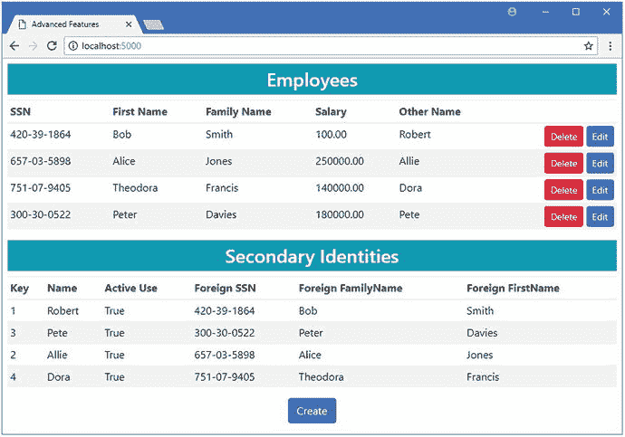
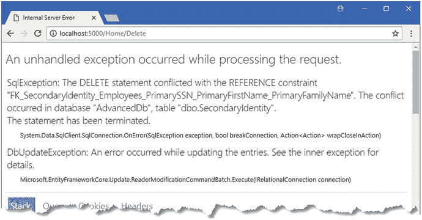
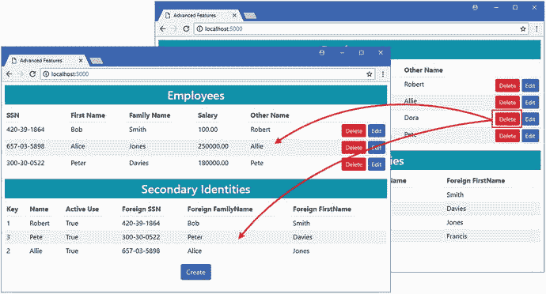
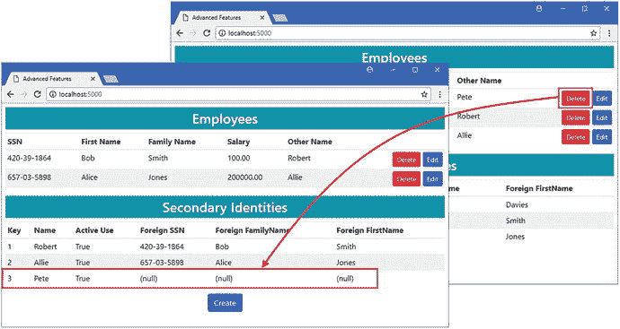
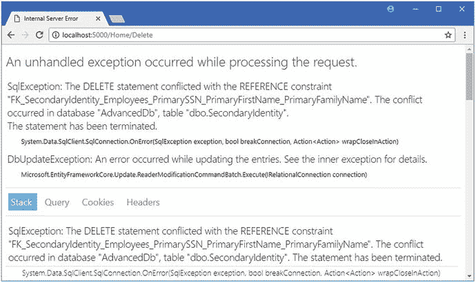
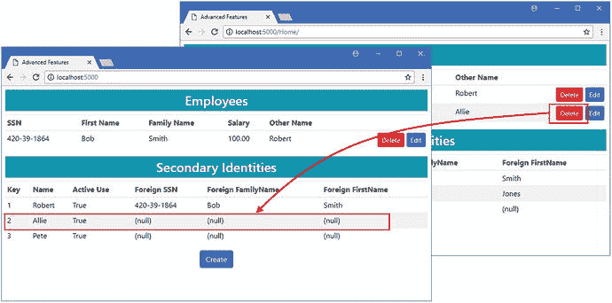
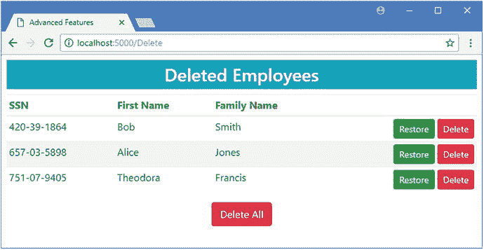

# 二十二、删除数据

删除数据可能是一项异常复杂的任务，尤其是在处理相关数据或对现有数据库建模时。在这一章中，我描述了实体框架处理删除数据的核心特性，演示了它们各自的工作原理，并解释了它们何时有用。表 [22-1](#Tab1) 将本章放入上下文中。

表 22-1。

Putting Advanced Delete Features in Context

<colgroup><col> <col></colgroup> 
| 问题 | 回答 |
| --- | --- |
| 它们是什么？ | 这些功能允许您指定数据库服务器如何响应删除数据的请求。 |
| 它们为什么有用？ | 删除对象时，有几种不同的方法可以处理相关数据，选择正确的方法将确保您的应用可以访问它需要的数据。 |
| 它们是如何使用的？ | 这些特性是通过 Fluent API 语句和对项目中存储库类的更改的组合来应用的。 |
| 有什么陷阱或限制吗？ | 必须小心不要在数据库中导致意外的级联删除，并且删除比预期更多的数据。同样，如果没有删除足够的数据，也可能会产生孤立数据。 |
| 有其他选择吗？ | 您可以依赖实体框架核心应用于数据库的默认行为。 |

表 [22-2](#Tab2) 总结了本章内容。

表 22-2。

Chapter Summary

<colgroup><col> <col> <col></colgroup> 
| 问题 | 解决办法 | 列表 |
| --- | --- | --- |
| 更改删除行为 | 使用`OnDelete`方法 | 1–19 |

## 为本章做准备

我继续使用 AdvancedApp 项目，但是需要做一些修改来为本章做准备。为了显示`SecondaryIdentity`对象的细节，我在`Views/Home`文件夹中创建了一个名为`SecondaryIdentities.cshtml`的文件，并添加了清单 [22-1](#Par5) 中所示的内容来创建一个局部视图。

Tip

如果您不想遵循构建示例项目的过程，您可以从本书的源代码库中下载所有需要的文件，可以从 [`https://github.com/apress/pro-ef-core-2-for-asp.net-core-mvc`](https://github.com/apress/pro-ef-core-2-for-asp.net-core-mvc) 获得。

```cs
<h3 class="bg-info p-2 text-center text-white">Secondary Identities</h3>
<table class="table table-sm table-striped">
    <thead>
        <tr>
            <th>Key</th>
            <th>Name</th>
            <th>Active Use</th>
            <th>Foreign SSN</th>
            <th>Foreign FamilyName</th>
            <th>Foreign FirstName</th>
        </tr>
    </thead>
    <tbody>
        <tr class="placeholder"><td colspan="6" class="text-center">No Data</td></tr>
        @foreach (SecondaryIdentity ident in ViewBag.Secondaries) {
            <tr>
                <td>@ident.Id</td>
                <td>@ident.Name</td>
                <td>@ident.InActiveUse</td>
                <td>@(ident.PrimarySSN ?? "(null)")</td>
                <td>@(ident.PrimaryFirstName ?? "(null)")</td>
                <td>@(ident.PrimaryFamilyName ?? "(null)")</td>
            </tr>
        }
    </tbody>
</table>
Listing 22-1.The Contents of the SecondaryIdentities.cshtml File in the Views/Home Folder

```

为了将部分视图合并到显示给用户的显示中，我将清单 [22-2](#Par7) 中所示的元素添加到了由`Home`控制器使用的`Index`视图中。我还从显示`Employees`对象的表格中删除了`In Use`和`Last Updated`列。

```cs
@model IEnumerable<Employee>
@{
    ViewData["Title"] = "Advanced Features";
    Layout = "_Layout";
}
<h3 class="bg-info p-2 text-center text-white">Employees</h3>
<table class="table table-sm table-striped">
    <thead>
        <tr>
            <th>SSN</th>
            <th>First Name</th>
            <th>Family Name</th>
            <th>Salary</th>
            <th>Other Name</th>
            @*<th>In Use</th>*@
            @*<th>Last Updated</th>*@
            <th></th>
        </tr>
    </thead>
    <tbody>
        <tr class="placeholder"><td colspan="8" class="text-center">No Data</td></tr>
        @foreach (Employee e in Model) {
            <tr>
                <td>@e.SSN</td>
                <td>@e.FirstName</td>
                <td>@e.FamilyName</td>
                <td>@e.Salary</td>
                <td>@(e.OtherIdentity?.Name ?? "(None)")</td>
                @*<td>@(e.OtherIdentity?.InActiveUse.ToString() ?? "(N/A)")</td>*@
                @*<td>@e.LastUpdated.ToLocalTime()</td>*@
                <td class="text-right">
                    <form>
                        <input type="hidden" name="SSN" value="@e.SSN" />
                        <input type="hidden" name="Firstname" value="@e.FirstName" />
                        <input type="hidden" name="FamilyName"
                               value="@e.FamilyName" />
                        <input type="hidden" name="RowVersion"
                               asp-for="@e.RowVersion" />
                        <button type="submit" asp-action="Delete" formmethod="post"
                                class="btn btn-sm btn-danger">
                            Delete
                        </button>
                        <button type="submit" asp-action="Edit" formmethod="get"
                                class="btn btn-sm btn-primary">
                            Edit
                        </button>
                    </form>
                </td>
            </tr>
        }
    </tbody>
</table>

@Html.Partial("SecondaryIdentities")

<div class="text-center">
    <a asp-action="Edit" class="btn btn-primary">Create</a>
</div>
Listing 22-2.Adding a Partial View in the Index.cshtml File in the Views/Home Folder

```

对于`Home`控制器，我修改了`Index`动作以通过`ViewBag`提供对`SecondaryIdentity`对象的访问，如清单 [22-3](#Par9) 所示。我还修改了`Delete`方法来移除软删除特性，并执行了一个传统的删除，类似于前几章中使用的方法。(我在本章末尾恢复了软删除功能。)

```cs
using AdvancedApp.Models;
using Microsoft.AspNetCore.Mvc;
using Microsoft.EntityFrameworkCore;
using System.Linq;
using System;

namespace AdvancedApp.Controllers {

    public class HomeController : Controller {
        private AdvancedContext context;

        public HomeController(AdvancedContext ctx) => context = ctx;

        public IActionResult Index() {
            ViewBag.Secondaries = context.Set<SecondaryIdentity>();
            return View(context.Employees.Include(e => e.OtherIdentity)
                .OrderByDescending(e => EF.Property<DateTime>(e, "LastUpdated")));
        }

        public IActionResult Edit(string SSN, string firstName, string familyName) {
            return View(string.IsNullOrWhiteSpace(SSN)
                ? new Employee() : context.Employees.Include(e => e.OtherIdentity)
                    .First(e => e.SSN == SSN
                        && e.FirstName == firstName
                        && e.FamilyName == familyName));
        }

        [HttpPost]
        public IActionResult Update(Employee employee) {
            if (context.Employees.Count(e => e.SSN == employee.SSN
                    && e.FirstName == employee.FirstName
                    && e.FamilyName == employee.FamilyName) == 0) {
                context.Add(employee);
            } else {
                Employee e = new Employee {
                    SSN = employee.SSN, FirstName = employee.FirstName,
                    FamilyName = employee.FamilyName,
                    RowVersion = employee.RowVersion
                };
                context.Employees.Attach(e);
                e.Salary = employee.Salary;
                e.LastUpdated = DateTime.Now;
            }
            context.SaveChanges();
            return RedirectToAction(nameof(Index));
        }

        [HttpPost]
        public IActionResult Delete(Employee employee) {
            context.Remove(employee);
            context.SaveChanges();
            return RedirectToAction(nameof(Index));
        }        
    }
}

Listing 22-3.Making Changes in the HomeController.cs File in the Controllers Folder

```

接下来，在`AdvancedApp`项目文件夹中运行清单 [22-4](#Par11) 中所示的命令，删除并重新创建数据库。

```cs
dotnet ef database drop --force
dotnet ef database update
Listing 22-4.Dropping and Re-creating the Database

```

使用`dotnet run`启动应用，导航到`http://localhost:5000`，点击创建按钮，并使用表 [22-3](#Tab3) 中显示的值来存储三个`Employee`对象。

表 22-3。

The Data Values for Creating Example Objects

<colgroup><col> <col> <col> <col> <col> <col></colgroup> 
| severely subnormal 智力严重逊常 | 西方人名的第一个字 | 姓氏 | 薪水 | 其他名称 | 正在使用中 |
| --- | --- | --- | --- | --- | --- |
| 420-39-1864 | 上下移动 | 锻工 | One hundred thousand | 罗伯特 | 检查 |
| 657-03-5898 | 爱丽丝 | 琼斯 | Two hundred thousand | 艾莉 | 检查 |
| 300-30-0522 | 耗尽 | 戴维斯 | One hundred and eighty thousand | 银箱 | 检查 |
| 751-07-9405 | 提奥多拉 | 弗朗西斯 | One hundred and forty thousand | 动力操作研究机构（dynamic operators research apparatus 的缩写） | 检查 |

当你创建了所有四个对象后，你应该会看到如图 [22-1](#Fig1) 所示的布局。



图 22-1。

Running the example application

## 了解删除约束

上下文的`Remove`方法用于从数据库中删除数据。向该方法传递一个对象告诉实体框架核心不再需要数据库中的相应数据，并且当调用`SaveChanges`方法时，应该向数据库服务器发送一个`DELETE`命令。

当要删除的对象与数据库中存储的其他数据有关系时，ASP.NET Core MVC 应用中会出现一个常见问题。点击应用显示的一个`Employee`对象的删除按钮，可以看到一个例子。数据库服务器不允许数据被删除，您将在图 [22-2](#Fig2) 中看到异常。



图 22-2。

Attempting to delete data

当您删除关系中的主体实体时，根据数据模型配置，从属实体将发生以下三种情况之一。

*   相关实体将被删除。这意味着删除一个`Employee`对象也会删除其相关的`SecondaryIdentity`。
*   依赖实体的外键属性被设置为`null`。这意味着删除一个`Employee`将导致相关的`SecondaryIdentity`对象的`SSN`、`PrimaryFirstName`和`PrimaryFamily`名称属性被设置为`null`。
*   对依赖实体不做任何更改。

第三个选项实际上意味着您必须管理应用中的相关数据，负责确保您不会尝试任何会删除关系所依赖的数据的操作。数据库服务器努力确保它们管理的数据库的完整性，并且将报告错误，而不是允许产生引用问题。

定义关系时，实体框架核心遵循一组约定来选择删除行为，使用由`DeleteBehavior`枚举定义的值之一，如表 [22-4](#Tab4) 中所述。

表 22-4。

The DeleteBehavior Values

<colgroup><col> <col></colgroup> 
| 名字 | 描述 |
| --- | --- |
| `Cascade` | 从属实体将与主体实体一起自动删除。 |
| `SetNull` | 数据库服务器将依赖实体的主键设置为 null。 |
| `ClientSetNull` | 实体框架核心将依赖实体的主键设置为空。 |
| `Restrict` | 对依赖实体不做任何更改。 |

在`CompositeKey`迁移中配置`Employee`和`SecondaryIdentity`类之间的关系。如果您检查`Migrations`文件夹的`<timestamp>_CompositeKey.cs`文件中的`Up`方法，您会发现设置删除行为的语句。

```cs
...
migrationBuilder.CreateTable(name: "SecondaryIdentity",
    columns: table => new {
        Id = table.Column<long>(type: "bigint", nullable: false)
            .Annotation("SqlServer:ValueGenerationStrategy",    
                SqlServerValueGenerationStrategy.IdentityColumn),

        ...column definitions omitted for brevity...        

     },
     constraints: table => {
        table.PrimaryKey("PK_SecondaryIdentity", x => x.Id);
        table.ForeignKey(name: "FK_SecondaryIdentity_Employees_
            PrimarySSN_PrimaryFirstName_PrimaryFamilyName",
                 columns: x => new { x.PrimarySSN, x.PrimaryFirstName,       
                     x.PrimaryFamilyName },
                 principalTable: "Employees",
                 principalColumns: new[] { "SSN", "FirstName", "FamilyName" },
                 onDelete: ReferentialAction.Restrict);
     });
...

```

这种关系已经用`Restrict`行为进行了配置。当`SecondaryIdentity`对象的相关`Employee`被删除时，该对象没有发生变化，导致图 [22-2](#Fig2) 所示的异常。

### 配置删除行为

获得所需行为的最可靠方法是使用 Fluent API 选择所需的删除行为，用一个`DeleteBehavior`值显式配置数据模型。表中的描述可能看起来很简单，但是有些复杂。对于必需关系和可选关系，这些行为可能会有所不同。此外，让事情变得更加困难的是，Entity Framework Core 将只对从数据库中加载的相关数据执行一些操作，这在 ASP.NET Core MVC 应用中可能会引起混乱，因为对象通常是由 MVC 模型绑定器创建的，并且需要特殊的处理。在接下来的部分中，我将解释每种删除行为是如何工作的。

Deciding Which Delete Behavior to Use

删除行为的选择可能会令人困惑，并且很难确定您需要哪种行为，即使您已经在后面的小节中看到了每种行为的演示。如果你发现自己不知道从哪里开始，这是我的建议。

如果您正在处理一个需要的关系，那么您应该从`Cascade`行为开始，但是做一些测试来确保一个删除操作不会在数据库中传播并删除比您期望的更多的数据。

如果您正在处理一个可选的关系，那么如果您的数据库服务器支持的话，您应该从`SetNull`行为开始，否则就从`ClientSetNull`行为开始。但是如果你没有处理孤立数据的计划，那么就使用`Cascade`行为。

避免使用`Restrict`行为，除非您正在建模一个具有特定需求的数据库，而这些需求无法使用其他行为来处理。`Restrict`行为让您可以完全控制删除过程，但是这可能比您想象的更难实现，并且很容易出错。

## 使用层叠删除行为

`DeleteBehavior.Cascade`值对数据库进行配置，以便在删除与依赖实体相关的主体实体时，从数据库中删除依赖实体。级联行为是最容易使用的，但是需要小心，因为您很容易删除比预期更多的数据，因为数据库服务器将继续跟踪关系并删除数据以确保数据库的完整性。如果您过于随意地应用级联行为，您会发现删除操作可能会失去控制，并产生深远的后果。

在清单 [22-5](#Par33) 中，我在上下文类中添加了一个流畅的 API 语句，为`Employee` / `SecondaryIdentity`关系选择级联行为。

Note

只能使用 Fluent API 指定关系的删除行为。此功能没有属性支持。

```cs
using Microsoft.EntityFrameworkCore;
using System;

namespace AdvancedApp.Models {

    public class AdvancedContext : DbContext {

        public AdvancedContext(DbContextOptions<AdvancedContext> options)
            : base(options) {}

        public DbSet<Employee> Employees { get; set; }

        protected override void OnModelCreating(ModelBuilder modelBuilder) {

            modelBuilder.Entity<Employee>()
                .HasQueryFilter(e => !e.SoftDeleted);

            modelBuilder.Entity<Employee>().Ignore(e => e.Id);
            modelBuilder.Entity<Employee>()
                .HasKey(e => new { e.SSN, e.FirstName, e.FamilyName });

            modelBuilder.Entity<Employee>()
                .Property(e => e.Salary).HasColumnType("decimal(8,2)")
                .HasField("databaseSalary")
                .UsePropertyAccessMode(PropertyAccessMode.Field);
                //.IsConcurrencyToken();

            modelBuilder.Entity<Employee>().Property<DateTime>("LastUpdated")
                .HasDefaultValue(new DateTime(2000, 1, 1));

            modelBuilder.Entity<Employee>()
                .Property(e => e.RowVersion).IsRowVersion();

            modelBuilder.Entity<SecondaryIdentity>()
                .HasOne(s => s.PrimaryIdentity)
                .WithOne(e => e.OtherIdentity)
                .HasPrincipalKey<Employee>(e => new { e.SSN,
                     e.FirstName, e.FamilyName })
                .HasForeignKey<SecondaryIdentity>(s => new { s.PrimarySSN,
                     s.PrimaryFirstName, s.PrimaryFamilyName })
                .OnDelete(DeleteBehavior.Cascade);

            modelBuilder.Entity<SecondaryIdentity>()
                .Property(e => e.Name).HasMaxLength(100);
        }
    }
}

Listing 22-5.Configuring the Delete Behavior in the AdvancedContext.cs File in the Models Folder

```

`OnDelete`方法用于配置关系的删除行为，并接受一个`DeleteBehavior`值作为其参数。此方法用作定义两个类之间关系的方法调用链的一部分。

在`AdvancedApp`项目文件夹中运行清单 [22-6](#Par36) 中所示的命令，创建并向数据库应用迁移，这将改变删除行为。

```cs
dotnet ef migrations add CascadeDelete
dotnet ef database update
Listing 22-6.Creating and Applying a Migration

```

要查看更改的效果，使用`dotnet run`启动应用，导航到`http://localhost:5000`，并单击其中一个`Employee`对象的删除按钮。`Employee`及其相关的`SecondaryIdentity`对象将从数据库中删除，如图 [22-3](#Fig3) 所示。

Tip

如果您用完了要删除的对象，请单击“创建”按钮，填写字段，然后单击“保存”将新数据存储到数据库中。您选择的值并不重要，因为本章中的所有示例都只关注删除数据。



图 22-3。

Using the cascade delete behavior

级联行为由数据库服务器实现，它自动从数据库中删除相关数据。您可以通过检查应用生成的日志消息来了解这一点。当您单击“删除”按钮时，实体框架核心将以下 SQL 发送到数据库:

```cs
...
DELETE FROM [Employees]
WHERE [SSN] = @p0 AND [FirstName] = @p1 AND [FamilyName] = @p2
    AND [RowVersion] = @p3;
...

```

实体框架核心只需要删除主体实体，并且可以依靠数据库服务器来处理删除相关数据以保持数据库的完整性。

## 将外键设置为空

两个`DeleteBehavior`值`SetNull`和`ClientSetNull`通过将依赖实体留在数据库中但将外键设置为`null`来响应删除主体实体。这样做的效果是破坏两个对象之间的关系，这样就可以删除主体，而不会破坏数据库的引用完整性。

Caution

此行为只能用于可选关系。在必需的关系上使用此行为将产生异常。

`SetNull`和`ClientSetNull`行为的区别在于谁负责修改依赖实体。通过`SetNull`行为，数据库服务器会将依赖实体的外键属性设置为`null`。通过`ClientSetNull`行为，实体框架核心负责更新依赖实体。

并不是所有的数据库都支持`SetNull`行为——尽管 SQL Server 支持——但是`SetNull`具有一致性的优势，因为`ClientSetNull`行为只有在实体框架核心知道相关数据的情况下才起作用，要么是因为它已经作为查询的一部分被加载，要么是因为 MVC 模型绑定器创建了一个包含其主键的对象。在接下来的小节中，我将演示这些行为的不同使用方式。

### 依靠数据库服务器来更改外键

如果您的数据库服务器支持它，那么`SetNull`行为可以用于更新依赖实体，即使它们没有被实体框架核心加载。在将外键设置为`null`的两个删除行为中，这是最容易使用的一个，因为您不必确保实体框架核心正在跟踪必须修改的对象。在清单 [22-7](#Par47) 中，我通过将参数改为`OnDelete`方法，为`Employee` / `SecondaryIdentity`关系选择了`SetNull`行为。

```cs
...
modelBuilder.Entity<SecondaryIdentity>()
    .HasOne(s => s.PrimaryIdentity)
    .WithOne(e => e.OtherIdentity)
    .HasPrincipalKey<Employee>(e => new { e.SSN,
            e.FirstName, e.FamilyName })
    .HasForeignKey<SecondaryIdentity>(s => new { s.PrimarySSN,
            s.PrimaryFirstName, s.PrimaryFamilyName })
    .OnDelete(DeleteBehavior.SetNull);
...
Listing 22-7.Changing the Delete Behavior in the AdvancedContext.cs File in the Models Folder

```

在`AdvancedApp`项目文件夹中运行清单 [22-8](#Par49) 中所示的命令来创建一个新的迁移，并将其应用到数据库中。

```cs
dotnet ef migrations add SetNullDelete
dotnet ef database update
Listing 22-8.Creating and Applying a Database Migration

```

要查看删除行为是如何工作的，使用`dotnet run`启动应用，导航到`http://localhost:5000`，并单击其中一个删除按钮。您将看到`Employee`对象从数据库中被删除，相关的`SecondaryIdentity`对象的外键属性被设置为空，如图 [22-4](#Fig4) 所示。



图 22-4。

Using the SetNull behavior

如果您检查应用产生的日志消息，您可以看到实体框架核心用来删除`Employee`对象的`DELETE`命令。

```cs
...
DELETE FROM [Employees]
WHERE [SSN] = @p0 AND [FirstName] = @p1 AND [FamilyName] = @p2
    AND [RowVersion] = @p3;
...

```

不发送命令来更新相关的`SecondaryIdentity`对象，而是由数据库服务器将任何依赖实体的外键属性更新到`null`。

Caution

因为`SetNull`行为不会从数据库中删除依赖实体，所以您可能会得到“孤立的”数据。只有当应用可能重用数据库中的依赖实体时，才应该使用这种行为。对于示例应用，现在数据库中有一个与`Employee`不相关联的`SecondaryIdentity`对象，应用在创建新的`Employee`时没有提供使用现有对象的方法，这实际上孤立了数据。孤立数据可能会导致意外的问题，尤其是在对自然键应用了唯一性约束的情况下，这会阻止使用与孤立数据相同的键值创建新对象。

### 依靠实体框架核心更新外键

通过`ClientSetNull`行为，当主体实体被删除时，实体框架核心将更新从属实体的外键属性。如果您的数据库服务器不支持`SetNull`行为，这是很有用的，尽管它需要在 ASP.NET Core MVC 应用中做一些额外的工作，因为实体框架核心将只更新那些已经从数据库加载或手动添加到变更跟踪的对象。这意味着要么使用额外的查询从数据库加载相关数据，要么在用户发送的启动删除操作的 HTTP 请求中包含额外的信息。

为了配置`ClientSetNull`行为，我更改了传递给上下文类中的`OnDelete`方法的值，如清单 [22-9](#Par57) 所示。

```cs
...
modelBuilder.Entity<SecondaryIdentity>()
    .HasOne(s => s.PrimaryIdentity)
    .WithOne(e => e.OtherIdentity)
    .HasPrincipalKey<Employee>(e => new { e.SSN,
            e.FirstName, e.FamilyName })
    .HasForeignKey<SecondaryIdentity>(s => new { s.PrimarySSN,
            s.PrimaryFirstName, s.PrimaryFamilyName })
    .OnDelete(DeleteBehavior.ClientSetNull);
...
Listing 22-9.Changing the Delete Behavior in the AdvancedContext.cs File in the Models Folder

```

需要进行新的迁移来配置数据库。在`AdvancedApp`文件夹中运行清单 [22-10](#Par59) 中所示的命令来创建迁移并将其应用到数据库。

```cs
dotnet ef migrations add ClientSetNullDelete
dotnet ef database update
Listing 22-10.Creating and Applying a Database Migration

```

如果您检查已经添加到`Migrations`文件夹的`<timestamp>_ClientSetNullDelete.cs`文件中的`Up`方法，您将看到删除行为已经被更改，如下所示:

```cs
...
protected override void Up(MigrationBuilder migrationBuilder) {
    migrationBuilder.DropForeignKey(
        name: "FK_SecondaryIdentity_Employees
            _PrimarySSN_PrimaryFirstName_PrimaryFamilyName",
        table: "SecondaryIdentity");

    migrationBuilder.AddForeignKey(
        name: "FK_SecondaryIdentity_Employees
            _PrimarySSN_PrimaryFirstName_PrimaryFamilyName",
        table: "SecondaryIdentity",
        columns: new[] { "PrimarySSN", "PrimaryFirstName", "PrimaryFamilyName" },
        principalTable: "Employees",
        principalColumns: new[] { "SSN", "FirstName", "FamilyName" },
        onDelete: ReferentialAction.Restrict);
}
...

```

迁移会将行为改回`Restrict`，这样当删除`Employee`对象时，数据库服务器不会采取任何措施。这是有意义的，因为`ClientSetNull`行为依赖于实体框架核心来更新外键值，而不是数据库服务器。

如果您使用`dotnet run`启动应用，导航到`http://localhost:5000`，并点击删除按钮，您将看到如图 [22-5](#Fig5) 所示的错误信息。



图 22-5。

Deleting a principal entity

如果您选择了`ClientSetNull`行为，但没有向实体框架核心提供对与被删除对象相关的依赖实体的访问，就会发生这种情况。其效果相当于指定了`Restrict`行为，因为数据库服务器不会对依赖实体进行任何更改，并且实体框架核心不知道它们。

#### 使用查询加载相关数据

确保实体框架核心知道有相关对象要删除的一种方法是执行数据库查询来加载数据，如清单 [22-11](#Par66) 所示。

```cs
...
[HttpPost]
public IActionResult Delete(Employee employee) {

    context.Set<SecondaryIdentity>().FirstOrDefault(id =>
        id.PrimarySSN == employee.SSN
        && id.PrimaryFirstName == employee.FirstName
        && id.PrimaryFamilyName == employee.FamilyName);

    context.Employees.Remove(employee);
    context.SaveChanges();
    return RedirectToAction(nameof(Index));
}    
...

Listing 22-11.Querying for Related Data in the HomeController.cs File in the Controllers Folder

```

加载将要删除的数据就足够了，除了确保实体框架核心创建的对象被跟踪之外，我不需要对它做任何事情。

Tip

我使用了`Find`方法，它可以立即执行查询。如果您的相关数据只能通过创建`IQueryable<T>`的 LINQ 查询来访问，那么您应该调用`Load`方法来强制执行查询。否则，实体框架核心不会执行查询，不会加载数据，也不会将外键属性设置为`null`。

使用`dotnet run`启动应用，导航到`http://localhost:5000`，并点击删除按钮。与`SetNull`行为一样，`Employee`对象将从数据库中删除，相关`SecondaryIdentity`对象的外键属性将被设置为空，如图 [22-6](#Fig6) 所示。



图 22-6。

Using the ClientSetNull behavior

如果您检查应用生成的日志消息，您将看到实体框架核心已经负责处理这两个对象。首先您会看到这个命令，它将`SecondaryIdentity`对象的外键值设置为`null`:

```cs
...
UPDATE [SecondaryIdentity] SET [PrimaryFamilyName] = @p0, [PrimaryFirstName] = @p1,
    [PrimarySSN] = @p2
WHERE [Id] = @p3;
...

```

这确保了可以删除`Employee`对象，而不会导致引用完整性问题。使用以下命令执行删除操作:

```cs
...
DELETE FROM [Employees]
WHERE [SSN] = @p4 AND [FirstName] = @p5 AND [FamilyName] = @p6
    AND [RowVersion] = @p7;
...

```

#### 避免相关数据查询

实体框架核心只需要依赖实体的主键来执行更新。您可以通过在针对`Delete`操作的 HTTP POST 请求中包含一个额外的值来避免清单 [22-11](#Par66) 中的额外查询，并使用它来给实体框架核心提供它所需要的信息。在清单 [22-12](#Par75) 中，我为相关`SecondaryIdentity`对象的主键添加了一个元素到`Index`视图中。

```cs
@model IEnumerable<Employee>
@{
    ViewData["Title"] = "Advanced Features";
    Layout = "_Layout";
}
<h3 class="bg-info p-2 text-center text-white">Employees</h3>
<table class="table table-sm table-striped">
    <thead>
        <tr>
            <th>SSN</th>
            <th>First Name</th>
            <th>Family Name</th>
            <th>Salary</th>
            <th>Other Name</th>
            <th></th>
        </tr>
    </thead>
    <tbody>
        <tr class="placeholder"><td colspan="8" class="text-center">No Data</td></tr>
        @foreach (Employee e in Model) {
            <tr>
                <td>@e.SSN</td>
                <td>@e.FirstName</td>
                <td>@e.FamilyName</td>
                <td>@e.Salary</td>
                <td>@(e.OtherIdentity?.Name ?? "(None)")</td>
                <td class="text-right">
                    <form>
                        <input type="hidden" name="SSN" value="@e.SSN" />
                        <input type="hidden" name="Firstname" value="@e.FirstName" />
                        <input type="hidden" name="FamilyName"
                               value="@e.FamilyName" />
                        <input type="hidden" name="RowVersion"
                               asp-for="@e.RowVersion" />
                        <input type="hidden" name="OtherIdentity.Id"
                               value="@e.OtherIdentity.Id" />    
                        <button type="submit" asp-action="Delete" formmethod="post"
                                class="btn btn-sm btn-danger">
                            Delete
                        </button>
                        <button type="submit" asp-action="Edit" formmethod="get"
                                class="btn btn-sm btn-primary">
                            Edit
                        </button>
                    </form>
                </td>
            </tr>
        }
    </tbody>
</table>
@Html.Partial("SecondaryIdentities")
<div class="text-center">
    <a asp-action="Edit" class="btn btn-primary">Create</a>
</div>
Listing 22-12.Adding an Element in the Index.cshtml File in the Views/Home Folder

```

在清单 [22-13](#Par77) 中，我已经注释掉了`Delete`动作方法中的查询。HTTP POST 请求中包含的新值允许 MVC 模型绑定器创建一个`SecondaryIdentity`对象，实体框架核心将使用该对象在执行删除操作之前更新数据库。

```cs
...
[HttpPost]
public IActionResult Delete(Employee employee) {

    //context.Set<SecondaryIdentity>().FirstOrDefault(id =>
    //    id.PrimarySSN == employee.SSN
    //    && id.PrimaryFirstName == employee.FirstName
    //    && id.PrimaryFamilyName == employee.FamilyName);

    context.Employees.Remove(employee);
    context.SaveChanges();
    return RedirectToAction(nameof(Index));
}     
...

Listing 22-13.Disabling a Query in the HomeController.cs File in the Controllers Folder

```

使用`dotnet run`启动应用，导航到`http://localhost:5000`，并点击删除按钮。相关的`SecondaryIdentity`对象的外键属性将被设置为`null`，就像前面的例子一样，但是不需要在`Delete`操作方法中执行额外的查询。

## 控制删除操作

`Restrict`行为告诉实体框架核心和数据库服务器不要对依赖实体做任何更改。如果您选择此行为，则您有责任确保您的删除操作可以在不导致错误的情况下执行。在清单 [22-14](#Par80) 中，我在上下文类中选择了删除行为。

```cs
...
modelBuilder.Entity<SecondaryIdentity>()
    .HasOne(s => s.PrimaryIdentity)
    .WithOne(e => e.OtherIdentity)
    .HasPrincipalKey<Employee>(e => new { e.SSN,
            e.FirstName, e.FamilyName })
    .HasForeignKey<SecondaryIdentity>(s => new { s.PrimarySSN,
            s.PrimaryFirstName, s.PrimaryFamilyName })
    .OnDelete(DeleteBehavior.Restrict);
...
Listing 22-14.Selecting the Restrict Behavior in the AdvancedContext.cs File in the Models Folder

```

在`AdvancedApp`项目文件夹中运行清单 [22-15](#Par82) 中所示的命令来创建一个新的迁移，并将其应用到数据库中。

```cs
dotnet ef migrations add RestrictDelete
dotnet ef database update
Listing 22-15.Creating and Applying a Database Migration

```

### 重新创建级联行为

如果要删除相关数据，则必须在数据库中查询要删除的对象，或者确保 HTTP POST 请求中有足够的数据来创建允许实体框架核心执行删除操作的对象。

在清单 [22-12](#Par75) 中，我在`Index.cshtml`视图中添加了一个隐藏的`input`元素，在删除`Employee`的请求中包含了`SecondaryIdentity`对象的主键值。在清单 [22-16](#Par85) 中，我用这个值告诉实体框架核心在删除操作中包含相关对象。

```cs
...
[HttpPost]
public IActionResult Delete(Employee employee) {
    if (employee.OtherIdentity != null) {
        context.Set<SecondaryIdentity>().Remove(employee.OtherIdentity);
    }   
    context.Employees.Remove(employee);
    context.SaveChanges();
    return RedirectToAction(nameof(Index));
}        
...
Listing 22-16.Deleting Related Data in the HomeController.cs File in the Controllers Folder

```

使用`dotnet run`启动应用，导航到`http://localhost:5000`，并单击一个删除按钮(您可能需要创建新的对象，以便删除一些内容)。检查应用生成的日志消息，您将看到从数据库中删除数据的两个操作。第一个删除了`SecondaryIdentity`对象。

```cs
...
DELETE FROM [SecondaryIdentity]
WHERE [Id] = @p0;
...

```

删除依赖实体为删除主体实体的第二个操作扫清了道路。

```cs
...
DELETE FROM [Employees]
WHERE [SSN] = @p1 AND [FirstName] = @p2 AND [FamilyName] = @p3
    AND [RowVersion] = @p4;
...

```

### 重新创建设置空行为

如果您想负责将外键属性设置为`null`，那么您可以使用`Attach`方法将 MVC 模型绑定器创建的对象置于实体框架核心变更跟踪下，然后设置外键属性的值，如清单 [22-17](#Par92) 所示。

Note

这只适用于可选关系。如果试图在所需的关系中将外键属性设置为`null`，将会收到一个错误。

```cs
...
[HttpPost]
public IActionResult Delete(Employee employee) {
    if (employee.OtherIdentity != null) {
        SecondaryIdentity identity =
            context.Set<SecondaryIdentity>().Find(employee.OtherIdentity.Id);
        identity.PrimarySSN = null;
        identity.PrimaryFirstName = null;
        identity.PrimaryFamilyName = null;
    }
    employee.OtherIdentity = null;
    context.Employees.Remove(employee);
    context.SaveChanges();
    return RedirectToAction(nameof(Index));
}        
...
Listing 22-17.Setting Foreign Key Properties in the HomeController.cs File in the Controllers Folder

```

我查询数据库以获取当前的外键值，将属性设置为`null`，并将`OtherIdentity`导航属性设置为`Employee`对象上的`null`。当实体框架核心更新数据库时，它发送`UPDATE`和`DELETE`命令，就像`ClientSetNull`行为使用的命令一样。

## 恢复软删除功能

我将通过恢复软删除功能并将永久删除功能移入单独的`Delete`控制器来结束这一章。

在清单 [22-18](#Par96) 中，我修改了`Home`控制器，以便`Delete`动作执行软删除。我还更改了对`Index`动作中相关数据的查询，以便通过`Employee`导航属性访问`SecondaryIdentity`对象。这将确保查询服从查询过滤器，这样外键属性为 null 的`SecondaryIdentity`对象将不会显示。

```cs
using AdvancedApp.Models;
using Microsoft.AspNetCore.Mvc;
using Microsoft.EntityFrameworkCore;
using System.Linq;
using System;

using System.Collections.Generic;

namespace AdvancedApp.Controllers {

    public class HomeController : Controller {
        private AdvancedContext context;

        public HomeController(AdvancedContext ctx) => context = ctx;

        public IActionResult Index() {
            IEnumerable<Employee> data = context.Employees
                .Include(e => e.OtherIdentity)
                .OrderByDescending(e => e.LastUpdated)
                .ToArray();
            ViewBag.Secondaries = data.Select(e => e.OtherIdentity);
            return View(data);
        }

        public IActionResult Edit(string SSN, string firstName, string familyName) {
            return View(string.IsNullOrWhiteSpace(SSN)
                ? new Employee() : context.Employees.Include(e => e.OtherIdentity)
                    .First(e => e.SSN == SSN
                        && e.FirstName == firstName
                        && e.FamilyName == familyName));
        }

        [HttpPost]
        public IActionResult Update(Employee employee) {
            if (context.Employees.Count(e => e.SSN == employee.SSN
                    && e.FirstName == employee.FirstName
                    && e.FamilyName == employee.FamilyName) == 0) {
                context.Add(employee);
            } else {
                Employee e = new Employee {
                    SSN = employee.SSN, FirstName = employee.FirstName,
                    FamilyName = employee.FamilyName,
                    RowVersion = employee.RowVersion
                };
                context.Employees.Attach(e);
                e.Salary = employee.Salary;
                e.LastUpdated = DateTime.Now;
            }
            context.SaveChanges();
            return RedirectToAction(nameof(Index));
        }

        [HttpPost]
        public IActionResult Delete(Employee employee) {
            context.Employees.Attach(employee);
            employee.SoftDeleted = true;
            context.SaveChanges();
            return RedirectToAction(nameof(Index));
        }        
    }
}

Listing 22-18.Updating Actions in the HomeController.cs File in the Controllers Folder

```

查询筛选器仅适用于它们所应用到的类的查询，这意味着如果您使用在关系的不同端开始的查询，可能会得到不一致的结果。在`Index`动作中，我更改了对`SecondaryIdentity`对象的查询，以便它从对`Employee`对象的查询中选择一个结果子集。这确保了只有与未被软删除的`Employee`对象相关的`SecondaryIdentity`对象才会显示给用户。

Tip

为了确保只执行一个查询，我使用了`ToArray`方法来强制执行查询。如果没有这个方法，当视图枚举`Employee`和`SecondaryIdentity`对象时，就会有重复的查询。

接下来，我在`Delete`控制器使用的`Index`视图中添加了按钮，这样被软删除的对象可以从数据库中移除，无论是单独移除还是批量移除，如清单 [22-19](#Par100) 所示。

```cs
@model IEnumerable<Employee>
@{
    ViewData["Title"] = "Advanced Features";
    Layout = "_Layout";
}
<h3 class="bg-info p-2 text-center text-white">Deleted Employees</h3>
<table class="table table-sm table-striped">
    <thead>
        <tr>
            <th>SSN</th>
            <th>First Name</th>
            <th>Family Name</th>
            <th></th>
        </tr>
    </thead>
    <tbody>
        <tr class="placeholder"><td colspan="4" class="text-center">No Data</td></tr>
        @foreach (Employee e in Model) {
            <tr>
                <td>@e.SSN</td>
                <td>@e.FirstName</td>
                <td>@e.FamilyName</td>
                <td class="text-right">
                    <form method="post">
                        <input type="hidden" name="SSN" value="@e.SSN" />
                        <input type="hidden" name="FirstName" value="@e.FirstName" />
                        <input type="hidden" name="FamilyName"
                               value="@e.FamilyName" />
                        <input type="hidden" name="RowVersion"
                               asp-for="@e.RowVersion" />
                        <input type="hidden" name="OtherIdentity.Id"
                               value="@e.OtherIdentity.Id" />
                        <button asp-action="Restore" class="btn btn-sm btn-success">
                            Restore
                        </button>
                        <button asp-action="Delete" class="btn btn-sm btn-danger">
                            Delete
                        </button>
                    </form>
                </td>
            </tr>
        }
    </tbody>
</table>

<div class="text-center">

    <form method="post" asp-action="DeleteAll">
        <button type="submit" class="btn btn-danger">Delete All</button>
    </form>

</div>

Listing 22-19.Adding Elements in the Index.cshtml File in the Views/Delete Folder

```

为了完成这个特性，我将清单 [22-20](#Par102) 中显示的动作添加到`Delete`控制器中，对应于清单 [22-19](#Par100) 中添加的元素。

```cs
using AdvancedApp.Models;
using Microsoft.AspNetCore.Mvc;
using Microsoft.EntityFrameworkCore;
using System.Linq;

using System.Collections.Generic;

namespace AdvancedApp.Controllers {

    public class DeleteController : Controller {
        private AdvancedContext context;

        public DeleteController(AdvancedContext ctx) => context = ctx;

        public IActionResult Index() {
            return View(context.Employees.Where(e => e.SoftDeleted)
                .Include(e => e.OtherIdentity).IgnoreQueryFilters());
        }

        [HttpPost]
        public IActionResult Restore(Employee employee) {
            context.Employees.IgnoreQueryFilters()
                .First(e => e.SSN == employee.SSN
                    && e.FirstName == employee.FirstName
                    && e.FamilyName == employee.FamilyName).SoftDeleted = false;
            context.SaveChanges();
            return RedirectToAction(nameof(Index));
        }

        [HttpPost]
        public IActionResult Delete(Employee e) {
            if (e.OtherIdentity != null) {
                context.Remove(e.OtherIdentity);
            }
            context.Employees.Remove(e);
            context.SaveChanges();
            return RedirectToAction(nameof(Index));
        }

        [HttpPost]
        public IActionResult DeleteAll() {
            IEnumerable<Employee> data = context.Employees
                .IgnoreQueryFilters()
                .Include(e => e.OtherIdentity)
                .Where(e => e.SoftDeleted).ToArray();
            context.RemoveRange(data.Select(e => e.OtherIdentity));
            context.RemoveRange(data);
            context.SaveChanges();
            return RedirectToAction(nameof(Index));
        }
    }
}

Listing 22-20.Adding Actions in the DeleteController.cs File in the Controllers Folder

```

动作方法必须确保与`Employee`对象相关的`SecondaryIdentity`对象也被从数据库中删除，因为数据模型配置了`Restrict`删除行为。为了测试软删除/硬删除特性，使用`dotnet run`启动应用，导航到`http://localhost:5000`，并点击一个或多个`Employee`对象的`Delete`按钮。导航到`http://localhost:5000/delete`，您可以使用图 [22-7](#Fig7) 所示的按钮来恢复对象、永久删除单个软删除对象或删除所有软删除对象。



图 22-7。

Restoring and completing the soft-delete feature

## 摘要

在这一章中，我描述了实体框架核心支持的删除数据的不同行为。我展示了`Cascade`和`SetNull` / `ClientSetNull`行为之间的区别，以及如何使用`Restrict`行为来控制删除过程。我通过恢复软删除特性和添加对从其软删除状态永久删除对象的支持来完成本章。在下一章中，我将描述实体框架核心为使用数据库服务器提供的高级特性而提供的特性。