# 二十三、使用数据库服务器功能

即使拥有高级特性，Entity Framework Core 的目标也是覆盖数据库服务器提供的最常用的特性。但是，知道这对于某些项目来说是不够的，Microsoft 还包括了对直接使用数据库服务器的支持，如果您的项目有特殊的需求或者如果您正在建模一个复杂的数据库，这将是非常宝贵的。

在本章中，我将演示如何直接使用 SQL 来访问 Entity Framework Core 不直接支持的特性，包括视图、存储过程和表值函数。我还演示了 Entity Framework Core 为处理数据库服务器生成的数据值而提供的一系列特性。表 [23-1](#Tab1) 将本章放在上下文中。

Caution

所有的实体框架核心特性都受数据库服务器和提供者包之间的变化的影响，但是对于本章中的例子来说尤其如此。这些示例已经使用 SQL Server 和默认的 Microsoft 数据库提供程序进行了测试。如果使用不同的数据库服务器或提供者包，您可能需要对示例进行更改。

表 23-1。

Putting Database Features in Context

<colgroup><col> <col></colgroup> 
| 问题 | 回答 |
| --- | --- |
| 它们是什么？ | 数据库服务器提供了使用普通实体框架核心技术无法访问的高级特性。Entity Framework Core 包括一组用于处理这些特性的工具，因此您可以超越所有数据库服务器通用的基本特性集。 |
| 它们为什么有用？ | 这些特性有助于增加数据库服务器代表应用承担的工作量，或者当您需要无法通过其他方式访问的特定特性时。如果您正在使用现有的数据库，您可能必须使用这些功能来获取和存储数据。 |
| 它们是如何使用的？ | 通过 LINQ 查询和配置数据模型的 Fluent API 语句中包含的方法组合，可以访问这些功能。 |
| 有什么陷阱或限制吗？ | 直接使用数据库特性会增加测试应用代码的难度，并且需要很好地理解高级数据库服务器特性以及使用它们所需的 SQL。 |
| 有其他选择吗？ | 不可以。本章介绍的技术是访问数据库服务器功能的唯一方法。 |

表 [23-2](#Tab2) 总结了本章内容。

表 23-2。

Chapter Summary

<colgroup><col> <col> <col></colgroup> 
| 问题 | 解决办法 | 列表 |
| --- | --- | --- |
| 执行 SQL 命令 | 使用`FromSql`或`ExecuteSqlCommand`方法 | 1–18 |
| 更新数据模型对象以反映服务器生成的值 | 使用`HasDefaultValueSql`或`HasSequence`方法或`ValueGeneratedOnXXX`方法 | 19–25, 30–33 |
| 确保值是唯一的 | 使用`HasIndex`方法 | 26–29 |

## 为本章做准备

在这一章中，我继续使用从第 19 章[开始使用的 AdvancedApp 项目。本章中的一些查询不包括相关的数据，所以我改变了`Home`控制器使用的`Index`视图，如清单](19.html) [23-1](#Par7) 所示。

Tip

如果您不想遵循构建示例项目的过程，您可以从本书的源代码库中下载所有需要的文件，可以从 [`https://github.com/apress/pro-ef-core-2-for-asp.net-core-mvc`](https://github.com/apress/pro-ef-core-2-for-asp.net-core-mvc) 获得。

```cs
@model IEnumerable<Employee>
@{
    ViewData["Title"] = "Advanced Features";
    Layout = "_Layout";
}
<h3 class="bg-info p-2 text-center text-white">Employees</h3>
<table class="table table-sm table-striped">
    <thead>
        <tr>
            <th>SSN</th>
            <th>First Name</th>
            <th>Family Name</th>
            <th>Salary</th>
            <th>Other Name</th>
            <th></th>
        </tr>
    </thead>
    <tbody>
        <tr class="placeholder"><td colspan="8" class="text-center">No Data</td></tr>
        @foreach (Employee e in Model) {
            <tr>
                <td>@e.SSN</td>
                <td>@e.FirstName</td>
                <td>@e.FamilyName</td>
                <td>@e.Salary</td>
                <td>@(e.OtherIdentity?.Name ?? "(None)")</td>
                <td class="text-right">
                    <form>
                        <input type="hidden" name="SSN" value="@e.SSN" />
                        <input type="hidden" name="Firstname" value="@e.FirstName" />
                        <input type="hidden" name="FamilyName"
                               value="@e.FamilyName" />
                        <input type="hidden" name="RowVersion"
                               asp-for="@e.RowVersion" />
                        <input type="hidden" name="OtherIdentity.Id"
                               value="@e.OtherIdentity?.Id" />
                        <button type="submit" asp-action="Delete" formmethod="post"
                                class="btn btn-sm btn-danger">
                            Delete
                        </button>
                        <button type="submit" asp-action="Edit" formmethod="get"
                                class="btn btn-sm btn-primary">
                            Edit
                        </button>
                    </form>
                </td>
            </tr>
        }
    </tbody>
</table>

@if (ViewBag.Secondaries != null) {

    @Html.Partial("SecondaryIdentities")

}

<div class="text-center">
    <a asp-action="Edit" class="btn btn-primary">Create</a>
</div>
Listing 23-1.Dealing with Missing Related Data in the Index.cshtml File in the Views/Home Folder

```

我还需要在没有查询过滤器的情况下开始这一章，所以我在上下文类中注释掉了过滤掉软删除对象的 Fluent API 语句，如清单 [23-2](#Par9) 所示。

```cs
using Microsoft.EntityFrameworkCore;
using System;

namespace AdvancedApp.Models {

    public class AdvancedContext : DbContext {

        public AdvancedContext(DbContextOptions<AdvancedContext> options)
            : base(options) {}

        public DbSet<Employee> Employees { get; set; }

        protected override void OnModelCreating(ModelBuilder modelBuilder) {

            //modelBuilder.Entity<Employee>()
            //    .HasQueryFilter(e => !e.SoftDeleted);

            modelBuilder.Entity<Employee>().Ignore(e => e.Id);
            modelBuilder.Entity<Employee>()
                .HasKey(e => new { e.SSN, e.FirstName, e.FamilyName });

            modelBuilder.Entity<Employee>()
                .Property(e => e.Salary).HasColumnType("decimal(8,2)")
                .HasField("databaseSalary")
                .UsePropertyAccessMode(PropertyAccessMode.Field);

            modelBuilder.Entity<Employee>().Property<DateTime>("LastUpdated")
                .HasDefaultValue(new DateTime(2000, 1, 1));

            modelBuilder.Entity<Employee>()
                .Property(e => e.RowVersion).IsRowVersion();

            modelBuilder.Entity<SecondaryIdentity>()
                .HasOne(s => s.PrimaryIdentity)
                .WithOne(e => e.OtherIdentity)
                .HasPrincipalKey<Employee>(e => new { e.SSN,
                     e.FirstName, e.FamilyName })
                .HasForeignKey<SecondaryIdentity>(s => new { s.PrimarySSN,
                     s.PrimaryFirstName, s.PrimaryFamilyName })
                .OnDelete(DeleteBehavior.Restrict);

            modelBuilder.Entity<SecondaryIdentity>()
                .Property(e => e.Name).HasMaxLength(100);
        }
    }
}

Listing 23-2.Disabling the Query Filter in the AdvancedContext.cs File in the Models Folder

```

本章中的一些例子需要客户端评估查询，所以我已经注释掉了`Startup`类中的语句，该语句告诉实体框架核心在应用中评估部分查询时抛出异常，如清单 [23-3](#Par11) 所示。

```cs
using System;
using System.Collections.Generic;
using System.Linq;
using System.Threading.Tasks;
using Microsoft.AspNetCore.Builder;
using Microsoft.AspNetCore.Hosting;
using Microsoft.AspNetCore.Http;
using Microsoft.Extensions.DependencyInjection;
using Microsoft.Extensions.Configuration;
using Microsoft.EntityFrameworkCore;
using AdvancedApp.Models;
using Microsoft.EntityFrameworkCore.Diagnostics;

namespace AdvancedApp {
    public class Startup {

        public Startup(IConfiguration config) => Configuration = config;

        public IConfiguration Configuration { get; }

        public void ConfigureServices(IServiceCollection services) {
            services.AddMvc();
            string conString = Configuration["ConnectionStrings:DefaultConnection"];
            services.AddDbContext<AdvancedContext>(options =>
                options.UseSqlServer(conString));
                    //.ConfigureWarnings(warning => warning.Throw(
                    // RelationalEventId.QueryClientEvaluationWarning)));
        }

        public void Configure(IApplicationBuilder app, IHostingEnvironment env) {
            app.UseDeveloperExceptionPage();
            app.UseStatusCodePages();
            app.UseStaticFiles();
            app.UseMvcWithDefaultRoute();
        }
    }
}

Listing 23-3.Disabling the Client-Side Exception in the Startup.cs File in the AdvancedApp Folder

```

接下来，在`AdvancedApp`项目文件夹中运行清单 [23-4](#Par13) 中所示的命令，删除并重新创建数据库。

```cs
dotnet ef database drop --force
dotnet ef database update
Listing 23-4.Dropping and Re-creating the Database

```

使用`dotnet run`启动应用，导航到`http://localhost:5000`，点击创建按钮，使用表 [23-3](#Tab3) 中显示的值存储三个`Employee`对象。

表 23-3。

The Data Values for Creating Example Objects

<colgroup><col> <col> <col> <col> <col> <col></colgroup> 
| severely subnormal 智力严重逊常 | 西方人名的第一个字 | 姓氏 | 薪水 | 其他名称 | 正在使用中 |
| --- | --- | --- | --- | --- | --- |
| 420-39-1864 | 上下移动 | 锻工 | One hundred thousand | 罗伯特 | 检查 |
| 657-03-5898 | 爱丽丝 | 琼斯 | Two hundred thousand | 艾丽 | 检查 |
| 300-30-0522 | 耗尽 | 戴维斯 | One hundred and eighty thousand | 银箱 | 检查 |

当你创建了所有三个对象后，你应该会看到如图 [23-1](#Fig1) 所示的布局。

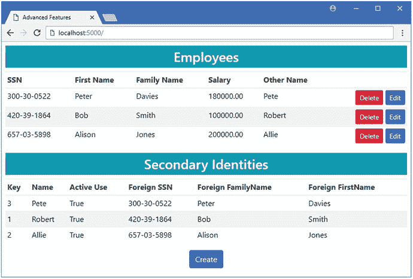

图 23-1。

Running the example application

## 直接使用 SQL

Entity Framework Core 在提供对大多数项目需要的数据库服务器特性的访问方面做得很好，但是每个数据库服务器都有独特的特性，使用它们意味着直接使用 SQL。在接下来的小节中，我将解释 Entity Framework Core 支持使用 SQL 的不同方式，并演示每种方式的工作原理。

Caution

只有在使用标准实体框架核心特性无法获得所需结果的情况下，才应该使用这些特性。直接使用 SQL 会使您的应用更难测试和维护，并且会限制您的应用只能在一个数据库服务器上工作。如果您使用的不是 SQL Server，您可能无法从本章的示例中获得预期的结果。

### 使用 SQL 查询

实体框架核心支持直接使用 SQL 查询数据库的`FromSql`方法。为了演示，我修改了`Home`控制器的`Index`动作，使其使用 SQL 查询数据库，如清单 [23-5](#Par19) 所示。

```cs
using AdvancedApp.Models;
using Microsoft.AspNetCore.Mvc;
using Microsoft.EntityFrameworkCore;
using System.Linq;
using System;
using System.Collections.Generic;

namespace AdvancedApp.Controllers {

    public class HomeController : Controller {
        private AdvancedContext context;

        public HomeController(AdvancedContext ctx) => context = ctx;

        public IActionResult Index() {
            IEnumerable<Employee> data = context.Employees
                .FromSql(@"SELECT * FROM Employees
                            WHERE SoftDeleted = 0
                            ORDER BY Salary DESC");
            //ViewBag.Secondaries = data.Select(e => e.OtherIdentity);
            return View(data);
        }

        public IActionResult Edit(string SSN, string firstName, string familyName) {
            return View(string.IsNullOrWhiteSpace(SSN)
                ? new Employee() : context.Employees.Include(e => e.OtherIdentity)
                    .First(e => e.SSN == SSN
                        && e.FirstName == firstName
                        && e.FamilyName == familyName));
        }

        [HttpPost]
        public IActionResult Update(Employee employee) {
            if (context.Employees.Count(e => e.SSN == employee.SSN
                    && e.FirstName == employee.FirstName
                    && e.FamilyName == employee.FamilyName) == 0) {
                context.Add(employee);
            } else {
                Employee e = new Employee {
                    SSN = employee.SSN, FirstName = employee.FirstName,
                    FamilyName = employee.FamilyName,
                    RowVersion = employee.RowVersion
                };
                context.Employees.Attach(e);
                e.Salary = employee.Salary;
                e.LastUpdated = DateTime.Now;
            }
            context.SaveChanges();
            return RedirectToAction(nameof(Index));
        }

        [HttpPost]
        public IActionResult Delete(Employee employee) {
            context.Employees.Attach(employee);
            employee.SoftDeleted = true;
            context.SaveChanges();
            return RedirectToAction(nameof(Index));
        }        
    }
}

Listing 23-5.Querying Using SQL in the HomeController.cs File in the Controllers Folder

```

`FromSql`方法用于创建一个包含原始 SQL 的查询，在本例中，我从尚未被软删除的`Employees`表中选择数据，并按照`Salary`值对结果进行排序。

在 SQL 中，您可以使用的`FromSql`方法有一些限制。首先，也是最重要的，您必须确保您的结果包含实体框架核心将创建的实体类的每个属性的列，并且这些列必须与那些属性具有相同的名称。你只能通过它的`DbSet<T>`查询一个特定的实体类，相关数据不能被包含，也就是说你不能查询类，除非它们是数据模型的一部分。最后，实体框架核心不会创建相关对象，即使您在原始 SQL 查询中包含了一个`JOIN i`。(有关获取相关数据的不同技术的详细信息，请参见“编写复杂查询”一节。)

要查看发送到数据库服务器的 SQL，使用`dotnet run`启动应用并导航到`http://localhost:5000`。检查应用生成的日志消息，您将看到与清单 [23-5](#Par19) 中的原始 SQL 相对应的查询。

```cs
...
SELECT * FROM Employees
WHERE SoftDeleted = 0
ORDER BY Salary DESC
...

```

由于没有从数据库中检索到相关数据，所以只有`Employee`对象的详细信息会显示给用户，如图 [23-2](#Fig2) 所示。

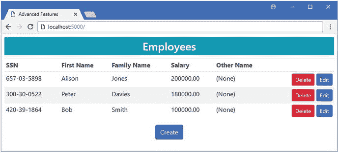

图 23-2。

Querying the database using raw SQL

#### 使用参数查询

为了防止 SQL 注入攻击，您必须对 SQL 查询中包含的任何用户输入进行参数化。最简单的方法是依靠字符串插值功能，该功能在 SQL 字符串中按名称包含值，并自动确保安全处理这些值。在清单 [23-6](#Par26) 中，我修改了由`Index`动作生成的查询，使其接受一个参数，该参数的值取自 HTTP 请求并用于选择数据。

```cs
...

public IActionResult Index(decimal salary = 0) {

    IEnumerable<Employee> data = context.Employees
        .FromSql($@"SELECT * FROM Employees
                    WHERE SoftDeleted = 0
                        AND Salary > {salary}
                    ORDER BY Salary DESC");
    //ViewBag.Secondaries = data.Select(e => e.OtherIdentity);
    return View(data);
}
...
Listing 23-6.Using a Query Parameter in the HomeController.cs File in the Controllers Folder

```

在字符串前面加上美元符号允许我按名称包含值，这样`{salary}`就可以安全地将值合并到查询中。要查看生成的 SQL，使用`dotnet run`启动应用并导航到`http://localhost:5000`。在应用生成的日志消息中，您会看到以下查询:

```cs
...
SELECT * FROM Employees
WHERE SoftDeleted = 0 AND Salary > @p0
ORDER BY Salary DESC
...

```

实体框架核心发送了一个使用安全参数的查询，而不是将该值直接合并到 SQL 字符串中。如果你导航到`http://localhost:5000?salary=100000`，你会看到数据被过滤，只显示`Salary`值超过 100，000 的`Employee`对象，如图 [23-3](#Fig3) 所示。

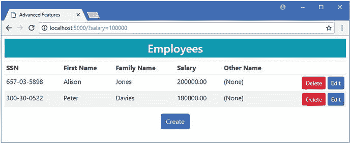

图 23-3。

Querying with user input Other Ways of Passing Parameters in Queries

如果不想使用字符串插值，可以安全地将参数作为参数传递给`FromSql`方法，如下所示:

```cs
...
context.Employees.FromSql(@"SELECT * FROM Employees
                    WHERE SoftDeleted = 0 AND Salary > {0}
                    ORDER BY Salary DESC", salary);
...

```

参数按照指定的顺序使用，并使用从零开始的索引在 SQL 字符串中引用。如果您正在处理一个包含查询所需参数名称的字符串，那么您可以使用`SqlParameter`类为查询提供值。

```cs
...

SqlParameter min = new SqlParameter("minSalary", salary);

IEnumerable<Employee> data = context.Employees
    .FromSql(@"SELECT * FROM Employees
    WHERE SoftDeleted = 0 AND Salary > @minSalary
    ORDER BY Salary DESC", min);
...

```

这两种技术产生的查询与清单 [23-6](#Par26) 中所示的字符串插值技术相匹配。

#### 编写复杂的查询

如果您的数据库服务器和提供者包支持，Entity Framework Core 能够使用原始 SQL 作为更复杂查询的基础，该查询由标准 LINQ 方法或其他 Entity Framework Core 功能组成。例如，我取消了 context 类中的 Fluent API 语句的注释，以启用排除软删除对象的查询过滤器，如清单 [23-7](#Par36) 所示。

```cs
using Microsoft.EntityFrameworkCore;
using System;

namespace AdvancedApp.Models {

    public class AdvancedContext : DbContext {

        public AdvancedContext(DbContextOptions<AdvancedContext> options)
            : base(options) {}

        public DbSet<Employee> Employees { get; set; }

        protected override void OnModelCreating(ModelBuilder modelBuilder) {

            modelBuilder.Entity<Employee>()
                .HasQueryFilter(e => !e.SoftDeleted);

            modelBuilder.Entity<Employee>().Ignore(e => e.Id);
            modelBuilder.Entity<Employee>()
                .HasKey(e => new { e.SSN, e.FirstName, e.FamilyName });

            // ...other statements omitted for brevity...
        }
    }
}

Listing 23-7.Enabling the Query Filter in the AdvancedContext.cs File in the Models Folder

```

在清单 [23-8](#Par38) 中，我已经更改了在`Index`动作方法中进行的查询，以便包含相关数据，并使用`LastUpdated`属性对结果进行排序。

```cs
...
public IActionResult Index(decimal salary = 0) {
    IEnumerable<Employee> data = context.Employees
        .FromSql($@"SELECT * FROM Employees
                    WHERE SoftDeleted = 0
                        AND Salary > {salary}")
        .Include(e => e.OtherIdentity)
        .OrderByDescending(e => e.Salary)
        .OrderByDescending(e => e.LastUpdated).ToArray();
    ViewBag.Secondaries = data.Select(e => e.OtherIdentity);
    return View(data);
}
...
Listing 23-8.Composing a Complex Query in the HomeController.cs File in the Controllers Folder

```

实体框架核心生成一个查询，该查询将传递给`FromSql`方法的原始 SQL 与表示 LINQ 方法的附加查询组合在一起。要查看编写的查询，使用`dotnet run`启动应用，导航到`http://localhost:5000?salary=100000`，并检查日志消息，其中将包含以下查询:

```cs
...
SELECT [e].[SSN], [e].[FirstName], [e].[FamilyName], [e].[LastUpdated],
    [e].[RowVersion], [e].[Salary], [e].[SoftDeleted], [e.OtherIdentity].[Id],
    [e.OtherIdentity].[InActiveUse], [e.OtherIdentity].[Name],
    [e.OtherIdentity].[PrimaryFamilyName], [e.OtherIdentity].[PrimaryFirstName],
    [e.OtherIdentity].[PrimarySSN]
FROM (
    SELECT * FROM Employees
    WHERE SoftDeleted = 0 AND Salary > @p0
) AS [e]
LEFT JOIN [SecondaryIdentity] AS [e.OtherIdentity] ON
    (([e].[SSN] = [e.OtherIdentity].[PrimarySSN])
    AND ([e].[FirstName] = [e.OtherIdentity].[PrimaryFirstName]))
    AND ([e].[FamilyName] = [e.OtherIdentity].[PrimaryFamilyName])
WHERE [e].[SoftDeleted] = 0
ORDER BY [e].[LastUpdated] DESC, [e].[Salary] DESC
...

```

查询的内部部分是我传递给`FromSql`方法的字符串，它被一个外部查询所包围，外部查询使用`SELECT`来获取实体框架核心创建`Employee`和`SecondaryIdentity`对象所需的列名，使用`JOIN`来获取相关数据，使用`WHERE`子句来排除被软删除的数据，使用`ORDER BY`子句根据`LastUpdated`值对数据进行排序。

原始 SQL 和标准 LINQ 方法的混合可以使查询比那些纯粹用原始 SQL 创建的查询更易于管理和测试。也就是说，这种技术确实限制了查询的原始 SQL 部分。例如，请注意，我已经将基于`Salary`值选择数据的`WHERE`子句移到了清单 [23-8](#Par38) 中的 LINQ `OrderByDescending`方法中。组合查询中对原始 SQL 的限制之一是不能使用`ORDER BY`子句。

#### 使用原始 SQL 查询存储过程

当使用早于 ASP.NET Core MVC 应用的数据库时，或者当有特定的性能或数据管理需求时，经常会遇到存储过程。实体框架核心支持查询存储过程，尽管数据库服务器或提供者可能会对可以进行的查询类型进行限制。

清单 [23-9](#Par46) 包含创建一个简单存储过程所需的 SQL 语句，该存储过程查询数据库中`Salary`值超过指定数量的`Employee`对象。从 Visual Studio 工具菜单中选择 SQL Server ➤新查询，连接到数据库，并执行 SQL 以创建存储过程。

Tip

你可以在 [`https://github.com/apress/pro-ef-core-2-for-asp.net-core-mvc`](https://github.com/apress/pro-ef-core-2-for-asp.net-core-mvc) 下载包含清单 [23-9](#Par46) 中的 SQL 语句的文件，作为本书附带的免费源代码下载的一部分。

```cs
USE AdvancedDb
GO

DROP PROCEDURE IF EXISTS GetBySalary;
GO

CREATE PROCEDURE GetBySalary
        @SalaryFilter decimal
AS
        SELECT * from Employees
        WHERE Salary > @SalaryFilter AND SoftDeleted = 0
        ORDER BY Salary DESC
GO

Listing 23-9.A Simple Stored Procedure

```

实体框架核心不能使用它的标准特性查询存储过程，这意味着必须使用`FromSql`方法。在清单 [23-10](#Par48) 中，我修改了`Home`控制器的`Index`动作中的查询，这样它就可以使用存储过程查询数据库。

```cs
...
public IActionResult Index(decimal salary = 0) {
    IEnumerable<Employee> data = context.Employees
        .FromSql($"Execute GetBySalary @SalaryFilter = {salary}")
        .IgnoreQueryFilters();
    //ViewBag.Secondaries = data.Select(e => e.OtherIdentity);
    return View(data);
}
...
Listing 23-10.Querying Using a Stored Procedure in the HomeController.cs File in the Controllers Folder

```

可以用存储过程执行的查询类型是有限的。例如，相关数据不能包含在内，这就是我删除`Include`的原因。我已经移除了`OrderByDescending`方法并添加了`IgnoreQueryFilters`方法来防止客户端执行。Entity Framework Core 不能使用存储过程构成复杂的查询，因此您必须确保该过程完成您需要的所有筛选和处理，或者接受可能需要客户端评估。为了测试存储过程查询，使用`dotnet run`启动应用并导航到`http://localhost:5000?salary=150000`。如果您检查应用生成的日志消息，您可以看到存储过程是这样查询的:

```cs
...
Execute GetHighEarners @SalaryFilter = @p0
...

```

由于没有相关数据，结果将只包含`Employee`数据，如图 [23-4](#Fig4) 所示。

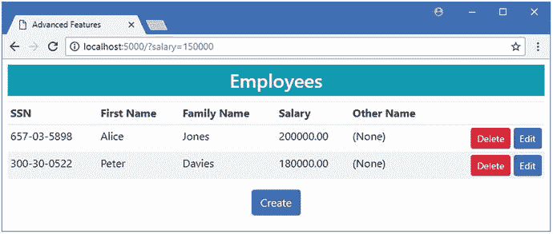

图 23-4。

Querying with a stored procedure

#### 用视图构成复杂查询

如果您能够影响或更改数据库的设计，那么 Entity Framework Core 对视图有更灵活的支持，视图是虚拟表，其内容由查询生成。清单 [23-11](#Par53) 包含创建一个简单视图所需的 SQL 语句，该视图包含所有未被软删除的`Employee`数据。视图通常更复杂，或者通过执行计算来合成数据，但是这个简单的视图足以演示它们如何与实体框架核心一起使用。从 Visual Studio 工具菜单中选择 SQL Server ➤新查询，连接到数据库，并执行 SQL 以创建视图。

```cs
USE AdvancedDb
GO

DROP VIEW IF EXISTS NotDeletedView
GO

CREATE VIEW NotDeletedView
AS
        SELECT * FROM Employees
        WHERE SoftDeleted = 0
GO

Listing 23-11.A Simple View

```

为了查询视图，我更新了`Home`控制器上的`Index`动作，如清单 [23-12](#Par55) 所示。因为视图返回一个表，所以实体框架核心能够通过混合原始 SQL 和普通 LINQ 查询方法来构成一个查询。

```cs
...
public IActionResult Index(decimal salary = 0) {
    IEnumerable<Employee> data = context.Employees
        .FromSql($@"SELECT * from NotDeletedView
                    WHERE Salary > {salary}")
        .Include(e => e.OtherIdentity)
        .OrderByDescending(e => e.Salary)
        .OrderByDescending(e => e.LastUpdated)
        .IgnoreQueryFilters()
        .ToArray();
    ViewBag.Secondaries = data.Select(e => e.OtherIdentity);
    return View(data);
}
...
Listing 23-12.Querying a View in the HomeController.cs File in the Controllers Folder

```

视图是查询中的数据源，由`Include`和`OrderByDescending`方法补充。我添加了`IgnoreQueryFilters`方法，因为视图已经排除了软删除的数据，使得查询过滤器变得多余。启动应用，导航到`http://localhost:5000`，检查日志消息，查看发送到数据库服务器的组合查询。

```cs
...
SELECT [e].[SSN], [e].[FirstName], [e].[FamilyName], [e].[LastUpdated],
    [e].[RowVersion], [e].[Salary], [e].[SoftDeleted], [e.OtherIdentity].[Id],
    [e.OtherIdentity].[InActiveUse], [e.OtherIdentity].[Name],  
    [e.OtherIdentity].[PrimaryFamilyName], [e.OtherIdentity].[PrimaryFirstName],
    [e.OtherIdentity].[PrimarySSN]
FROM (SELECT * from NotDeletedView WHERE Salary > @p0) AS [e]
LEFT JOIN [SecondaryIdentity] AS [e.OtherIdentity]
    ON (([e].[SSN] = [e.OtherIdentity].[PrimarySSN])
    AND ([e].[FirstName] = [e.OtherIdentity].[PrimaryFirstName]))
    AND ([e].[FamilyName] = [e.OtherIdentity].[PrimaryFamilyName])
ORDER BY [e].[LastUpdated] DESC, [e].[Salary] DESC
...

```

由于组成的查询包含相关数据，因此用户既可以看到`Employee`对象，也可以看到`SecondaryIdentity`对象，如图 [23-5](#Fig5) 所示。

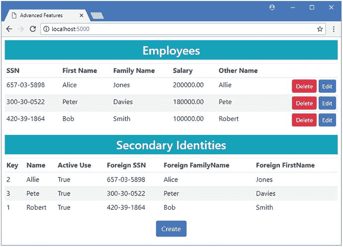

图 23-5。

Querying using a view

#### 使用表值函数构成复杂查询

表值函数就像是视图和存储过程的混合体。像存储过程一样，表值函数可以接受参数，并且它生成一个表作为结果，就像视图一样。当使用 Entity Framework Core 时，表值函数通常可以取代存储过程，其优点是允许组合复杂的查询。

清单 [23-13](#Par62) 包含创建表值函数所需的 SQL 语句，该表值函数执行与清单 [23-9](#Par46) 中创建的存储过程相同的查询。从 Visual Studio“工具”菜单中选择“SQL Server ➤新查询”,连接到数据库，并执行 SQL 来创建函数。

Tip

实体框架核心还支持标量函数，即返回单个值的函数，而不是由表值函数生成的结果表。您可以在 context 类中创建一个方法，而不是直接使用 SQL，Entity Framework Core 将知道在查询中调用这个方法应该会导致函数被执行。在撰写本文时，这个特性是有限的，只适用于有限数量的结果类型。有关详细信息，请在线搜索 Fluent API `HasDbFunction`方法。

```cs
USE AdvancedDb
GO

DROP FUNCTION IF EXISTS GetSalaryTable
GO

CREATE FUNCTION GetSalaryTable(@SalaryFilter decimal)
RETURNS @employeeInfo TABLE
(
    SSN nvarchar(450),
    FirstName nvarchar(450),
    FamilyName nvarchar(450),
    Salary decimal(8, 2),
    LastUpdated datetime2(7),
    SoftDeleted bit
) AS
    BEGIN
        INSERT INTO @employeeInfo
        SELECT SSN, FirstName, FamilyName, Salary, LastUpdated, SoftDeleted
        FROM Employees
        WHERE Salary > @SalaryFilter AND SoftDeleted = 0
            ORDER BY Salary DESC
        RETURN
    END
GO

Listing 23-13.A Table-Valued Function

```

这个 SQL 创建了一个名为`GetSalaryTable`的函数，该函数返回一个包含几乎所有列的表，实体框架核心需要这些列来创建`Employee`对象。例外情况是`RowVersion`列，因为它的 SQL 数据类型不能用在函数中。

如前所述，原始 SQL 查询必须为实体框架核心创建对象所需的所有属性生成值。为了防止实体框架核心处理查询结果时出现异常，我已经将数据模型配置为忽略`Employee`类中的`RowVersion`属性，如清单 [23-14](#Par66) 所示。

Caution

确保您了解忽略属性对这种查询工作的影响。在这种情况下，禁用`RowVersion`属性会在用户软删除对象时禁用对并发更新的保护。其他操作不受影响，因为`Home`控制器中的其他操作方法所做的查询不使用表值函数。

```cs
using Microsoft.EntityFrameworkCore;
using System;

namespace AdvancedApp.Models {

    public class AdvancedContext : DbContext {

        public AdvancedContext(DbContextOptions<AdvancedContext> options)
            : base(options) {}

        public DbSet<Employee> Employees { get; set; }

        protected override void OnModelCreating(ModelBuilder modelBuilder) {

            modelBuilder.Entity<Employee>()
                .HasQueryFilter(e => !e.SoftDeleted);

            modelBuilder.Entity<Employee>().Ignore(e => e.Id);
            modelBuilder.Entity<Employee>()
                .HasKey(e => new { e.SSN, e.FirstName, e.FamilyName });

            modelBuilder.Entity<Employee>()
                .Property(e => e.Salary).HasColumnType("decimal(8,2)")
                .HasField("databaseSalary")
                .UsePropertyAccessMode(PropertyAccessMode.Field);

            modelBuilder.Entity<Employee>().Property<DateTime>("LastUpdated")
                .HasDefaultValue(new DateTime(2000, 1, 1));

            modelBuilder.Entity<Employee>()
                .Ignore(e => e.RowVersion);
            //  .Property(e => e.RowVersion).IsRowVersion();

            modelBuilder.Entity<SecondaryIdentity>()
                .HasOne(s => s.PrimaryIdentity)
                .WithOne(e => e.OtherIdentity)
                .HasPrincipalKey<Employee>(e => new { e.SSN,
                     e.FirstName, e.FamilyName })
                .HasForeignKey<SecondaryIdentity>(s => new { s.PrimarySSN,
                     s.PrimaryFirstName, s.PrimaryFamilyName })
                .OnDelete(DeleteBehavior.Restrict);

            modelBuilder.Entity<SecondaryIdentity>()
                .Property(e => e.Name).HasMaxLength(100);
        }
    }
}

Listing 23-14.Ignoring a Property in the AdvancedContext.cs File in the Models Folder

```

为了使用表值函数，我在`Home`控制器的`Index`动作中修改了查询，如清单 [23-15](#Par68) 所示。

```cs
...
public IActionResult Index(decimal salary = 0) {
    IEnumerable<Employee> data = context.Employees
        .FromSql($@"SELECT * from GetSalaryTable({salary})")
        .Include(e => e.OtherIdentity)
        //.OrderByDescending(e => e.Salary)
        .OrderByDescending(e => e.LastUpdated)
        .IgnoreQueryFilters()
        .ToArray();
    ViewBag.Secondaries = data.Select(e => e.OtherIdentity);
    return View(data);
}
...
Listing 23-15.Querying a Table-Valued Function in the HomeController.cs File in the Controllers Folder

```

表值函数用作原始 SQL 查询的目标，并接收一个用于按`Salary`值进行过滤的参数。由于实体框架核心能够在使用表值函数时执行复杂的查询，所以我能够包含相关数据并对结果进行排序。(我已经注释掉了`Salary`属性的`OrderByDescending`，因为该函数已经使用`Salary`值对数据进行了排序。)

要查看效果，使用`dotnet run`启动应用并导航到`http://localhost:5000`。在应用生成的日志消息中，您将看到 Entity Framework Core 针对表值函数编写的查询。

```cs
...
SELECT [e].[SSN], [e].[FirstName], [e].[FamilyName], [e].[LastUpdated], [e].[Salary],
    [e].[SoftDeleted], [e.OtherIdentity].[Id], [e.OtherIdentity].[InActiveUse],
    [e.OtherIdentity].[Name], [e.OtherIdentity].[PrimaryFamilyName],
    [e.OtherIdentity].[PrimaryFirstName], [e.OtherIdentity].[PrimarySSN]
FROM (SELECT * from GetSalaryTable(@p0)) AS [e]
LEFT JOIN [SecondaryIdentity] AS [e.OtherIdentity]
    ON (([e].[SSN] = [e.OtherIdentity].[PrimarySSN])
    AND ([e].[FirstName] = [e.OtherIdentity].[PrimaryFirstName]))
    AND ([e].[FamilyName] = [e.OtherIdentity].[PrimaryFamilyName])
ORDER BY [e].[LastUpdated] DESC
...

```

组合查询遵循前面示例中所示的相同结构。由于这是一个组合查询，相关数据被加载并显示给用户，如图 [23-6](#Fig6) 所示。

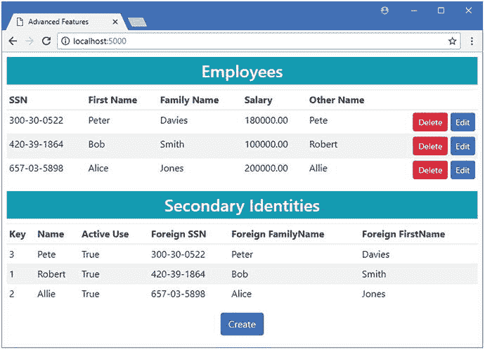

图 23-6。

Querying using a table-valued function

### 调用存储过程或其他操作

并不是所有的存储过程都用来查询数据，这意味着不能总是使用`FromSql`方法。尽管 Entity Framework Core 不会通过 context 类自动公开存储过程，但它们仍然可以使用。清单 [23-16](#Par74) 包含创建两个存储过程的 SQL 语句，这两个存储过程恢复软删除的数据或永久删除它。从 Visual Studio“工具”菜单中选择“SQL Server ➤新查询”,连接到数据库，并执行 SQL 来创建函数。

```cs
USE AdvancedDb
GO

DROP PROCEDURE IF EXISTS RestoreSoftDelete
DROP PROCEDURE IF EXISTS PurgeSoftDelete
GO

CREATE PROCEDURE RestoreSoftDelete
AS
    BEGIN
        UPDATE Employees
         SET SoftDeleted = 0 WHERE SoftDeleted = 1
    END
GO

CREATE PROCEDURE PurgeSoftDelete
AS
    BEGIN
        DELETE from SecondaryIdentity WHERE Id IN
            ( SELECT Id from Employees emp
            INNER JOIN SecondaryIdentity ident on ident.PrimarySSN = emp.SSN
            AND ident.PrimaryFirstName = emp.FirstName
            AND ident.PrimaryFamilyName = emp.FamilyName
            WHERE SoftDeleted = 1)
    END
    BEGIN
        DELETE FROM Employees
        WHERE SoftDeleted = 1
    END

Listing 23-16.Two Stored Procedures

```

不返回数据的存储过程使用`ExecuteSqlCommand`来调用，我在清单 [23-17](#Par76) 中使用它来更新`Delete`控制器。

```cs
using AdvancedApp.Models;
using Microsoft.AspNetCore.Mvc;
using Microsoft.EntityFrameworkCore;
using System.Linq;
using System.Collections.Generic;

namespace AdvancedApp.Controllers {

    public class DeleteController : Controller {
        private AdvancedContext context;

        public DeleteController(AdvancedContext ctx) => context = ctx;

        public IActionResult Index() {
            return View(context.Employees.Where(e => e.SoftDeleted)
                .Include(e => e.OtherIdentity).IgnoreQueryFilters());
        }

        [HttpPost]
        public IActionResult Restore(Employee employee) {
            context.Employees.IgnoreQueryFilters()
                .First(e => e.SSN == employee.SSN
                    && e.FirstName == employee.FirstName
                    && e.FamilyName == employee.FamilyName).SoftDeleted = false;
            context.SaveChanges();
            return RedirectToAction(nameof(Index));
        }

        [HttpPost]
        public IActionResult Delete(Employee e) {
            if (e.OtherIdentity != null) {
                context.Remove(e.OtherIdentity);
            }
            context.Employees.Remove(e);
            context.SaveChanges();
            return RedirectToAction(nameof(Index));
        }

        [HttpPost]
        public IActionResult DeleteAll() {
            context.Database.ExecuteSqlCommand("EXECUTE PurgeSoftDelete");
            return RedirectToAction(nameof(Index));
        }

        [HttpPost]
        public IActionResult RestoreAll() {
            context.Database.ExecuteSqlCommand("EXECUTE RestoreSoftDelete");
            return RedirectToAction(nameof(Index));
        }

    }
}

Listing 23-17.Calling Stored Procedures in the DeleteController.cs File in the Controllers Folder

```

不返回数据的 SQL 特性通过 context 类的`Database.ExecuteSqlCommand`方法访问，该方法接受一个 SQL 字符串(和可选参数)。在清单中，我使用了`ExecuteSqlCommand`方法来调用清单 [23-16](#Par74) 中定义的存储过程。

清单 [23-17](#Par76) 中的`DeleteAll`动作已经可以被用户使用，在清单 [23-18](#Par79) 中，我已经为`Delete`控制器使用的`Index`视图添加了一个 HTML 元素，这样`RestoreAll`方法就可以被定位。

```cs
@model IEnumerable<Employee>
@{
    ViewData["Title"] = "Advanced Features";
    Layout = "_Layout";
}
<h3 class="bg-info p-2 text-center text-white">Deleted Employees</h3>
<table class="table table-sm table-striped">
    <thead>
        <tr>
            <th>SSN</th>
            <th>First Name</th>
            <th>Family Name</th>
            <th></th>
        </tr>
    </thead>
    <tbody>
        <tr class="placeholder"><td colspan="4" class="text-center">No Data</td></tr>
        @foreach (Employee e in Model) {
            <tr>
                <td>@e.SSN</td>
                <td>@e.FirstName</td>
                <td>@e.FamilyName</td>
                <td class="text-right">
                    <form method="post">
                        <input type="hidden" name="SSN" value="@e.SSN" />
                        <input type="hidden" name="FirstName" value="@e.FirstName" />
                        <input type="hidden" name="FamilyName"
                               value="@e.FamilyName" />
                        <input type="hidden" name="RowVersion"
                               asp-for="@e.RowVersion" />
                        <input type="hidden" name="OtherIdentity.Id"
                               value="@e.OtherIdentity.Id" />
                        <button asp-action="Restore" class="btn btn-sm btn-success">
                            Restore
                        </button>
                        <button asp-action="Delete" class="btn btn-sm btn-danger">
                            Delete
                        </button>
                    </form>
                </td>
            </tr>
        }
    </tbody>
</table>
<div class="text-center">
    <form method="post" asp-action="DeleteAll">
        <button type="submit" class="btn btn-danger">Delete All</button>
        <button type="submit" class="btn btn-success" asp-action="RestoreAll">
            Restore All
        </button>
    </form>
</div>
Listing 23-18.Adding an Element in the Index.cshtml File in the Views/Delete Folder

```

为了确认存储过程正在被调用，使用`dotnet run`启动应用，导航到`http://localhost:5000`，并使用删除按钮软删除`Employee`对象。然后你可以导航到`http://localhost:5000/delete`并使用删除全部或恢复全部按钮来调用存储过程，如图 [23-7](#Fig7) 所示。

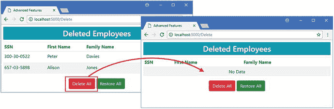

图 23-7。

Calling a stored procedure

## 使用服务器生成的值

在第 [19](19.html) 章中，您看到了数据库服务器如何负责生成唯一键，但是这不是数据库服务器可以创建的唯一类型的值。在接下来的小节中，我将解释支持处理数据库服务器生成的数据值的不同实体框架核心特性。

### 使用数据库服务器生成的默认值

对于许多属性，使用带有固定值的`HasDefaultValue`方法，如第 [21 章](21.html)所示，会很有用，因为它允许你为你存储在数据库中的对象定义一个方便的基线。

然而，在某些项目中，每次存储新对象时，要求数据库服务器生成一个默认值是很有用的，尽管数据库可以生成的默认值的范围是有限的。作为一个例子，我向`Employee`类添加了一个新属性，如清单 [23-19](#Par84) 所示。我没有为每一种不同的服务器生成的值添加新的属性，而是添加了一个属性，其目的只是充当占位符，以便我可以轻松地显示值。

```cs
using System;

namespace AdvancedApp.Models {

    public class Employee {
        private decimal databaseSalary;

        public long Id { get; set; }
        public string SSN { get; set; }
        public string FirstName { get; set; }
        public string FamilyName { get; set; }

        public decimal Salary {
            get => databaseSalary;
            set => databaseSalary = value;
        }

        public SecondaryIdentity OtherIdentity { get; set; }

        public bool SoftDeleted { get; set; } = false;

        public DateTime LastUpdated { get; set; }
        public byte[] RowVersion { get; set; }

        public string GeneratedValue { get; set; }
    }
}

Listing 23-19.Adding a Property to the Employee.cs File in the Models Folder

```

使用 Fluent API `HasDefaultValueSql`方法请求数据库服务器为一个属性生成默认值，该方法类似于`HasDefaultValue`方法，但是告诉数据库服务器执行一个 SQL 表达式来获得默认值。在清单 [23-20](#Par86) 中，我已经使用`HasDefaultValueSql`方法配置了新的属性。

```cs
using Microsoft.EntityFrameworkCore;
using System;

namespace AdvancedApp.Models {

    public class AdvancedContext : DbContext {

        public AdvancedContext(DbContextOptions<AdvancedContext> options)
            : base(options) {}

        public DbSet<Employee> Employees { get; set; }

        protected override void OnModelCreating(ModelBuilder modelBuilder) {

            modelBuilder.Entity<Employee>()
                .HasQueryFilter(e => !e.SoftDeleted);

            modelBuilder.Entity<Employee>().Ignore(e => e.Id);
            modelBuilder.Entity<Employee>()
                .HasKey(e => new { e.SSN, e.FirstName, e.FamilyName });

            modelBuilder.Entity<Employee>()
                .Property(e => e.Salary).HasColumnType("decimal(8,2)")
                .HasField("databaseSalary")
                .UsePropertyAccessMode(PropertyAccessMode.Field);

            modelBuilder.Entity<Employee>().Property<DateTime>("LastUpdated")
                .HasDefaultValue(new DateTime(2000, 1, 1));

            modelBuilder.Entity<Employee>()
                .Ignore(e => e.RowVersion);
            //    .Property(e => e.RowVersion).IsRowVersion();

            modelBuilder.Entity<Employee>().Property(e => e.GeneratedValue)
                .HasDefaultValueSql("GETDATE()");

            modelBuilder.Entity<SecondaryIdentity>()
                .HasOne(s => s.PrimaryIdentity)
                .WithOne(e => e.OtherIdentity)
                .HasPrincipalKey<Employee>(e => new { e.SSN,
                     e.FirstName, e.FamilyName })
                .HasForeignKey<SecondaryIdentity>(s => new { s.PrimarySSN,
                     s.PrimaryFirstName, s.PrimaryFamilyName })
                .OnDelete(DeleteBehavior.Restrict);

            modelBuilder.Entity<SecondaryIdentity>()
                .Property(e => e.Name).HasMaxLength(100);
        }
    }
}

Listing 23-20.Configuring the Default Value in the AdvancedContext.cs File in the Models Folder

```

在清单中，我使用了 SQL `GETDATE`函数来获取时间戳。对可用于生成默认值的 SQL 表达式有一些限制，这意味着值的范围是有限的。例如，不允许引用同一表中的其他列，这是有意义的，因为默认值是在存储数据时设置的。因此，使用 SQL 来指定默认值通常涉及到调用函数或使用常量。正是因为这个原因，大多数默认值的演示依赖于我在这个例子中使用的 SQL `GETDATE`函数。正如我在接下来的章节中所描述的，还有更灵活的选择。

为了接收`GeneratedValue`属性的值，我已经更改了`Home`控制器的`Index`动作中的查询，以便它不再使用`GetSalaryTable`函数进行查询，该函数返回实体框架核心所需值的子集，如清单 [23-21](#Par89) 所示。

```cs
...

public IActionResult Index() {

    IEnumerable<Employee> data = context.Employees
        //.FromSql($@"SELECT * from GetSalaryTable({salary})")
        .Include(e => e.OtherIdentity)
        //.OrderByDescending(e => e.Salary)
        .OrderByDescending(e => e.LastUpdated)
        .IgnoreQueryFilters()
        .ToArray();
    ViewBag.Secondaries = data.Select(e => e.OtherIdentity);
    return View(data);
}
...
Listing 23-21.Revising the Query in the HomeController.cs File in the Controllers Folder

```

配置数据库需要新的迁移。在`AdvancedApp`项目文件夹中运行清单 [23-22](#Par91) 中所示的命令，创建一个名为`GeneratedDefaultValue`的迁移，并将其应用到示例数据库中。

```cs
dotnet ef migrations add GeneratedDefaultValue
dotnet ef database update
Listing 23-22.Creating and Applying a Database Migration

```

为了向用户显示默认值，我将清单 [23-23](#Par93) 中所示的元素添加到`Home`控制器使用的`Index`视图中。

```cs
@model IEnumerable<Employee>
@{
    ViewData["Title"] = "Advanced Features";
    Layout = "_Layout";
}
<h3 class="bg-info p-2 text-center text-white">Employees</h3>
<table class="table table-sm table-striped">
    <thead>
        <tr>
            <th>SSN</th>
            <th>First Name</th>
            <th>Family Name</th>
            <th>Salary</th>
            <th>Other Name</th>
            <th>Generated</th>
            <th></th>
        </tr>
    </thead>
    <tbody>
        <tr class="placeholder"><td colspan="8" class="text-center">No Data</td></tr>
        @foreach (Employee e in Model) {
            <tr>
                <td>@e.SSN</td>
                <td>@e.FirstName</td>
                <td>@e.FamilyName</td>
                <td>@e.Salary</td>
                <td>@(e.OtherIdentity?.Name ?? "(None)")</td>
                <td>@e.GeneratedValue</td>
                <td class="text-right">
                    <form>
                        <input type="hidden" name="SSN" value="@e.SSN" />
                        <input type="hidden" name="Firstname" value="@e.FirstName" />
                        <input type="hidden" name="FamilyName"
                               value="@e.FamilyName" />
                        <input type="hidden" name="RowVersion"
                               asp-for="@e.RowVersion" />
                        <input type="hidden" name="OtherIdentity.Id"
                               value="@e.OtherIdentity?.Id" />
                        <button type="submit" asp-action="Delete" formmethod="post"
                                class="btn btn-sm btn-danger">
                            Delete
                        </button>
                        <button type="submit" asp-action="Edit" formmethod="get"
                                class="btn btn-sm btn-primary">
                            Edit
                        </button>
                    </form>
                </td>
            </tr>
        }
    </tbody>
</table>
@if (ViewBag.Secondaries != null) {
    @Html.Partial("SecondaryIdentities")
}
<div class="text-center">
    <a asp-action="Edit" class="btn btn-primary">Create</a>
</div>
Listing 23-23.Adding Elements in the Index.cshtml File in the Views/Home Folder

```

要查看数据库服务器生成的默认值，使用`dotnet run`启动应用，导航到`http://localhost:5000`，单击 Create 按钮，并存储一个新对象。当它存储新数据时，数据库服务器将评估我在清单 [23-21](#Par89) 中使用的 SQL 表达式，并产生类似于图 [23-8](#Fig8) 所示的结果。

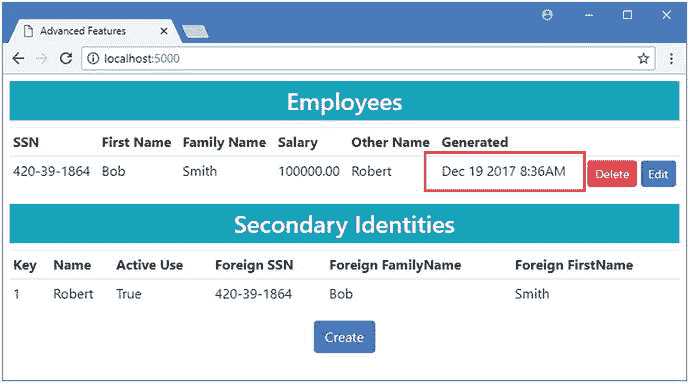

图 23-8。

Generating a default value

让数据库服务器生成缺省值的一个结果是，实体框架核心必须查询数据库，以找出分配了什么值。如果您检查应用生成的日志消息，您会看到一个`INSERT`命令被用来在数据库中存储新对象，如下所示:

```cs
...
INSERT INTO [Employees] ([SSN], [FirstName], [FamilyName], [Salary], [SoftDeleted])
VALUES (@p0, @p1, @p2, @p3, @p4);
...

```

紧随`INSERT`之后，您将看到一个查询，其中实体框架核心请求由数据库分配的`GeneratedValue`和`LastUpdated`值，如下所示:

```cs
...
SELECT [GeneratedValue], [LastUpdated]
FROM [Employees]
WHERE @@ROWCOUNT = 1 AND [SSN] = @p0 AND [FirstName] = @p1 AND [FamilyName] = @p2;
...

```

实体框架核心使用这些值来更新已存储的对象的属性，这确保了对该对象执行的任何后续操作都具有一组完整的值。

### 合并顺序值

增加服务器生成的默认值的灵活性的一种方法是加入一个序列，其中数据库服务器将根据请求生成唯一的值。这类似于我在第 [19 章](19.html)中描述的生成键值的特性，但是它可以应用于任何属性，并且可以包含在生成的值中。

在清单 [23-24](#Par102) 中，我向数据模型添加了一个序列，并将其作为 SQL 表达式的一部分，为`GeneratedValue`属性生成一个值。

```cs
using Microsoft.EntityFrameworkCore;
using System;

namespace AdvancedApp.Models {

    public class AdvancedContext : DbContext {

        public AdvancedContext(DbContextOptions<AdvancedContext> options)
            : base(options) {}

        public DbSet<Employee> Employees { get; set; }

        protected override void OnModelCreating(ModelBuilder modelBuilder) {

            modelBuilder.Entity<Employee>()
                .HasQueryFilter(e => !e.SoftDeleted);

            modelBuilder.Entity<Employee>().Ignore(e => e.Id);
            modelBuilder.Entity<Employee>()
                .HasKey(e => new { e.SSN, e.FirstName, e.FamilyName });

            modelBuilder.Entity<Employee>()
                .Property(e => e.Salary).HasColumnType("decimal(8,2)")
                .HasField("databaseSalary")
                .UsePropertyAccessMode(PropertyAccessMode.Field);

            modelBuilder.Entity<Employee>().Property<DateTime>("LastUpdated")
                .HasDefaultValue(new DateTime(2000, 1, 1));

            modelBuilder.Entity<Employee>()
                .Ignore(e => e.RowVersion);
            //    .Property(e => e.RowVersion).IsRowVersion();

            modelBuilder.HasSequence<int>("ReferenceSequence")
                .StartsAt(100)
                .IncrementsBy(2);

            modelBuilder.Entity<Employee>().Property(e => e.GeneratedValue)
                .HasDefaultValueSql(@"'REFERENCE_'
                    + CONVERT(varchar, NEXT VALUE FOR ReferenceSequence)");

            modelBuilder.Entity<SecondaryIdentity>()
                .HasOne(s => s.PrimaryIdentity)
                .WithOne(e => e.OtherIdentity)
                .HasPrincipalKey<Employee>(e => new { e.SSN,
                     e.FirstName, e.FamilyName })
                .HasForeignKey<SecondaryIdentity>(s => new { s.PrimarySSN,
                     s.PrimaryFirstName, s.PrimaryFamilyName })
                .OnDelete(DeleteBehavior.Restrict);

            modelBuilder.Entity<SecondaryIdentity>()
                .Property(e => e.Name).HasMaxLength(100);
        }
    }
}

Listing 23-24.Using a Sequence in the AdvancedContext.cs File in the Models Folder

```

使用`HasSequence`方法创建序列，其中 type 参数设置序列值的数据类型，method 参数是分配给序列的名称。我使用了名称`ReferenceSequence`，但是在一个真实的项目中，您应该尽可能使您的序列名称有意义，因为单个序列可以在数据库中的任何地方使用。

`HasSequence`方法返回一个`SequenceBuilder`对象，该对象可用于使用表 [23-4](#Tab4) 中描述的方法配置序列。

表 23-4。

The Sequence Configuration Methods

<colgroup><col> <col></colgroup> 
| 名字 | 描述 |
| --- | --- |
| `StartsAt(value)` | 此方法用于指定序列的起始值。 |
| `IncrementsBy(value)` | 此方法用于指定生成值后序列的增量。 |
| `IsCyclic(cycles)` | 此方法用于指定当达到最大值时序列是否重新开始。 |
| `HasMax(value)` | 此方法用于指定序列的最大值。 |
| `HasMin(value)` | 此方法用于指定序列的最小值。 |

在清单中，我使用了`StartsAt`方法将 100 指定为起始值，并使用`IncrementsBy`方法创建了一个序列，每生成一个新值就递增 2。为了使用这个序列，我修改了传递给`HasDefaultValueSql`方法的表达式，这样序列的下一个值就被转换成一个字符串，并带有前缀`REFERENCE_`。

应用序列需要新的迁移。在`AdvancedApp`项目文件夹中运行清单 [23-25](#Par107) 中所示的命令，创建一个名为`Sequence`的迁移，并将其应用到数据库中。

```cs
dotnet ef migrations add Sequence
dotnet ef database update

Listing 23-25.Creating and Applying a Database Migration

```

要查看效果，使用`dotnet run`启动应用，导航到`http://localhost:5000`，单击 Create 按钮，并在数据库中存储一个新对象。当显示结果时，你会看到该序列已经被用来为新对象创建默认值，如图 [23-9](#Fig9) 所示。

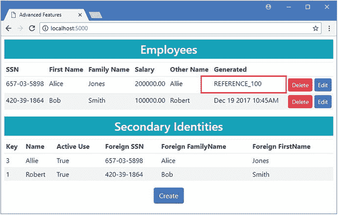

图 23-9。

Using a sequence to generate default values Avoiding the Sequence Pitfalls

使用序列时有两个常见的陷阱。第一个陷阱是在使用表 [23-4](#Tab4) 中描述的方法时过于严格，导致可用值池太小，无法满足应用的需求。开发完成后，所有可能的序列值都会用完，数据库服务器会开始报告错误。

第二个陷阱是在纠正一个用尽的序列时最常见的尝试，即快速应用`IsCyclic`方法，以便序列将重新开始。循环序列中的值不能保证是唯一的，这意味着同一个值可能被赋值多次，并给假定序列值是唯一的应用带来问题。

创建序列时，请选择一种能够为您的应用提供足够大的值范围的数据类型。如果您需要唯一的值，那么考虑使用备用键，如第 [19](19.html) 章所述。

### 计算数据库中的值

计算列是数据库服务器使用数据库中已有的值计算的列。这是一种生成值的有用方法，否则每次执行查询时都必须重复计算这些值，并且可能需要客户端查询评估。

作为一个例子，我修改了`Home`控制器的`Index`动作中的查询，这样用户就可以为组合的`FirstName`和`FamilyName`值应用一个搜索词，如清单 [23-26](#Par114) 所示。

```cs
...

public IActionResult Index(string searchTerm) {

    IQueryable<Employee> query = context.Employees.Include(e => e.OtherIdentity);
    if (!string.IsNullOrEmpty(searchTerm)) {
        query = query.Where(e => EF.Functions
            .Like($"{e.FirstName[0]}{e.FamilyName}", searchTerm));
    }
    IEnumerable<Employee> data = query.ToArray();
    ViewBag.Secondaries = data.Select(e => e.OtherIdentity);
    return View(data);
}
...
Listing 23-26.Querying with a Search Term in the HomeController.cs File in the Controllers Folder

```

该查询获取`FirstName`属性的第一个字符，将其与`FamilyName`属性的值连接起来，并使用`Like`方法执行搜索。使用`dotnet run`启动应用并导航至`http://localhost:5000?searchTerm=%ajon%`。搜索词是`%ajon%`，它将匹配一个`Employee`，例如 Alice Jones，尽管您可能需要更改搜索词以匹配您存储的数据。您将在应用生成的日志消息中看到以下警告:

```cs
...
The LINQ expression 'where __Functions_0.Like(Format("{0}{1}", [e].FamilyName, Convert([e].FirstName.get_Chars(0), Object)), __searchTerm_1)' could not be translated and will be evaluated locally.
...

```

正如我在第 [20 章](20.html)中解释的，如果查询不能被翻译成 SQL，那么`Like`方法将在客户端被评估，这就是这个例子将要发生的。

计算列通过生成可在数据库中查询的值，有助于避免客户端计算。在清单 [23-27](#Par119) 中，我更改了`GeneratedValue`属性的配置，使其成为包含组合名称值的计算列。

```cs
using Microsoft.EntityFrameworkCore;
using System;

namespace AdvancedApp.Models {

    public class AdvancedContext : DbContext {

        public AdvancedContext(DbContextOptions<AdvancedContext> options)
            : base(options) {}

        public DbSet<Employee> Employees { get; set; }

        protected override void OnModelCreating(ModelBuilder modelBuilder) {

            modelBuilder.Entity<Employee>()
                .HasQueryFilter(e => !e.SoftDeleted);

            modelBuilder.Entity<Employee>().Ignore(e => e.Id);
            modelBuilder.Entity<Employee>()
                .HasKey(e => new { e.SSN, e.FirstName, e.FamilyName });

            modelBuilder.Entity<Employee>()
                .Property(e => e.Salary).HasColumnType("decimal(8,2)")
                .HasField("databaseSalary")
                .UsePropertyAccessMode(PropertyAccessMode.Field);

            modelBuilder.Entity<Employee>().Property<DateTime>("LastUpdated")
                .HasDefaultValue(new DateTime(2000, 1, 1));

            modelBuilder.Entity<Employee>()
                .Ignore(e => e.RowVersion);
            //    .Property(e => e.RowVersion).IsRowVersion();

            modelBuilder.HasSequence<int>("ReferenceSequence")
                .StartsAt(100)
                .IncrementsBy(2);

            modelBuilder.Entity<Employee>().Property(e => e.GeneratedValue)
                //.HasDefaultValueSql(@"'REFERENCE_'
                //    + CONVERT(varchar, NEXT VALUE FOR ReferenceSequence)");
                .HasComputedColumnSql(@"SUBSTRING(FirstName, 1, 1)
                                            + FamilyName PERSISTED");
            modelBuilder.Entity<Employee>().HasIndex(e => e.GeneratedValue);

            modelBuilder.Entity<SecondaryIdentity>()
                .HasOne(s => s.PrimaryIdentity)
                .WithOne(e => e.OtherIdentity)
                .HasPrincipalKey<Employee>(e => new { e.SSN,
                     e.FirstName, e.FamilyName })
                .HasForeignKey<SecondaryIdentity>(s => new { s.PrimarySSN,
                     s.PrimaryFirstName, s.PrimaryFamilyName })
                .OnDelete(DeleteBehavior.Restrict);

            modelBuilder.Entity<SecondaryIdentity>()
                .Property(e => e.Name).HasMaxLength(100);
        }
    }
}

Listing 23-27.Defining a Computed Column in the AdvancedContext.cs File in the Models Folder

```

使用`HasComputedColumnSql`方法配置计算列，该方法接收将用于生成属性值的 SQL 表达式。在这种情况下，SQL 表达式创建了我前面使用的相同的连接名称。

```cs
...
.HasComputedColumnSql(@"SUBSTRING(FirstName, 1, 1) + FamilyName PERSISTED");
...

```

`PERSISTED`关键字告诉数据库服务器将值永久存储在数据库中，而不是为每个查询生成它们。我还使用 Fluent API `HasIndex`方法为`GeneratedValue`属性创建了一个索引；这不是计算列的要求，但它将提高搜索性能。

添加计算列需要更新数据库。在`AdvancedApp`项目文件夹中运行清单 [23-28](#Par125) 中所示的命令，创建一个新的迁移，并将其应用到数据库中。

Tip

当它所依赖的任何值发生变化时，数据库服务器将自动重新计算计算列值。在本例中，这意味着如果`FirstName`或`FamilyName`的值发生变化，那么`SearchName`属性将被重新计算。

```cs
dotnet ef migrations add ComputedColumn
dotnet ef database update
Listing 23-28.Creating and Applying a Database Migration

```

#### 使用计算列进行查询

一旦定义了计算列，就可以像任何其他列一样在查询中使用它。在清单 [23-29](#Par127) 中，我已经更新了`Home`控制器的`Index`动作中的查询，以便在对应于计算列的属性上执行`Like`操作。

```cs
...
public IActionResult Index(string searchTerm) {
    IQueryable<Employee> query = context.Employees.Include(e => e.OtherIdentity);
    if (!string.IsNullOrEmpty(searchTerm)) {
        query = query.Where(e => EF.Functions.Like(e.GeneratedValue, searchTerm));
    }
    IEnumerable<Employee> data = query.ToArray();
    ViewBag.Secondaries = data.Select(e => e.OtherIdentity);
    return View(data);
}
...
Listing 23-29.Using a Computed Column in the HomeController.cs File in the Controllers Folder

```

使用`dotnet run`启动应用，并导航至`http://localhost:5000?searchTerm=%ajon%`；您将看到如图 [23-10](#Fig10) 所示的结果，尽管您可能需要更改搜索词以匹配您数据库中的数据。如果您检查应用生成的日志消息，您会看到`LIKE`操作是作为 SQL 查询的一部分执行的。

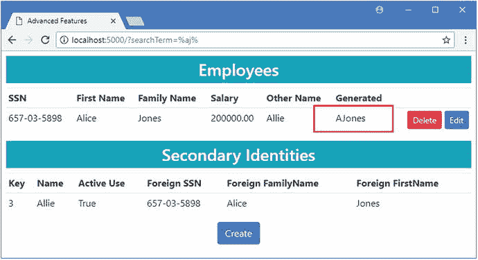

图 23-10。

Querying using a computed column

```cs
...
SELECT [e].[SSN], [e].[FirstName], [e].[FamilyName], [e].[GeneratedValue],
    [e].[LastUpdated], [e].[Salary], [e].[SoftDeleted], [e.OtherIdentity].[Id],
    [e.OtherIdentity].[InActiveUse], [e.OtherIdentity].[Name],
    [e.OtherIdentity].[PrimaryFamilyName], [e.OtherIdentity].[PrimaryFirstName],
    [e.OtherIdentity].[PrimarySSN]
FROM [Employees] AS [e]
LEFT JOIN [SecondaryIdentity] AS [e.OtherIdentity]
    ON (([e].[SSN] = [e.OtherIdentity].[PrimarySSN])
        AND ([e].[FirstName] = [e.OtherIdentity].[PrimaryFirstName]))
        AND ([e].[FamilyName] = [e.OtherIdentity].[PrimaryFamilyName])

WHERE ([e].[SoftDeleted] = 0) AND [e].[GeneratedValue] LIKE @__searchTerm_1

...

```

### 建模自动生成的值

在某些项目中，您可能必须处理由数据库服务器生成但尚未在数据库中配置的值。这通常是因为数据库包含触发器，当在数据库中插入或修改数据时，触发器会自动生成值。

为了准备这个例子，在`AdvancedApp`项目文件夹中运行清单 [23-30](#Par132) 中所示的命令。这些命令从项目中删除最近的迁移，并重新创建数据库，这避免了 Entity Framework Core 试图删除仍被索引使用的列的问题。

```cs
dotnet ef database drop --force
dotnet ef migrations remove --force
dotnet ef database update
Listing 23-30.Removing a Migration and Dropping the Database

```

清单 [23-31](#Par134) 包含创建一个简单触发器所需的 SQL 语句，该触发器在数据库中存储或更新一个`Employee`对象时更新`GeneratedValue`属性。从 Visual Studio 工具菜单中选择 SQL Server ➤新查询，连接到数据库，并执行 SQL 以创建触发器。

```cs
USE AdvancedDb
GO

DROP TRIGGER IF EXISTS GeneratedValueTrigger
GO

CREATE TRIGGER GeneratedValueTrigger ON Employees
        AFTER  INSERT, UPDATE
AS
BEGIN
        DECLARE @Salary decimal(8,0), @SSN nvarchar(450),
                @First nvarchar(450), @Family nvarchar(450)

        SELECT @Salary = INSERTED.Salary, @SSN = INSERTED.SSN,
                @First = INSERTED.FirstName, @Family = INSERTED.FamilyName
        FROM INSERTED

        UPDATE dbo.Employees SET GeneratedValue = FLOOR(@Salary /2)
        WHERE SSN = @SSN AND FirstName = @First AND FamilyName = @Family
END

Listing 23-31.Creating a Trigger in the Database

```

当`Employee`表中的一行被更新并将`GeneratedValue`属性设置为`Salary`值的一半时，该触发器被执行。

Entity Framework Core 不支持在数据库中设置触发器之类的功能，但是您可以确保它检查以获取数据库服务器生成的值，以便使用相同对象执行的后续操作不会有不完整或过时的数据。

有四种 Fluent API 方法可用于告诉实体框架核心如何为属性生成值，如表 [23-5](#Tab5) 中所述。

表 23-5。

The Fluent API Methods for Generating Property Values

<colgroup><col> <col></colgroup> 
| 名字 | 描述 |
| --- | --- |
| `ValueGeneratedNever()` | 该方法告诉实体框架核心，永远不会为该属性生成值，这是默认行为。 |
| `ValueGeneratedOnAdd()` | 该方法告诉实体框架核心，当新对象存储在数据库中时，将为该属性生成值。 |
| `ValueGeneratedOnUpdate()` | 该方法告诉实体框架核心，当现有对象被更新时，将为该属性生成值。 |
| `ValueGeneratedOnAddOrUpdate()` | 这个方法告诉 Entity Framework Core，当一个新对象存储在数据库中时，或者当一个现有对象被更新时，将生成值。 |

我将向数据库添加一个触发器，当在`SecondaryIdentity`表中插入或更新一行时，该触发器将为`GeneratedValue`列生成一个值。为了配置数据模型，我更改了`GenerateValue`属性的配置，删除了计算列，并告诉实体框架核心在插入或更新数据时查询生成的值，如清单 [23-32](#Par141) 所示。

Understanding the Limitations of the Generated Value Methods

表 [23-5](#Tab5) 中描述的方法不会将数据库配置为生成的值；它们只告诉实体框架核心何时应该查询以获取已经配置好的生成值。这意味着这些方法对于现有数据库的建模是有用的，但是在代码优先的项目中使用时将不起作用。

即使在数据库优先的项目中，只有当您需要使用同一个数据库上下文对象进行一系列查询时，这些方法才是有用的，比如使用 fixing up 特性。当使用表 [23-5](#Tab5) 中的方法时，如果您在执行创建或更新操作后丢弃上下文——及其缓存的数据——大多数 ASP.NET Core MVC 应用都是这种情况，那么实体框架核心所做的额外查询是没有用的。

```cs
using Microsoft.EntityFrameworkCore;
using System;

namespace AdvancedApp.Models {

    public class AdvancedContext : DbContext {

        public AdvancedContext(DbContextOptions<AdvancedContext> options)
            : base(options) {}

        public DbSet<Employee> Employees { get; set; }

        protected override void OnModelCreating(ModelBuilder modelBuilder) {

            modelBuilder.Entity<Employee>()
                .HasQueryFilter(e => !e.SoftDeleted);

            modelBuilder.Entity<Employee>().Ignore(e => e.Id);
            modelBuilder.Entity<Employee>()
                .HasKey(e => new { e.SSN, e.FirstName, e.FamilyName });

            modelBuilder.Entity<Employee>()
                .Property(e => e.Salary).HasColumnType("decimal(8,2)")
                .HasField("databaseSalary")
                .UsePropertyAccessMode(PropertyAccessMode.Field);

            modelBuilder.Entity<Employee>().Property<DateTime>("LastUpdated")
                .HasDefaultValue(new DateTime(2000, 1, 1));

            modelBuilder.Entity<Employee>()
                .Ignore(e => e.RowVersion);
            //    .Property(e => e.RowVersion).IsRowVersion();

            modelBuilder.HasSequence<int>("ReferenceSequence")
                .StartsAt(100)
                .IncrementsBy(2);

            modelBuilder.Entity<Employee>().Property(e => e.GeneratedValue)
                .ValueGeneratedOnAddOrUpdate();

            modelBuilder.Entity<SecondaryIdentity>()
                .HasOne(s => s.PrimaryIdentity)
                .WithOne(e => e.OtherIdentity)
                .HasPrincipalKey<Employee>(e => new { e.SSN,
                     e.FirstName, e.FamilyName })
                .HasForeignKey<SecondaryIdentity>(s => new { s.PrimarySSN,
                     s.PrimaryFirstName, s.PrimaryFamilyName })
                .OnDelete(DeleteBehavior.Restrict);

            modelBuilder.Entity<SecondaryIdentity>()
                .Property(e => e.Name).HasMaxLength(100);
        }
    }
}

Listing 23-32.Configuring a Property in the AdvancedContext.cs File in the Models Folder

```

更改属性的配置需要更新数据库。在`AdvancedApp`项目文件夹中运行清单 [23-33](#Par143) 中所示的命令，创建一个新的迁移并将其应用到数据库中。

```cs
dotnet ef migrations add AutomaticallyGenerated
dotnet ef database update
Listing 23-33.Creating and Applying a Migration

```

使用`dotnet run`启动应用，导航`http://localhost:5000`，点击创建按钮，并存储一个新的`Employee`对象。当数据被存储时，触发器将为数据库中的新行设置`GeneratedValue`列，产生如图 [23-11](#Fig11) 所示的结果。

然而，对于这个例子来说重要的是，实体框架核心将在执行一个`INSERT`或`UPDATE`命令后查询`GeneratedValue`。在应用生成的日志消息中，您将看到用于存储您创建的对象的`INSERT`语句，如下所示:

```cs
...
INSERT INTO [Employees] ([SSN], [FirstName], [FamilyName], [Salary], [SoftDeleted])
VALUES (@p0, @p1, @p2, @p3, @p4);
...

```

在该命令之后，您将立即看到一个查询，该查询获取将由数据库服务器生成的属性值，如下所示:

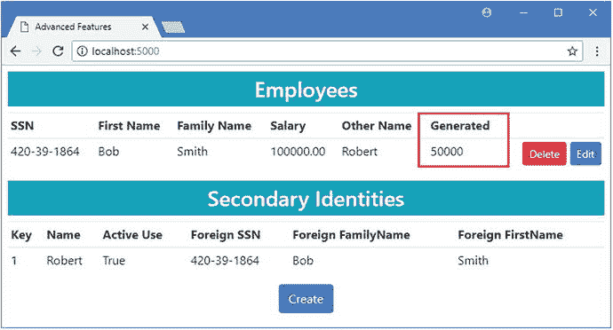

图 23-11。

Querying for an automatically generated value

```cs
...
SELECT [GeneratedValue], [LastUpdated]
FROM [Employees]
WHERE @@ROWCOUNT = 1 AND [SSN] = @p0 AND [FirstName] = @p1 AND [FamilyName] = @p2;
...

```

Modeling Generated Values Using Attributes

如果您不喜欢使用 Fluent API，那么您可以告诉 Entity Framework Core 关于数据库服务器使用`DatabaseGenerated`属性为其生成值的属性，该属性接受来自`DatabaseGeneratedOption`枚举的值作为其参数，如下所示:

```cs
...

[DatabaseGenerated(Computed)]

public string GeneratedValue { get; set; }
...

```

有三个`DatabaseGeneratedOption`值可用。`None`值表示数据库永远不会产生值，`Identity`选项表示当存储新对象时数据库会产生值，`Computed`值告诉实体框架核心当存储新对象或更新现有对象时数据库会产生值。

## 摘要

在本章中，我描述了直接使用 SQL 的实体框架核心特性。我向您展示了如何在查询中直接包含 SQL，以及如何使用不同的数据库服务器特性创建复杂的查询，包括视图、存储过程和表值函数。我还解释了数据库服务器生成数据值的不同方式，以及如何将这些数据值合并到应用中。在下一章，我将解释实体框架核心是如何支持事务的。