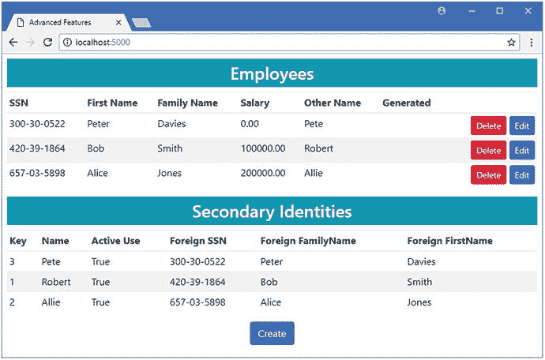
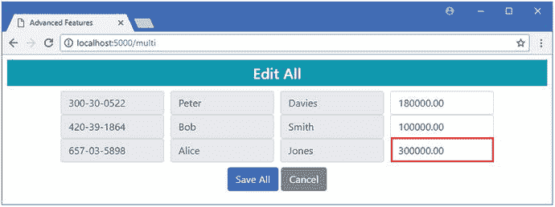
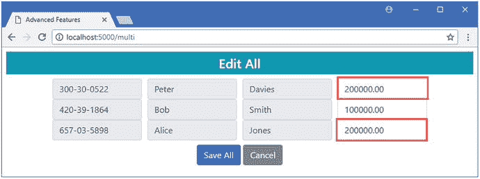
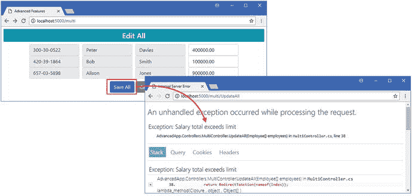
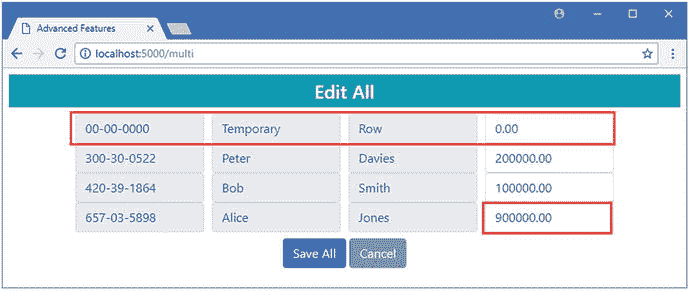

# 二十四、使用事务

在这一章中，我描述了实体框架核心支持事务的方式，事务用于确保多个操作作为单个工作单元执行。如果所有的操作都可以顺利执行，那么更改就会应用到数据库，这就是所谓的提交事务。如果一个或多个操作失败，则不修改数据库，并放弃更改，这就是所谓的回滚事务。(我在这里做了一点简化，因为事务可能很复杂，但这是事务工作的本质。)

我首先描述 Entity Framework Core 默认应用的行为，然后向您展示如何直接控制事务，包括如何禁用它们。表 [24-1](#Tab1) 将本章放在上下文中。

Note

并非所有数据库服务器都支持事务。本章中的示例是针对 SQL Server 的，如果使用不同的数据库服务器，您可能会看到不同的行为。

表 24-1。

Putting Transactions in Context

<colgroup><col> <col></colgroup> 
| 问题 | 回答 |
| --- | --- |
| 它们是什么？ | 事务允许将更改组合在一起，这样，如果所有更改都成功，则应用所有更改，如果任何更改失败，则不应用任何更改。 |
| 它们为什么有用？ | 事务允许将相关操作组合在一起，以确保应用使用的数据的一致性，而不仅仅是数据库服务器强制实施的关系一致性。 |
| 它们是如何使用的？ | 默认情况下启用事务，但是也有一个 API 用于配置如何使用事务。 |
| 有什么陷阱或限制吗？ | 事务会影响性能，并且可能会产生死锁，因为在处理事务时更新必须排队。 |
| 还有其他选择吗？ | 应用可以进行纠正性更新来模拟回滚事务的效果，但这很难正确完成。 |

表 [24-2](#Tab2) 总结了本章内容。

表 24-2。

Chapter Summary

<colgroup><col> <col> <col></colgroup> 
| 问题 | 解决办法 | 列表 |
| --- | --- | --- |
| 独立执行更新 | 每次更新后调用`SaveChanges` | five |
| 禁用自动事务 | 使用`AutoTransactionsEnabled`属性 | 6, 7 |
| 显式使用事务 | 使用`BeginTransaction`、`CommitTransaction`和`RollbackTransaction`方法 | 8, 9 |
| 指定事务隔离级别 | 使用`IsolationLevel`枚举 | Ten |

## 为本章做准备

在这一章中，我继续使用我在第 [19 章](19.html)中创建的 AdvancedApp 项目，并在此后的每一章中使用。在第 23 章中，我使用原始 SQL 创建了一些特性，比如存储过程和视图，这些已经不再需要了。运行`AdvancedApp`文件夹中清单 [24-1](#Par6) 所示的命令，删除并重新创建数据库。

```cs
dotnet ef database drop --force
dotnet ef database update
Listing 24-1.Resetting the Database

```

为了准备本章，我在`Controllers`文件夹中添加了一个名为`MultiController.cs`的类文件，并用它来定义清单 [24-2](#Par8) 中所示的类。

```cs
using AdvancedApp.Models;
using Microsoft.AspNetCore.Mvc;
using Microsoft.Extensions.Logging;

namespace AdvancedApp.Controllers {

    public class MultiController : Controller {
        private AdvancedContext context;
        private ILogger<MultiController> logger;

        public MultiController(AdvancedContext ctx, ILogger<MultiController> log) {
            context = ctx;
            logger = log;
        }

        public IActionResult Index() {
            return View("EditAll", context.Employees);
        }

        [HttpPost]
        public IActionResult UpdateAll(Employee[] employees) {
            context.UpdateRange(employees);
            context.SaveChanges();
            return RedirectToAction(nameof(Index));
        }
    }
}

Listing 24-2.The Contents of the MultiController.cs File in the Controllers Folder

```

为了给新的控制器提供一个视图，我创建了`Views/Multi`文件夹，并在其中添加了一个名为`EditAll.cshtml`的文件，其内容如清单 [24-3](#Par11) 所示。

Tip

如果您不想遵循构建示例项目的过程，您可以从本书的源代码库中下载所有需要的文件，可以从 [`https://github.com/apress/pro-ef-core-2-for-asp.net-core-mvc`](https://github.com/apress/pro-ef-core-2-for-asp.net-core-mvc) 获得。

```cs
@model IEnumerable<Employee>
@{
    ViewData["Title"] = "Advanced Features";
    Layout = "_Layout";
    int counter = 0;
}

<h4 class="bg-info p-2 text-center text-white">
    Edit All
</h4>
<form asp-action="UpdateAll" method="post">
    <div class="container">
        @foreach (Employee e in Model) {
            <div class="form-row">
                <div class="col">
                    <input class="form-control" name="Employees[@counter].SSN"
                         value="@e.SSN" readonly />
                </div>
                <div class="col">
                    <input class="form-control" name="Employees[@counter].FirstName"
                         value="@e.FirstName" readonly />
                </div>
                <div class="col">
                    <input class="form-control" name="Employees[@counter].FamilyName"
                         value="@e.FamilyName" readonly />
                </div>
                <div class="col">
                    <input class="form-control" name="Employees[@counter].Salary"
                         value="@e.Salary" />
                </div>
            </div>
             counter++;
        }
    </div>
    <div class="text-center m-2">
        <button type="submit" class="btn btn-primary">Save All</button>
        <a class="btn btn-secondary" asp-action="Index"
            asp-controller="Home">
                Cancel
        </a>
    </div>
</form>

Listing 24-3.The Contents of the EditAll.cshtml File in the Views/Multi Folder

```

使用`dotnet run`启动应用，导航到`http://localhost:5000`，点击创建按钮，并使用表 [24-3](#Tab3) 中的详细信息填充数据库。

表 24-3。

The Data Values for the Example Applicaiton

<colgroup><col> <col> <col> <col> <col> <col></colgroup> 
| severely subnormal 智力严重逊常 | 西方人名的第一个字 | 姓氏 | 薪水 | 其他名称 | 正在使用中 |
| --- | --- | --- | --- | --- | --- |
| 420-39-1864 | 上下移动 | 锻工 | One hundred thousand | 罗伯特 | 检查 |
| 657-03-5898 | 爱丽丝 | 琼斯 | Two hundred thousand | 艾丽 | 检查 |
| 300-30-0522 | 耗尽 | 戴维斯 | One hundred and eighty thousand | 银箱 | 检查 |

添加完数据后，您应该会看到图 [24-1](#Fig1) 中的结果。



图 24-1。

Running the example application

## 了解默认行为

事务是使用数据库的一个基本部分，实体框架核心会自动使用它们。为了揭示如何使用事务，我更改了日志系统的配置，以便实体框架核心将报告更详细的消息，如清单 [24-4](#Par15) 所示。

```cs
{
  "ConnectionStrings": {
    "DefaultConnection": "Server=(localdb)\\MSSQLLocalDB;Database=AdvancedDb;MultipleActiveResultSets=true"
  },
  "Logging": {
    "LogLevel": {
      "Default": "None",
      "Microsoft.EntityFrameworkCore": "Information",
      "Microsoft.EntityFrameworkCore.Database.Transaction":  "Debug"
    }
  }
}
Listing 24-4.Changing the Logging Level in the appsettings.json File in the AdvancedApp Folder

```

新条目请求来自处理实体框架核心事务的类的`Debug`级消息。要查看默认情况下如何使用事务，使用`dotnet run`启动应用，导航到`http://localhost:5000/multi`，并按照表 [24-4](#Tab4) 中的描述更改`Salary`值。

表 24-4。

The Salary Values for a Successful Transaction

<colgroup><col> <col></colgroup> 
| 名字 | 工资价值 |
| --- | --- |
| 鲍勃·史密斯 | One hundred and fifty thousand |
| 爱丽丝·琼斯 | Two hundred and fifty thousand |

单击“保存全部”按钮，实体框架核心将更新数据库。如果您检查来自数据库的日志消息，您可以看到事件的顺序(尽管很难在由`Debug`日志设置生成的输出流中找到单独的消息)。首先，实体框架核心创建一个新的事务。

```cs
...
Beginning transaction with isolation level 'ReadCommitted'.
...

```

稍后我会解释什么是隔离级别，但是对于本节来说重要的是事务已经开始。

我还没有给 Entity Framework Core 提供变更检测的基线，所以每个对象都被更新，产生了三个`UPDATE`语句，每个语句后面跟一个`SELECT`语句来确定数据库生成的值。

```cs
...
UPDATE [Employees] SET [LastUpdated] = @p0, [Salary] = @p1, [SoftDeleted] = @p2
WHERE [SSN] = @p3 AND [FirstName] = @p4 AND [FamilyName] = @p5;
SELECT [GeneratedValue]
FROM [Employees]
WHERE @@ROWCOUNT = 1 AND [SSN] = @p3 AND [FirstName] = @p4 AND [FamilyName] = @p5;

UPDATE [Employees] SET [LastUpdated] = @p6, [Salary] = @p7, [SoftDeleted] = @p8
WHERE [SSN] = @p9 AND [FirstName] = @p10 AND [FamilyName] = @p11;
SELECT [GeneratedValue]
FROM [Employees]
WHERE @@ROWCOUNT = 1 AND [SSN] = @p9 AND [FirstName] = @p10 AND [FamilyName] = @p11;

UPDATE [Employees] SET [LastUpdated] = @p12, [Salary] = @p13, [SoftDeleted] = @p14
WHERE [SSN] = @p15 AND [FirstName] = @p16 AND [FamilyName] = @p17;
SELECT [GeneratedValue]
FROM [Employees]
WHERE @@ROWCOUNT = 1 AND [SSN] = @p15 AND [FirstName] = @p16 AND [FamilyName] = @p17;
...

```

数据库服务器没有报告这些命令的任何错误，实体框架核心也没有任何进一步的工作要执行；因此，事务被提交，这将更改应用到数据库，并通过以下消息进行报告:

```cs
...
Committing transaction.
...

```

在提交事务之前，这些更改不会应用于数据库，如果事务回滚，这些更改会被丢弃。要查看运行中的回滚，导航至`http://localhost:5000/multi`并按照表 [24-5](#Tab5) 所述更改`Salary`值。

表 24-5。

The Salary Values for a Failed Transaction

<colgroup><col> <col></colgroup> 
| 名字 | 工资价值 |
| --- | --- |
| 鲍勃·史密斯 | Nine hundred million |
| 爱丽丝·琼斯 | Three hundred thousand |

Bob Smith 的`Salary`的值太大，无法使用数据模型中配置的数据类型来表示，当您单击 Save All 按钮时会看到一个异常。异常中断了更新，并且事务没有被提交。由于来自表 [24-5](#Tab5) 的两个更新都是在同一个事务中执行的，所以两个更新都不会应用于数据库。

### 执行独立的更改

默认事务行为的一个潜在缺点是，如果成功的更新与失败的更新组合在一起，它会阻止成功的更新应用到数据库。例如，在上一节中，您看到了 Alice Jones 的有效更新是如何失败的，因为它与 Bob Smith 的失败更新是一组的。如果您想隔离每个更新，使其不受其他故障的影响，那么您可以为每个更新调用`SaveChanges`方法，如清单 [24-5](#Par27) 所示。

```cs
using AdvancedApp.Models;
using Microsoft.AspNetCore.Mvc;
using Microsoft.Extensions.Logging;
using System;
using Microsoft.EntityFrameworkCore;

namespace AdvancedApp.Controllers {

    public class MultiController : Controller {
        private AdvancedContext context;
        private ILogger<MultiController> logger;

        public MultiController(AdvancedContext ctx, ILogger<MultiController> log) {
            context = ctx;
            logger = log;
        }

        public IActionResult Index() {
            return View("EditAll", context.Employees);
        }

        [HttpPost]
        public IActionResult UpdateAll(Employee[] employees) {
            foreach (Employee e in employees) {
                try {
                    context.Update(e);
                    context.SaveChanges();
                } catch (Exception) {
                    context.Entry(e).State = EntityState.Detached;
                }
            }
            return RedirectToAction(nameof(Index));
        }
    }
}

Listing 24-5.Performing Independent Changes in the MultiController.cs File in the Controllers Folder

```

每个`Employee`对象被单独传递给上下文对象的`Update`方法，之后调用`SaveChanges`方法。我使用一个`try` … `catch`块来确保更新抛出的异常不会干扰后续的更新。

其效果是，每次更新将使用一个单独的事务，您可以通过使用`dotnet run`启动应用，导航到`http://localhost:5000/multi`，并应用表 [24-5](#Tab5) 中的更改来看到这一点。对 Bob Smith 的更新仍然会失败，但是这次对 Alice Jones 的更新将会应用到数据库中，如图 [24-2](#Fig2) 所示。

Tip

请注意，我更改了`Employee`对象的变更跟踪状态，这些对象的更新未能在`try` … `catch`块的`catch`子句中更新到`Detached`。如果没有此更改，实体框架核心将在下次调用`SaveChanges`方法时包含失败的更新，导致另一个错误并阻止应用其他更新。



图 24-2。

Applying updates in their own transactions

如果您检查应用生成的日志消息，您将看到为每个对象创建并提交了一个单独的事务。Bob Smith 更新引发的异常阻止提交该更改的事务，但不影响其他更改应用到数据库。

### 禁用自动事务

如果您不希望实体框架核心自动使用事务，那么您可以通过更改上下文对象的配置来禁用该特性。上下文对象定义了一个`Database`属性，该属性返回一个`DatabaseFacade`对象，该对象提供对事务特性的访问。该类定义了表 [24-6](#Tab6) 中描述的属性，该属性用于控制自动事务特性。

表 24-6。

The DatabaseFacade Property for Automatic Transactions

<colgroup><col> <col></colgroup> 
| 名字 | 描述 |
| --- | --- |
| `AutoTransactionsEnabled` | 将该属性设置为`false`将禁用自动事务功能。 |

在清单 [24-6](#Par34) 中，我使用了表 [24-6](#Tab6) 中描述的属性来禁用`AdvancedContext`类的自动事务特性。必须为创建的每个对象设置该属性，这意味着在使用依赖注入的 ASP.NET Core MVC 应用中，使用构造函数可以确保一致的结果。

```cs
using Microsoft.EntityFrameworkCore;
using System;

namespace AdvancedApp.Models {

    public class AdvancedContext : DbContext {

        public AdvancedContext(DbContextOptions<AdvancedContext> options)
                : base(options) {
            Database.AutoTransactionsEnabled = false;
        }

        public DbSet<Employee> Employees { get; set; }

        protected override void OnModelCreating(ModelBuilder modelBuilder) {
            // ...Fluent API statements omitted for brevity...
        }
    }
}

Listing 24-6.Disabling Automatic Transactions in the AdvancedContext.cs File in the Models Folder

```

在清单 [24-7](#Par36) 中，我将`UpdateAll`方法返回到它的原始实现，这样所有的更新都是通过对`SaveChanges`方法的一次调用来执行的。这在以前意味着所有的更新都在单个事务中执行。

```cs
using AdvancedApp.Models;
using Microsoft.AspNetCore.Mvc;
using Microsoft.Extensions.Logging;
using System;
using Microsoft.EntityFrameworkCore;

namespace AdvancedApp.Controllers {

    public class MultiController : Controller {
        private AdvancedContext context;
        private ILogger<MultiController> logger;

        public MultiController(AdvancedContext ctx, ILogger<MultiController> log) {
            context = ctx;
            logger = log;
        }

        public IActionResult Index() {
            return View("EditAll", context.Employees);
        }

        [HttpPost]
        public IActionResult UpdateAll(Employee[] employees) {
            context.UpdateRange(employees);
            context.SaveChanges();
            return RedirectToAction(nameof(Index));
        }
    }
}

Listing 24-7.Performing Updates in the MultiController.cs File in the Controllers Folder

```

要查看配置更改如何改变结果，使用`dotnet run`启动应用并导航到`http://localhost:5000/multi`。如表 [24-7](#Tab7) 所示进行更改，并点击保存更改按钮。

表 24-7。

The Salary Changes to Test Disabling Automatic Transactions

<colgroup><col> <col></colgroup> 
| 名字 | 工资价值 |
| --- | --- |
| 彼得·戴维斯 | Two hundred thousand |
| 鲍勃·史密斯 | Nine hundred million |
| 爱丽丝·琼斯 | Two hundred thousand |

当您单击 Save All 按钮时，您将看到一个异常，因为 Bob Smith 的值对于用于在数据库中存储`Salary`值的数据类型来说太大了。但是，因为没有要回滚的事务，所以其他更改会应用到数据库，如图 [24-3](#Fig3) 所示。

Tip

在没有事务的情况下工作时，您可能不会总是看到相同的结果，因为数据库服务器或提供程序包可能会以不同的方式响应。需要注意的重要一点是，如果其中一个更新失败，您不能指望所有更新都被回滚。



图 24-3。

Working without automatic transactions

## 使用显式事务

默认行为对于大多数项目来说已经足够了，但是您可以让 Entity Framework Core 显式地使用一个事务来将单独的操作组合在一起。如果您需要更改配置事务的方式，或者需要在决定是提交还是回滚一组更新之前执行额外的任务，这将非常有用。

在清单 [24-8](#Par42) 中，我修改了`Multi`控制器的`UpdateAll`方法，以便它显式地使用一个事务。

```cs
using AdvancedApp.Models;
using Microsoft.AspNetCore.Mvc;
using Microsoft.Extensions.Logging;
using System;

namespace AdvancedApp.Controllers {

    public class MultiController : Controller {
        private AdvancedContext context;
        private ILogger<MultiController> logger;

        public MultiController(AdvancedContext ctx, ILogger<MultiController> log) {
            context = ctx;
            logger = log;
        }

        public IActionResult Index() {
            return View("EditAll", context.Employees);
        }

        [HttpPost]
        public IActionResult UpdateAll(Employee[] employees) {
            context.Database.BeginTransaction();
            try {
                context.UpdateRange(employees);
                context.SaveChanges();
                context.Database.CommitTransaction();
            } catch (Exception) {
                context.Database.RollbackTransaction();
            }
            return RedirectToAction(nameof(Index));
        }
    }
}

Listing 24-8.Using a Transaction in the MultiController.cs File in the Controllers Folder

```

对事务的直接访问是通过上下文对象的`Database`属性，该属性返回一个`DatabaseFacade`对象，该对象定义了表 [24-8](#Tab8) 中描述的事务相关成员。

表 24-8。

The DatabaseFacade Transaction Members

<colgroup><col> <col></colgroup> 
| 名字 | 描述 |
| --- | --- |
| `BeginTransaction()` | 此方法创建一个新的事务。这个方法有一个异步版本叫做`BeginTransactionAsync`。 |
| `CommitTransaction()` | 此方法提交当前事务。 |
| `RollbackTransaction()` | 此方法回滚当前事务。 |
| `CurrentTransaction` | 此属性返回当前事务。 |

在清单中，我调用`BeginTransaction`来启动一个新事务，然后执行更新。当调用`SaveChanges`方法时，实体框架核心向数据库服务器发送 SQL 命令来执行更新，但是不自动提交事务，这与使用自动事务特性时不同。相反，在调用`CommitTransaction`方法之前，更改不会应用到数据库。我使用了一个`try` … `catch`块来处理数据库服务器通过调用`RollbackTransaction`方法报告的任何错误，该方法将放弃更改。

Understanding Transaction Disposal

您经常会看到使用从`BeginTransaction`方法中获取结果的`using`子句创建的事务，如下所示:

```cs
...

using (var transaction = context.Database.BeginTransaction()) {

    // ...operations are performed...
    context.Database.CommitTransaction();
}
...

```

事务在被处置时会自动回滚，`using`子句的思想是确保一旦不再需要事务时就进行处置，防止事务堆积起来等待回滚并销毁它们的对象。

您不必担心在 ASP.NET Core MVC 应用中处理事务，因为当一个动作方法完成时，对象就会被处理掉。这意味着，除非您显式调用`CommitTransaction`或`RollbackTransaction`方法，否则在执行一个动作方法后，事务将被回滚。

### 包括事务中的其他操作

前面的例子展示了如何直接处理事务，但是没有执行任何使用自动事务时不会执行的任务。直接使用事务的一个常见原因是，在更新发送到数据库之后，在确定应该提交还是回滚之前，需要执行一些额外的工作。作为演示，我在`UpdateAll`方法中添加了一个验证查询，该查询查询数据库以限制`Salary`属性的累积值，如果总量太大，则回滚事务，如清单 [24-9](#Par50) 所示。

```cs
using AdvancedApp.Models;
using Microsoft.AspNetCore.Mvc;
using Microsoft.Extensions.Logging;
using System;

using System.Linq;

namespace AdvancedApp.Controllers {

    public class MultiController : Controller {
        private AdvancedContext context;
        private ILogger<MultiController> logger;

        public MultiController(AdvancedContext ctx, ILogger<MultiController> log) {
            context = ctx;
            logger = log;
        }

        public IActionResult Index() {
            return View("EditAll", context.Employees);
        }

        [HttpPost]
        public IActionResult UpdateAll(Employee[] employees) {
            context.Database.BeginTransaction();
            context.UpdateRange(employees);
            context.SaveChanges();
            if (context.Employees.Sum(e => e.Salary) < 1_000_000) {
                context.Database.CommitTransaction();
            } else {
                context.Database.RollbackTransaction();
                throw new Exception("Salary total exceeds limit");
            }            
            return RedirectToAction(nameof(Index));
        }
    }
}

Listing 24-9.Performing Additional Work in the MultiController.cs File in the Controllers Folder

```

在调用了`SaveChanges`方法之后，我使用`Sum`方法来获得`Salary`值的总和。如果总数小于一百万，我提交事务，否则回滚事务并抛出异常。要查看效果，启动应用，导航到`http://localhost:5000/multi`，并更改`Salary`值。点击 Save All 按钮，您将看到您的更改是如何应用的，或者显示一个异常并放弃更改，如图 [24-4](#Fig4) 所示。



图 24-4。

Performing additional work in a transaction

当使用自动事务特性时，这种额外的检查是不可能的，因为一旦调用了`SaveChanges`方法，事务就会被提交。通过直接处理事务，我可以在决定结果之前执行额外的任务。

### 更改事务隔离级别

事务的隔离级别指定数据库服务器如何处理尚未提交的更新。在某些应用中，在提交更改之前，将一个客户端所做的更改与其他客户端隔离是很重要的。在其他应用中，这种隔离不太重要，可以通过减少客户端对其他人所做的未提交更改的屏蔽程度来提高性能。事务的隔离级别是通过从`IsolationLevel`枚举中传递一个值来指定的，如表 [24-9](#Tab9) 中所述。

表 24-9。

The IsolationLevel Values

<colgroup><col> <col></colgroup> 
| 名字 | 描述 |
| --- | --- |
| `Chaos` | 这个值定义得很差，但是当它被支持时，它通常表现得好像事务被禁用了一样。对数据库所做的更改在提交之前对其他客户机是可见的，并且通常没有回滚支持。SQL Server 不支持此隔离级别。 |
| `ReadUncomitted` | 该值代表通常支持的最低隔离级别。使用此隔离级别的事务可以读取尚未提交的其他事务所做的更改。 |
| `ReadComitted` | 如果没有指定值，此值是默认的隔离级别。其他事务仍然可以在当前事务所做的更新之间插入或删除数据，这可能导致不一致的查询结果。 |
| `RepeatableRead` | 该值表示较高的隔离级别，可以防止其他事务修改当前事务读取的数据，从而确保查询结果的一致性。 |
| `Serializable` | 该值通过防止其他事务将数据添加到已被当前事务读取的数据库区域来提高`RepeatableRead`隔离级别。 |
| `Snapshot` | 该值代表最高级别的隔离，并确保每个事务都使用自己的数据快照。这种隔离级别要求对数据库进行更改，而使用实体框架核心无法执行这种更改。详情见此: [`https://docs.microsoft.com/en-us/dotnet/framework/data/adonet/sql/snapshot-isolation-in-sql-server`](https://docs.microsoft.com/en-us/dotnet/framework/data/adonet/sql/snapshot-isolation-in-sql-server) 。 |

隔离级别越高，事务之间的交互就越少，但是数据库服务器必须使用的锁定就越多，如果有多个客户端同时尝试修改相同的数据，就会对性能产生影响。选择隔离级别时，需要在性能和不一致的数据之间进行权衡。对于许多应用，尤其是在 ASP.NET Core MVC 项目中，几乎不需要改变隔离级别，因为默认值将提供一个可接受的折衷。然而，对于某些应用，尤其是那些具有特别复杂的数据库的应用，事务之间的交互风险可能是一个问题。

Avoiding the High Isolation Level Pitfall

为了安全起见，您可能会选择高级别的事务隔离。这当然会避免本章中描述的三个问题，但也可能会降低应用的速度。数据库服务器通过锁定对部分数据库的访问来增加事务隔离；事务隔离级别越高，需要的锁定就越多，更新开始排队的可能性就越大，从而使客户端一直等到前面的事务完成。隔离级别选择不当不会给应用带来任何好处，反而会降低性能。

#### 了解脏读、幻像行和不可重复读

当事务相互干扰时，可能会出现三个潜在的问题。当您决定事务的隔离级别时，您实际上是在告诉数据库您愿意接受这些潜在问题中的哪些，以及您愿意牺牲多少性能来避免它们。为了演示这三个问题，我对`Multi`控制器做了一些修改，如清单 [24-10](#Par57) 所示。

```cs
using AdvancedApp.Models;
using Microsoft.AspNetCore.Mvc;
using Microsoft.Extensions.Logging;
using System;
using System.Linq;

using System.Data;

using Microsoft.EntityFrameworkCore;

namespace AdvancedApp.Controllers {

    public class MultiController : Controller {
        private AdvancedContext context;
        private ILogger<MultiController> logger;
        private IsolationLevel level = IsolationLevel.ReadUncommitted;

        public MultiController(AdvancedContext ctx, ILogger<MultiController> log) {
            context = ctx;
            logger = log;
        }

        public IActionResult Index() {
            context.Database.BeginTransaction(level);
            return View("EditAll", context.Employees);
        }

        [HttpPost]
        public IActionResult UpdateAll(Employee[] employees) {
            context.Database.BeginTransaction(level);
            context.UpdateRange(employees);

            Employee temp = new Employee {
                SSN = "00-00-0000",
                FirstName = "Temporary",
                FamilyName = "Row",
                Salary = 0
            };
            context.Add(temp);
            context.SaveChanges();
            System.Threading.Thread.Sleep(5000);
            context.Remove(temp);
            context.SaveChanges();
            if (context.Employees.Sum(e => e.Salary) < 1_000_000) {
                context.Database.CommitTransaction();
            } else {
                context.Database.RollbackTransaction();
                logger.LogError("Salary total exceeds limit");
            }
            return RedirectToAction(nameof(Index));
        }

        public string ReadTest() {
            decimal firstSum = context.Employees.Sum(e => e.Salary);
            System.Threading.Thread.Sleep(5000);
            decimal secondSum = context.Employees.Sum(e => e.Salary);
            return $"Repeatable read results - first: {firstSum}, "
                + $"second: {secondSum}";
        }
    }
}

Listing 24-10.Using Isolation Levels in the MultiController.cs File in the Controllers Folder

```

隔离级别被设置为`BeginTransaction`方法的参数，该方法是在`Microsoft.EntityFrameworkCore`名称空间中定义的扩展方法。在清单中，我选择了`ReadUncomitted`级别，我在一个事务中使用它，在`Index`动作中查询数据库，在`UpdateAll`动作中更新数据库。在`UpdateAll`方法中，我执行从用户接收的更新，向数据库添加一个临时的`Employee`，然后再次删除它。仅当`Salary`值的总和小于一百万时，事务才被提交；否则，它将被回滚。为了降低`UpdateAll`方法的速度并更容易看到事务交互的效果，我添加了一个对`Thread.Sleep`方法的调用，它将事务提交或回滚延迟了五秒。

要查看两个潜在问题，使用`dotnet run`启动应用，打开两个浏览器窗口，并导航到`http://localhost:5000/multi`查看两个窗口。在第一个浏览器窗口中，将 Alice Jones 的`Salary`值更改为 900000，然后单击 Save All。在五秒钟的睡眠时间过去之前重新加载另一个浏览器，您将会看到如图 [24-5](#Fig5) 所示的结果。

Caution

你不会总是能够重现这些问题，尤其是在条件更难控制的真实项目中。原则上，您应该根据您需要的隔离级别来选择您的隔离级别，即使您无法在测试期间重现特定的问题。



图 24-5。

Changes made by another transaction

即使更改随后被回滚，也会有一段时间`ReadUncomitted`隔离级别允许在另一个事务中读取更改。临时行是幻像行的一个例子，为 Alice 显示的`Salary`值是脏读的一个例子。

要查看第三个问题，导航至其中一个窗口中的`http://localhost:5000/multi/readtest`。这个请求的目标是清单 [24-10](#Par57) 中添加的`ReadTest`动作，它在五秒钟暂停前后对数据库执行相同的查询。该方法返回一个字符串，这样我就不必向项目中添加视图，并且它将产生一个结果，显示两次读取的相同值，如下所示:

```cs
Repeatable read results - first: 500000.00, second: 500000.00

```

使用另一个浏览器窗口导航到`http://localhost:5000/multi`，将 Alice 的薪金更改为 90000，然后单击 Save All 按钮。在五秒钟过去之前，重新加载第一个浏览器窗口以重复这两个查询。这一次，您将看到每个查询都收到了不同的结果。

```cs
Repeatable read results - first: 1200000.00, second: 500000.00

```

这是一个不可重复的读问题，由同一个事务执行的两个查询返回不同的结果。如果你在控制器中改变事务所使用的隔离级别，你会发现这些问题都不见了。

## 摘要

在本章中，我描述了 Entity Framework Core 支持事务的方式，从自动事务特性开始，一直到直接处理事务。我解释了如何禁用事务，如何在事务中执行额外的工作，以及如何告诉实体框架核心何时提交或回滚对数据库的更改。在本章的最后，我解释了可用于事务的不同隔离级别，以及每种级别在性能方面的权衡。

这就是我要告诉你的关于 ASP.NET Core MVC 开发的实体框架核心的全部内容。我首先介绍了使用数据库的基础知识，描述了您可能会遇到的常见问题，并描述了所有关键的实体框架核心特性。我希望你像我喜欢写这本书一样喜欢读这本书，并且我祝愿你在你的 ASP.NET Core MVC 和实体框架核心项目中一切顺利。