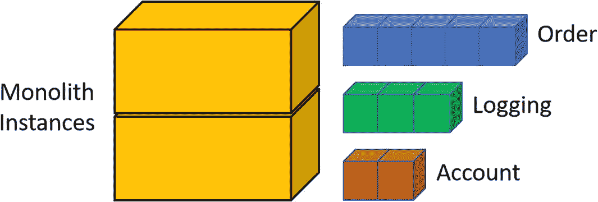

# 一、微服务简介

推特、贝宝和网飞有严重的问题。像扩展、质量和停机这样的问题变得越来越普遍。每一个都有一个大型的、基于单一代码的应用，称为“monolith”并且每一个都遇到了不同的挫折点，在这些挫折点上必须进行基本的架构变更。开发和部署周期漫长而乏味，导致功能交付延迟。每次部署都意味着停机或从一组服务器切换到另一组服务器的昂贵基础架构。随着代码库的增长，模块之间的耦合也在增长。对于耦合的模块，代码更改更成问题，更难测试，并且降低了应用的整体质量。

对于 Twitter 来说，扩展服务器是导致停机和用户不安的一个重要因素。用户经常会看到一个错误页面，上面写着 Twitter 容量过剩。许多用户会看到“失败的鲸鱼”,而系统管理员会重启服务器并处理需求。随着用户数量的增加，对架构变化的需求也在增加。从数据存储、代码和服务器拓扑来看，整体架构达到了极限。

对于 PayPal 来说，他们的用户群增加了对有保障事务的需求。他们扩大了服务器和网络基础设施。但是，随着服务数量的增加，性能达到了临界点，结果就是延迟。他们不断增加虚拟机数量，以处理不断增长的用户和事务。这给网络增加了巨大的压力，从而导致了延迟问题。

网飞遇到了规模、可用性和开发速度方面的问题。他们的业务需要全天候访问视频流。他们无法以足够快的速度构建数据中心来满足需求。他们的用户群在增加，家庭和设备的联网速度也在提高。这个单一的应用如此复杂和脆弱，以至于一个分号就让网站瘫痪了几个小时。

就其本身而言，一块巨石并没有错。Monoliths 服务于他们的目的，当他们需要更多的服务器资源时，添加更多的服务器通常是足够便宜的。通过良好的编码实践，monolith 可以很好地自我维持。然而，随着它们的增长和复杂性的增加，它们可能会达到这样一个程度，即功能请求需要越来越长的时间来实现。它们变成了“巨大的地狱”将功能投入生产需要更长的时间，bug 的数量增加，用户的挫折感增加。Monolith hell 是 Monolith 在稳定性下降、难以扩展以及几乎无法利用新技术时的一种状态。

随着时间的推移，应用可能会变成一种负担。随着开发人员、技能组合、业务优先级等的变化。，这些应用很容易变成“意大利面条代码”的混乱。随着这些应用需求的变化，对开发、测试和部署速度的期望也在变化。通过将功能从单一的应用中分离出来，开发团队可以缩小他们对功能和各自部署时间表的关注。这使得业务功能的开发和部署速度更快。

在本章中，您将了解使用微服务架构的好处以及架构变化带来的挑战。然后，您将了解整体架构和微服务架构之间的差异。接下来，我们将开始研究微服务模式、消息传递和测试。最后，我们将讨论部署微服务，并研究具有跨领域问题的架构化基础设施。

## 利益

对于遭受“整体地狱”之苦的大型应用，有几个原因可以让它们通过转换到微服务架构而受益。开发团队可以更加关注业务流程、代码质量和部署时间表。微服务可单独扩展，从而有效利用基础设施上的资源。当出现通信问题和其他故障时，隔离有助于保持系统的高可用性。最后，通过定义和维护架构边界，系统可以更容易地适应变化。每项福利的详细内容定义如下。

### 团队自治

使用微服务架构的最大好处之一是团队自治。公司经常需要以最快的方式在生产中提供更多的功能。通过在架构中分离关注的区域，开发团队可以从其他团队中获得自主权。这种自主性允许团队以不同于其他团队的速度进行开发和部署。上市时间对大多数公司来说是至关重要的。功能越早投入生产，它们就越早拥有竞争优势。

它还允许但不要求不同的团队利用不同的编程语言。单片通常要求整个代码库使用同一种语言。因为微服务是截然不同的应用，所以它们为使用不同的语言打开了大门，允许工具灵活地适应手头的任务。

例如，对于数据分析，Python 是最常用的编程语言，在微服务架构中工作良好。移动和前端 web 开发人员可以利用最适合这些需求的语言，而 C# 用于后端业务事务逻辑。

对于致力于一个或多个微服务的团队，他们只对自己的服务负责。他们只关注自己的代码，而不需要了解其他领域的代码细节。需要就微服务的 API 端点进行沟通。客户端需要知道如何调用这些服务的细节，比如 HTTP 动词和有效负载模型，以及返回数据模型。有一个 API 规范可以帮助指导 API 的结构。考虑 OpenAPI 倡议( [`https://www.openapis.org/`](https://www.openapis.org/) )以获得更多信息。

### 服务自治

由于团队自治关注于开发团队及其职责，服务自治是关于在服务层分离关注点。“单一责任原则”在这里也适用。任何微服务都不应该有一个以上的理由去改变。例如，订单管理微服务不应该包含帐户管理的业务逻辑。通过拥有专用于特定业务流程的微服务，服务可以独立发展。

并不是所有的微服务都是随着业务逻辑的处理而单独存在的。微服务根据要处理的数据调用其他服务是很常见的。耦合仍然是松散的，并保持代码进化的灵活性。

通过微服务之间的松散耦合，您将获得与在代码级别应用时相同的好处。升级微服务更容易，对其他服务的影响更小。这也允许特性和业务流程以不同的速度发展。

微服务之间的自主性满足了个人的弹性和可用性需求。例如，处理信用卡支付的微服务比处理帐户管理具有更高的可用性要求。根据客户端使用的服务，它们可以使用带有不同参数的重试和错误处理策略。

部署微服务也是服务自治的一个好处。随着服务的发展，它们分别使用“持续集成/持续部署”(CI/CD)工具发布，如 Azure DevOps、Jenkins 和 CircleCI。单独部署允许频繁发布，对其他服务的影响极小(如果有的话)。与单一应用相比，它还允许单独的部署频率和复杂性。这支持零停机时间的要求。您可以将部署策略配置为在关闭现有服务之前启动更新版本。

### 可量测性

可伸缩性的好处是允许服务实例的数量来区分其他服务和单一应用。一般来说，单片应用需要比微服务更大的服务器。拥有微服务可以让多个实例驻留在同一台服务器上或跨多台服务器，这有助于故障隔离。图 [1-1](#Fig1) 显示了代码实例数量和代码大小之间的关系。

图 1-1

代码的实例和大小示例

通过利用微服务架构，应用可以利用不同规模的服务器。一个微服务可能需要比 RAM 更多的 CPU，而其他微服务需要更多的内存处理能力。其他微服务可能只需要足够的 CPU 和 RAM 来处理繁重的 I/O 需求。

在不同于 monolith 的服务器上使用微服务的另一个好处是编程语言的多样性。例如，假设整块石头运行。NET 框架，可以用其他编程语言写微服务。如果这些语言可以在 Linux 上运行，那么由于操作系统许可成本，您有可能节省资金。

### 故障隔离

故障隔离是指处理故障而不使整个系统瘫痪。当 monolith 实例关闭时，该实例中的所有服务也会关闭。当发生故障时，没有服务隔离。有几种情况会导致失败:

*   编码或数据问题

*   极端的 CPU 和 RAM 利用率

*   网络

*   服务器硬件

*   下游系统

对于微服务架构，具有上述任何条件的服务都不会导致系统的其他部分停止运行。请将此视为逻辑分组。一组是与业务功能相关的服务和依赖系统。该功能独立于另一组中的功能。如果一个组发生故障，影响不会波及到另一个组。图 [1-2](#Fig2) 是依赖于其他服务的服务和对数据存储的依赖的过度简化。

图 1-2

故障隔离的描述

与任何依赖于远程处理的应用一样，失败的机会总是存在的。当微服务重启或升级时，任何现有的连接都将被切断。始终认为微服务是短暂的。它们将会死亡，需要在某个时候重新启动。这可能是由于长时间的 CPU 或 RAM 使用超过了阈值。像 Kubernetes 这样的编排器将在这些条件下“驱逐”包含微服务实例的 pod。这是一种自我保护机制，因此失控情况不会导致服务器/节点停机。

一个不合理的目标是拥有一个运行时间为 100%或 99.999%的微服务。如果一个整体应用或另一个微服务正在调用一个微服务，那么重试策略必须到位，以处理微服务的缺失或消失。这与让一个单一的应用与一个 SQL Server 连接没有什么不同。处理各种相关异常并做出相应反应是调用代码的责任。

在呼叫微服务时，断路器模式中的重试策略对处理问题有很大帮助。Polly ( [`http://www.thepollyproject.org`](http://www.thepollyproject.org) )等库提供了使用断路器、重试策略等功能。这允许调用代码对连接问题作出反应，方法是通过渐进式等待时间重试，然后在对微服务的调用失败 X 次时使用替代代码路径。

### 数据自治

到目前为止，已经有很多使用微服务架构的理由。但是他们关注的是业务流程。数据同样重要，甚至更重要。具有上述症状的整体式应用肯定依赖于数据存储。数据完整性对业务至关重要。没有数据完整性，任何公司都不会长久存在。你能想象一家银行“猜测”你的账户余额吗？

微服务结合了松散耦合，因此变化是独立部署的。通常，这些更改还包含对数据的模式更改。新功能可能需要新列或对现有列的更改，对于表也是如此。当一个团队的模式变更影响到其他团队时，真正的问题就出现了。这反过来要求更改是向后兼容的。此外，另一个受影响的团队可能没有准备好同时部署。

通过隔离每个微服务的数据，可以在对其他服务影响最小的情况下进行独立的更改。这种隔离是促使企业更快投入生产的另一个因素。用新的微服务和新的数据开始一项新的功能是很棒的。当然，这很容易实现。

使用单独的数据库，您还可以受益于使用不同的数据存储技术。拥有独立的数据库为一些数据提供了位于关系数据库(如 SQL Server)中的机会，而其他数据则位于非关系数据库(如 MongoDB、Azure Cosmos DB 和 Azure Table Storage)中。选择不同的数据库是使用正确工具完成工作的另一个例子。

## 要考虑的挑战

迁移到微服务架构并非一帆风顺，而且比整体架构更复杂。你需要给自己失败的空间。即使是一个小的微服务，也可能需要几次迭代才能达到你所需要的。在支持将功能迁移到微服务之前，您可能需要在 monolith 上完成多轮重构。开发微服务需要对现有架构进行新的思考，例如开发时间的成本以及网络和服务器的基础设施变化。

如果来自 monolith，你将需要修改代码来与新的微服务通信，而不仅仅是简单的方法调用。与微服务通信需要通过网络调用，并且最常见的是使用消息代理。在本章的后面，你会学到更多关于消息传递的知识。

整体应用的大小和团队规模也是影响因素。小型应用，或者小型团队的大型应用可能看不到好处。当“整体地狱”的压倒性问题通过分离区域被克服时，微服务架构的好处就出现了。

许多公司还没有准备好迎接挑战，只是在额外的服务器上托管单一的应用，并控制它们处理什么样的业务逻辑。服务器相对便宜，因此分散处理负载通常是最简单的“快速”解决方案。直到他们最终面临与 PayPal、Twitter 和其他公司同样的问题。

开发人员可能会反对微服务开发的想法。对于需要理解的复杂细节，有一个很大的学习曲线。许多开发人员将继续负责单块应用的各个部分，因此感觉就像同时在两个项目上工作。将会有持续的质量问题，而不仅仅是把东西投入生产。偷工减料只会增加代码脆弱性和技术债务，并可能延长成功完成的时间。

每个团队都将面临的挑战是代码能力。开发人员必须主动加强所选择的编程语言，并接受分布式系统设计。设计模式和最佳实践非常棒，因为它们与单片和微服务内部的代码相关。但是，还必须了解微服务如何通信、处理故障、依赖性和数据一致性的新模式。

开发微服务的团队面临的另一个挑战是，要考虑的不仅仅是代码。在后面的“横切关注点”一节中，描述了影响每一个微服务，也就是每一个开发人员的项目。每个人都应该参与理解(如果不是创建的话)有助于你理解架构系统健康的项目。用户故事或者你使用的任何基于任务的系统都需要额外的时间和任务。这包括帮助测试系统，而不仅仅是微服务。

## 微服务开始

由于主系统需要与其他系统一起工作，所以出现了主系统需要知道每个连接系统的所有通信细节的问题。在这种情况下，主系统是您的主要应用。由于每个连接的系统都有自己存储信息的方式、提供的服务和通信方法，主系统必须知道所有这些细节。这是一个“紧密耦合”的架构。假设一个连接的系统改变到另一个系统，需要大量的改变。面向服务的架构(SOA)旨在消除麻烦和困惑。通过使用标准的通信方法，每个系统可以以较少的耦合进行交互。

2002 年引入的企业服务总线(ESB)用于向各种系统传递消息。ESB 为“发布/订阅”模型提供了一种方法，在这种模型中，每个系统都可以处理或忽略广播的消息。安全性、路由和有保证的消息传递也是 ESB 的方面。

当需要扩展服务时，整个基础架构也必须扩展。借助微服务，每个服务都可以独立扩展。通过从 ESB 转移到 HTTP 之类的协议，端点在通信内容和方式方面变得更加智能。消息传递平台不再需要知道消息有效负载，只需要知道将消息传递给哪个端点。“智能端点，哑管道”是 Martin Fowler 的简洁表述。

那么，为什么在最近几年，微服务获得了关注？考虑到支持性基础设施的成本，构建代码并测试一个或多个微服务是否是正确的方法会更便宜。如今，网络和 CPU 的能力大大增强，成本效益也比过去高得多。今天，我们可以使用带有数据分析的数学模型处理大量数据，并以更快的速度获取知识。只需 35 美元，一个树莓 Pi 就可以用来托管微服务！

成本是一个巨大的因素，但编程语言和平台也是。如今，C#、Python 和 Node 等许多语言都非常适合微服务。像 Kubernetes、Service Fabric 和其他平台非常有能力维护 Docker 容器中运行的微服务。行业中也有更多的程序员可以快速利用 SOA 和微服务等架构模式。

随着对软件程序员需求的不断增加，也存在对质量的需求。对于程序员来说，解决简单的问题并相信他们已经“完成”太容易了事实上，高质量的软件对我们的时间、才能和耐心要求很高。仅仅因为微服务更便宜，在某些情况下，更容易创建，它们就绝不容易。

## 架构比较

由于大多数微服务都源于单片应用，因此我们将比较这两种架构。单片是最容易创建的，所以这种架构在创建应用时成为事实上的标准也就不足为奇了。公司需要快速开发新功能以获得竞争优势。产品越好、越快，就能越快获得预期的利润。因此，几乎所有的应用都会增长。代码库在规模、复杂性和脆弱性方面都在增长。在图 [1-3](#Fig3) 中，描绘了一个包含用户界面层、具有多种服务的业务逻辑层和持久层的整体。

图 1-3

三层架构的描述

用最简单的话来说，一个整体就是一个包含业务逻辑的可执行文件。这包括所有支持的 dll。当一个整体部署，功能停止，并被取代。monolith 中的每个服务(或组件)都“在进程中”运行这意味着 monolith 的每个实例都有可供实例化的完整代码库。

图 1-4

微服务架构示例

使用微服务架构，如图 [1-4](#Fig4) 所示，业务逻辑被分离到进程外的可执行文件中。这使得他们可以在不同的服务器上运行各自的多个实例。如前所述，通过这种分离可以实现故障隔离。例如，如果运输暂时无法进行，订单仍然可以接受。

最现实的是混合架构，如图 [1-5](#Fig5) 所示。很少有公司完全过渡到微服务架构。许多公司将采用一小部分功能，部分迁移到微服务解决方案。

图 1-5

混合架构的描述

当从整体架构迁移到微服务架构时，如果一个微服务中包含太多的业务功能，将会带来巨大的危险。例如，如果订单微服务在代码中与库存管理紧密耦合，并且所有的逻辑都被带过来，那么您最终会得到一个分布式的整体。你已经获得了一些分离的好处，同时保留了独石的许多负担。

当你决定尝试创建微服务时，从小处着手。从一个小的代码库开始，你就有了回头路。如果微服务超出了时间、成本或耐心，您将需要撤销或中止对 monolith 的更改。在进行这些更改的同时，不断地在 monolith 上执行测试，寻找您没有预料到的中断代码。

## 微服务模式

每个微服务架构都面临着诸如可访问性、获取配置信息、消息传递和服务发现等挑战。这些挑战有一些常见的解决方案，称为模式。存在各种模式来帮助解决这些挑战，并使架构变得稳固。

### API 网关/BFF

API 网关模式为分配给它的微服务的客户端应用提供了一个端点。图 [1-6](#Fig6) 显示了单个 API 网关作为多个微服务的接入点。API 网关提供路由到微服务、认证和负载平衡等功能。

图 1-6

单一 API 网关接入点

根据架构的规模和业务需求，单个 API 网关可能会导致另一个问题。客户端应用的数量可能会增加。这些客户端应用的需求可能会增长。在某种程度上，应该通过使用多个 API 网关来分离客户端应用。前端设计模式后端(BFF)有助于这种分离。有多个端点，但它们是根据所服务的客户端类型来指定的。

图 1-7

指定的 API 网关端点

在本例中，如图 [1-7](#Fig7) 所示，一个调用微服务的应用可能是一个 MVC web 应用，而另一个客户端可能是一个移动应用。还描述了来自第三方消费者的连接。

与完整的网站相比，移动客户端通常不会获得/需要所有内容。将 BFF 模式与 API 网关结合使用，可以实现处理差异的分离。

考虑到最终用户可能需要支付数据使用费。如果与完整的网站版本相比，移动应用不需要那么多“现成的”信息，那么最终用户视图管理的分离就需要 BFF 模式。

使用 API 网关模式时有一些注意事项。微服务与 API 网关之间存在耦合。随着微服务的发展，基础设施也在发展。必须维护 API 网关，这样就不会有太多的耦合。API 网关不应该承担不必要的责任。可能会在某个时间点创建多个 API 网关，并在它们之间拆分微服务。这将有助于另一项预防措施，即 API 网关可能成为瓶颈，并可能增加任何延迟问题。

### 外部配置存储

几乎所有的微服务都需要配置信息，就像 monoliths 一样。有了拥有许多微服务实例的能力，让每个实例拥有自己的配置文件是不切实际的。跨所有正在运行的实例更新信息将是压倒性的。相反，使用外部配置存储模式提供了一个公共区域来存储配置信息。这意味着配置值只有一个来源。

配置信息可以存储在数据存储中，比如 SQL Server 或 Azure Cosmos DB。特定于环境的设置可以存储在不同的配置存储中，从而允许相同的代码在开发或生产环境中工作。当然，每个实例都需要知道如何到达配置存储。该信息位于本地配置文件中。这意味着在这些文件中有足够的信息说明在哪里以及如何获得所有其他的应用设置。

配置存储中的信息可能会随时更改。这里的一个挑战是知道何时获取设置。代码可以在启动时或根据需要获取所有设置。如果只在启动时检索，那么微服务的行为将不会改变，直到重新启动。对于某些设置，这是可以的，比如检索它运行的环境。这可能对日志记录有用。如果微服务在 Dev 中运行，那么日志记录的详细程度会高得多。如果不是 Dev，那么只记录特定条件下的附加信息，如错误处理。这种情况不太可能改变。有些设置会改变，应该经常检查。业务功能中的 HTTP 超时值或最大重试次数等设置可能会改变并影响行为。

## 信息发送

由于微服务旨在适应各种业务需求，因此也必须考虑它们的通信方法。对于整体式应用，方法只需调用其他方法，而无需担心该方法驻留在哪里。对于分布式计算，这些方法在其他服务器上。进程间通信(IPC)机制用于与微服务通信，因为它们是通过网络进行的。

与微服务的沟通主要有三个方面。业务流程和用例有助于确定消息传递需求的布局。这些决定了与微服务进行通信的“原因”。“什么”是数据格式。消息中的内容并不完全相同，它们会根据目的而有所不同。最后，传输机制用于在流程之间传输消息内容。这包括消息“如何”发送到端点。

### 业务流程沟通

在微服务架构中，业务流程之间有多种通信方式。最简单但最不通用的方法是使用同步调用。其他三种方式是异步的，并提供各种消息传递方法。

#### 位置遥控(remote position control)

同步的“直接”方式适用于请求需要立即响应的情况。例如，一个微服务有一个财务算法，并根据传入请求的值用数据进行响应。客户端(monolith 客户端或另一个微服务)提供参数值，发送请求，并等待响应。业务流程在收到回答或错误之前不会继续。这种类型的调用是远程过程调用(RPC ),因为它是从客户端到服务的直接同步调用。使用 RPC 应该受到限制。这些很有可能给客户端增加不必要的延迟，应该只在微服务内部的处理量很小时使用。

#### 火了就忘了

第一种类型的异步调用是“一劳永逸”式的。客户端不关心微服务是否能完成请求。这种风格的一个例子是日志。业务流程可能需要记录特定的信息，但是继续处理的需要比验证微服务成功完成的需要更重要。

#### 回收

另一种异步调用方式是当微服务回调客户端时，通知它何时完成处理。发送请求后，业务流程继续进行。该请求包含微服务如何发送响应的信息。这要求客户端打开端口来接收调用，并在请求中传递地址和端口号。随着许多调用的发生，需要将响应与请求相匹配。当在请求消息中传递一个关联 ID 并且微服务将该信息保存到响应中时，客户端可以使用该响应进行进一步的处理。

考虑咖啡师的例子。你点了一杯拿铁。咖啡师记下饮料的种类和你的名字。然后发生两个平行的过程。一个是制作饮料的过程。另一个是处理付款。只有在饮料准备好并且支付成功后，你才会被叫去。"肖恩，你的拿铁好了。"注意，有两条信息被用作关联 ID。顾客的姓名和饮料名称是在订购时记录的，用来告诉顾客订单已经完成。

这个例子还展示了一个同步业务流程。我直到点菜后才开始等饮料。然后出现了两个异步流程:一个创建饮料，另一个接收付款。这两个过程完成后，另一个异步过程被启动。有人通知我饮料准备好了，以及去哪里取。在制作拿铁咖啡的时候，我可以看报纸，甚至取消订单。这种通知称为“域事件”

#### 发布/订阅

这导致了另一种异步调用方式，发布/订阅(Pub/Sub)。这是一种在消息总线上监听关于要处理的工作的消息的方式。发送者发布一条消息，让所有的收听者根据这条消息自己做出反应。Pub/Sub 模式的一个比较是报纸公司。它每天向多个订户发行一期。每个订户都有机会像所有其他订户一样独立地阅读相同的内容并对其做出反应。

基于持久性的发布/订阅模型是指只有一个侦听器实例处理消息。构建在前面提到的“一劳永逸”模型之上的是日志记录示例。当需要日志记录的事件发生时，会创建一条包含要写入的内容的消息。如果没有持久性，每个订阅者都会记录消息并导致重复记录。使用持久性模型，一个订阅者锁定消息进行处理。其他侦听器可能会拾取下一条消息，但只处理一条消息。现在，每个事件只创建一个日志条目。如果订阅者未能完成他们的任务，则消息被中止，另一个订阅者可以获取它进行处理。

### 消息格式

消息中的数据格式允许您的通信是跨语言和技术独立的。消息有两种主要格式:文本和二进制。人类可读的基于文本的消息是最容易创建的，但也有其负担。这些格式允许传输包含元数据。对于中小型消息，JSON 和 XML 是最常用的格式。但是，随着消息大小的增加，额外的信息会增加延迟。

利用诸如谷歌的协议缓冲区( [`https://developers.google.com/protocol-buffers/`](https://developers.google.com/protocol-buffers/) )或阿帕奇的 Avro([`https://avro.apache.org/`](https://avro.apache.org/))之类的格式，消息作为二进制流发送。这对于中到大的消息是有效的，因为将内容转换成二进制文件需要 CPU 开销。较小的消息可能会有一些延迟。

开箱即用，ASP.NET Core 可以使用 JSON 或 XML 作为有效载荷格式。对于 ASP.NET Core 和微服务的所有参考，JSON 是选择的格式。在对服务的调用中，使用 JSON 对数据进行序列化和反序列化。大多数时候，考虑到有效负载的大小，使用 JSON 是可以的。

### 运输

传输机制负责向/从客户端和微服务传递消息。有多种协议可用，如 HTTP、TCP、gRPC 和高级消息队列协议(AMQP)。正如你之前读到的，发送信息有直接和间接两种方式。这些是对微服务的直接调用，套接字打开等待调用者。端口 80 是标准端口 HTTP 流量，端口 443 用于传输层安全性(TLS)加密的 HTTP 流量。

通常使用 HTTP，但是使用 TCP web sockets 也是一种选择。同步消息传递的缺点是客户端和服务之间的耦合更紧密。客户端可能知道它不需要关心的细节，比如有多少服务在监听以及它们的地址。或者客户端必须进行 DNS 查找来获得服务的地址。

表述性状态转移(REST)是当今创建 Web APIs 和微服务时非常常见的一种架构风格。例如，为了检索数据，调用使用 HTTP 谓词 GET。为了插入、修改或删除数据，使用了 HTTP 动词 POST、PUT、UPDATE 和 delete。特定的动词在服务端点的代码中声明。

随着微服务架构的发展，可能会有微服务调用其他微服务。由于数据在每一跳都被序列化和反序列化，因此存在固有的延迟风险。称为“gRPC 远程过程调用”(gRPC)的 RPC 技术更适合于进程间通信。gRPC 是 Google 创建的一种格式，默认使用协议缓冲区。JSON 是一串序列化的信息，gRPC 是一个二进制流，大小较小，因此有助于减少延迟。当有效负载很大，并且 JSON 有明显的延迟时，这也很有用。

对于异步调用，使用消息代理发送消息，比如 RabbitMQ、Redis、Azure Service Bus、Kafka 等等。AMQP 是这些消息代理使用的主要协议。AMQP 定义了出版商和消费者。消息代理确保消息从生产者传递到消费者。使用消息代理，应用将消息发送给代理，代理将消息转发给接收应用。这提供了一种存储转发机制，并允许在以后接收消息，例如当应用联机时。

## 测试

对于产品开发来说，测试和编码一样重要。一个巨大的问题是代码执行不正确。我们可以制作最精细的软件，以惊人的速度执行，并返回无效的答案。你的代码运行到一个错误的答案有多快并不重要。

就像代码一样，测试是多方面的。从处理少量业务逻辑的简单代码到具有许多依赖关系的类，需要有针对性的测试来确保我们产品的准确性和可靠性。

### 测试金字塔

测试金字塔是测试级别的可视化表示。图 [1-8](#Fig8) 基于 Mike Cohn 在他的书*用敏捷取得成功*中的概念。它表示与每个级别、速度和可靠性相比的测试数量。单元测试应该是小型的，并且覆盖业务逻辑的基本单元。服务测试针对单个微服务。端到端测试是最慢和最不可靠的，因为它们通常依赖于手工操作和最少的自动化。

图 1-8

测试金字塔

### E 到 E

端到端测试，有时也称为系统测试，是关于测试使用微服务的系统交互以及它们与其他服务的交互。这些测试可能包括使用人工的 UI 级测试，或者使用 Selenium 等产品的自动化测试。系统测试验证后续调用检索和更新数据。

图 1-9

端到端测试的描述

图 [1-9](#Fig9) 显示了针对被测系统(SUT)执行的测试块，它调用了多个微服务。与单元测试相比，这一级别的测试非常缓慢和脆弱。

### 服务

组件测试是为了测试一个不同于其他服务(如其他微服务或数据存储)的微服务。您可以使用 mock 或 stub 来测试依赖于数据存储或其他微服务的微服务。模拟和存根被配置为向被测系统(SUT)返回预定的响应。

存根根据响应的设置返回响应。例如，在图 [1-10](#Fig10) 中，存根可以代表数据存储或其他长期运行的方法。当调用保存新订单时，它返回订单和其他信息，就像刚刚保存一样。这有助于测试的速度，因为它跳过了耗时的进程外逻辑，并且只返回它被设置的方式。

图 1-10

使用存根进行测试

模拟有助于验证依赖关系是否被调用。模拟也需要一套预先确定的反应。它们用于帮助测试行为，而存根帮助测试状态。例如，当调用一个`createOrder`方法时，验证创建日志消息的方法也被调用。

### 单元测试

好的单元测试执行起来最快，通常也是最可靠的。它们是最基本的代码。单元测试不应该在执行过程之外调用。这意味着不应该调用数据存储、文件或其他服务。这些测试是为了测试业务逻辑的细节。这些测试的范围众说纷纭。有人说测试应该只覆盖单一方法中的代码。其他人说这个测试可以跨越许多方法，甚至可以进入其他类。为了保持它们的快速、可靠和可维护性，要保持较小的范围。

### 自动化

使用持续集成/持续部署(CI/CD)管道应该被认为是必须的。它们有助于测试和部署的自动化。强烈建议在执行单元测试的 CI/CD 管道中使用构建步骤。集成测试的执行时间通常要长得多，所以许多公司不将它们添加到 CI/CD 管道中。更好的建议是至少每晚执行，或者按其他时间表执行。

## 部署微服务

微服务是独立的应用。尽管他们的代码和业务功能可能来自一个整体，但他们现在有了自己的生命。这种独立性的一部分是部署。如前所述，其中一个好处是与整体式和其他微服务分开部署。本节讨论版本控制策略、容器包装、orchestrators 托管和部署管道方面的因素。

### 版本控制

随着更新版本的微服务的部署，版本控制成为考虑因素。利用来自 SemVer ( [`https://www.semver.org`](https://www.semver.org) )的版本语义，使用了三个号码段:

*   major——进行不兼容的 API 更改时的版本

*   次要版本——以向后兼容的方式添加功能时的版本

*   补丁——当你进行向后兼容的错误修复时的版本

使用语义版本适用于您的 API 以及您创建的任何 NuGet 包。有了你的 API，如果使用 REST，可以在 URL 中添加一个版本，比如“api/v1/account”

当您构建多个微服务时，每个服务将使用相同的功能。您将快速构建一个可能包括日志记录、监控和警报的框架。在这个框架中，你可以对每个部分使用 NuGet 打包。有了这些包，如果使用 NuGet 4.3.0 或更高版本和 Visual Studio 2017 版本 15.3 或更高版本，就可以使用语义版本化。

### 容器

容器允许将可执行文件、它们的依赖项和配置文件打包在一起。虽然有几个容器品牌，但 Docker 是最知名的。在第 8 章中，你会学到更多关于使用容器的细节。

部署微服务可以直接在服务器或更可能的虚拟机上进行。然而，您将看到运行容器的更多好处。通过使用容器，您可以约束 CPU 和 RAM 等资源，这样消耗过多 CPU 或内存泄漏的进程就不会杀死它们所在的服务器。它们更容易管理。控制容器实例的数量、在某些服务器上运行以及处理升级/回滚和故障都可以通过使用 orchestrator 来处理。像 Docker Swarm、Service Fabric、Kubernetes 和其他组织者管理的容器具有刚才提到的所有特性，但还包括网络和安全性等特性。你将在第 8 章中了解更多关于 Kubernetes 的细节。

### 管道

通过持续集成和持续部署(CI/CD)这样的开发过程，您可以利用工具来帮助自动化测试和分阶段发布。举几个例子，像 CircleCI、Jenkins、Travis 和 Azure DevOps 这样的工具可以被设置来执行各种任务。您可以将它们设置为手动执行，或者在代码签入存储库时触发。

例如，使用 Azure DevOps，您可以设置在代码签入时触发的构建。执行任务从分配的存储库中提取代码，运行单元测试和/或集成测试，构建容器映像，将映像推送到容器注册表，如 Azure Container Registry (ACR ),并将新映像通知编制者。在本例中，您可以让签入的代码触发一个构建，并在很短的时间内在开发或登台集群中运行。您还可以按照基于时间的计划来设置构建和发布，例如，每小时或每夜更新环境。

此外，“Azure DevOps”有自动或手动触发的版本。当构建完成时，自动发布被触发。手动触发发布提供了指定当前或先前构建版本的选项。通过发布任务，您可以执行更彻底的测试，如果通过，容器映像可以提供给生产集群。

微服务应该被认为是自己的独立应用，有自己的部署管道。它们拥有独立于 monoliths 和其他微服务的自主权。因此，它们也应该有自己的存储库。拥有独立的存储库有助于自主发展。

## 贯穿各领域的问题

有些方面不是微服务特有的，但确实适用于基础设施。这些和微服务一样重要。如果微服务在凌晨 2 点变得不可用，您如何知道？你什么时候会知道？谁应该知道？这些横切关注点(CCC)帮助您从整体上理解系统的健康，它们是系统的一部分。了解系统的运行状况有助于容量规划和故障排除。如果系统显示出资源匮乏的迹象，您可能需要更多的容器或服务器。故障排除对于帮助识别错误、代码修复和网络带宽等基础设施相关项目也很重要。

### 监视

如果您无法证明您的微服务运行良好并帮助进行容量规划、故障诊断和成本调整，那么说您的微服务运行良好就毫无意义。

评估良好的监控解决方案。普罗米修斯( [`https://prometheus.io`](https://prometheus.io) )是一个很好的选择，但不是唯一可用的好选择。而且，尽管普罗米修斯很棒，但它有一个陡峭的学习曲线。无论你发现了什么，确保你及时建立并学会如何很好地使用它。在数据被捕获之后，您将需要一些东西来显示这些信息。像 Grafana ( [`https://grafana.com`](https://grafana.com) )这样的工具用于显示通过 Prometheus 和其他来源获取的度量。

使用 Prometheus 和 Grafana 可以帮助您了解服务器或节点(如果使用 Kubernetes)是否急需 CPU 和 RAM 等资源。您还可以使用诸如呼叫量和响应时间之类的监控信息来了解是否需要向集群添加服务器。这极大地有助于容量规划。虽然没有足够的服务器是一个大问题，但服务器太多也会降低成本。

实施某种形式的健康检查可以让您以多种方式访问信息。其中之一是知道微服务没有死亡并响应请求。这是一个“活性探针”另一个是返回给客户端的信息。考虑添加一个使用 HTTP GET 的入口点，例如`HTTP://{service endpoint}/health`。让活动探测器返回有关微服务的详细信息，并列出各种特定于服务的详细信息的运行状况:

*   可以连接到数据存储

*   可以连接到下一个微服务跃点(如果有)

*   考虑返回故障排除和事件报告所需的数据

*   考虑返回可用于验证已部署最新版本的版本

活性探测器可能返回 HTTP 代码 200，表示微服务是活动的。响应内容包含健康状态。每个微服务都有不同的数据来响应您定义的数据，以满足您的架构需求。然后，返回的数据可以提供给监控资源。您可能需要为 Grafana 等进料系统添加定制适配器。有。捕获数据并可自定义的 Prometheus that 库。

### 记录

来自微服务的日志信息与监控一样重要，甚至更重要。监控指标很重要，但是在诊断故障事件、异常甚至正常工作调用的消息时，记录信息是绝对必要的。首先，决定你需要保留什么信息。然后决定如何保存和检索这些信息。

集中式日志记录系统提供了一种很好的方式来接受可能来自多个系统的信息。这就是所谓的“日志聚合”Splunk 等服务是用于日志管理的第三方工具。微服务将信息记录到 stdout 或 stderr。这些信息被捕获并发送到 Splunk，在 Splunk 中可以进行关联和查看。

考虑您需要保留的信息，例如，包括应用名、机器名、UTC 时间戳和简要描述的消息。另一个选项可能包括序列化异常类型和堆栈跟踪。如果您确实捕获了异常，我建议您遍历内部异常来捕获所有冒泡事件。主要信息可能被包装在异常层中，您不想错过细节。堆栈跟踪肯定有助于识别代码行、类和进一步研究所需的附加信息。

与任何日志记录机制一样，都会有相关的成本。首先，您需要某种捕获日志信息的方法，其次，存储它。Loggly ( [`https://www.loggly.com`](https://www.loggly.com) )是一个日志记录系统，有许多连接器用于各种系统。monolith 和所有微服务都可以使用这些库，并将所有日志存储在一个中央存储位置。

### 发信号

通过监控和捕获数据，开发团队需要知道他们的微服务何时出现问题。警报是对各种性能指标做出反应的过程。CPU 利用率瞬间达到 100%是很常见的。问题是当进程超过 CPU 阈值太长时间时，会有资源不足或影响其他进程的风险。根据高 CPU 利用率或 RAM 不足等情况设置警报非常简单。以下是您应该为其创建预警的示例指标列表:

*   高网络带宽使用率

*   在一定时间内 CPU 使用率超过阈值

*   RAM 利用率

*   同时拨入和拨出电话的数量

*   错误(异常、HTTP 错误等。)

*   service broker 死信队列中的消息数(DLQ)

Grafana、Azure Log Analytics 和 RabbitMQ 等工具都有自己的提醒功能。Grafana 可以提醒前面列表中的大多数项目。您需要在多个系统中设置警报。如果您选择的 service broker 不包含警报，您可能需要考虑编写一个定制的度量处理程序，或者看看是否有开源选项可用。

另一个选择是使用 webhooks 向 Slack 通道发送信息。这样，就有了一个多人都能看到的消息。对于严重到需要在半夜呼叫某人的警报，有像 PagerDuty 这样的工具。这可以通过升级策略进行配置，以便根据警报类型寻呼一个或多个人。

### 测试架构

上一节讨论了代码和服务测试。这一部分是关于测试基础设施的横切关注点。有了监控、日志记录和警报，它们的设置是否正确？随着您的微服务架构的发展，这些项目也应该发展。随着架构的变化，这些项目的工具也需要升级和修改。

在非生产环境中，故意造成故障。考虑以下问题作为评估项目的开始列表。当你浏览这个列表时，添加它。找到与您的案例相关的细节，并将其添加到您的清单中。很快，您将获得对工具、您的设置、微服务和团队响应能力的信任。

*   是否记录了故障？

*   日志条目是否反映了足够的细节来识别服务器、微服务等。？

*   失败是由于代码、网络、第三方呼叫还是数据存储？还有别的吗？

*   故障是否出现在监控工具上？

*   是否生成了警报？

*   警报是否发送给了负责的开发团队？

*   警报是否包含足够的信息来开始正确的故障诊断？

*   是否注意到多个故障？应该有一个还是多个？

*   代码使用“重试策略”重试了吗？应该吗？重试是否充分？

*   解决故障后，警报是否停止？日志记录是否显示正确的活动？

*   您是否能够生成一份失败报告，其中包括来自监控工具、相关日志条目、警报以及响应者的信息？

现在考虑系统地导致更多的失败。对于每一个问题，仔细检查你的清单。细化核对表，更重要的是，修正测试中发现的问题。

## 摘要

我们只是粗略地浏览了大量信息。与涵盖微服务架构的知识深度相比，提到的主题只是知识冰山的一角。采用微服务架构既不容易也不便宜。面对所有的挑战，我们需要容忍失败、团队合作和时间来做好。对许多公司来说，好处轻而易举地超过了挑战。他们看到了团队、服务和数据自治的好处。他们可以扩展服务并充分利用服务器。

微服务有很多模式可供选择。这将需要另一本书来涵盖所有这些。但是 API 网关、BFF 和外部配置存储将很快为您服务。它们甚至适用于最小的微服务架构。

在您的架构中，与微服务的通信可能会发生变化。最简单的是使用同步 RPC。但是您可能会发现自己正在改变使用消息代理的异步方法，因为它更具可扩展性。

始终考虑在整个开发周期中进行测试。单元测试将为分钟代码的业务逻辑理解的准确性提供信心。对于微服务，测试复杂性又增加了一层。使用 mocks 和 stubs 测试服务层是可能的，并且更容易自动化。然后，当接近生产准备就绪时，系统会进行测试，以验证系统是否运行正常。

在开发微服务时，考虑使用像 Jenkins 和 Azure DevOps 这样的 CI/CD 自动化工具来自动化构建。管道处理如此多的平凡过程，并释放开发人员进行更多的编码。此外，在构建管道中包含测试执行，以便更稳定地发布到各种环境中。

横切关注点是托管微服务的环境。您应该能够监控每个服务和托管服务器的健康状况。设置警报，以便在出现问题时通知合适的人员立即采取行动。当它们发生时，日志记录对于故障排除和调试将是至关重要的。

最后，手动测试架构。导致问题发生，以便您知道您的监视显示了足够的信息，日志记录了重要线索，并且警报通知了正确的响应团队成员。微服务架构将会像微服务一样发展。基础设施需要和代码一样的关注。