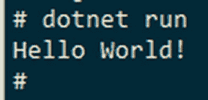
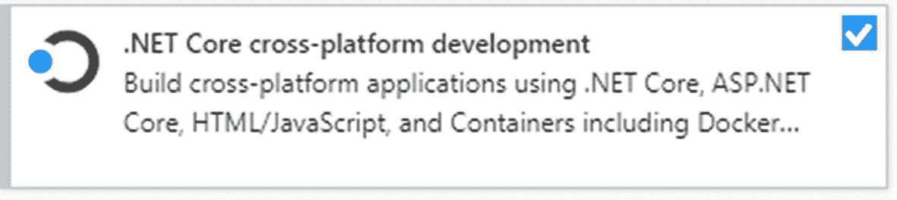
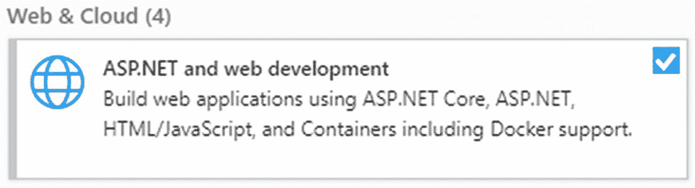
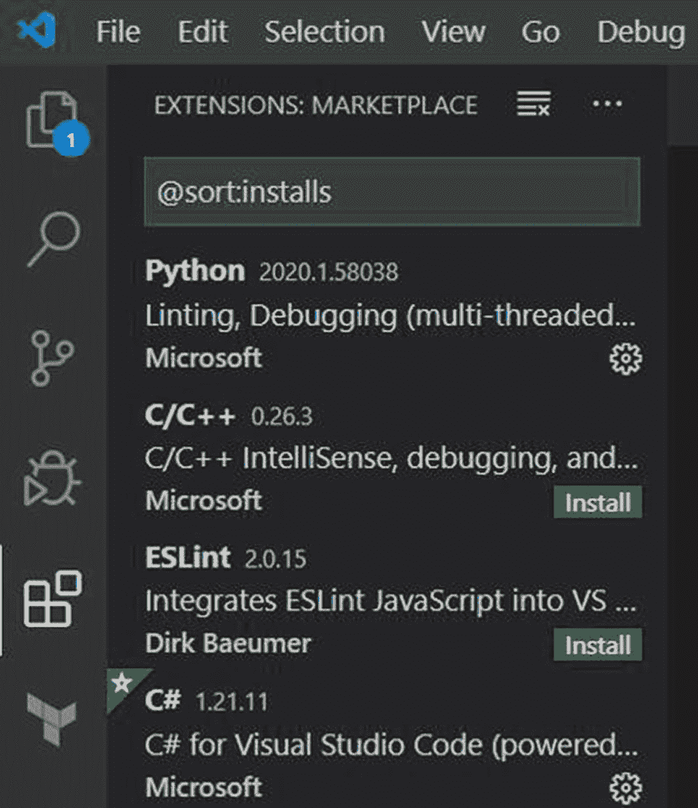
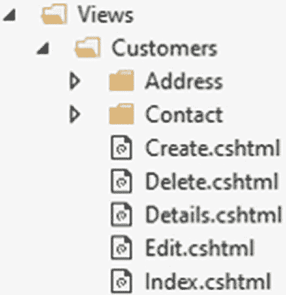
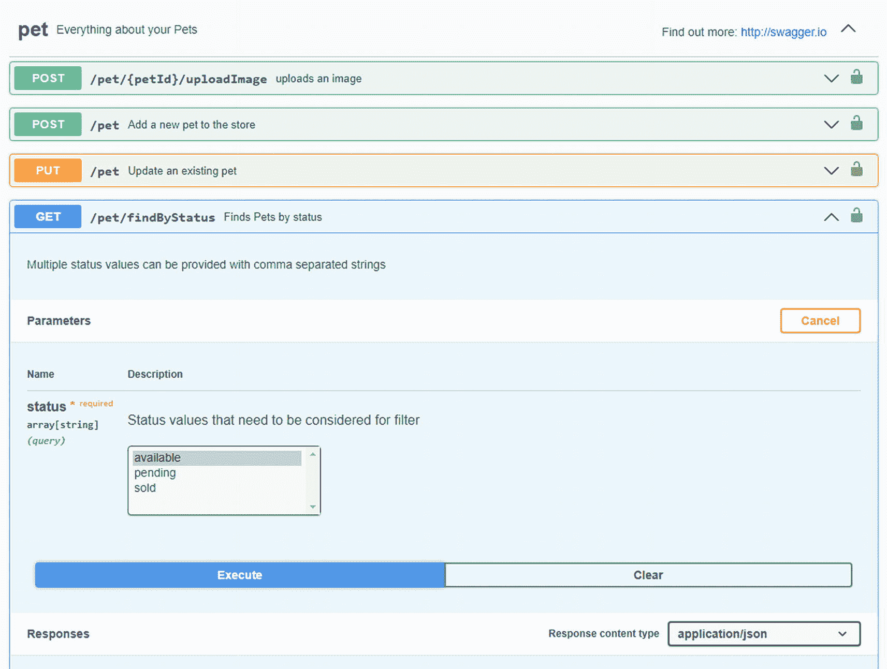
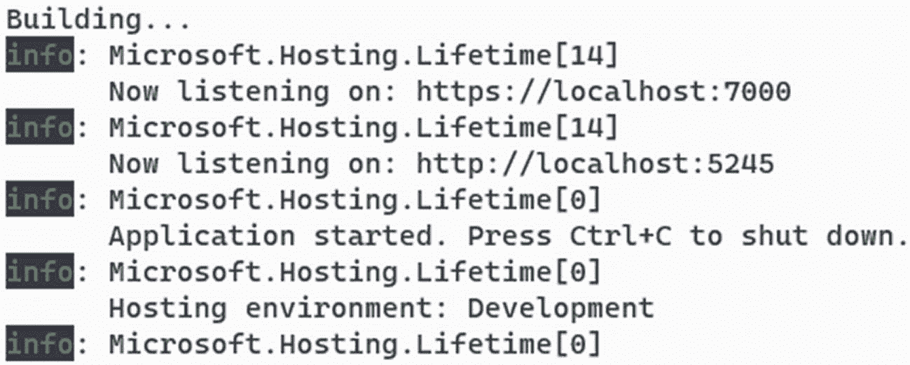
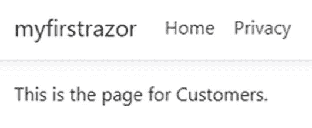

# 二、ASP.NET Core 概述

在这一章中，我们将讨论的历史和特点。NET 运行时和 ASP.NET Core，网络服务器。我们还将介绍如何安装您需要开始使用的各种组件，例如单片应用和微服务。最后，我们将浏览您在构建 ASP.NET 项目时可以选择的编程范例的类型。如果你已经精通。NET、ASP.NET Core 和 MVC，你可以快速浏览这一章，直接进入构建微服务。然而，如果你还没有开始做这些事情，那么本章是一个很好的开始。

## 的简史。网

微软推出了。NET 框架在 2000 年。。NET 是一种很好的方式，可以摆脱手工内存管理，进入现代的基于 web 的世界。假以时日。NET Framework 发展到了 4.8 版，它在遗留问题的重压下崩溃了。微软移植了。NET 转换为一个开源的跨平台版本，名为。NET 核心。与。净 5，。NET 框架正式宣布完成，将只接收安全更新。。网芯成了。NET:构建伟大的现代应用的统一平台。

一开始，我们有。NET 框架 1.0。那个。NET Framework 是在一个非常不同的时代构建的。我们开始了解 WSDL，一种使 SOAP (XML)服务更容易被发现的机制。Windows Forms 是一个新的 UI 框架，它允许我们像在 VB 6 中一样使用拖放工具来构建应用，但它有 C#(一种类似 C 的语言)的强大支持。

快进到今天。我们有聊天机器人、微服务和物联网设备。XML 几乎成了遥远的记忆，被 gRPC 等更现代的技术所取代。那个。NET 框架正在显示它的时代。如果你在。NET 框架，它需要加载。NET 框架。这包括捆绑了 GDI+的 Windows Forms、XML 解析(即使您只使用 JSON)和用于查看注册表的库。显然，这不是一个构建快速、现代应用的工具。

ASP.NET 团队开始重启 ASP.NET。该项目最初被称为 K 项目，后来被称为 ASP.NET vNext，最终被扩展到包含整个. NET。NET 诞生了:。网芯 1.0。这个平台是完全开源的，可以在 macOS、Linux 和 Windows 上跨平台运行。它在 x64 和 ARM 处理器上运行得一样好。您可以将它安装在机器上，就像将其嵌入 Docker 容器中一样容易。一个可以捆绑。NET 集成到一个可执行文件中，或者利用。计算机上安装的. NET 运行库。。NET 现在是一个现代的、可移植的、精简的环境。

随之而来的是 ASP.NET Core、实体框架核心和大量类似的“核心”品牌服务。微软移植了最好的。NET 框架移植到这个新平台上。例如，在 ASP.NET 的 web 服务器组件中，我们延续了 MVC 控制器和视图的传统。事实上，如果你没有远离模板，你可以很容易地从 ASP.NET 移植一个网站。NET 框架)到 ASP.NET Core(on。NET Core ),用 Program.cs 和 Startup.cs 替换 global.asax 和 global.asax.cs。

。网芯 2.0(喜欢。NET Framework 2.0)才是微软真正找到自己发展空间的地方。JSON 项目文件被替换为向后兼容的 XML 文件，扩展的基础类库 NuGet 包被合并到随。NET 核心 SDK，越来越多的 API 和编程模型被移植过来。

这些年来，。净核心从。NET Core 1.0 到 1.1 到 2.0 到 2.1 到 2.2，到 3.0 和。网芯 3.1。。NET 框架已经达到顶峰。NET 框架 4.7.2。当团队考虑下一个版本的。NET Core，很明显我们有一个命名冲突。我们如何解释一个人应该从旧的升级？网东西 4.7 到新。网东西 4.0？这似乎很荒谬。(诚然，从。NET 框架到。NET Core 带来了很多好处。但对于未经训练的观察者来说，这只是”。净”接着是一些喃喃自语，然后是一个数字。)那么我们如何统一。NET 生态系统？

我们决定下一个版本的。NET Core 不会被调用。NET Core 4.0，更确切地说应该叫做。净 5。这个统一的基础类库和运行时现在可以支持云属性、桌面应用、手机应用、物联网设备、机器学习应用和主机游戏:“One .NET。”

。NET 6.0 继承了这一传统:在最好的开源、跨平台. NET 上构建一个统一的运行时。

### 长期支持

在过去。NET 框架天，。网被烤成了窗户的内部。发布新的主要版本。NET 框架是一种仪式，通常与 Windows 的发布联系在一起。用这种节奏，。NET Framework 通常被认为是受支持的，只要它附带的是 Windows 版本。

在新的领域。NET Core，该团队已经采取了更快的步伐，镜像其他开源项目，如 Node.js。他们称之为网络核心 2.1。作为“LTS”(长期支持)或“当前版本”的网络核心版本:

*   “当前版本”支持 18 个月。。NET Core 2.2 被指定为“当前版本”它于 2018 年底发布，因此它的支持已经结束。

*   “长期支持”版本自发布之日起支持 3 年。。NET Core 3.1 被指定为 LTS 版本。2019 年出的，所以会支持到 2022 年。

*   。NET 6 被指定为 LTS 版本。2021 年 11 月发货，所以支持到 2024 年。

有关的更多详细信息。NET 和。NET 核心发布日期和支持日期，参见 [`https://dotnet.microsoft.com/platform/support/policy/dotnet-core`](https://dotnet.microsoft.com/platform/support/policy/dotnet-core) 。

### 展示框架

微软表示，他们已经完成了将编程范例移植到。网核，现在。NET 6。在 web 服务器堆栈上，我们有 ASP.NET Core MVC、Web API 和 SignalR。除此之外，我们现在还有 gRPC 和 Blazor，这是一个在 WebAssembly 上的浏览器中运行的 web 组件框架。在桌面堆栈上，我们有 WinForms，包括一个新的设计器。网络核心 5 和 WPF。除此之外，我们还在移动设备上内置了基于 XAML 的应用 Xamarin，MAUI 是一个新的跨平台 UI 工具包，可在。NET 6 时间框架。

不幸的是，WCF 和 WebForms 还没有被移植。这是有意义的，因为这些工具在 20 世纪 90 年代已经被 gRPC 和 MVC 所取代。NET 框架时代。但是有一些开源的选择，给了我们很多我们需要的特性。有一些很棒的工作允许旧的 WebForms 应用在 Blazor 上运行。如果你需要 WCF，CoreWCF 被捐赠给。NET 基础，可能会满足需要。或者，如果您不需要 WSDL 服务发现、高级协议绑定或安全性集成，您可以通过模型绑定来解析和序列化必要的 XML，以创建精心设计和命名的类。

尽管将应用移植到。网核，现在。NET 6。NET Framework 内置在 Windows 中，所以保留了超长的支持时间表来匹配 Windows。(VB 6 也是 Windows 内置的，所以之前写的灰头土脸的 Visual Basic apps。网也还是管用的。)如果您的应用在上运行良好。NET Framework，把它留在那里，在运行的独立代码库中构建新的微服务可能会更便宜。NET 6。

## 安装要求

为什么使用 ASP.NET Core 6.0？在撰写本文时，它是微软提供的最新“长期支持”(LTS)版本。。NET 已经存在很多年了，它提供了一个稳定的、开源的、跨平台运行的编程框架。它可以很好地与 Windows、macOS 和 Linux 兼容。利用这种在这些操作系统上工作的能力，很容易决定在这个项目中使用 ASP.NET Core。

这一节是关于安装使用单片应用和本书后面创建的微服务的要求。如果你已经有了。NET 6，那么你可能更愿意跳过这一节。对于那些还没有安装最新版本的人来说，本节将帮助您安装组件，并在安装过程中学习一些命令。

### 正在安装。NET 6.0 和 ASP.NET Core

通过安装。NET 6.0 SDK，你得到了 ASP.NET Core 的项目模板。有两个包需要注意。NET 核心。运行时包适用于将运行应用的服务器，但它没有构建和发布应用的工具。SDK 是我们将用于这本书的包。您可以从 [`https://dotnet.microsoft.com/download`](https://dotnet.microsoft.com/download) 下载这两种包类型。选择选项“下载”。NET SDK”将自动检测您正在使用的系统，并允许您下载适当的安装程序。如果需要不同的版本，您可以选择“全部”选项。净下载量…。”

安装完成后，您可以验证它是否已安装并具有预期的版本。安装后，打开新的命令提示符并输入

```cs
dotnet --version

```

您可以通过输入以下命令来查看安装的所有 SDK 和运行时

```cs
dotnet --info

```

要查看当前可用的项目模板列表，请输入

```cs
dotnet new --list

```

要创建一个快速的 helloworld 控制台应用，创建一个名为“Hello World”的目录，并进入该目录。

```cs
mkdir helloworld
cd helloworld

```

执行此命令将使用目录名创建一个控制台应用。

```cs
dotnet new console

```

您可以使用不同于目录的名称来创建控制台应用。这里使用了名称`myhelloworld`。

```cs
dotnet new console --name myhelloworld

```

这是创建控制台应用的输出示例。

```cs
$ dotnet new console --name myhelloworld
The template "Console Application" was created successfully.

Processing post-creation actions...
Running 'dotnet restore' on myhelloworld\myhelloworld.csproj...
  Restore completed in 195.27 ms for D:\Temp\helloworld\myhelloworld\myhelloworld.csproj.

Restore succeeded.

```

运行“dotnet new”命令创建了两个文件:myhelloworld.csproj 和 Program.cs。如果使用 Linux，用`cat`替换`type`命令。

```cs
$ type myhelloworld.csproj
<Project Sdk="Microsoft.NET.Sdk">

  <PropertyGroup>
    <OutputType>Exe</OutputType>
    <TargetFramework>net6.0</TargetFramework>
  </PropertyGroup>

</Project>

```

你可以看到现在 csproj 文件已经很少了。与。NET Core，代码文件不再列出。在与 csproj 文件相同的目录中，您可以通过输入以下命令来运行应用。您将看到如图 [2-1](#Fig1) 所示的输出。



图 2-1

运行 dotnet run 命令的结果

```cs
dotnet run

```

现在让我们构建一个 ASP.NET Core 项目。在这个模板中还有更多内容。

```cs
cd ..
mkdir helloweb
cd helloweb
dotnet new mvc --name myhelloweb

```

像控制台应用一样，它用控制器、视图、JavaScript 和 CSS 文件搭建了一个新的 ASP.NET Core 网站。您可以用同样的方式运行网站:

```cs
dotnet run

```

当网站启动时，记下网站运行的网址。HTTP 端口将是一个介于 5000 和 5300 之间的随机未使用端口，HTTPS 将在 7000 和 7300 之间随机选择。例如，控制台输出可以列出`https://localhost:7000/`。从您的控制台复制 URL，打开浏览器，然后粘贴该 URL。您将看到您的示例网站正在运行。

回到终端，键入 Ctrl+C 退出应用并停止 web 服务器。

### 安装 Visual Studio

您可以选择使用基于命令行的工具来编辑项目。然而，为了快速高效，您可能最好使用集成开发环境(IDE ),如 Visual Studio 或 VS Code。两者都是微软的产品，功能和用途各不相同。Visual Studio 2022 有三个版本:社区版(免费)、专业版和企业版。免费的社区版本将会为我们在这本书里所做的事情发挥巨大的作用。专业版和企业版有更多的工具。你可以去 [`https://visualstudio.microsoft.com/vs/compare`](https://visualstudio.microsoft.com/vs/compare) 比较版本。

对于我们所需要的，我们将从 [`https://visualstudio.microsoft.com/vs`](https://visualstudio.microsoft.com/vs) 下载 Visual Studio 2022 社区版。安装程序将提示在基本编辑器功能的基础上安装功能。有两个你需要确保你检查。第一个是为 ASP.NET Core 发展；见图 [2-2](#Fig2) 。另一个是跨平台支持，包括 Docker 见图 [2-3](#Fig3) 。



图 2-3

。NET Core 跨平台安装组件



图 2-2

ASP.NET 安装组件

您可能还想添加其他功能。您可以随时回到安装程序来启用更多功能。准备好后，选择右下角的安装按钮。

### 安装 Visual Studio 代码

一个跨平台的编辑器叫 Visual Studio Code，也叫 VS Code，或者就叫 Code，可以去 [`https://code.visualstudio.com/download`](https://code.visualstudio.com/download) 安装。VS 代码是一个编辑器，它不是专门为。网络开发。它可以作为一个简单的文件编辑器或记事本的替代品。但是在 VS 代码中，你可以安装扩展来编辑各种编程语言的代码。请注意，本书中的代码截图是 Visual Studio 提供的。

代码是内置的 TypeScript，在 electronic 上运行，这是一个用于构建跨平台桌面应用的主机。VS 代码的强大和优雅来自于扩展社区。扩展可以添加编译器和语法突出显示，扩展可以添加与其他工具的集成，扩展可以添加格式、颜色和主题调整。C# 不是编辑器的原生语言，但是可以通过 VS 代码扩展来安装。这显示了代码的威力，因为您可以根据您所从事的项目类型安装许多扩展。在下图中，您可以看到 Python、C# 和其他语言的扩展。您可以找到 Docker、Kubernetes、JavaScript、数据库连接器、代码翻译器、拼写检查器等等的扩展。参见图 [2-4](#Fig4) 。

Note

任何人都可以对 VS 代码进行扩展。明智地选择你要安装的扩展。



图 2-4

在 VS 代码中安装扩展，比如 C# 扩展

## 。NET 6.0 一览

有了基地。NET 运行时，您可以访问控制台应用。人们可以安装额外的框架和库来促进更高级的范式，如 WinForms 和 WPF 桌面应用、ASP.NET 网站、使用 Xamarin 的 Android 和 iOS 应用，或使用毛伊岛的现代 XAML 应用。

例如，ASP.NET Core 是一组扩展基础的库。NET 运行时。这些库提供了通过 HTTP 进行基于 web 的通信所必需的代码。借助 ASP.NET Core，您可以构建面向物联网(IoT)、基于云、移动和网络用户界面的应用。它们可以在 Windows、Linux 和 macOS 上运行。还有，是有可能跑的。基于 ARM 架构的. NET 核心应用，如 Raspberry Pi。

## MVC 一览

模型-视图-控制器(MVC)模式已经存在了几十年。大约在 2007 年，微软将其应用于 ASP.NET，并在转向开源时再次应用于 ASP.NET Core。NET 重写。以前的 web 开发模式是 ASP.NET web forms。WebForms 帮助许多开发人员从其他有状态开发方法(如 WinForms)过渡到无状态方法。几年后，ASP.NET 的 MVC 模式提供了一个比早期使用回发和可怕的会话状态更简单、更强大的编程模型。

MVC 有三个主要组件:模型、视图和控制器。除了 ASP.NET，还有第四个组成部分，路由。ASP.NET 包括这些组件以及其他方面，如配置约定、模型绑定和防伪标记。

MVC 模式是一个步骤的轮子，从请求开始，到响应结束。首先，URL 被解析成段并流入路由器。路由器查看 URL 片段并选择正确的控制器和动作(类和方法)来满足请求。控制器的动作方法负责调用应用的其余部分来处理数据，获取结果，并将模型(类)传递给视图。视图是一个模板引擎，将 HTML 片段和数据映射在一起，产生一个 HTTP 响应。action 方法也可以选择放弃 API 请求的视图，而是选择将数据传递给可能产生 JSON、XML 或 gRPC 的序列化引擎。一旦构造了响应，就会附加 HTTP 头，并将数据返回给调用的浏览器或应用。

这种 MVC 模式确实比简单的 URL 到文件路径系统更复杂，就像我们在 WebForms 或经典 ASP 中使用的那样。但是这种复杂性带来了灵活性。在路由引擎中，我们可以根据条件选择不同的控制器和动作。用户是否未经认证？不要发送到与 URL 匹配的类，而是发送到登录页面。控制器的动作也可以做出选择。请求的数据不存在吗？然后让我们将它们发送到未找到页面，而不是数据页面。他们会喜欢 JSON 数据而不是 HTML 页面吗？让我们放弃这个视图，选择一个序列化数据的响应方法。这种选择链中下一步的灵活性是 MVC 模式在。NET 生态系统以及其他语言和框架。

约定优于配置指的是 ASP.NET MVC 如何使用命名约定将 URL 绑定到控制器类和方法，将控制器方法绑定到视图，并将 URL 段和 post 主体绑定到 C# 类。不需要以编程方式将每个视图添加到任何列表或关联中。模型绑定是数据如何从浏览器发送到控制器中的方法(动作)。例如，Customer 类型的数据被反序列化为 Customer 对象参数的实例，反之亦然，因为 Customer 对象从控制器返回到视图。

### 选择途径

当浏览器或服务建立 HTTP 连接时，URL 模式匹配确定哪个控制器和动作接收请求。使用默认模板，创建家庭控制器并处理默认请求。在 URL 中，控制器紧接在域名或端口号(如果指定的话)之后定义。比如用 URL `http://localhost/Home/Index`，控制器类名是 *Home* ，动作方法名是 *Index* 。动作是控制器类中的方法，接收请求，执行任何业务逻辑，并返回信息或状态。

定义的路由存储在路由表中。当一个请求进入 web 服务器时，它会根据路由进行分析，并选择第一个匹配的路由。这意味着，如果定义了自定义路由，那么它们需要按优先顺序列出。如果没有匹配的路由，则应用默认的 URL 模式匹配规则。

在 ASP.NET Core 网中，路由通常配置有每个类别的属性。让我们看一个 ASP.NET Core MVC 项目中的控制器示例:

```cs
[Route("[controller]")]
public class CustomerController : Controller
{
  [Route("get/{id}")]
  public ActionResult GetCustomer(int id)
  {
    return View();
  }
}

```

这里顶部的`Route`属性指定如果 URL 以`https://some-site/Customer`开头，它应该运行这个类中的方法。接下来，方法上的 Route 属性映射到 URL 的下一部分。如果 URL 是`https://some-site/Customer/get/7`，那么应该调用`GetCustomer()`方法。

按照惯例，如果我们想避免给每个类添加路由属性，我们可以配置默认规则。这些附加的路由规则在 Startup.cs 文件中维护，通常在 Configure 方法中与其他自定义一起维护。在下面的代码示例中，名为 *default* 的路由被添加到路由表中。它有一个定义好的模式，其中指定了控制器和动作。也指定了 id，但带有问号。这允许该字段为空或不出现在 URL 中。但是，如果存在一个值，那么它将应用于 Index 操作方法的 id 参数。

```cs
  app.UseMvc(routes =>
  {
    routes.MapRoute("default", "{controller=Home}/{action=Index}/{id?}");
  });

```

从 ASP.NET Core 2.2 开始，您可以使用端点来代替路由表。端点映射允许在不影响其他 web 框架的情况下定义路由规则，这意味着有可能利用 SignalR 以及 MVC、Razor 等，而不会在中间件管道中发生冲突。

```cs
  app.UseEndpoints(endpoints => {
    endpoints.MapControllerRoute(name: "default",
    pattern: "{controller=Home}/{action=Index}/{id?}");
  });

```

向操作添加路由属性也有助于控制路由逻辑。在下面的示例中，使用这些 URL 中的任何一个调用 Index 方法:/、/home/或/home/index。路由属性的使用也允许方法名不匹配。在本例中，使用 URL /home/about 将调用 ShowAboutPage 方法。

```cs
  [Route("")]
  [Route("Home")]
  [Route("Home/Index")]
  public IActionResult Index()
  {
     return View();
  }

  [Route("Home/About")]
  public IActionResult ShowAboutPage()
  {
    return View("About");
  }

```

### 控制器

控制器的工作是将请求输入映射到类，调用完成工作的业务类，并将结果提供给响应。它们通过路由接收对动作(方法)的请求，处理模型数据并发送到适当的视图。最后，控制器可以使用验证、安全和内容类型来自定义发送给调用者的响应。

他们使用一个命名约定，仅仅是一个名称和单词“控制器”，例如，CustomerController。这里的逻辑意味着处理与客户相关的请求，而 InvoiceController 意味着发票处理逻辑。这种逻辑分离有助于保持轻量级控制器的良好原则。也就是说，它们应该有足够的逻辑来处理接收和发送数据。其他业务逻辑和数据访问代码应该在单独的类中。

### 视角

视图负责表示带有或不带有动态数据的页面。视图的输出是一个巨大的字符串，所以它们天生就很难测试。因此，视图内部的逻辑应该非常简单。如果你需要复杂的逻辑，把这个逻辑移到控制器的动作中，在那里它可以被正确地测试。例如，客户视图应该只有足够的业务逻辑来遍历列表并显示每个客户。它不应该有任何关于如何检索数据或日志记录等业务逻辑。这种逻辑在控制器或对应用更重要的其他类中更好。

有一个文件夹约定用于定位要使用的正确视图文件。在顶层，每个控制器类都有文件夹。文件夹中是控制器类中每个方法的视图(cshtml 文件);见图 [2-5](#Fig5) 。“视图”文件夹中还有其他文件夹，例如“客户”、“发票”,当然还有“主页”。虽然不是必需的，但是在 MVC 项目的每个视图文件夹中都有一个 Index.cshtml 文件。当访问配置了默认路由的类似于`http://localhost/Customers/Edit/3453`的 URL 时，我们点击 CustomersController 类、Edit 方法，并在 Views/Customers/Edit.cshtml 文件中找到视图。当然，路由器可以选择不同的控制器和操作，操作方法也可以选择不同的视图。



图 2-5

在 Views 文件夹中，每个控制器都有一个文件夹，每个动作都有一个视图文件

### 模型

ASP.NET Core 中的模型是用来表示数据的类。利用控制器并发送到视图，模型是保存视图呈现的数据的包。例如，在检索客户列表时，每个客户都是客户模型的一个实例。它具有该客户字段的属性。它可能具有名称、地址、电话号码等属性。视图的逻辑将遍历一组模型，并呈现每一个模型。

模型可能不同于项目中的其他数据类。例如，我们可能有映射到数据库中的表的实体。我们可能还有数据转换对象，或 d to，用于在应用的不同部分之间传递数据。

当设计一个在视图中使用的类时，我们可以称之为视图模型。这个类是专门为保持视图呈现简单而定制的。在控制器或其他业务逻辑类中，我们可以将数据从实体类映射到视图模型类。视图模型特定于它被渲染的目的。可能有一个视图模型用于列出客户，而另一个视图模型用于编辑客户详细信息。您可能还有一个由多个来源组成的视图模型。也就是说，它们不应该被认为是与数据库表的一对一关系。

模型绑定还可以使用视图将请求细节映射到控制器动作中。在这种情况下，我们可以称之为请求模型。例如，当保存一个用户的概要文件时，我们可能有一个包括他们的姓名、地址和电话号码的请求模型。这与实体类不同，实体类也可能包含用户名和密码。我们绝对不希望在请求模型中包含这些属性，因为我们不希望请求中的额外数据变成可能改变用户密码的注入攻击。

### ASP.NET Core 中间件

借助 ASP.NET Core，几乎所有的功能都通过中间件管道连接在一起。这个管道是所有请求流经的一组步骤。管道中的每一步都可以增加请求、中止请求或者什么都不做。例如，我们可能有一个中间件函数，它将 HTTP 头解析成 C# 类，或者将来自请求体的 JSON 数据解析成请求模型。我们可能还有一个验证用户身份的中间件，如果没有，返回一个 HTTP 401 状态码。我们还可能有一个中间件来捕获和记录异常。

web 应用可以根据处理请求和响应的内容和方式进行配置。要添加中间件选项，请打开 Startup.cs 文件。两种方法中较低的是 Configure 方法。作为 Configure 方法中的参数，我们可以接受来自 IoC 容器的任何服务。默认情况下，我们通常只接受 IApplicationBuilder 和 IWebHostEnvironment。IApplicationBuilder 类型是配置使用的主要实例。利用 IWebHostEnvironment 将提供诸如 web 应用是否在开发模式下运行的信息。

在 Configure 方法中，可以将 web 应用配置为使用路由、认证等中间件。在下面的代码示例中，这被配置为不仅使用 MVC 路由，还使用端点路由。这是设置默认路由逻辑的地方。方法`UseStaticFiles`允许静态文件如 JavaScript、CSS 和图像文件从`wwwroot`文件夹托管。

```cs
  public void Configure(IApplicationBuilder app, IWebHostEnvironment env)
  {
    if (env.IsDevelopment())
    {
      app.UseDeveloperExceptionPage();
    }
    else
    {
      app.UseExceptionHandler("/Home/Error");
    }

    app.UseHttpsRedirection();
    app.UseStaticFiles();
    app.UseRouting();
    app.UseAuthorization();

    app.UseEndpoints(endpoints =>
    {
      endpoints.MapControllerRoute(
        name: "default",
        pattern: "{controller=Home}/{action=Index}/{id?}");
  });
}

```

微软提供了许多内置的中间件选项。此外，第三方提供商通过 NuGet 打包提供了许多产品。由于中间件仅仅是功能，创建定制的中间件组件也是一件简单的事情。

## ASP.NET Core Web API

类似于 MVC 项目，ASP.NET Core 包括一个 Web API 模板。MVC 模板是面向网站的，而 Web API 模板是面向微服务的。两个模板都使用 MVC 模式。在 Web API 项目模板中，视图被删除，控制器通常返回 JSON 数据。可以在同一个项目中同时使用 MVC 控制器和视图以及 Web API 控制器，而不会发生意外。

从 ASP.NET 3.0 开始，Web API 项目包括了 Swashbuckle 库。Swashbuckle 提供了一种使用 OpenAPI(以前的 Swagger)浏览和探索 API 的好方法。当你启动一个 ASP.NET Core Web API 项目时，浏览到“`/swagger/,`”，你可以直接从浏览器中形成请求并看到结果，如图 [2-6](#Fig6) 所示。



图 2-6

来自 [`https://petstore.swagger.io`](https://petstore.swagger.io) 的 Swagger 文档的样本 Swagger UI 体验

通过在 Explorer、Finder 或您选择的 shell 中创建一个空文件夹来创建一个新的 Web API 项目，在该文件夹中打开一个新的终端，然后键入

```cs
dotnet new webapi --name mywebapi
dotnet run

```

记下 web 服务器的 URL，并打开浏览器访问该页面。您可能会得到一个 404，因为默认情况下，没有任何东西在监听主页。添加“/swagger/”，您将进入 OpenAPI 浏览器。例如，如果控制台输出将 URL 列为`https://localhost:7000/`，我们将浏览到`https://localhost:7000/swagger/`。

完成后，按 Ctrl+C 停止 web 服务器。

浏览此项目中的文件。注意，与 MVC 项目不同，我们没有视图文件夹。我们有一个 Controllers 文件夹和一个 Startup.cs 文件来装配中间件管道。

## Razor 页

在 ASP.NET Core 2.2 中，Razor 页面变得可用。Razor 页面不使用 MVC 范式，而是使用与经典 ASP 和 WebForms 相同的范式:它将 URL 直接映射到文件。这对于构建简单的 web 页面非常有用，这些页面不需要在请求通过路由器、控制器的操作和视图时选择不同的路径。

在 Razor Pages 项目中，所有页面都存在于 Pages 文件夹中。为了映射到 URL `https://localhost:7000/customer/detail`，视图应该是`Pages/Customer/Detail.cshtml`中的一个文件。

与 Web API 项目类似，我们可以在一个项目中包含 Razor 页面以及 MVC 控制器和 Web API 控制器。为了实现这一点，我们只需要安装适当的中间件。所涉及的步骤留给读者作为练习。(提示:合并两个模板之间的 Startup.cs 文件，并将 Pages 文件夹复制到位。)

让我们创建一个新的 Razor Pages 项目。从提示符开始，创建一个新的目录遍历。现在进入

```cs
dotnet new razor

```

几秒钟后，新的基于 Razor 的应用就创建好了。对于这一部分，我们将使用 VS 代码来查看文件。在提示符下，在下面一行输入命令。注意，使用点号告诉 VS 代码从当前文件夹开始打开。

```cs
code .

```

在 VS 代码中打开应用后，请注意 Pages 文件夹。它有一些针对错误和隐私的预构建文件以及主 Index.cshtml 文件。还有一个文件夹叫共享。这是为了共享布局以及利用依赖注入的公共区域。现在创建一个新的 Razor 页面。在提示符下，进入 Pages 文件夹并创建一个名为 Customers 的新文件夹。现在进入

```cs
dotnet new page -n Index

```

这在 Customers 文件夹中创建了一个名为 Index 的新 Razor 页面。在 VS 代码中，打开这个新文件。您会看到有一个页面标签和一个模型标签。在代码部分，添加任何 HTML，例如，

```cs
@page
@model MyApp.Namespace.IndexModel
@{
  <p>This is the page for Customers.</p>
}

```

要运行该应用，请在终端提示符下输入以下命令:

```cs
dotnet run

```

项目构建完成后，您将看到类似于图 [2-7](#Fig7) 所示的输出。



图 2-7

获取端口号

这里列出了两个 URL，一个用于 HTTP，另一个用于 HTTPS 流量。选择 HTTPS 流量的 URL，使用浏览器，转到该 URL，然后添加`/Customers`。例如，控制台中的 URL 可能类似于`https://localhost:7000/`。所以在这个例子中我们要浏览的完整 URL 是`https://localhost:7000/` `Customers`。你应该会看到如图 [2-8](#Fig8) 所示的内容。



图 2-8

从新视图中查看 HTML

## 最小 API

ASP.NET Core 6.0 中的全新特性是最小 API。这使用了最好的 C# 10 来为简单的 API 创建更少的代码。最小 API 设置嵌入在 Visual Studio 2022 中可用的新项目模板和来自`dotnet new`的命令行模板中。

最小 API 技术可以用在 MVC、Web API 和 Razor Page 项目中。事实上，ASP.NET 的开发人员已经在最小 API 的基础上重新搭建了这些传统方法的平台。这意味着如果你的微服务真的很简单，你也可以从最小 API 方法中获得一些性能提升。

在最小 API 范例中，Startup.cs 文件被合并到 Program.cs 文件中。人们也可以装配动作方法，而不需要将它们嵌入控制器类中。如果你熟悉 Node.js 和 Express.js，你会觉得使用这些最小的 API 很舒服。

下面是一个使用最小 API 的 Hello World 程序示例:

```cs
var builder = WebApplication.CreateBuilder(args);
var app = builder.Build();
app.MapGet("/", () => "Hello World");
app.Run();

```

没错，就是整个 app。创建一个新文件夹，创建一个名为 Program.cs 的文件，并将上面的代码粘贴到其中。在此文件夹中，添加一个 HelloWorld.csproj 文件，并将此配置粘贴到其中:

```cs
<Project Sdk="Microsoft.NET.Sdk.Web">
  <PropertyGroup>
    <TargetFramework>net6.0</TargetFramework>
  </PropertyGroup>
</Project>

```

现在在这个文件夹中打开一个终端，启动应用:

```cs
dotnet run

```

浏览到指定的 URL，您将看到消息“Hello World”

当您不想要传统项目中的所有仪式和惯例时，这种最小化的 API 技术会非常有用。然而，最小 API 可以容纳更强大的特性，比如依赖注入(DI)、模型绑定、认证等等。

然而，最小 API 方法并不是没有缺点。测试一个最小的 API 要困难得多，因为程序类不是公共的，很难从单元测试中引用。此外，如果将所有特性都放在一个文件中启动 web 服务器，就会失去关注点的分离。

由于这些原因，本书不太关注新的最小 API，而是关注传统的项目模板，包括控制器、视图和模型文件夹，以及独立的 Program.cs 和 Startup.cs 类。通过一点定制和大量调试，您也可以使用最少的 API 来完成本书中的大部分项目。

## 摘要

在本章中，我们探讨了。NET 和 ASP.NET Core，我们得到了必要的工具安装，我们安装了两个伟大的 ide，我们可以用来编辑 C# 代码。我们安装了 Visual Studio 和 VS 代码。出于不同的原因，他们都是伟大的编辑。尽管 Visual Studio 有很多可用的开发助手，但 VS Code 是一个可靠的轻量级编辑器。

然后我们讨论了 MVC、中间件和 Razor。MVC 和 Razor 都提供了强大的 web 应用功能，也可以一起使用。了解一点路由是必要的，因为 HTTP 连接是连接到正确的 MVC 控制器或 Razor 页面的。此外，当我们进入微服务时，您将看到如何调整路由以使用协议缓冲区来帮助实现更快的通信。