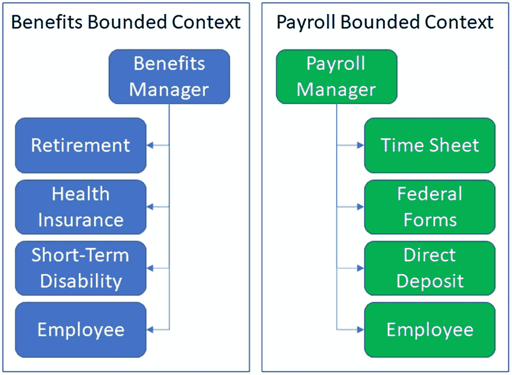
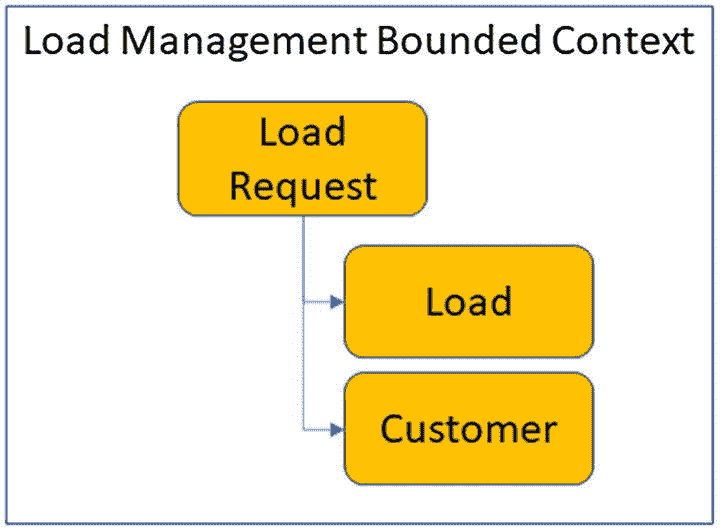
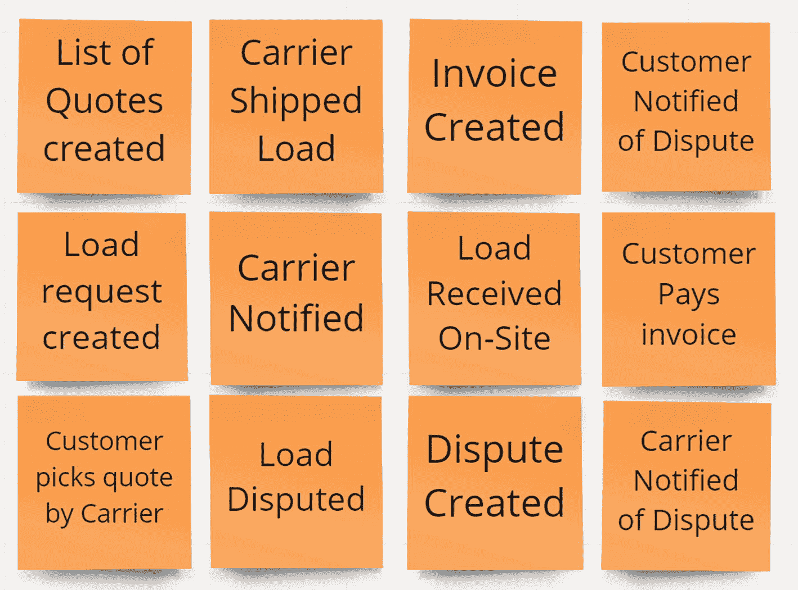
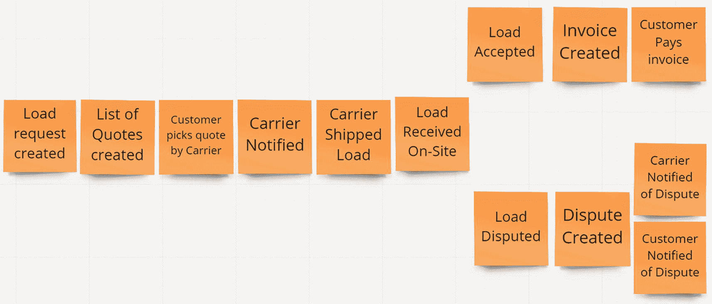
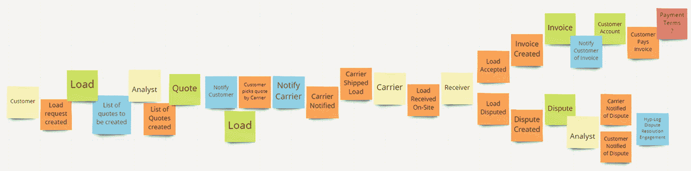
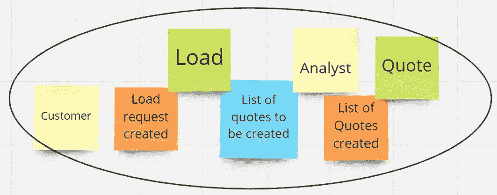
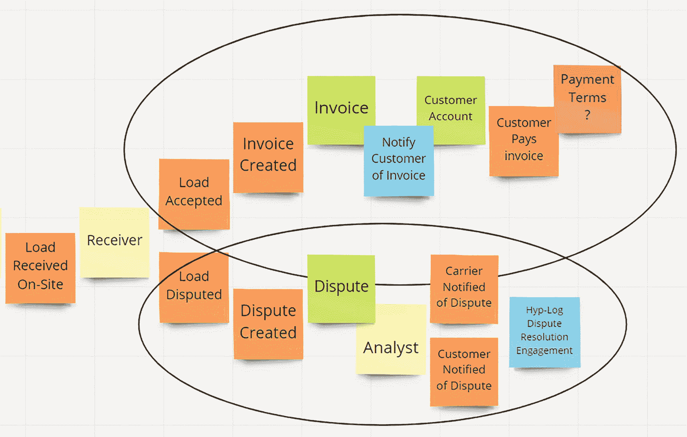
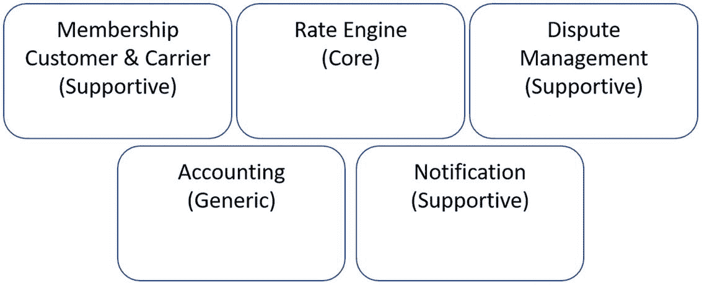

# 三、搜索微服务

本章使用一个模拟场景来理解客户在使用对其业务至关重要的应用时遇到的问题。您将看到一个称为事件风暴的研讨会式会议如何帮助软件开发人员理解客户的业务以及他们需要帮助的应用。您还将了解领域驱动设计(DDD ),以及开发人员如何使用它来准备将单片应用分解为微服务。为了朝着正确的方向前进，我们将从简单介绍客户的业务开始。此介绍将帮助您了解一些客户的困难，这将有助于分析微服务需求的示例。

## 商业

我们假设的客户公司 Hyp-Log 是一家运输物流中间商，负责热门产品的交付。Hotshot 交付是货物或材料的点对点转移，需要一定程度的便利，这可能是大型运输公司无法实现的。

Hyp-Log 对其客户的价值源于其在给定货物的类型、尺寸和重量的情况下获得最佳价格的能力。实际上，Hyp-Log 采用了他们所有的费率电子表格和员工手动执行的分析，并构建了一个“费率引擎”，以更快的速度、更高的准确性和更好的整体客户体验来执行相同的计算。

Hyp-Log 的一名前员工为他们创建了一个定制应用。尽管该应用在许多方面都有所帮助，但一些业务流程仍然是手工操作。随着需求的增长，Hyp-Log 决定让一家公司进行必要的编程更改。Code Whiz 是一家假想的软件开发公司，受雇进行代码修改。

在没有自动化的情况下管理货运会面临几个挑战。让我们考虑一家运输公司的所有者/经营者。此人不仅是公司的所有者，负责所有后台管理任务，而且还负责货物报价和交付货物。对一个人来说，这是一个很大的负担。这就是整体承运商门户的亮点，该应用消除了为每批货物报价的负担。定价引擎使用承运商提供的费率表、船队可用性和自动生成客户装运报价的能力，从而消除了承运商的报价负担。

在使用电子表格和致电运营商询问报价信息几年后，他们决定开发一个应用来处理他们的流程。一名员工创建了一个应用来尽可能地简化工作。该应用被亲切地称为“装运包裹物流管理——东西”，又名“SPLAT”给事物命名很难。

SPLAT 有三种主要的用户类型:客户、运营商和管理员。它为客户提供了一种提交装载请求、根据报价列表选择承运商以及付款的方式。运营商可以管理他们的车队和每英里的基本成本，以及基于特定需求的额外成本。有些货物需要拖车，属于危险物品，甚至需要冷藏。

## 领域驱动设计

在我们能够利用领域驱动设计(DDD)之前，我们需要定义一些事情。我们将回顾 DDD 的几个租户:域、无处不在的语言、有界上下文和具有聚合根的聚合。

### 领域

DDD 是一种专注于某个领域的应用开发方式。域是您为其创建应用的领域。例如，如果应用的主要焦点是管理与会计相关的功能，则该领域是会计，而不是另一个主要焦点是视频编辑的应用。

在 Hyp-Log 的情况下，他们的领域是 hotshot 负载管理。公司中可能存在其他领域，如人力资源和保险，但它们与 Hyp-Log 作为公司存在的原因无关。它们是公司运作的辅助领域，但它们并不能帮助 Hyp-Log 在竞争对手中脱颖而出。

Eric Evans 是 DDD 的创始人，也是《领域驱动设计:解决软件核心的复杂性》一书的作者。本章将利用 DDD 来帮助理解热门领域，并确定何时/何地创建微服务。DDD 不是为使用微服务而创建的，但可以用于微服务的开发。也就是说，这本书并没有解释 DDD 的每一部分。

### 子域

更深入的领域是子域。子域是相关业务流程的分组。例如，在一个会计领域中，您可能有一组处理应付账款、应收账款和工资单的流程。产生和处理发票的相互关联的业务流程属于应收账款子域。相比之下，管理时间表、工资和联邦表格的业务流程属于 Payroll 子域。在这个层次上，我们仅指业务流程。这种焦点分组被称为问题空间。

在子域中提供功能的代码也应该存在于与其他部分分开的组中。为子域提供功能的代码组称为有界上下文。有界上下文存在于所谓的解空间中。我们将在另一节讨论更多关于有界上下文的内容。当我们决定什么代码应该成为微服务时，你会看到子域类型是如何起作用的。

有三种子域类型:核心、支持和通用。

*   核心——应用中的每个核心子域都包含一个或多个对公司至关重要的有界上下文。

*   支持性的——支持性的子域不被认为是关键的，但包含支持业务的代码。

*   通用——最后，通用子域是那些可以用现成的解决方案替换的子域。

### 普遍存在的语言

DDD 最重要的文物之一是无处不在的语言(UL)。UL 是一个短语和术语的集合，它帮助每个相关人员对业务流程有一个清晰简明的理解。

像“用户提交请求”这样的一些短语对其所属的完整含义和上下文并不清楚。重新措辞有助于建立一个能被迅速理解的 UL。例如，“客户提供优惠券代码”和“客户发出争议请求”具有完全不同的上下文，尽管两者都有“用户”和“提交请求”澄清是至关重要的，这样参与项目开发的每个人都能理解业务流程的细节。

有些时候，术语有着过多的含义。根据上下文的不同，像“票”这样的术语可以有不同的含义。说“一个用户提交了一张票”需要澄清具体的上下文。这是指客户提交支持票吗？还是指司机向停车场的机器提交罚单来支付停车费？拥有一个格式良好的 UL 有助于减轻团队之间的混乱，并且可以产生更简洁的用例。

UL 也应该延伸到法典。开发人员倾向于避免使用长的类名和方法名。但是命名空间、类和方法的简洁名称有助于代码符合 UL。随着时间的推移，开发人员会改变角色或工作，让代码符合 UL 有助于其他开发人员在更短的时间内跟上速度。

### 有界上下文

有界上下文是在一个子域中实现业务流程的代码集合，该子域明显不同于其他流程。例如，考虑一个制造工厂的应用。采购零件的库存管理代码不同于制造零件的库存管理代码。因为外购件和自制件的业务流程不同，所以提供业务功能的代码也不同。通过在这里使用无处不在的语言，术语“零件”被区分为不同的用途，成为“采购零件”和“制造零件”因此，有一个有界的上下文，由术语“部件”周围的语言决定

识别有界上下文可以通过几种不同的策略来完成。如前所述，语言是一个边界的指示器，构成一个有界的语境。在名称空间、类名和方法中使用特定语言的功能有助于识别有界上下文及其用途。还要考虑功能中使用的术语。例如，术语发票就是一个明显的线索。但 CustomerAccount 可能还不足以提供线索。在这种情况下，寻找动词。什么作用于客户帐户或与客户帐户一起作用？两种可能的操作是创建客户帐户，而另一种是通知。

### 骨料和骨料根

不足为奇的是，在一个有界上下文中可以有多个类。这些类之间存在基于依赖性的关系。这种依赖性可能是由于继承或合成。这些类的每个组都是一个聚合，并且是聚合根中的顶级类。

Eric Evans 提供了一个规则，规定一个聚合中的类可以相互调用或者调用另一个聚合的聚合根，即使它在另一个有界上下文中。其思想是，如果不通过聚合的根，一个有界上下文中的任何类都不能利用另一个有界上下文中的类。这个规则是封装的一种架构形式。它防止建立很快变得脆弱的依赖性。

让我们考虑下面的例子。在图 [3-1](#Fig1) 所示的利益约束上下文中有一个处理利益的集合。有一个处理退休、健康保险和短期残疾等福利的依赖类的聚合根。在工资限制的上下文中，还有一个聚合。它有处理时间表、联邦表格和直接存款等细节的依赖类。在单独的有界上下文中，每个聚合都有自己的 Employee 类。employee 类的这种复制允许 Employee 功能是独立的，不会成为一个 God 类。God 类包含多个有界上下文的功能，因此模糊了界限，使它们更难进化。

图 3-1

聚集体的例子

是否应该允许福利聚合中的任何类调用工资单聚合中的 employee 对象并更改其状态？不可以。允许任何类调用不同聚合中的任何其他类都会影响该雇员所在州的数据的完整性。当员工福利的变化影响到他们的工资时，福利汇总中的代码应该只调用工资汇总根。遵守这一规则允许制定业务规则来保护雇员数据和其他相关类的完整性。另一个例子是，员工福利的变化不应改变其直接存款信息。

负载请求类与 SPLAT 应用中处理新负载请求的负载和客户类相关。在图 [3-2](#Fig2) 中，您可以看到加载请求类是聚合根。要访问请求中的负载信息，您不应该直接转到负载类，而应该通过负载请求类。直接进入负载请求类允许它提供改变负载或客户状态的功能。在没有功能的情况下，根可以保护信息状态的完整性。

图 3-2

将加载请求类显示为聚合根

领域驱动设计是一个很大的话题，需要一段时间来完全掌握所有的细节，并将它们集成到日常的软件开发中。我介绍的这些方面将有助于讨论 Code Whiz 的开发人员如何分析和创建满足 Hyp-Log 需求的代码。在下一节中，我们将介绍一种分析现有代码库的方法。

## 事件风暴

Code Whiz 的团队决定与 Hyp-Log 的成员召开一次名为“事件风暴”的研讨会。虽然这不是帮助理解业务流程的唯一方法，但是它对于识别开发团队稍后将要建模的各种领域是非常有用的。Alberto Brandolini 最初发明了事件风暴来帮助识别 DDD 中的聚集。对于公司来说，更好地理解现有系统和开发软件项目所需的需求也是非常有用的。Alberto 有一个关于在 [`https://eventstorming.com`](https://eventstorming.com) 的风暴事件的网站。

在事件风暴中，软件开发人员从被称为领域专家的主题专家那里学习行业如何运作，以及公司如何运作。会议旨在帮助所有相关人员对当前的工作方式达成共识，并展示需要改变的流程。事件风暴会议帮助新的开发团队成员跟上速度，并让领域专家熟悉他们的位置。领域专家可能会退休，而没有多年知识的人必须接管这个角色。在这种情况下，领域专家也可以完全理解系统的各个部分。

其中的一些会议将在整个开发过程中进行。虽然在开发开始之前讨论所有的事情并收集所有的需求是很好的，但是这样做将不可避免地导致误解或不正确的假设。开许多小型会议可能比开一些冗长而令人畏缩的会议更有效。相关领域的专家认可开发人员针对各种问题提出的解决方案。这个批准过程有助于防止领域专家和开发团队对业务过程的理解出现偏差。

### 设置

事件风暴最好使用纸卷、便签纸和笔在大墙上完成。由于许多人可以一起工作，所以在处理多个子域时，要为便笺提供足够的空间。通常使用走廊为人们在一起工作留出足够的空间。

数字选项是可用的，但有些不鼓励。虽然使用米罗( [`https://miro.com`](https://miro.com) )这样的网站是一个不错的选择，但是多人之间很难有效协作。像 Miro 这样的在线资源比使用真正的便利贴有一个优势，那就是能够抓取一组便利贴并在黑板上快速移动。

### 颜色编码

为了区分活动的类型，使用各种颜色的便利贴。有许多关于使用配色方案的建议。无论你选择什么样的配色方案，做一个如图 [3-3](#Fig3) 所示的图例。考虑到会议期间使用的墙的大小，您可能需要为各个区域制作图例的副本。

图 3-3

事件风暴传奇

*   橙色–领域事件

*   蓝色–动作/命令

*   黄色–演员

*   紫色–政策

*   绿色–骨料

*   红色–问题

领域事件(橙色)是以过去时态标注的业务流程。它们在发生时就已经是过去式了，其他项目也受到这些事件的影响。参与者(黄色)要么引发域事件，要么负责启动操作/命令。例如，客户参与者通过完成一个在线订单启动了“Order Submitted”域事件。

动作/命令(蓝色)是触发域事件的工件，或者是由域事件触发的过程。例如，如果发生了“发票已创建”域事件，则操作可能是“通知客户”通知客户是值得注意的，但是实施它超出了试图理解的问题的范围。

策略(紫色)用于记录特殊业务规则发挥作用的地方。例如，对于域事件“Items Purchased”，注意仓库员工挑选商品的动作。保单可能会注明，重量超过 50 磅的物品需要两个人才能抬起。另一个例子是，如果一件物品的重量超过 200 磅，那么就需要叉车。政策应指出哪里需要这种关注，但并不意味着涵盖所有情况。

聚合(绿色)用于记录域对象存在的位置。坚持前面的“购买的商品”域事件的例子，一个集合可以是“仓库提货票”在代码中，这很可能是类对象。聚合的另一个例子可以是发票或客户。请注意，聚合足以显示与其相关的业务流程之间的关系。

问题(红色)是领域专家或开发团队有问题但没有直接答案的时候。他们需要一些研究，但只是简单地标记，以便研讨会可以继续进行。使用便利贴来记录问题，当开发的时候，你不会忘记必要的细节。然而，没有这些问题的答案，就不能认为发展是完整的。一个例子是“谁决定仓库物品政策的重量阈值？”

## 会议

事件风暴会议开始时只记录领域事件。领域专家开始填写橙色便利贴，并将它们贴在墙上。他们从想到的任何领域事件开始。在此基础上，随着其他事件被记住和思考，添加其他便笺。随着讨论的进行和您发现事件的新顺序，重新整理便笺。

在这个阶段不需要记录每个域事件。随着会议的进行和其他便笺的应用，您将向故事情节添加其他领域事件。并且没有必要记录发生在持久层的功能(数据存储交互)，除非有业务关键的功能。希望在持久层中没有业务逻辑，因为那不是干净的代码，会导致更紧密的依赖耦合。

与问题空间无关的领域事件不应出现在墙上。如果问题与用户登录有关，像“用户登录系统”这样的域事件应该只出现在墙上。否则，便利贴只会增加混乱。在这种情况下，关于通知的客户和运营商的域事件应该在墙上，因为它们直接应用于问题空间中的业务流程。图 [3-4](#Fig4) 显示了领域事件的例子。

图 3-4

域事件的示例

应用领域事件后，让小组寻找不需要出现在板上的重复事件，并应用事件的顺序。会有重复事件应该在墙上的情况。例如，在通知承运人时，该事件可能会发生多次。然而，它们是上下文特定的。也就是说，每个域事件都与它存在的上下文原因相关。

图 [3-5](#Fig5) 显示了事件流，也描述了拆分流程。这种分割过程显示了负载是被接受还是有争议的决定。所示的一个并行过程是在争议处理期间，在该过程中，通知客户和承运人。它们同时发生，互不依赖。

图 3-5

拆分流程示例

现在，请领域专家注意领域事件的其他支持部分。将操作/命令、集合、参与者和策略添加到它们的相对位置，从而更好地展示业务流程是如何运行的。通常需要移动许多便笺条来为附加的支持便笺腾出空间。重复便笺的另一种可能性是聚合。在图 [3-6](#Fig6) 中，装货、客户、承运人和发票可以有应用于不同上下文的副本。在这种情况下，拥有便笺的副本比移动便笺更干净。

图 3-6

新兴环境

随着团队回顾便利贴墙和讨论的进行，不同的环境开始形成。其中一种情况是创建加载请求，如图 [3-7](#Fig7) 所示。“Load Request Created”域事件使用 Load aggregate 和 Customer actor 发生。确定的另一个上下文用于创建报价。该上下文依赖于演员 Annie，我们的超级日志示例管理员，她目前必须处理许多手动流程，并且超负荷地创建报价和处理电话呼叫。

请注意，装载请求和报价的上下文都依赖于装载总量。这种依赖可能是 DDD 所说的“共享内核”关系的一个例子，因为不同的有界上下文共享代码。然而，粗略地看一下就会发现，这些环境并不相互排斥。他们真的不能独立成长，他们也没有必要这样做。因此，表示两个上下文的行扩展成一个包含加载请求和报价的上下文。

图 3-7

单一上下文示例

其他上下文也是可识别的。图 [3-8](#Fig8) 描述了发票和争议管理的背景。由于事件风暴会话的结果是反映当前的系统，所以所识别的上下文是代码存在的地方，并且具有不同的功能。开具发票的代码应该与处理争议的代码完全分开。由于这种分离，不同上下文中的代码被称为有界上下文。每个有界上下文都包含应该完全独立于其他上下文的业务功能。这种分离允许适用代码的独立发展。

图 3-8

发票和争议管理环境

在每次事件风暴会议之后，两个团队就任务和相关的优先级达成一致。这样，每个人都参与进来，并理解期望和期限。开发团队为确定的任务修改和创建工作项。当领域专家评估正在进行的工作时，一些工作项可能会被修改以包括返工，有时是重新设计。如果开发的结果不符合领域专家的期望，那么这种返工就会发生。

## 查看域

在事件风暴会议之后的墙上，开发人员可以看到有界上下文的证据。然而，开发人员应该如何衡量一个有界上下文相对于另一个的价值呢？问这个问题的另一种方式是，开发人员如何理解有界上下文给公司带来的价值？

图 3-9

有界上下文

开发者将有界的上下文分组到子域中。在图 [3-9](#Fig9) 中，子域被列出并赋值。费率引擎子域对业务至关重要。如果没有费率引擎，Hyp-Log 将无法为其客户和运营商提供实质性的价值。其他一些子域被标注为“支持性的”这些子域并不重要，但却是应用处理信息所必需的。对于 Hyp-Log，成员资格、争议管理和通知子域支持其他子域中的业务流程。成员资格涉及注册和维护客户和运营商的逻辑。通知仅涉及在费率引擎子域和争议管理子域中不同的业务流程执行期间通知客户和运营商。争议管理子域处理货物未交付、交付至错误地点以及发票信息不正确的问题。

理解有界上下文实现的子域的值有助于确定代码更改的成本。位于核心子域的有界上下文中的代码必须受到更多的审查和保护。正因为如此，核心子域中的功能不太可能转移到微服务，留在单一应用中可能会更好。

## 领域模型

在与 Hyp-Log 的第一次事件风暴会议后，代码高手开发人员开始创建代码来解决各种确定的问题。领域模型是为解决相关子域中的问题而创建的一组代码。费率引擎子域将具有与为处理成员注册而创建的域模型相分离的域模型。

随着领域模型的发展，有时开发人员必须验证领域专家是否同意新代码，以及现有代码是否发生变化。任何由领域专家编写并事先批准的代码都应该反复测试，检查是否有意外的破坏性变化。当使用敏捷时，冲刺评审是验证现有的和新的变更符合领域专家期望的最佳时机。

### 关注行为

领域模型应该关注行为而不是对象的状态。在风暴活动中，密切注意 UL 中的动词。它们是领域模型预期行为的线索。领域模型也应该只包含足够的代码来解决他们子域中的问题。当一个模型提供了比需要更多的功能时，它增加了紧耦合、错误和失败的可能性，使它们更难维护。

### 领域建模

与领域专家的进一步会谈可能会表明领域模型需要随着变化而发展。新的需求可能来自新的挑战，或者当领域专家阐明业务流程时。准备好扔掉一个领域模型，重新开始。尽管开发人员不喜欢从头开始，但有时这是最好的方法，可以使模型更加符合业务和开发人员的需求。

## 分解

在风暴会议期间，整块巨石被详细地挂在墙上。所有重要的领域事件及其相关的参与者、命令和集合都已经确定。现在，开发团队需要确定在哪里最好地修改现有的代码库，以满足客户的新需求。

在 Hyp-Log 给 Code Whiz 列出的一系列棘手问题中，有一个是费率引擎的问题。在事件风暴会议中还提到，Hyp-Log 分析师负责检索距离信息以应用于报价的手动流程。这一过程非常繁琐，影响了他们的业务增长。他们认为应用代码更改比雇佣更多的人来做这项工作更便宜。

开发人员要求现有系统的源代码。有人从 Hyp-Log 给了他们一个 USB 闪存驱动器，同时被告知这是唯一的其他副本。没有源代码库来保证源代码的安全。超级日志没有意识到他们所处的危险。随着这些简单问题的出现，Hyp-Log 的处境可能会糟糕得多。

开发人员快速浏览了一下 USB 驱动器上的代码文件。他们很快确认代码远非干净，事实上，它是一个 BBoM(大泥球),需要花费大量的时间来正确地重构。由于满足客户需求需要大量的重构工作，首席架构师决定使用调用 Google 地图 API 和其他 API 的微服务来检索距离信息。

使用微服务将允许对现有代码进行最小的更改，保持手动过程的完整性，并使该功能独立于其他更改进行部署。这是微服务的另一个原因是，它允许添加其他地图信息提供者，而无需更改整体。

清单上的另一个痛点是缺乏良好的发票管理系统。分析员处理所有的发票。她不仅要创建发票，还要跟踪那些未付的和过期的发票。通过让微服务处理发票，可以尽可能少地修改当前系统，同时提供更具功能性的解决方案。但是这个微服务会更有挑战性一点。有一个现有的数据库与一些发票信息。因为任何负责持久信息的微服务都必须有自己的数据库，所以发票数据必须移动。第 [6](6.html) 章介绍了数据分散。

## 成为微服务

微服务应该被视为独立的应用，可以自由发展，对系统的其他部分几乎没有依赖性。它们应该由一个开发团队来维护或拥有。它们还需要网络来连接基于 RPC 的直接调用或基于消息传递的通信。

Code Whiz 考虑 SPLAT 应用的微服务的最大原因是上市时间因素。Hyp-Log 的业务正在增长，而手动流程阻碍了他们的发展。通过对 monolith 进行最小的修改，并添加微服务来解决他们的主要痛点，应用将能够随着时间的推移更容易扩展，并在未来处理更多的代码项目。

## 摘要

这一章我们讲了很多内容。使用我们假设的公司 Hyp-Log，您能够看到现有系统的业务流程。您看到了如何使用事件风暴来更好地理解领域专家对他们系统的了解。事件风暴帮助每个人在存在什么业务流程、它们如何交互以及支持它们的其他元素方面保持一致。

我们还对 DDD 进行了高水平的报道。DDD 通过关注域、子域和相关行为来帮助开发者。您了解了 DDD 的一些元素，这些元素有助于开发人员利用它们来使代码更加整洁、松散耦合，并且更容易为将来的更改进行修改。您还了解了无处不在的语言是 DDD 的一个重要部分，它为开发团队提供上下文支持，以便从领域专家那里更好地理解系统。我们还讨论了聚合和聚合根，以及它们如何用一个结构来表示类以支持某种形式的封装，以及聚合根如何帮助保护聚合的完整性。

在下一章中，我们将创建第一个微服务。您将创建一个微服务来解决从 Google 检索地图信息的问题。这个微服务将在 monolith 和 Web API 端点之间使用 RPC 风格的通信。