# 四、第一个微服务

在上一章中，我们决定通过调用 Google 的距离服务来检索距离信息。首席架构师决定开发一个微服务来提供这一功能。在我们开始创建这个微服务之前，我们需要了解一些关键的架构细节。微服务与其说是代码，不如说是解决业务问题的软件架构。通过了解需要和使用距离信息的业务流程，我们可以设计出更好的解决方案。

对于每个装货和卸货地点，Hyp-Log 的分析师 Annie 会获取距离并将值输入 SPLAT 程序。对于 Annie，她手动检索距离信息。但是，这非常耗时，并且会影响报价的生成。在查看创建报价的业务流程时，调用微服务有什么意义？在我们回答这个问题之前，我们需要看看微服务的通信方式。

## 进程间通信

每个应用都有逻辑执行的进程。在逻辑中是对驻留在内存中的函数的调用。然而，在分布式系统中，有些功能不在相同的应用进程中，甚至可能不在相同的服务器上。微服务架构是通过网络提供功能的分布式系统的实现。与微服务通信的各种机制称为进程间通信(IPC)。调用微服务的两种机制是“直接”和“异步消息传递”您可以使用远程过程调用(RPC)风格的通信直接调用微服务。另一种方法是利用像大众运输这样的信息系统。 <sup>[1](#Fn1)</sup> 我们的微服务使用 RPC 样式来检索距离有多种原因。从 Google 的距离 API 中检索距离信息的平均时间足够低。此外，调用 Google 的 Distance API 的次数非常少。

RPC 是一种有请求和响应的同步通信方法。调用者是从服务器上的函数发出请求的客户机。调用者发送请求并等待响应。这种等待意味着如果没有具体的回复，业务逻辑就无法继续。因为对微服务的调用是通过网络进行的，所以这允许关注点的分离。即调用者不需要了解微服务的内部。

了解如何利用微服务非常重要，因为每个呼叫在业务流程中都有作用。由于微服务通过网络进行通信，因此业务流程的执行存在固有的延迟。如果业务流程不能容忍执行中的这种额外延迟，那么代码就不应该依赖微服务。

对微服务使用 RPC 风格的通信还有另一个缺点。呼叫者必须知道微服务的网络地址。如果微服务不在那个位置会怎么样？我们如何处理单个微服务的多个实例的扩展？我们将从硬编码的 IP 地址开始，然后讨论服务发现的使用。

## API 优先设计

接收直接请求的微服务通过应用编程接口(API)接受这些调用。尽管为我们的微服务甩代码会很有趣，但这是偶然的，可能会出现问题。相反，API 优先设计意味着关注公开什么功能以及对请求和响应的期望。

API 是一个或多个可由代码中自身外部的代码调用的函数。这些函数是提供业务逻辑封装的公共入口点。这种封装允许对外部调用者可用的逻辑进行管理。这些调用者可能在不同的名称空间、类甚至 NuGet 包中。当公共类中的公共函数公开功能时，另一个程序集中的代码可以调用和使用该功能。对于 Web API，这些接口只能通过基于 Web 的通信协议使用，通常是超文本传输协议(HTTP)。

我们已经了解了微服务在业务流程中的作用。但是微服务应该怎么叫呢？这一章讲的是 RPC 风格的微服务。因此，我们需要了解对这个从谷歌检索信息的微服务有什么期望。我们将首先构建 API。也就是说，我们将计算出这种微服务将提供什么功能。请求的形式/格式是什么？请求使用 JSON、XML 还是二进制格式？请求应该使用 REST 还是 gRPC？那么对呼叫者的回应呢？

## 运输机制

当使用 HTTP、文件传输协议(FTP)服务器或物联网(IoT)设备调用任何网络服务(如 web 服务器)时，都有一种通信方式用于端点之间的数据收发。端点之间的通信方式使用传输机制。有几种传输机制可用。在本书中，我们将只关注两个，REST 和 gRPC。

### 休息

Roy Fielding 在 2000 年创建了表述性状态传输(REST)来使用无状态连接传输数据。REST 在无状态协议 HTTP 上提供了一种状态形式。HTTP 1.1 和统一资源标识符(URI)标准的开发利用了 REST。

REST 最适合基于文本的负载，而不是二进制负载。因为大多数数据都在内存中，所以在发送到端点之前，必须将其转换或“序列化”为 JSON 或 XML 之类的文本表示。然后，当接收到数据时，将数据反序列化为存储在内存中的二进制形式。

REST 有称为 HTTP 动词的操作。以下是最常见的列表:

*   GET–用于检索数据

*   POST–用于创建数据

*   上传–用于更新数据

*   删除–用于删除数据

REST 标准认为 GET、PUT 和 DELETE 是等幂的。幂等操作意味着多次发送相同的消息与发送一次具有相同的效果。对于开发人员来说，这意味着我们需要仔细关注我们的 API。当收到重复的消息时，不允许创建多个结果。例如，如果您有重复的消息，每条消息都有将费用添加到$5.00 账单的指令，那么金额应该只受其中一条消息的影响。另一方面，POST 不是幂等的。多次调用可能会导致重复记录。

### gRPC

微服务通信的另一种方式是“gRPC 远程过程调用”(gRPC)。Google 创建 gRPC 是为了通过使用一种叫做协议缓冲区的二进制协议来更快地与分布式系统进行通信。像 REST 一样，gRPC 是语言不可知的，所以它可以用在微服务和调用者使用不同编程语言的地方。

与 REST 不同，gRPC 是特定于类型的，使用协议缓冲区来序列化和反序列化数据。您必须在设计时了解类型定义，以便双方了解如何管理数据。在我们使用 gRPC 的部分，您将看到原型定义文件如何定义我们的数据结构。

在为微服务选择哪种传输机制时，需要考虑一些因素。首先，gRPC 使用 HTTP/2 协议，这有助于降低延迟。但是，您可能需要验证各个部分是否与 HTTP/2 兼容。另一个考虑是知道何时利用 gRPC。如果你知道微服务是面向公众的，无论是在互联网上还是在被认为是公共的网络上，REST 是最有可能的选择。它是最通用和最容易使用的。如果调用来自内部代码，如 monolith 或其他微服务，您可以考虑 gRPC。使用 gRPC 将有助于降低延迟，值得花额外的时间来设置。虽然我们的微服务只面向内部，但我们将从 REST 的简单性开始，然后展示如何将 gRPC 集成到我们的项目中。

到目前为止，我们已经了解到，这个微服务将使用 RPC 样式的与 REST 的通信，用于请求和响应中数据的传输机制。请求和响应应该是什么样子，JSON 还是 XML？简单地看一下 Google Distance API 规范，就可以看出他们使用 JSON 返回数据。尽管我们可以为微服务的调用者将数据转换成 XML，但这并不是必需的。JSON 是 XML 的一个很好的替代品，在传输和存储中通常是一个较小的负载。

## 文件-新建-项目

我们将开始使用。Web API 的 NET 核心模板。正如前面提到的 API，Web API 只是一个用于处理基于 Web 的流量的 API。调用外部程序集中的函数就是利用 API 的一个例子。使用 Web API，这些功能只能通过 REST 和 gRPC 等传输机制来访问。这个 Web API 的设置非常类似于 ASP.NET Core MVC 模式。它有路由、控制器和视图。算是吧。对于 Web APIs，视图是不同的。使用 MVC，视图是关于在响应中为人类的眼睛表示数据。数据是为 Web API 的响应而格式化的，而不是为用 CSS 样式装饰的响应而格式化的。调用者将根据业务逻辑解释这些数据。

在 Visual Studio 2022 中，我们将创建第一个微服务。第一步是创建一个新项目。选择文件➤新➤项目。

选择“ASP。NET Core Web API”从选项列表中选择，如图 [4-1](#Fig1) 所示。您可能需要调整一些项目模板筛选器，以便更容易找到模板。

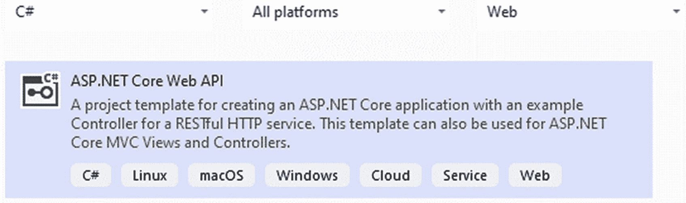

图 4-1

选择项目类型

选择模板后，选择“下一步”按钮。现在，您将配置您的新项目，从名称和文件位置的细节开始。此处显示的项目名称和文件位置只是建议。应用完您选择的名称和文件位置后，选择“下一步”按钮(参见图 [4-2](#Fig2) )。

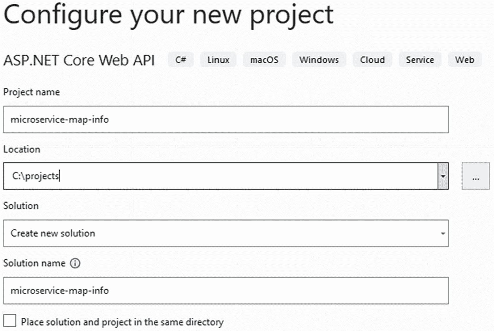

图 4-2

提供项目名称

在附加信息屏幕中，选择。网 6(见图 [4-3](#Fig3) )。对于这个演示，不需要认证。其他选项也不在本演示的范围之内。选择您想要的选项后，选择“创建”按钮。

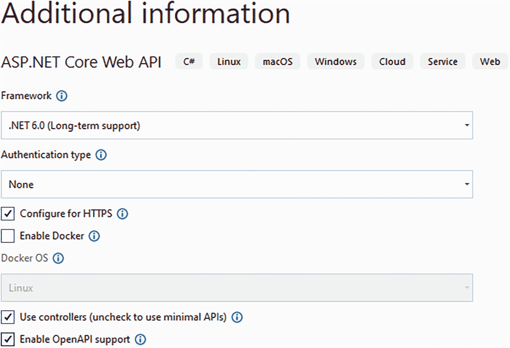

图 4-3

设置附加项目信息

创建项目后，您将看到从模板创建的文件。它创建了一个名为 WeatherForecastController 的控制器和一个名为 WeatherForecastController 的类。您可以按原样构建和运行项目。您将看到示例代码运行，它显示随机天气数据并将数据显示为 JSON。

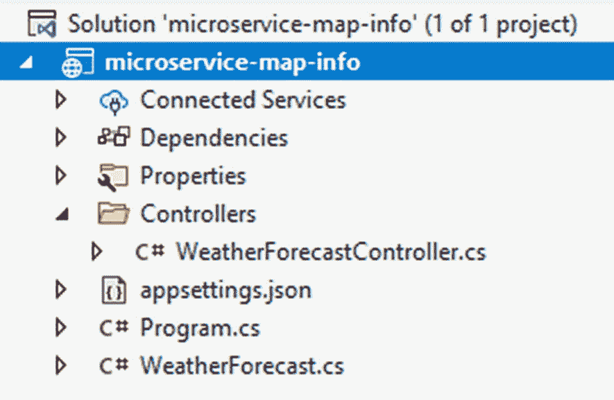

图 4-4

默认天气预报模板

图 [4-4](#Fig4) 显示了使用默认模板创建的文件。英寸 NET 6，你会看到不再有一个启动文件。程序文件已经变成了没有定义类的新样式。这只适用于程序文件。

## 联系谷歌的距离 API

如前所述，调用谷歌的距离 API 不是免费的。如果你愿意，可以用假数据回复。使用假数据至少会让你开始运作，直到你有能力为提供所需信息的服务付费。

在调用 Google 的 Distance API 之前，你必须先注册并把几件事情处理好。从前往 [`https://developers.google.com/maps/documentation/distance-matrix/start`](https://developers.google.com/maps/documentation/distance-matrix/start) 开始。您将需要一个谷歌帐户来获得一个 API 密钥。要获取 API 密钥，请按照 [`https://developers.google.com/maps/documentation/distance-matrix/get-api-key`](https://developers.google.com/maps/documentation/distance-matrix/get-api-key) 处的说明进行操作。

### 应用设置

一旦有了 API 键，就需要将它存储在主项目的 appSettings.json 文件中。在项目“microservice-map-info”中，打开文件 appSettings.json 并添加此块。

Note

最好不要在配置文件中存储任何秘密或 API 密钥。意外地将机密部署到生产中是非常容易的。相反，可以考虑使用秘密管理器工具( [`https://docs.microsoft.com/en-us/aspnet/core/security/app-secrets`](https://docs.microsoft.com/en-us/aspnet/core/security/app-secrets) )。

```cs
"googleDistanceApi": {
  "apiKey": "Enter your API Key here",
  "apiUrl": "https://maps.googleapis.com/maps/api/distancematrix/json?"
}

```

结果将如下所示:

```cs
{
  "Logging": {
    "LogLevel": {
      "Default": "Information",
      "Microsoft": "Warning",
      "Microsoft.Hosting.Lifetime": "Information"
    }
  },
  "AllowedHosts": "*",
  "googleDistanceApi": {
    "apiKey": "Enter your API Key here",
    "apiUrl": "https://maps.googleapis.com/maps/api/distancematrix/json?"
  }
}

```

### 新类库

现在，我们将创建一个新的类库项目，该项目将包含用于联系 Google 的距离信息的代码。将这些代码放在单独的类库中，可以让您选择在以后与另一个提供者交换这些功能。

右击该解决方案，然后选择“添加➤新项目”。您可能需要更改过滤器选择来查找类库。选择类库的项目类型，然后选择“下一步”按钮(参见图 [4-5](#Fig5) )。

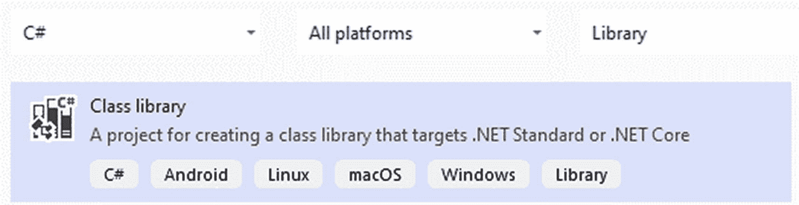

图 4-5

创建新的类库

在这个屏幕上，如图 [4-6](#Fig6) 所示，给你的新类库项目命名为“GoogleMapInfo”另外，为项目文件选择一个文件夹。

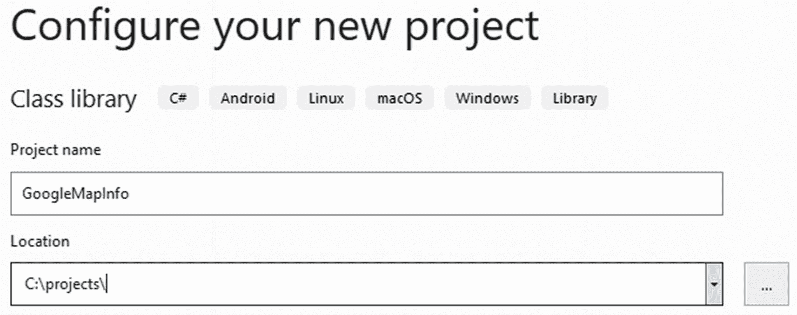

图 4-6

提供项目名称和文件夹位置

选择“下一步”按钮，您将看到添加附加信息的下一个屏幕(参见图 [4-7](#Fig7) )。选择。NET 6 选项，然后选择“创建”按钮。

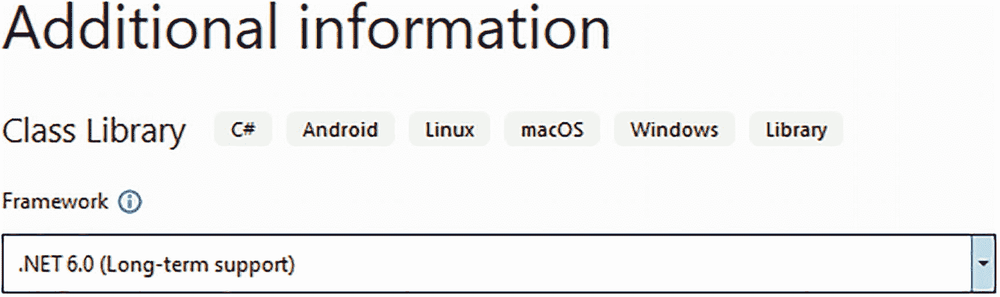

图 4-7

附加类库项目信息

创建这个新的类库后，您将创建一个名为“GoogleDistanceApi”的类输入以下代码:

```cs
public class GoogleDistanceApi
{
  private readonly IConfiguration _configuration;

  public GoogleDistanceApi(IConfiguration configuration)
  {
    _configuration = configuration;
  }

  public async Task<GoogleDistanceData>
     GetMapDistance(string originCity, string destinationCity)
  {
    var apiKey = _configuration["googleDistanceApi:apiKey"];
    var googleDistanceApiUrl = _configuration["googleDistanceApi:apiUrl"];
    googleDistanceApiUrl += $"units=imperial&origins={originCity}&destinations={destinationCity}&key={apiKey}";

    using var client = new HttpClient();
    var request = new
        HttpRequestMessage(HttpMethod.Get, new Uri(googleDistanceApiUrl));

    var response = await client.SendAsync(request);
    response.EnsureSuccessStatusCode();

    await using var data = await response.Content.ReadAsStreamAsync();
    var distanceInfo = await
        JsonSerializer.DeserializeAsync<GoogleDistanceData>(data);

    return distanceInfo;
  }
}

```

对 Google 的 Distance API 的调用返回 JSON 格式的数据，您可以将其反序列化为一种类型。创建一个名为“GoogleDistanceData”的新类文件，并输入以下代码:

```cs
public class GoogleDistanceData
{
  public string[] destination_addresses { get; set; }
  public string[] origin_addresses { get; set; }
  public Row[] rows { get; set; }
  public string status { get; set; }
}

public class Row
{
  public Element[] elements { get; set; }
}

public class Element
{
  public Distance distance { get; set; }
  public Duration duration { get; set; }
  public string status { get; set; }
}

public class Distance
{
  public string text { get; set; }
  public int value { get; set; }
}

public class Duration
{
  public string text { get; set; }
  public int value { get; set; }
}

```

有了调用 Google 的距离 API 的代码，现在您将通过主项目引用这个新项目。在主项目“microservice-map-info”上，右键单击并选择“添加➤项目引用”。您将看到列出您可以参考的项目的屏幕(参见图 [4-8](#Fig8) )。选择您刚刚创建的项目，然后选择“OK”按钮。

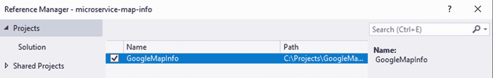

图 4-8

设置项目引用

## 地图信息控制器

为了让微服务接受对距离信息的调用，您需要创建一个控制器来处理请求。在主项目中，找到控制器文件夹并右键单击它。选择添加➤控制器。当出现如图 [4-9](#Fig9) 的画面时，选择“API 控制器-空”,然后选择“添加”按钮。

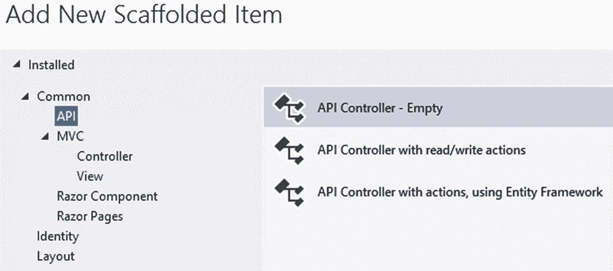

图 4-9

创建新的空 API 控制器

一旦下一个屏幕出现，选择“API 控制器-空”并应用名称“MapInfoController.cs”(见图 [4-10](#Fig10) )。然后，选择“添加”按钮。

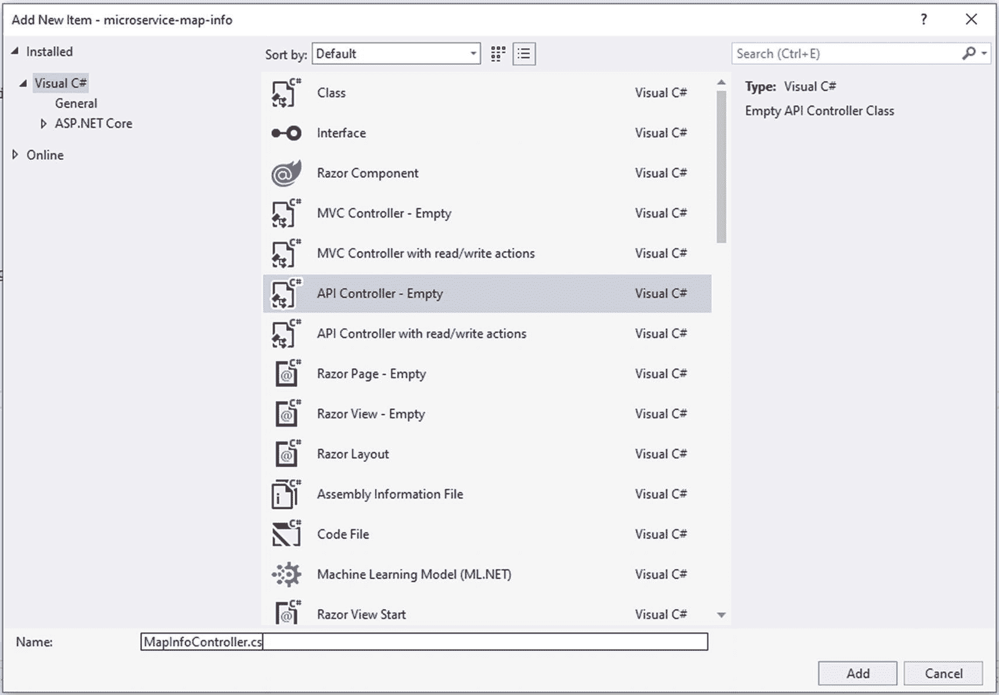

图 4-10

为新的 API 控制器提供名称

在新的 MapInfoController 中，修改该类，如下所示:

```cs
[Route("[controller]")]
[Route("[controller]/[action]")]
[ApiController]
public class MapInfoController : ControllerBase
{
  private readonly GoogleDistanceApi _googleDistanceApi;

  public MapInfoController(GoogleDistanceApi googleDistanceApi)
  {
    _googleDistanceApi = googleDistanceApi;
  }

  [HttpGet]
  public async Task<GoogleDistanceData> GetDistance(string originCity,
  string destinationCity)
  {
    return await _googleDistanceApi.GetMapDistance(originCity, destinationCity);
  }
}

```

我们需要配置 ASP.NET Core 来知道如何实例化 MapInfoController 以备使用。在 Startup.cs 文件中，您需要添加几行。在 ConfigureServices 方法中，在添加控制器的那一行上面添加一行。这个新代码行用内置的控制反转(IoC)系统注册了 GoogleDistanceApi 类。当 MapInfoController 类被实例化时，IoC 容器提供一个 GoogleDistanceApi 的实例，并将其交给 MapInfoController 的构造函数。

```cs
public void ConfigureServices(IServiceCollection services)
{
  services.AddTransient<GoogleDistanceApi>();
  services.AddControllers();
}

```

### 测试我们所拥有的

随着项目的进行，您应该能够构建和运行代码了。但是，您将如何验证它正在工作呢？有几种方法可以做到这一点。首先，简单地运行应用。几秒钟后，一个浏览器将打开，显示该应用的默认页面。您会注意到，它显示的是执行天气预报代码的结果，而不是从 Google 获得的距离数据。意外的结果是由位于 Properties 文件夹中的 launchSettings.json 文件中的设置造成的。您的文件内容将类似于下面的列表，但不必完全相同:

```cs
{
  "$schema": "http://json.schemastore.org/launchsettings.json",
  "iisSettings": {
    "windowsAuthentication": false,
    "anonymousAuthentication": true,
    "iisExpress": {
      "applicationUrl": "http://localhost:60285",
      "sslPort": 44358
    }
  },
  "profiles": {
    "IIS Express": {
      "commandName": "IISExpress",
      "launchBrowser": true,
      "launchUrl": "weatherforecast",
      "environmentVariables": {
        "ASPNETCORE_ENVIRONMENT": "Development"
      }
    },
    "microservice_map_info": {
      "commandName": "Project",
      "launchBrowser": true,
      "launchUrl": " weatherforecast ",
      "applicationUrl": "https://localhost:6001;http://localhost:6000",
      "environmentVariables": {
        "ASPNETCORE_ENVIRONMENT": "Development"
      }
    }
  }
}

```

请注意，有两个主要部分，“IIS Express”和“microservices_map_info”这些条目显示在 Visual Studio 中，是您可以运行应用的环境。顶部栏通常显示您可以选择的环境列表(见图 [4-11](#Fig11) )。


图 4-11

默认 Visual Studio 启动环境

当您选择 IIS Express 右侧的小箭头时，您会看到如图 [4-12](#Fig12) 所示的下拉选项列表。

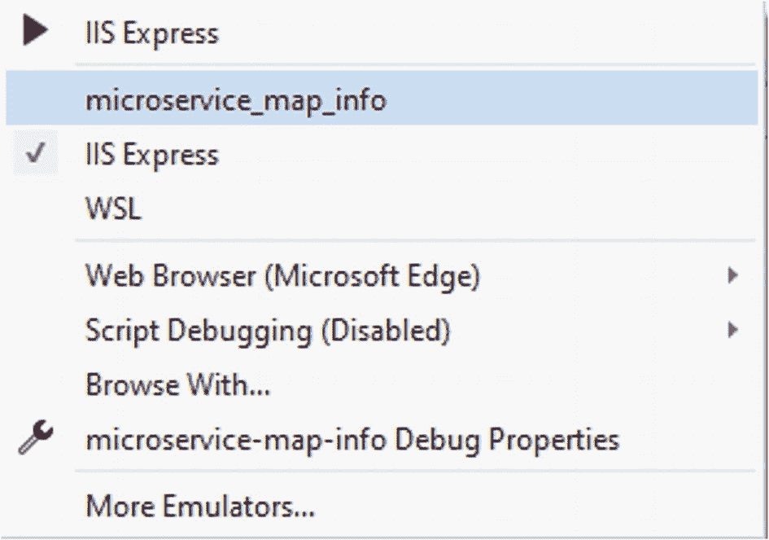

图 4-12

选择新的启动环境

在 launchSettings.json 文件中，注意每个部分都有一个键“launchUrl”和值“weatherforecast”。这就是为什么当您运行应用时，天气预报是默认页面。应用使用“applicationUrl”的值，并连接来自“launchUrl”的值。这允许使用 HTTP URL 和 HTTPS URL。现在将“launchUrl”的值更改为“mapinfo”该名称是默认情况下使用的控制器的名称。它不需要“控制器”这个词，因为 ASP.NET Core 使用“约定优于配置”的方法来通过名称识别控制器。现在，在环境列表中，选择“microservice_map_info”选项，并再次运行应用。这一次它将调用“MapInfoController”类。

打开浏览器显示您的页面，将查询字符串更改为如下所示:

**https://localhost:5001/mapinfo/get distance？原产地=达拉斯，Tx &目的地城市% 20 洛杉矶，CA**

执行返回结果:

```cs
{
  "destination_addresses": [
    "Los Angeles, CA, USA"
  ],
  "origin_addresses": [
    "Dallas, TX, USA"
  ],
  "rows": [
    {
      "elements": [
        {
          "distance": {
            "text": "2,311 km",
            "value": 2310980
          },
          "duration": {
            "text": "20 hours 52 mins",
            "value": 75108
          },
          "status": "OK"
        }
      ]
    }
  ],
  "status": "OK"
}

```

此时，可以删除文件“WeatherForecastController.cs”和文件“weatherforecastcontroller . cs”

### 时髦的

测试应用的另一种方法是使用一个叫做 Swagger 的工具。Swagger ( [`https://swagger.io`](https://swagger.io) )是 OpenAPI Spec 为开发 API 提供的免费工具。添加 Swagger 使用起来非常简单，它将显示调用应用可以调用的所有公开的方法。

使用软件包管理器控制台:

**工具** ➤ **获取包经理** ➤ **包经理控制台**

将默认项目设置为“微服务-地图-信息”(见图 [4-13](#Fig13) )。


图 4-13

为 NuGet 选择默认项目

现在运行这个命令:

```cs
Install-Package Swashbuckle.AspNetCore

```

打开 Startup.cs 文件，修改 ConfigureServices 和 Configure 方法，如下所示:

```cs
public void ConfigureServices(IServiceCollection services)
{
  services.AddTransient<GoogleDistanceApi>();
  services.AddControllers();

  services.AddSwaggerGen(c =>
  {
   c.SwaggerDoc("v1", new OpenApiInfo { Title = "My map API", Version = "v1" });
  });
}

// This method gets called by the runtime. Use this method to configure the HTTP request pipeline.

public void Configure(IApplicationBuilder app, IWebHostEnvironment env)
{
  if (env.IsDevelopment())
  {
    app.UseDeveloperExceptionPage();
  }

  app.UseSwagger();

  app.UseSwaggerUI(c =>
  {
    c.SwaggerEndpoint("/swagger/v1/swagger.json",
        "My microservice for map information.");
  });

  app.UseHttpsRedirection();

  app.UseRouting();

  app.UseAuthorization();

  app.UseEndpoints(endpoints =>
  {
    endpoints.MapControllers();
  });
}

```

现在，当您运行应用时，您可以在浏览器中访问这个 URL:`https://localhost:5001/swagger/index.html`。

您将看到一个显示多种可用操作方法的页面。在这个应用中，有两种方式调用我们的单个动作方法“GetDistance”一种方法是不指定操作方法名。另一个是在指定操作方法时形成。现在，选择其中一种方法，然后选择“尝试”按钮。该页面显示了两个参数“originCity”和“destinationCity”输入“德克萨斯州达拉斯”作为出发地，输入“加利福尼亚州洛杉矶”作为目的地。选择按钮“执行”该页面将调用您的应用，然后显示结果。

在开发微服务时，使用 Swagger 是测试微服务的好方法。当您修改 monolith 来调用微服务时，它还可以帮助您查看 HTTP 调用的结构。

## 利用 gRPC

之前和微服务的沟通方式是用 REST 和 JSON。现在，您可以利用二进制传输机制来加快通信速度。使用 gRPC，根据发送的数据类型，通信可能会更快。将类的实例转换成消息需要一些时间。对于小而简单的消息负载，使用 JSON 可能更好。然而，一旦消息有效负载的大小超过极小值，转换为二进制的时间就会很快得到调整。由于二进制通信的高性能特性，gRPC 被用于大型消息负载甚至流。gRPC 也是平台不可知的，所以它可以在任何可以使用 HTTP/2 的平台上运行。

gRPC 将 HTTP/2 用于接口定义语言(IDL)的传输和协议缓冲区。使用 JSON，将一个类的实例转换成文本流依赖于许多规则并使用反射。由于 gRPC 是数据的二进制表示，转换工作并不简单。开发人员甚至必须在简单的数据类型上使用定制。在本节中，您将修改微服务以利用 gRPC 来了解如何减少网络调用的延迟。

gRPC 使用 IDL 定义文件或“契约”来定义消息数据，并且必须在发送方和接收方共享。“原型”文件的一个简单例子是

```cs
syntax = "proto3";

service SubscribeToEvent {
  rpc Subscribe (EventSubscription) returns (Subscribed)
}

message EventSubscription {
  int32 eventId = 123;
  string name = foo;
}

message Subscribed {
  string message = bar;
}

```

在本例中，服务“SubscribeToEvent”是用方法“Subscribe”定义的。“Subscribe”方法接受一个参数类型“EventSubscription”，它返回“Subscribed”类型。

### 合并 gRPC

随着 Visual Studio 向我们的微服务开放，您将添加新的文件夹和文件，并修改项目文件。

1.  右键单击“微服务-地图-信息”项目，然后选择添加➤新文件夹。将文件夹命名为“Protos”

2.  从名为 Services 的项目中创建另一个文件夹。

3.  右键单击 Protos 文件夹并选择添加➤新项目。在菜单中，选择“协议缓冲文件”将其命名为“distance.proto”

4.  在文件“distance.proto”中，放入以下内容:

```cs
syntax = "proto3";

option csharp_namespace = "microservice_map_info.Protos";

package distance;

service DistanceInfo {
  rpc GetDistance (Cities) returns (DistanceData);
}

message Cities {
  string originCity = 1;
  string destinationCity = 2;
}

message DistanceData {
  string miles = 1;
}

```

现在创建服务文件。在服务文件夹中，右键单击并选择添加➤类。将其命名为 DistanceInfoService.cs，并将模板代码替换为:

```cs
public class DistanceInfoService : DistanceInfo.DistanceInfoBase
{
  private readonly ILogger<DistanceInfoService> _logger;
  private readonly GoogleDistanceApi _googleDistanceApi;

  public DistanceInfoService(ILogger<DistanceInfoService> logger, GoogleDistanceApi googleDistanceApi)
  {
    _logger = logger;
    _googleDistanceApi = googleDistanceApi;
  }

  public override async Task<DistanceData> GetDistance(Cities cities, ServerCallContext context)
  {
    var totalMiles = "0";

    var distanceData = await _googleDistanceApi.GetMapDistance(cities.OriginCity, cities.DestinationCity);

    foreach (var distanceDataRow in distanceData.rows)
    {
      foreach (var element in distanceDataRow.elements)
      {
        totalMiles = element.distance.text;
      }
    }

    return new DistanceData { Miles = totalMiles};
  }
}

```

如果您看到错误并且它还没有编译，请不要惊讶。再经过几个步骤，解决方案就可以编译了。gRPC 包将在后台为您创建的原型文件构建代码。现在，只需保存文件。

#### NuGet 包

您需要安装 gRPC NuGet 包来使用它生成的原型文件和代码。通过转到工具➤获取软件包管理器➤软件包管理器控制台打开软件包管理器控制台。在提示符下，键入

```cs
Install-Package Grpc.AspNetCore

```

#### 项目文件

通过左键单击项目来修改项目文件。它将在编辑器中打开文件。修改项目文件以包含以下内容:

```cs
<ItemGroup>
  <Protobuf Include="Protos\distance.proto" GrpcServices="Server" />
</ItemGroup>

<ItemGroup>
  <Folder Include="Protos\" />
</ItemGroup>

```

#### 启动修改

要调用 gRPC 服务，您需要在 ConfigureService 和 Configure 方法中添加几行代码。您的启动文件应该如下所示:

```cs
public class Startup
{
  public Startup(IConfiguration configuration)
  {
    Configuration = configuration;
  }

  public IConfiguration Configuration { get; }

// This method gets called by the runtime. Use this method to add services to the container.
  public void ConfigureServices(IServiceCollection services)
  {
    services.AddTransient<GoogleDistanceApi>();
    services.AddControllers();
    services.AddGrpc();
    services.AddSwaggerGen(c =>
    {
      c.SwaggerDoc("v1",
          new OpenApiInfo { Title = "My map API", Version = "v1" });
    });
  }

// This method gets called by the runtime. Use this method to configure the HTTP request pipeline.
  public void Configure(IApplicationBuilder app, IWebHostEnvironment env)
  {
    if (env.IsDevelopment())
    {
      app.UseDeveloperExceptionPage();
    }

    app.UseSwagger();
    app.UseSwaggerUI(c =>
    {
      c.SwaggerEndpoint("/swagger/v1/swagger.json",
      "My microservice for map information.");
    });

    app.UseHttpsRedirection();
    app.UseRouting();
    app.UseAuthorization();

    app.UseEndpoints(endpoints =>

    {
      endpoints.MapGrpcService<DistanceInfoService>(); //new
      endpoints.MapControllers();
    });
  }
}

```

现在 gRPC 已经被引入这个项目，一个限制出现了。gRPC 不能与 IIS 一起运行。因此，您必须使用 Kestrel <sup>[2](#Fn2)</sup> 而不是 IIS 在生产中调试和运行。要在 Visual Studio 中切换到 Kestrel，找到运行项目的选择框，如图 [4-14](#Fig14) 所示。然后，按名称选择“微服务 _ 地图 _ 信息”。

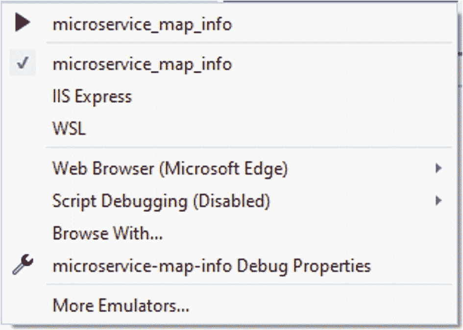

图 4-14

选择启动环境

### 测试 gRPC 端点

到目前为止，您可以测试到 REST API 的连接，但是如何测试 gRPC 服务端点呢？您可以使用简单的控制台应用进行测试。使用 Visual Studio 的新实例，创建新的控制台应用。图 [4-15](#Fig15) 显示了要选择的项目类型。

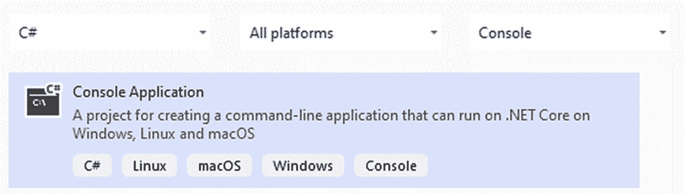

图 4-15

选择控制台应用类型

选择“下一步”按钮。现在提供一个项目名称和位置。参见图 [4-16](#Fig16) 。

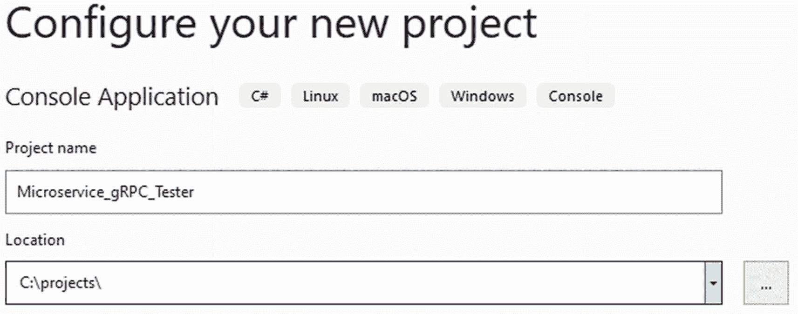

图 4-16

提供项目名称和文件夹位置

选择“下一步”按钮。现在，添加附加信息的屏幕出现(参见图 [4-17](#Fig17) )。选择。NET 6(如果尚未选择)。

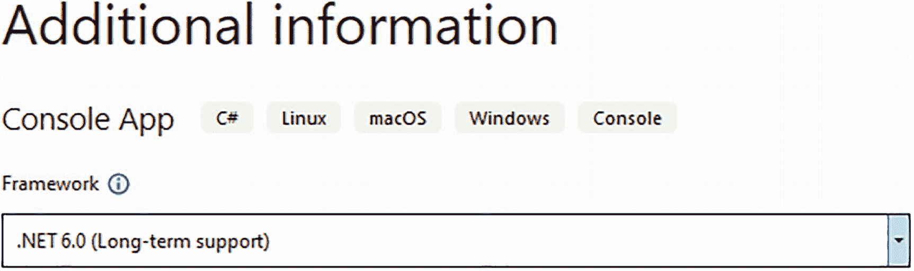

图 4-17

附加项目信息

创建项目后，您需要创建一个服务引用。与添加项目引用非常相似，这将基于前面创建的 proto 文件添加一个引用。右键单击项目并选择“添加➤连接服务”当下一个窗口出现时，找到“服务参考(OpenAPI，gRPC，WCF Web 服务)”部分并选择加号。

选择“gRPC”，如图 [4-18](#Fig18) 所示，并点击“下一步”按钮。

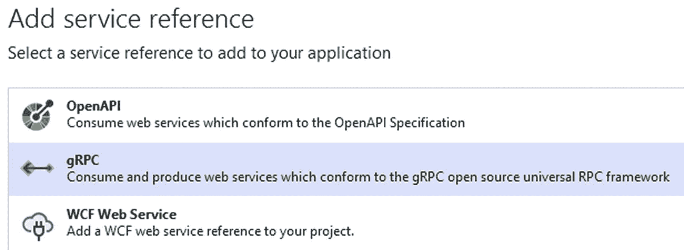

图 4-18

为 gRPC 选择服务参考类型

服务引用基于原型文件。在该屏幕上，如图 [4-19](#Fig19) 所示，遍历到您创建微服务和 distance.proto 文件的文件夹。完成后，选择“完成”按钮

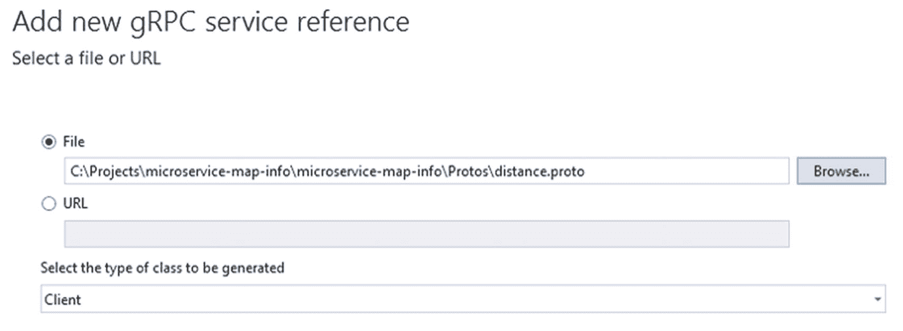

图 4-19

添加新的 gRPC 服务参考

现在编写一些客户端代码来联系 gRPC 端点。打开 Program.cs 文件，将 Main 方法替换为:

```cs
static async Task Main(string[] args)
{
  var channel = GrpcChannel.ForAddress(new Uri("https://localhost:5001"));
  var client = new DistanceInfo.DistanceInfoClient(channel);
  var response = await
       client.GetDistanceAsync(new Cities
       { OriginCity = "Topeka,KS", DestinationCity = "Los Angeles,CA" });

  Console.WriteLine(response.Miles);

  Console.ReadKey();
}

```

您还必须更新 using 语句。然而，这是一个有趣的部分。客户端代码如何知道该代码的数据类型和名称空间？当您创建服务引用并选择 distance.proto 文件时，会根据内容生成代码。

至此，您可以构建我们新的 gRPC 端点测试器了。但是在运行它之前，您需要注意一个细节。注意，URL 被设置为 https://localhost:5001。该路径需要与微服务的路径相匹配。在微服务项目中，在 launchSettings.json 文件中，您会看到当运行 Kestrel 时，对于 HTTPS，URL 是 https://localhost:5001。由于这两个 URL 匹配，我们很适合测试。现在，启动微服务。运行之后，启动控制台应用。使用堪萨斯州托皮卡和加利福尼亚州洛杉矶的测试数据，您应该看到返回值“1，555 mi”

我们的微服务现在可以接受使用 JSON 的基于 REST 的请求以及使用 binary 的基于 gRPC 的请求。您必须判断什么时候使用 REST，什么时候使用 gRPC，因为这很大程度上取决于您的架构设计中所需的消息有效负载的大小。您将根据有效负载大小做出运行时决策。相反，您的体系结构设计，由您的业务需求控制，有助于形成一种传输方法对另一种传输方法的使用。

## 修改整块石头

现在，微服务已经工作并准备好被调用，让我们修改 monolith 来使用它。该部分将修改 monolith 来调用微服务以检索两个城市之间的距离。

在服务文件夹中，右键单击并选择添加➤类。提供名称 DistanceInfoSvc 并选择 Add 按钮。现在用下面的代码替换模板代码:

```cs
public interface IDistanceInfoSvc
{
  Task<(int, string)> GetDistanceAsync(string originCity,
     string destinationCity);
}

public class DistanceInfoSvc : IDistanceInfoSvc
{
  private readonly IHttpClientFactory _httpClientFactory;

  public DistanceInfoSvc(IHttpClientFactory httpClientFactory)
  {
    _httpClientFactory = httpClientFactory;
  }

  /// <summary>
  /// Call the microservice to retrieve distance between two cities.
  /// </summary>
  /// <param name="originCity"></param>
  /// <param name="destinationCity"></param>
  /// <returns>Tuple for distance and the distance type.</returns>
  public async Task<(int, string)> GetDistanceAsync(string originCity, string destinationCity)
  {
    var httpClient = _httpClientFactory.CreateClient("DistanceMicroservice");

    var microserviceUrl = $"?originCity={originCity}&destinationCity={destinationCity}";

    var responseStream = await httpClient.GetStreamAsync(microserviceUrl);

    var distanceData = await JsonSerializer.DeserializeAsync<MapDistanceInfo>(responseStream);

    var distance = 0;
    var distanceType = "";

    foreach (var row in distanceData.rows)
    {
      foreach (var rowElement in row.elements)
      {
        if (int.TryParse(CleanDistanceInfo(rowElement.distance.text), out var distanceConverted))
        {
          distance += distanceConverted;
          if (rowElement.distance.text.EndsWith("mi"))
          {
            distanceType = "miles";
          }

          if (rowElement.distance.text.EndsWith("km"))
          {
            distanceType = "kilometers";
          }
        }
      }
    }

    return (distance, distanceType);
  }

  private string CleanDistanceInfo(string value)
  {
    return value
           .Replace("mi", "")
           .Replace("km", "")
           .Replace(",", "");
  }

    //These classes are based on the data structure
    //returned by Google's Distance API
    public class MapDistanceInfo
    {
        public string[] destination_addresses { get; set; }
        public string[] origin_addresses { get; set; }
        public Row[] rows { get; set; }
        public string status { get; set; }
    }

    public class Row
    {
        public Element[] elements { get; set; }
    }

    public class Element
    {
        public Distance distance { get; set; }
        public Duration duration { get; set; }
        public string status { get; set; }
    }

    public class Distance
    {
        public string text { get; set; }
        public int value { get; set; }
    }

    public class Duration
    {
        public string text { get; set; }
        public int value { get; set; }
    }
}

```

DistanceInfoSvc 类负责调用微服务并反序列化结果。JSON 是返回的距离数据的数据格式。数据反序列化为 MapDistanceInfo 类。您可以通过在剪贴板中捕获 JSON 负载来生成与 Visual Studio 中的 JSON 数据相匹配的类。现在，转到一个开放的领域，并选择编辑➤粘贴特殊➤ JSON 作为类。

现在我们需要修改报价服务来调用 DistanceInfoSvc 来检索报价的距离。在 QuoteSvc 类中，添加以下代码变更。

首先，修改构造函数，注入 DistanceInfoSvc。

```cs
private readonly IDistanceInfoSvc _distanceInfoSvc;

public QuoteSvc(IDistanceInfoSvc distanceInfoSvc)
{
  _distanceInfoSvc = distanceInfoSvc;
}

```

现在修改创建报价的方法，以利用 DistanceInfoSvc 类。

```cs
public async Task<Quote> CreateQuote(string originCity, string destinationCity)
{
  var distanceInfo = await _distanceInfoSvc
      .GetDistanceAsync(originCity, destinationCity);

  // other code here for creating a quote

  var quote = new Quote {Id = 123,
      ExpectedDistance = distanceInfo.Item1,
      ExpectedDistanceType = distanceInfo.Item2};

  return quote;
}

```

更新 appSettings.json 文件以保存微服务的位置。

```cs
"DistanceMicroservice": {
    "Location": "https://localhost:6001/mapinfo"
}

```

我们需要更新 Startup.cs 文件来注册 DistanceInfoSvc 并提供 HttpClient。在 ConfigureServices 方法中，添加以下代码:

```cs
services.AddScoped(typeof(IDistanceInfoSvc), typeof(DistanceInfoSvc));

var distanceMicroserviceUrl =
  Configuration.GetSection("DistanceMicroservice:Location").Value;

services.AddHttpClient("DistanceMicroservice", client =>
{
  client.BaseAddress= new Uri(distanceMicroserviceUrl);
});

```

注册 IDistanceInfoSvc 的代码行将在构造函数中使用的地方注入 DistanceInfoSvc 的实例。在这种情况下，当实例化 QuoteSvc 类时，会注入 DistanceInfoSvc 的一个实例。下一节获取微服务的 URL，并将其提供给 HttpClient 基址。使用 AddHttpClient 方法可以检索 HttpClient 的实例。这样做的主要好处是，每次调用微服务时不会生成另一个 HttpClient 实例。

## 服务发现

到目前为止，调用者(在我们的例子中是 monolith)需要知道微服务实例所在的 IP 地址。即使只有一个微服务实例，调用者也不应该拥有该 IP，因为另一个实例可以用新的 IP 地址替换该微服务。然而，在生产中不应该只有一个微服务实例。您可能有一个微服务，但有多个实例来实现高可用性。每个微服务实例都有一个 IP 地址。调用者(在我们的例子中是 monolith)应该知道每个微服务实例的 IP 地址吗？如果一个实例死亡或另一个被创建，你将如何更新整块？

微服务的呼叫者不应该有责任知道微服务的每个实例。这创造了一个紧密耦合的架构。相反，调用者应该只知道一个 IP 地址，它是一个负载平衡器。使用负载平衡器，您可以在调用者和微服务实例之间分离关注点。

负载平衡器了解多个微服务实例的能力就是服务发现。为此，有许多产品可用，如 Apache 的 ZooKeeper、HashiCorp 的 Consul、网飞的 Eureka，甚至 Nginx。

## 摘要

我们讨论了调用微服务的进程间通信方法。具体来说，在本章中，我们讨论了 RPC 通信风格。我们还讨论了首先设计 API 的必要性，以便更好地理解如何调用微服务和有效负载结构。然后我们讨论了传输机制以及 REST 和 gRPC 的细节。然后，我们构建了第一个利用谷歌距离 API 的微服务。然后，我们将调用 Google 的远程 API 的能力与 Web API 前端控制器结合起来。然后，我们修改了微服务，以利用 gRPC 实现二进制负载。接下来，我们修改了 monolith 来调用微服务。最后，我们注意到服务发现是该架构的一个额外部分，用于防止硬编码 IP 地址和处理多个微服务实例。

<aside aria-label="Footnotes" class="FootnoteSection" epub:type="footnotes">Footnotes [1](#Fn1_source)

MassTransit 是一个开源库。NET 应用使用消息样式通信。更多信息请访问 [`https://masstransit-project.com`](https://masstransit-project.com) 。

  [2](#Fn2_source)

Kestrel 是 ASP.NET Core 应用的跨平台 web 服务器。更多信息，请访问 [`https://docs.microsoft.com/en-us/aspnet/core/fundamentals/servers/kestrel?view=aspnetcore-6.0`](https://docs.microsoft.com/en-us/aspnet/core/fundamentals/servers/kestrel%253Fview%253Daspnetcore-6.0) 。

 </aside>