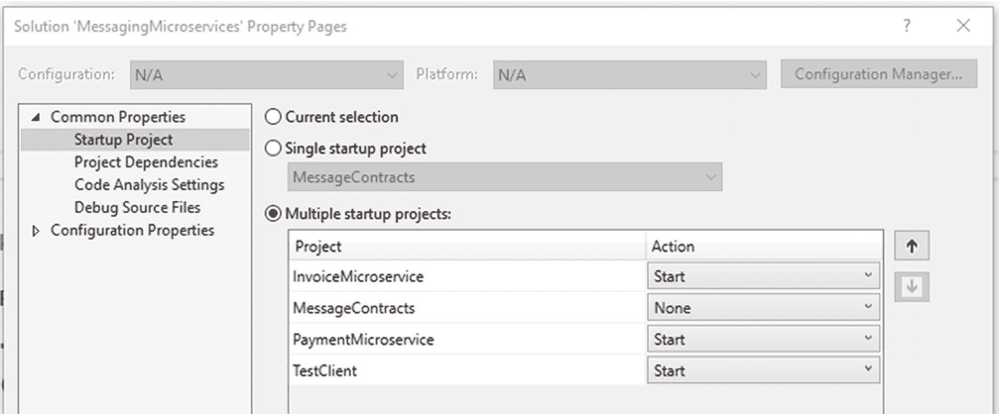

# 五、微服务消息传递

到目前为止，您已经学习了如何使用 RPC 通信创建微服务。您还了解了需要请求和响应的同步通信。在本章中，您将使用消息传递的异步通信方法创建两个微服务，以满足与发票管理相关的一些业务需求。

## 同步通信的问题

在我们深入消息通信之前，让我们首先理解为什么消息通信是一个可行的选择。想象一下这个场景；你是儿童运动队的教练。出现了导致游戏重新安排的问题。你开始列出一个名单，然后一个一个地给他们打电话。你打电话给其他教练，加上裁判和家长。

现在想象一下，给监管小卖部的父母之一打电话。然后，这位家长打电话给小卖部的老板，发现他们不能参加预定的日期。你打电话给父母，父母打电话给主人。通信链中的每一步都有传递延迟。这种传递性延迟对你来说是个问题，因为你从来没有打算花这么多时间试图与他人交流。

你和其他教练还有其他问题。要联系的人的名单各不相同。它们也因目的而异。仅仅因为联系了教练并不意味着也必须联系所有的家长。也不知道谁有正确的联系信息列表。

这种直接沟通效率极低。它允许各种各样的交流问题。如果没有人被通知排班改变会发生什么？如果传播链涉及到其他下游环节会怎样？如果没有通知他们呢？这考虑到了级联故障。

这种联系他人的方式对你和其他教练来说是一种巨大的消耗。你同意做教练来帮助孩子们，而不是担心沟通问题。每个电话都有可能不被接听，信息无法被发送和理解。此外，每个呼叫都占用教练的时间，因为它们是同步的。每个打电话的人必须等待有人回答，收到信息，并确认接下来需要做什么。

## RPC 的限制

前面的真实场景是 RPC 通信的一个例子。你和教练的每个电话都需要等待回复。这就说明了 RPC 用微服务的最大弊端；进程必须等待响应，即同步通信。

这种类型的通信的另一个问题是处理同时呼叫的数量。例如，如果微服务无法处理更多的来电，呼叫者将会看到严重的延迟或根本没有联系。这迫使呼叫者使用重试策略或断路器模式。

水平扩展微服务需要一个负载平衡器。负载平衡器还必须具有不增加任何延迟的性能。仅仅因为微服务的另一个实例存在，并不意味着它会立即在负载平衡器中注册。因此，需要在负载平衡器中注册微服务实例。

然后是向业务流程添加其他微服务的另一个问题。如果调用者只知道一个微服务，那么它必须被改变以知道其他微服务。这意味着每个调用者需要修改更多的代码，而且必须知道其他调用者。如何处理版本控制？为了适应不同的版本，还需要做更多的代码修改。

## 信息发送

在你作为教练的情况下，如果有一种方法可以将信息广播一次，会怎么样？也许群发短信或电子邮件就足够了。然后每个人都独立地接收到那个信息，每个接收者都相应地做出反应。这就是信息传递的目的。

在微服务架构中使用消息传递允许独立的部分在不知道彼此位置的情况下进行通信。在前面的场景中，每个教练都必须有一个其他教练的列表以及如何联系他们。此外，他们每个人都需要知道如何联系到父母和游戏中的其他人。

消息解决了前面的例子中发现的许多问题。如果教练有一个信息系统，联系一些人或每个人会更容易。此外，添加、删除和更新联系信息会更简单。那么，消息传递在架构中处于什么位置呢？

## 体系结构

通过消息传递，对微服务的思考方式发生了转变。您可以使用简单的消息架构以断开连接的方式访问微服务。此外，通过微服务使用消息传递支持动态和反应式架构。借助事件驱动的架构，微服务对作为事件响应而发送的消息做出反应。也许用户已经承诺创建一个订单。或者某个项目的库存发生了变化。

### 使用消息传递的原因

使用消息传递通信风格而不是 RPC 风格有多种原因。原因包括

*   松散耦合

*   减轻

*   缩放比例

*   独立处理

#### 松散耦合

通过使用消息传递，发送方和微服务(消息消费者)是松散耦合的。消息的发送者不需要知道关于接收消息的微服务的任何事情。这意味着微服务不需要知道别人的端点。它允许微服务的交换和扩展，而无需任何代码更改。

这为微服务提供了自主权。有了自治，微服务可以独立发展。这使得微服务只能在适合完成业务流程的地方绑定在一起，而不是在网络层。

#### 减轻

使用微服务架构，可能会出现停机或间歇性网络连接问题。消息代理利用队列来提供消息缓冲。出现问题时，无法传递的消息会被存储起来。一旦消费者再次可用，消息就被传递。这种缓冲也保留了顺序。消息按照发送的顺序发送。维护消息顺序被称为先进先出(FIFO)。

#### 缩放比例

扩展微服务架构的能力至关重要。对于任何生产应用或分布式处理，您将拥有多个微服务实例。这不仅仅是为了高可用性，还允许以更高的吞吐量处理消息。

#### 独立处理

消息传递允许微服务架构解决方案随时间变化。您可以拥有生成订单和管理产品运输的解决方案。稍后，您可以添加其他微服务，通过使它们成为消息消费者来执行额外的业务流程。将微服务作为消费者添加到业务流程的能力允许他们成为独立的信息处理者。

### 消息类型

根据通信的需要，有多种类型的消息。这些消息类型在履行业务流程中的各种职责方面发挥着作用。

#### 询问

考虑联系你最喜欢的商店，看看他们是否有最新的游戏。(假装他们还没有在线销售的网站。)你想快速购买三份，但是商店没有开门。你给他们发一封电子邮件，或者在他们的网站上填写一份信息调查表。这是在异步通信方式中使用查询消息类型。虽然查询可以像打电话一样同步进行，但并不一定要这样做。

当商店开门时，他们回复说他们确实有游戏存货。回复还包括目前有多少库存，以及对其他类似游戏的建议。对查询的回复是文档消息类型。该文件包含所要求的信息和任何支持信息。

#### 命令

您回复确认您想要保护这三个副本，并且您正在去商店的路上。给商店的信息让他们知道他们要为你保留物品是一种命令。命令消息类型指示消费者要做什么，而不明确要求回复。

#### 事件

你到达商店并购买游戏。稍后，您会收到一封关于购买的电子邮件。商店感谢您的购买，并附上了电子收据。该电子邮件是由于他们系统中的一个事件而发送的。为您创建了一个订单，因此，您收到了电子邮件。

当您购买游戏时，系统会将订单通知系统的其他区域。该事件启动了商店系统其他部分的流程。每个独立的进程接收到该事件并作出反应。例如，系统处理付款，从库存中取出物品，并通知运输部门游戏将被发送到哪里。

让多个消费者收听同一事件的架构被称为发布/订阅(Pub/Sub)。事件的发布者发出消息供其他人处理。消费者订阅事件并以不同的方式处理消息。例如，支付处理器消费者对消息的处理方式与库存管理消费者不同。

## 信息发送

对于从发布者到消费者的消息，必须有一个系统来处理消息和路由。该系统向订阅了不同消息的消费者提供消息路由。这些系统有两种类型:代理系统和无代理系统。

### 无经纪人

像 ZeroMQ 这样的无代理系统直接从发布者向消费者发送消息。这要求每个微服务安装无代理引擎。它还要求每个端点知道如何联系其他端点。随着您扩展微服务，管理端点列表很快变得更加困难。

因为没有中央消息系统，所以它比代理系统具有更低的延迟。这也导致了发布者到消费者的时间耦合。这意味着消费者必须是实时的，并准备好处理流量。处理消费者不在的机会的一种方法是使用经销商。当您有多个微服务实例时，分发服务器是一个负载平衡器，用于分担负载。分发服务器还处理消费者不可用的情况，向微服务的另一个实例发送消息。

### 经纪人

像 ActiveMQ、Kafka 和 RabbitMQ 这样的代理系统提供了一组集中的队列来保存消息，直到消息被使用。因为消息被存储然后发送给消费者，所以它提供了一个松散耦合的架构。存储消息直到它们被消费并不是一个高延迟的任务。这仅仅意味着发布者不必存储消息，而是可以依赖代理。

设计代理的使用首先要了解每个应用和微服务的业务需求。这个拓扑将由各种生产者和消费者组成，每个人都有自己的消息传递需求。一些生产者只需要发送消息，而不订阅其他消息。其他生产者将为一个企业发送消息，同时也订阅其他消息。正如您将在代码示例中看到的，我们的测试客户端发送关于发票的命令。它还订阅了发票已创建的消息。这意味着，尽管您可以使用代理，但是应用并不是完全不知道其他应用，因此仍然存在拓扑耦合。

使用代理的一个优点是，如果消息在消费者的处理中失败，该消息将留在队列中，直到它可以再次获得它或者另一个进程准备好处理它。

在本章中，我们将使用 MassTransit 库。它提供了一些抽象，让我们可以快速运行。MassTransit 可以使用 RabbitMQ 等工具来提供我们需要的消息传输。

## 消费模式

有多种接收消息的模式，您将看到有多个消费者。您将使用一个或两个模型。下面描述了两种模型。

### 相互竞争的消费者

各种业务流程需要一条消息只由一个消费者处理。例如，*创建发票*消息应该只处理一次。如果一个消费者的多个实例处理它，重复的信息可以被存储并发送到其他微服务。图 [5-1](#Fig1) 描绘了相互竞争的消费者。


图 5-1

相互竞争的消费者

竞争消费者的一个例子，如图 [5-2](#Fig2) ，是发票微服务。当您创建发票微服务的多个实例时，它们每个都成为竞争的消费者。


图 5-2

将微服务实例作为竞争消费者开具发票

您应该有一个微服务的多个实例，用于扩展、可用性和负载分布。微服务旨在订阅特定的队列和消息类型。但是当有多个微服务实例时，就会有一个竞争的消费者场景。当发送消息时，只有一个微服务实例接收消息。如果拥有该消息的微服务实例未能处理该消息，代理将尝试将其发送到另一个实例进行处理。

### 独立消费者

有时候，其他微服务也必须使用消息。这意味着这些微服务不与其他消费者竞争。无论哪个竞争的消费者处理该消息，他们都会收到该消息的副本。


图 5-3

独立消费者

这些独立的消费者根据他们特定的业务处理需求来处理消息。在前面的示例中，图 [5-3](#Fig3) ，从订单微服务发送一条消息。该消息需要由支付微服务的一个实例和运输微服务的一个实例接收。在这里，支付和运输微服务不是相互竞争的。相反，他们是独立的消费者。另外，请注意，支付微服务的每个实例本身都是一个竞争消费者。对于运输微服务实例也是如此。

拥有独立的消费者允许一个电线抽头模式(见图 [5-4](#Fig4) )。这方面的一个例子是前端组件向订单微服务发送命令来修改订单。在 RabbitMQ 中，您可以将一个交换绑定到另一个交换。这允许将消息的副本发送给另一个使用者，即使交换是使用直接拓扑建立的。


图 5-4

丝锥图案

## 交货保证

当我们评估我们的业务需求并设计消息传递拓扑解决方案时，我们还必须考虑到有时消息要么不能被传递，要么被再次传递。消息传递中断可能会导致数据重复或其他副作用。邮件传递失败的原因有很多。网络故障/中断经常发生，我们必须将它们考虑在内。此外，可能会出现硬件问题、代码错误，甚至超时。经纪人再伟大，也不能解决所有的问题。因此，我们在构建应用时必须考虑这些问题。

当出现问题时，有可能会发送重复的消息，因此我们的消费者必须以幂等的方式处理消息。也就是说，对待每一条消息，都要考虑它之前已经被处理过的可能性。具体如何做取决于消息类型和业务需求。一些消息可能包含时间戳，在处理它们时，只处理时间戳较晚的消息。并且由消费者存储最新的时间戳以比较下一个消息中的时间戳。这也意味着相互竞争的消费者必须有办法让所有实例知道最新的时间戳。

对于我们设计的每种消息类型，都有一些关于消息传递的模式。由于每个消费者可能会使用多种消息类型，所以要考虑如何将这些模式应用于他们的需求。

### 最多一次

这种交付保证是针对当您的系统能够容忍消息未被处理的情况。一个例子是当每秒接收温度读数时。如果代理传递了消息，但使用者未能处理它，则消息不会被重新发送。不管消费者是否能够完成消息的任何处理，代理都认为消息已经交付。

这种交付保证的另一个术语是“一劳永逸”原理是一样的。发布者发送一条消息，而不假设它已被传递或处理。这也提供了最高的性能，因为不需要状态管理。

### 至少一次

“至少一次”交付保证是您将花费最多精力设计消费者以幂等方式处理消息的地方。如果消息未能提供给消费者，则重试该消息。如果消费者收到消息，但在处理过程中失败，代理将把该消息重新发送给另一个消费者实例。

一个示例场景:有一个消费者为一个新订单创建了一个数据库条目，然后这个实例终止了。它没有向代理发送确认消息。因此，代理将该消息发送给另一个消费者实例。在那里，消息被处理，并且无意中创建了一个重复的数据库条目。

尽管大多数代理系统在再次发送消息时都会设置一个标志，但是假设消息是重复的并进行相应的处理会更安全。例如，如果消息是要创建一个订单，则在该客户的另一个订单的数据库中搜索相同的项目。然后，如果订单存在，您就有信心认为之前的尝试在业务操作中取得了成功。

因为微服务架构是分布式计算的一种实现，所以需要考虑的地方很多。这里我们指的是如何处理消息。分布式事务也有很多需要理解的地方，这超出了本书的范围。我强烈推荐一本书，由 Apress 出版的迈克尔·佩里的《永恒建筑的艺术》。在 Perry 的书中，有一个关于幂等性和交换性的特定章节适用于处理消息。

### 一次也只有一次

这种交付保证的另一个名称是“恰好一次”，这是最难完成的。许多人认为它不存在。当您需要消息只被处理一次时，您如何知道它只被处理了一次呢？您如何知道消息不是重复的？本质上，您如何知道预期状态尚未成功？

这里的要点是，保证消息只被传递和处理一次需要涉及消费者和代理系统的状态管理。这种状态管理的增加可能比设计其他交付保证要麻烦得多。

## 消息排序

如果整个消息系统是单线程的，那么就可以保证消息的顺序。然而，这将是一个效率极低的系统，很快就会被抛弃。相反，我们使用尽可能高效地处理消息的消息传递系统。但是这使得开发人员有责任构建一个能够容忍接收乱序消息的架构。

一个示例场景是向订单微服务发送消息以创建新订单。向同一微服务的不同实例发送另一条消息，其中包含对订单的更新。在处理第一条消息的过程中，出现了一个错误，并且该消息没有被确认。然后，代理将该消息发送到下一个可用的微服务实例。同时，正在处理订单更新的消息。微服务代码必须决定如何更新尚不存在的订单。

一个建议是微服务的每个实例共享同一个数据存储。然后，无序接收的消息可以临时存储，然后在处理订单的创建消息时重新组装。当然，要成功做到这一点还有很多事情要做。谢天谢地，有一个更简单的方法。

在《不可变架构的艺术》一书中，Perry 指出操作在这里应该是可交换的。这意味着，如果消息没有以正确的顺序到达，结果应该与它们以正确的顺序到达的结果相同。那么，我们的代码应该如何处理信息交换呢？

我们不能强制消息的顺序，但是我们可以设计处理无序的消息。在我们的场景中，带有订单更新的消息可以包含创建订单的消息中的所有信息。由于订单尚未创建，因此没有订单号。因此，发送更新消息时知道它是对尚未创建的订单的更新。在更新消息中包含原始信息允许消费者创建订单并在订单不存在的情况下应用更新。当收到创建订单的消息时，它被忽略，因为它现在已经存在。

## 构建示例

由于我们将在本章中创建的微服务旨在为公司处理发票，因此我们需要了解发票的各种状态。这里列出的都是简单的例子。您应该咨询您的主题专家或领域专家，以了解处理过程中适用的“真实世界”发票状态。

*   新的

*   晚

*   修改

*   有报酬的

*   关闭的

我们将在本章中构建的发票微服务将首先负责创建发票。看起来像是整块石头要负责开发票。但是既然微服务负责持久化数据，那么它就应该拥有这些数据。因此，这个微服务将收到创建发票的请求。该过程的一部分将把它保存到数据库中。

当然，我们将在这里构建的微服务只是处理发票的全功能微服务的一个示例。这种微服务将为您提供一个起点，让您构建更多您认为必要的业务功能。

## 构建消息传递微服务

为了演示微服务消息传递，我们将创建三个项目:一个用于发票微服务。另一个是支付微服务。然后，一个测试客户端将取代一个整体。测试客户端将充当前端服务，为发票微服务提供创建发票的信息。然后发票微服务会发布一条关于新创建发票的消息。支付微服务和测试客户端都将收到发票已创建的消息。对于测试客户端，它确认发票已创建。在真实的场景中，它可以向用户显示发票号。付款微服务是下游微服务的一个快速示例，它对发票的创建做出反应。

Disclaimer

代码示例并不意味着具有生产价值。它们仅仅足以帮助演示概念。

### 跑 rabbitmq

运行 RabbitMQ 时有一些选项。它可以运行在服务器、计算机或 Docker 容器中。如果你想安装 RabbitMQ，请进入 [`https://rabbitmq.com/download.html`](https://rabbitmq.com/download.html) 。在我们的例子中，我们将从 Docker 容器运行 RabbitMQ。需要安装 Docker 桌面。要安装 Docker 桌面，请进入 [`https://docker.com/products/docker-desktop`](https://docker.com/products/docker-desktop) 。

我确实注意到我们将使用大众运输系统来传递信息。我们将在 RabbitMQ 上运行 MassTransit。MassTransit 提供了一个抽象层，使编码更容易。它可以运行在 RabbitMQ、Azure Service Bus、ActiveMQ 等之上。

安装 Docker Desktop 后，在命令提示符下输入

```cs
docker run -p 5672:5672 -p 15672:15672 rabbitmq:3-management

```

如果您希望运行与控制台分离的 RabbitMQ 实例:

```cs
docker run -d -p 5672:5672 -p 15672:15672 rabbitmq:3-management

```

可以去`http://localhost:15672`看看 RabbitMQ 管理网站。RabbitMQ 的默认用户名和密码是*来宾*和*来宾*。

随着 RabbitMQ 的运行，现在我们将创建微服务。我们将从发票微服务开始。

## 第一个项目

对于第一个项目，我们将创建一个类库，其他项目将依赖于它。这个项目将包含成为我们的消息的接口和类。

在 Visual Studio 2022 中，选择创建新项目的选项。然后选择类库选项(见图 [5-5](#Fig5) )。


图 5-6

命名和选择文件位置


图 5-5

新类库

图 [5-6](#Fig6) 显示了项目名称 MessageContracts 的屏幕。提供项目的位置，然后使用 MessagingMicroservices 作为解决方案名称。确保未选中复选框，将解决方案放在与项目相同的目录中。完成后，选择“下一步”按钮。


图 5-7

其他项目选项

如果尚未选择，请选择的框架。网 6(见图 [5-7](#Fig7) )。然后，选择“创建”按钮。创建项目后，将 Class1.cs 文件重命名为 MessageContracts.cs，然后用以下代码替换该文件中的所有代码:

```cs
using System.Collections.Generic;

namespace MessageContracts
{
  public interface IInvoiceCreated
  {
    int InvoiceNumber { get; }
    IInvoiceToCreate InvoiceData { get; }
  }

  public interface IInvoiceToCreate
  {
    int CustomerNumber { get; set; }
    List<InvoiceItems> InvoiceItems { get; set; }
  }

  public class InvoiceItems
  {
    public string Description { get; set; }
    public double Price { get; set; }
    public double ActualMileage { get; set; }
    public double BaseRate { get; set; }
    public bool IsOversized { get; set; }
    public bool IsRefrigerated { get; set; }
    public bool IsHazardousMaterial { get; set; }
  }
}

```

## 构建发票微服务

现在我们将创建第一个微服务。这个微服务是处理发票的。作为一个使用消息传递的微服务的例子，它将接收一个创建发票的命令。一旦创建了新发票，它就会发布一个事件。

右击该解决方案，然后选择“添加➤新项目”。


图 5-8

新控制台应用

选择控制台应用选项，然后选择“下一步”按钮(参见图 [5-8](#Fig8) )。


图 5-9

项目名称和位置

现在将项目命名为 InvoiceMicroservice，然后选择“下一步”按钮(参见图 [5-9](#Fig9) )。选择。NET 6 框架，然后选择“创建”按钮。这个项目还需要安装有 RabbitMQ 的 MassTransit 库。在包管理器控制台中，确保默认项目选择了 InvoiceMicroservice。然后在提示符下，输入

```cs
Install-Package MassTransit.RabbitMQ

```

我们现在需要将这个项目连接到 MessageContract 项目。我们将编写依赖于 MessageContract 命名空间中的接口和类的代码。右击 InvoiceMicroservice 项目并选择“添加➤项目引用”。图 [5-10](#Fig10) 显示了选择项目 MessageContracts 的示例。


图 5-10

项目依赖性

选中 MessageContracts 左侧的复选框，然后选择确定。

在 InvoiceMicroservice 项目的 Program.cs 文件中，用以下代码替换所有代码:

```cs
using GreenPipes;
using MassTransit;
using MessageContracts;

var busControl = Bus.Factory.CreateUsingRabbitMq(cfg =>
{
  cfg.Host("localhost");
  cfg.ReceiveEndpoint("invoice-service", e =>
  {
    e.UseInMemoryOutbox();
    e.Consumer<EventConsumer>(c =>
      c.UseMessageRetry(m => m.Interval(5, new TimeSpan(0, 0, 10))));
  });
});

var source = new CancellationTokenSource(TimeSpan.FromSeconds(10));
await busControl.StartAsync(source.Token);

Console.WriteLine("Invoice Microservice Now Listening");

try
{
  while (true)
  {
    //sit in while loop listening for messages
    await Task.Delay(100);
  }
}
finally
{
  await busControl.StopAsync();
}

public class EventConsumer : IConsumer<IInvoiceToCreate>
{
  public async Task Consume(ConsumeContext<IInvoiceToCreate> context)
  {
    var newInvoiceNumber = new Random().Next(10000, 99999);

    Console.WriteLine($"Creating invoice {newInvoiceNumber} for customer: {context.Message.CustomerNumber}");

    context.Message.InvoiceItems.ForEach(i =>
    {
      Console.WriteLine($"With items: Price: {i.Price}, Desc: {i.Description}");
      Console.WriteLine($"Actual distance in miles: {i.ActualMileage}, Base Rate: {i.BaseRate}");
      Console.WriteLine($"Oversized: {i.IsOversized}, Refrigerated: {i.IsRefrigerated}, Haz Mat: {i.IsHazardousMaterial}");
    });

    await context.Publish<IInvoiceCreated>(new
    {
      InvoiceNumber = newInvoiceNumber,
      InvoiceData = new
      {
        context.Message.CustomerNumber,
        context.Message.InvoiceItems
      }
    });
  }
}

```

## 构建支付微服务

现在我们将创建 PaymentMicroservice 项目。这个项目将作为一个对创建发票做出反应的下游微服务的例子。右击该解决方案，然后选择“添加➤新项目”。


图 5-11

新控制台应用

选择控制台应用选项，然后选择“下一步”按钮(参见图 [5-11](#Fig11) )。


图 5-12

项目名称和位置

对于项目名称，使用 PaymentMicroservice，然后选择“下一步”按钮(参见图 [5-12](#Fig12) )。现在选择。NET 6 为框架，并选择“创建”按钮。这个项目还需要安装有 RabbitMQ 的 MassTransit 库。在包管理器控制台中，确保默认项目选择了 PaymentMicroservice。然后在提示符下，输入

```cs
Install-Package MassTransit.RabbitMQ

```

我们现在需要将这个项目连接到 MessageContract 项目。我们将编写依赖于 MessageContract 命名空间中的接口和类的代码。右击 InvoiceMicroservice 项目并选择“添加➤项目引用”。


图 5-13

项目依赖性

选择 MessageContracts 左侧的复选框，然后选择确定(参见图 [5-13](#Fig13) )。在 PaymentMicroservice 项目的 Program.cs 文件中，用以下代码替换所有代码:

```cs
using GreenPipes;
using MassTransit;
using MessageContracts;

var busControl = Bus.Factory.CreateUsingRabbitMq(cfg =>
{
  cfg.Host("localhost");
  cfg.ReceiveEndpoint("payment-service", e =>
  {
    e.Consumer<InvoiceCreatedConsumer>(c =>
      c.UseMessageRetry(m => m.Interval(5, new TimeSpan(0, 0, 10))));
  });
});

var source = new CancellationTokenSource(TimeSpan.FromSeconds(10));
await busControl.StartAsync(source.Token);
Console.WriteLine("Payment Microservice Now Listening");

try
{
  while (true)
  {
    //sit in while loop listening for messages
    await Task.Delay(100);
  }
}
finally
{
  await busControl.StopAsync();
}

class InvoiceCreatedConsumer : IConsumer<IInvoiceCreated>
{
  public async Task Consume(ConsumeContext<IInvoiceCreated> context)
  {
    await Task.Run(() =>
      Console.WriteLine($"Received message for invoice number: {context.Message.InvoiceNumber}"));
  }
}

```

在这一点上，您需要确保代码能够编译。但是现在还没有什么可以运行的。

## 构建测试客户端

我们需要创建一个项目，它将扮演单块应用中的角色。为了简单起见，我们只让代码在应用启动时发送一个新发票的请求。再次右键单击该解决方案，并选择“添加➤新项目”。


图 5-14

新控制台应用

选择控制台应用选项，然后选择“下一步”按钮(参见图 [5-14](#Fig14) )。


图 5-15

项目名称和位置

对于项目名称，使用 TestClient，然后选择“下一步”按钮(参见图 [5-15](#Fig15) )。选择。NET 6 的框架，然后选择“创建”按钮。这个项目还需要安装有 RabbitMQ 的 MassTransit 库。在包管理器控制台中，确保默认项目选择了 PaymentMicroservice。然后在提示符下，输入

```cs
Install-Package MassTransit.RabbitMQ

```

我们现在需要将这个项目连接到 MessageContract 项目。我们将编写依赖于 MessageContract 命名空间中的接口和类的代码。右击 InvoiceMicroservice 项目并选择“添加➤项目引用”。


图 5-16

项目依赖性

选择 MessageContracts 左侧的复选框，然后选择确定(参见图 [5-16](#Fig16) )。在 Program.cs 文件中，用以下代码替换所有代码:

```cs
using GreenPipes;
using MassTransit;
using MessageContracts;

Console.WriteLine("Waiting while consumers initialize.");
await Task.Delay(3000); //because the consumers need to start first

var busControl = Bus.Factory.CreateUsingRabbitMq(cfg =>
{
  cfg.Host("localhost");
  cfg.ReceiveEndpoint("invoice-service-created", e =>
  {
    e.UseInMemoryOutbox();
    e.Consumer<InvoiceCreatedConsumer>(c =>
      c.UseMessageRetry(m => m.Interval(5, new TimeSpan(0, 0, 10))));
  });
});

var source = new CancellationTokenSource(TimeSpan.FromSeconds(10));

await busControl.StartAsync(source.Token);
var keyCount = 0;
try
{
  Console.WriteLine("Enter any key to send an invoice request or Q to quit.");

  while (Console.ReadKey(true).Key != ConsoleKey.Q)
  {
    keyCount++;
    await SendRequestForInvoiceCreation(busControl);
    Console.WriteLine($"Enter any key to send an invoice request or Q to quit. {keyCount}");
  }
}
finally
{
  await busControl.StopAsync();
}

static async Task SendRequestForInvoiceCreation(IPublishEndpoint publishEndpoint)
{
  var rnd = new Random();
  await publishEndpoint.Publish<IInvoiceToCreate>(new
  {
    CustomerNumber = rnd.Next(1000, 9999),
    InvoiceItems = new List<InvoiceItems>()
          {
            new InvoiceItems{Description="Tables", Price=Math.Round(rnd.NextDouble()*100,2), ActualMileage = 40, BaseRate = 12.50, IsHazardousMaterial = false, IsOversized = true, IsRefrigerated = false},
            new InvoiceItems{Description="Chairs", Price=Math.Round(rnd.NextDouble()*100,2), ActualMileage = 40, BaseRate = 12.50, IsHazardousMaterial = false, IsOversized = false, IsRefrigerated = false}
          }
  });
}

public class InvoiceCreatedConsumer : IConsumer<IInvoiceCreated>
{
  public async Task Consume(ConsumeContext<IInvoiceCreated> context)
  {
    await Task.Run(() => Console.WriteLine($"Invoice with number: {context.Message.InvoiceNumber} was created."));
  }
}

```

我们需要多个应用同时启动。右击该解决方案并选择"设置启动项目"。在对话窗口中，选择多个启动项目的选项。然后将每个控制台应用的操作从 None 更改为 Start。确保将 MessageContracts 项目操作设置为无。然后选择确定(参见图 [5-17](#Fig17) )。



图 5-17

在多个项目上设置开始操作

## 测试我们所拥有的

我们需要测试并证明消息正在从测试客户端发送到发票微服务。然后，我们需要确保支付微服务和测试客户端收到发票微服务发送的消息。选择 F5 按钮或菜单选项启动应用(参见图 [5-18](#Fig18) )。


图 5-18

启动调试运行选项

运行 RabbitMQ，在 Visual Studio 中启动应用。这将启动测试客户端、发票微服务和支付微服务。屏幕上将显示三个窗口。在测试客户端屏幕上，按任意键，将触发发票微服务的命令消息，使用消息中的信息创建发票(见图 [5-19](#Fig19) )。


图 5-19

运行微服务和测试客户端的示例

## 详细解释

现在您已经有了一个可以工作的应用，我们将讨论一些细节，以便更好地理解不同部分是如何工作的。我们将从 TestClient 应用开始。这个项目旨在成为一个快速而非全功能的例子来实现一个整体的目的。在我们的故事情节中，monolith 是一个现有的应用，需要进行修改才能向新创建的发票微服务发送信息。在这种情况下，它将使用消息传递，而不是直接调用 RPC。

查看示例代码，您会看到它使用 RabbitMQ 通过 MassTransit 创建了一个消息传递总线的实例。它将主机设置为运行 Docker 中 RabbitMQ 实例的地址“localhost”。当然，像这样硬编码一个值通常是不好的。这里只是为了举例而硬编码。

然后，我们设置一个接收端点。这是因为我们的测试客户端应用还将监听名为“invoice-service-created”的队列中的消息还定义了 InvoiceCreatedConsumer，它告诉 MassTransit 我们的代码想要监听消息类型为 InvoiceCreated 的消息。InvoiceCreatedConsumer 是在该文件底部定义的一个类。您可以看到，它通过在屏幕上发布一条消息来响应收到的 InvoiceCreated 消息。

SendRequestForInvoiceCreation 方法向发票微服务发送信息。它创建一些随机数据作为接口类型 IInvoiceToCreate。数据被序列化、打包，并由 MassTransit 发送到 RabbitMQ 中称为“invoice-service”的端点。在我们的例子中，发票微服务定义了一个在 RabbitMQ 中创建队列的消费者。当发票微服务运行时，它接收来自“发票服务”队列的消息并处理它们(见图 [5-20](#Fig20) )。


图 5-20

发送创建发票的命令

查看 Invoice 微服务代码，您会看到正在定义的 RabbitMQ 主机和“invoice-service”接收端点设置。EventConsumer 类的 IConsumer 类型属于 IInvoiceToCreate 类型。这是对带有该服务信息的消息做出反应，以创建发票。在这里，您可以将信息保存到数据库、日志等。请注意，当微服务创建发票时，它会发布一个名为 IInvoiceCreated 的事件(参见图 [5-21](#Fig21) )。


图 5-21

作为发票创建的结果发送事件

当新发票作为事件发布时，一个或多个订户可能会收到相同的消息。在这种情况下，发送原始信息并且是订阅者的测试客户机接收事件消息。另外，另一个示例支付微服务是订户。这里的想法是，另一个微服务想要知道发票创建事件并对其做出反应。然后，它可以根据新的发票进行支付处理所需的任何处理。

## 消息传递的缺点

尽管实现消息传递有许多原因，但它并非没有缺点。消息传递解决方案需要花费精力和时间来理解必须决定的许多部分。期望创建几个概念验证来尝试许多设计。您需要根据复杂性、实现的容易程度和可管理性变化来判断每个设计。

选择消息传递解决方案后，您就有了创建和管理的基础结构。例如，消息产品 RabbitMQ 必须在某个地方的服务器上运行。然后，为了获得高可用性，您必须在多台服务器上创建一个集群。有了额外的服务器，您就有更多的基础设施需要维护。

故障排除也更加困难。由于微服务可以驻留在许多服务器上，因此当出现错误时，可能需要梳理许多日志文件。您必须了解是否只有一个微服务无法接收和处理消息，以及哪个微服务实例失败了。

由于消息可能会在死信队列中结束，您可能需要重播该消息或决定删除它。然后，确定 DLQ 的超时设置是否足够。您还需要验证所选的消息传递系统功能是否完全正常。

## 摘要

这一章我们讲了很多。即使不与微服务一起使用，消息传递也有很多东西需要学习。本章通过几个示例微服务提供了消息传递的高级概述。在这里，您了解了 RPC 样式的通信有许多缺点。

您还了解了使用消息传递的原因。消息传递是一种有助于保持微服务松散耦合的通信方式。它还提供消息的缓冲、缩放和独立处理。每个微服务都可以作为一个独立的应用，用最适合业务需求的语言编写。

在本章中，您还了解了消息类型。命令用于指导微服务执行特定的业务操作。查询是为了检索数据，事件是为了提醒订阅者已经发生了一些事情。在我们的代码示例中，使用了一个命令让发票微服务创建发票。创建发票时，它发布了一个事件。像支付微服务和测试客户端这样的用户收到了发布的消息，并独立地对该信息做出反应。

您还了解了消息路由可以由代理系统或无代理系统来完成。它们各有利弊，必须根据您的各种业务需求进行评估。请注意，根据您试图解决的业务需求，您可能有多种解决方案。仅仅因为无代理系统解决了您需求的一个方面，并不意味着它将解决所有的需求。

通过信息传递，您了解了不同类型的消费者。当您让一个使用者订阅队列并扩展该使用者时，多个使用者会争用消息。竞争的消费者有助于确保只有一个微服务处理特定的消息。使用独立的消费者意味着不同的微服务可以接收相同的消息。您在测试客户端和支付微服务中看到了这一点。创建发票时，他们每个人都会收到该消息。当另一个订阅者应该接收消息的副本时，使用独立使用者非常有用。另一个例子是日志或数据仓库解决方案，在这种情况下，无论其他业务流程在做什么，他们都需要消息的副本。

您还了解了传递保证，并且您必须考虑到消息传递并不容易。许多情况都可能导致邮件无法传递或处理。就像我们希望一条消息只被传递一次，每次都被处理一样，现实世界中有一些因素要求开发人员构建更健壮的消费者。我们必须让我们的消费者是等幂的，以防发送重复的消息。我们的消费者必须处理可交换的消息，因为它们可以不按预期的顺序传递。

然后，我们使用 MassTransit 库制作了一些代码示例，该库使用 RabbitMQ 作为消息传输。您看到了在我们的故事中代表整体的测试客户机如何发送创建发票的命令。然后，发票微服务作为发票的唯一真实来源，生成发票并发布包含新发票详细信息的事件。支付微服务和测试客户端是接收从发票微服务发送的事件的独立消费者。