# 六、分散数据

微服务架构是分布式系统的实现。这意味着，出于治理等原因，我们可能需要跨多个系统分离计算负载。现在微服务已经存在，可以跨系统处理业务功能，我们需要讨论如何处理数据。在这一章中，我们将讨论数据的分散化，以及在多个微服务中实现不同的数据处理方式的建议。

开发者，Code Whiz 的 Kathy，现在已经做了多个微服务。她开发了检索距离信息的微服务，以提高报价的准确性。凯西还制作了处理发票和其他相关功能的微服务。但是现在是 Kathy 考虑客户机 Hyp-Log 使用的数据库系统是否足够或者是否应该创建其他数据库的时候了。

## 初速电流状态

大多数单片应用的代码都随着时间的推移而增长，这通常包括集中式数据库。考虑到最常见的数据库类型之一是关系数据库，一个数据库中的多个表可以很容易地服务于多个业务流程。查询可以连接表，使收集数据变得相对容易。这种类型的数据库工作得非常好，直到业务流程的变化需要一种不同的方式来处理数据。有关系数据库系统，如微软的 SQL Server 和 Oracle。还有非关系数据库系统，其中一些被称为非 SQL。Azure Cosmos DB 和 AWS DynamoDB 就是两个例子。数据库的选择很大程度上取决于您选择的数据模型。

企业必须随着时间的推移而改变和适应，以保持相关性。有些适应法规和合规性要求中的新要求。很多业务因为行业变化而变化，不能掉队。也许一条新的产品线可以帮助提供收入，支持他们进行下一轮变革。为了保持竞争力，企业及其流程必须改变。

您已经了解了微服务如何帮助企业应对变化。正如应用随着业务的变化而发展一样，数据模型和模式也必须如此。你可能知道数据是如何在你的 monolith 中建模的。开发微服务允许数据建模的变化，因为您了解应用于微服务和 monolith 的不断变化的业务流程的需求。有几种数据库类型可供选择，它们的优缺点有助于微服务的成功。

大多数整体式应用都有数据模型，通过搜索记录和应用更新来存储更改。当前状态是唯一存储的东西。可能有一个历史表，它们通常包含跨多个表的更改，并且几乎没有任何查询性能。虽然这种存储记录的方式在很多情况下仍然有效，但对于微服务，还有其他数据模型需要考虑。

## 规则

有一条通用的“规则”规定，如果微服务持久存储数据，它应该拥有该数据库。这可以是数据库或数据存储。数据库的不同之处在于，它是一个以存储和管理数据为唯一目的的系统。数据存储可以是一个数据库，也可以是一个文件、一个像 Kafka 这样的消息系统，或者任何可以存储数据的东西。这两个术语在本章中可以互换，具体取决于使用案例。

那么，我们必须遵守微服务必须拥有自己的数据库这一规则吗？许多组织都有专门的数据库管理员(DBA ),他们通常对管理另一个数据库不感兴趣。当处理可用性、修补、日志记录、备份、容量规划、安全性和许多其他细节时，数据库的存在并不容易。添加更多的数据库也会增加故障和支持电话的可能性。

根据您的架构规模，您可以拥有微服务，而无需分散您的数据库。但是，如果这是真的，为什么规则甚至存在？原因在于，在微服务发展的某个阶段，您可能处于一个微服务的模式需求会影响另一个微服务的需求的位置。正如 monolith 随着时间的推移不断增加新的功能和错误修复，数据模式也是如此。处理订单的代码必须依赖数据库和模式来正确管理数据。随着时间的推移，随着功能的变化，您可能会创建新的列或附加的表。还要考虑对任何存储过程或函数的更改。如果这些变化影响了其他微服务的发展，那么这就清楚地表明需要将数据分离到各自的微服务中。

每个微服务都是他们的业务功能、领域的处理器。每个微服务还需要成为唯一的真实来源(数据)的唯一管理者。

如果不能管理单一的事实来源，您将面临失去数据完整性的风险。这意味着如果一个以上的应用使用一个数据库，您就有可能在不同的表中得到不完整的数据，因为每个应用中的需求和验证可能不相同。

## 数据库选择

为微服务建立单独的数据库有一个巨大的优势。例如，如果您的单片应用使用 SQL Server，并且您构建了一个新的微服务来处理来自现场传感器的传入遥测数据。拥有一个独立于 monolithic 应用使用的数据库，允许您根据数据建模的需要选择不同的数据库类型。您可以考虑使用像 Azure Table Storage 这样的数据存储来进行遥测数据处理，因为它存储的是非关系型结构化数据。

对于订单数据，可以使用 Azure Cosmos DB 这样的数据库系统。Azure Synapse 或 AWS Redshift 可能更适合使用执行数据分析的微服务来处理大量数据。关键是您可以选择最适合数据处理需求的不同数据库类型。

## 有效

每个微服务都有失败的可能。这可能是由于服务器主机重启、容器重启、代码中的错误或者数据库变得不可访问。没有任何微服务可以拥有 100%的可用性。我们用“九”来衡量系统的可用性如果一个系统有四个 9，则可用性为 99.99%，因为它在百分比描述中使用了四个 9。考虑到一年有多少分钟，525，600，一个具有四个 9 可用性的系统意味着它可能有高达 52.56 分钟的停机时间。

随着微服务依赖于其他微服务，我们了解了可用性(见图 [6-1](#Fig1) )。要获得可用性的总体计算结果，请乘以每个微服务的百分比。这里我们将得到 99.98% × 99.95% × 99.99%，这相当于 99.92%的可用性。

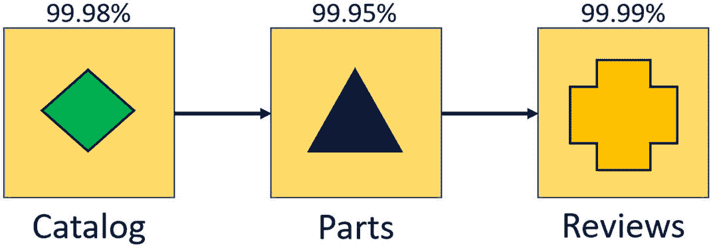

图 6-1

可用性示例

对于并行调用的微服务，计算方法不会改变(参见图 [6-2](#Fig2) )。看下面这些微服务，我们取每个微服务的可用百分比为 99.98% × 99.95% × 99.99% × 99.94%。这使我们的总可用性达到 99.86%。

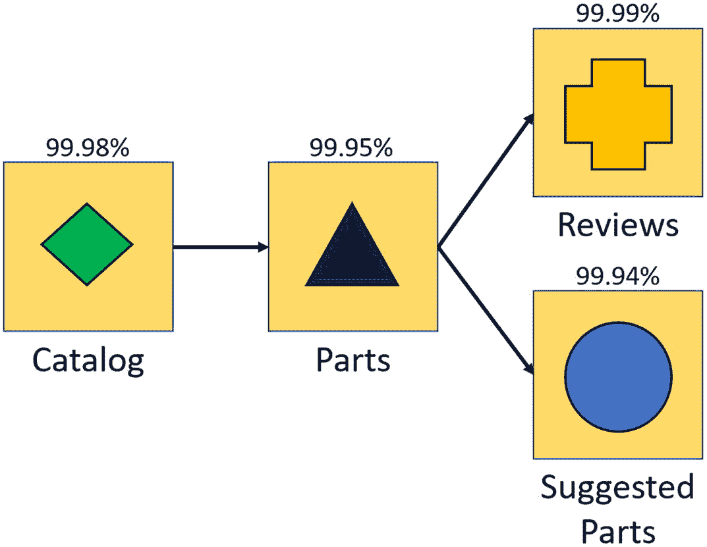

图 6-2

并行执行的可用性示例

停机时间的机会必须考虑如何以及在哪里托管您的微服务。数据中心发生停机可能会关闭多个微服务和其他依赖系统，如数据库和存储帐户。像 Kubernetes 这样的系统可以帮助解决一些停机问题。当一个 pod 出现故障时，Kubernetes 会尝试创建该 pod 的一个新实例，以实现弹性。

## 共享数据

当我们探索将数据分散到不同的数据库时，我们很快发现了一个新问题。

还有由其他微服务完成的其他流程仍然需要数据，但现在来自其他微服务。也许您有一个需要订单信息的运输微服务。它是如何获得这些数据的？

一种选择是简单地让运输微服务调用订单微服务来检索必要的数据(参见图 [6-3](#Fig3) )。这是一个合理的解决方案，但并非没有挑战。由于微服务相互调用以检索数据，因此可能会有一个相当繁忙的网络。随着网络呼叫的增加，延迟也会增加。随着数据请求的增加，相关数据库的负载也会增加。

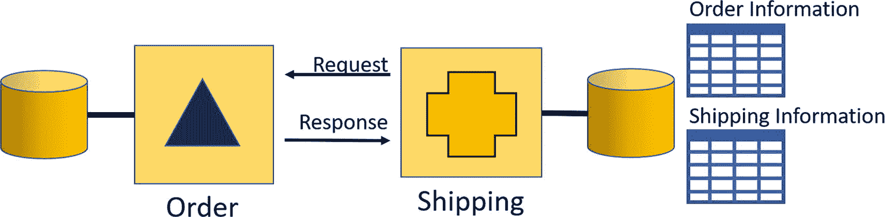

图 6-3

共享数据

假设一个微服务调用另一个微服务，而另一个微服务也必须调用另一个微服务。每个微服务调用只会增加延迟，业务流程失败的几率也会增加。看图 [6-4](#Fig4) ，如果调用 Reviews 微服务需要 1.5 秒，Part 微服务需要 2.1 秒，Catalog 微服务需要 2.4 秒执行，那么你的总延迟是 6 秒。这应该会挑战您的架构决策。这些调用真的需要同步吗？调用可以异步进行吗？

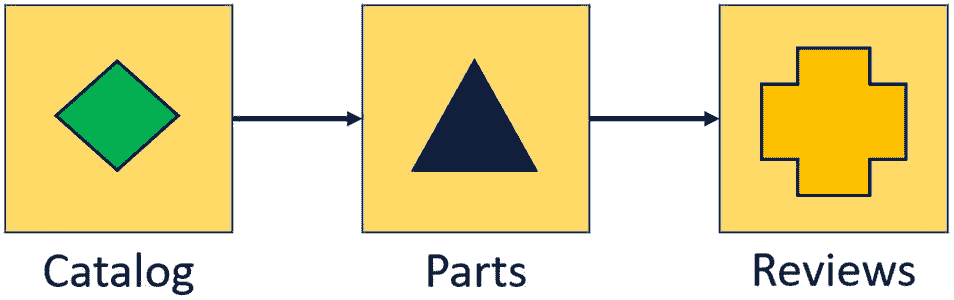

图 6-4

在线微服务调用

延迟不是我们面临的最大问题。这是需要考虑的事情，但是如何处理现在数据在两个或更多数据库中的事实呢？数据是如何保持同步的？或者我们换个方式问这个问题。由于业务流程需要数据位于多个数据库中，我们如何保持数据的一致性？当一个微服务发生停机而另一个没有发生停机时，数据一致性会发生什么变化？我们将在事务一致性一节中讨论这个主题。

### 重复数据

另一个选择是复制数据。这听起来很荒谬。为什么分离数据库只是为了以后复制数据？这并不像一开始看起来那么糟糕。考虑一个为您在线销售的零件提供微服务的例子。零件微服务是其数据库中零件数据的管理器。它是与部分相关的所有事物的唯一真理来源。随着新部件的添加或更新，请求会经过这个微服务。如果订单微服务需要该数据的副本怎么办？

由于订单微服务需要零件数据的副本，您还会注意到它不需要零件的每个细节。以下列表旨在传达构成零件微服务一部分的大量细节的理念，零件微服务是真实数据库的单一来源:

*   身份

*   零件号码

*   名字

*   描述

*   种类

*   分类

*   尺寸描述

*   颜色

*   容器

*   制造商

*   制造商零件号

*   生产日期

*   替换零件号

*   停产日期

订单微服务需要零件信息**的副本，但**只需要满足订单要求的足够信息。它不需要零件停产或更换的副本。订单微服务只需要关于一个零件的细节，比如一个名称和一些描述细节。现在，在订单微服务数据库中，有一个零件信息表。此列表是零件表中满足订单处理需求的详细信息示例:

*   零件 Id

*   零件号码

*   名字

*   描述

*   尺寸描述

*   颜色

既然微服务中存在一些重复数据，下一个挑战就是保持数据同步。例如，如果应用管理员修复了零件描述中的一个错别字，该怎么办？订单微服务中的重复信息如何得到更新？这就是使用消息传递的好处(参见图 [6-5](#Fig5) )。

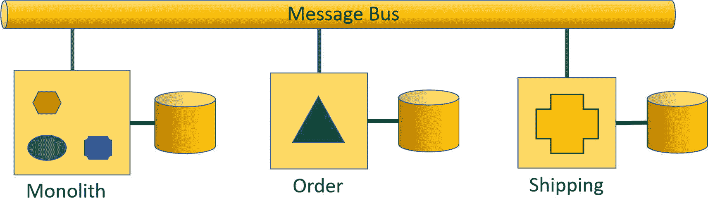

图 6-5

带消息传递的订单系统示例

发货微服务和订单微服务发送并处理*OrderShippingAddressUpdated*消息(见图 [6-6](#Fig6) )。运输微服务通过在数据库中查找指定订单的运输地址并应用更改来处理更新。订单微服务还可以通过在其数据库中搜索指定订单来处理消息，并更正地址。

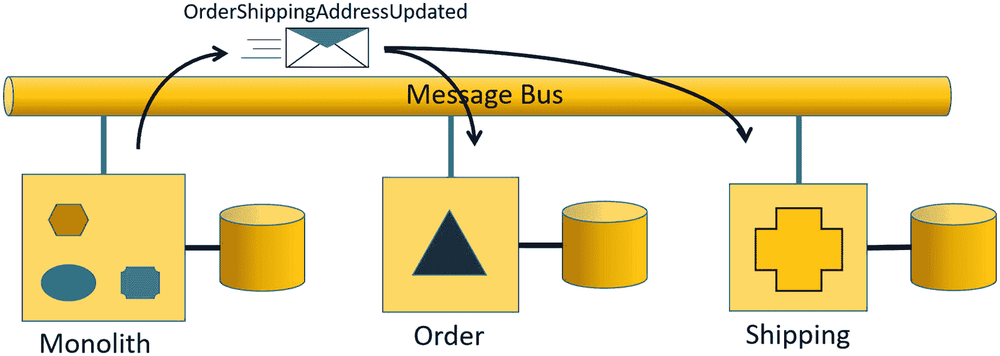

图 6-6

消息传递示例

这是一种简单的方法，可以使多个具有重复数据的微服务保持同步，而不需要微服务相互了解。通过保持微服务相互不了解，您的架构是松散耦合的，并允许微服务继续独立发展。

## 事务一致性

借助微服务架构和分散数据，我们需要就如何处理事务做出重大决策。具有中央数据库的整体式应用通常依赖数据库来处理事务的提交方式。这些事务具有由数据库处理的属性，以帮助确保可靠性。这些被称为酸性。酸代表原子性、一致性、隔离性和持久性。

原子事务要么完全提交更改，要么根本不提交。这有助于确保预期的更改不会被部分提交。一致性保证了预期的更改在事务期间不会被更改。进行隔离是为了使事务不会被其他事务改变。持久性保证是这样的，即提交的更改保留在系统中，直到发生另一个事务来更改该数据。这是为了在事务提交后立即处理系统故障。例如，提交的更改被保存，并且可以在重新启动后继续存在。

对于像微服务这样的分布式系统，出现故障的几率会增加。尝试跨多个微服务执行分布式事务非常困难，并且会增加事务延迟和许多故障场景。对于每种可能的失败，您都必须构建补偿事务。这使得架构变得复杂。

### CAP 定理

随着数据的分散，我们需要了解如何处理数据库对相关微服务不可用的情况。埃里克·布鲁尔(Eric Brewer)创立了上限定理(CAP theorem ),该定理指出，在一次失败中，不可能提供两次以上的担保。上限定理有三个保证: **C** 一致性， **A** 可用性， **P** 分割容差。因为微服务通过网络进行通信，所以我们设计它们来处理网络上出现问题时的时间，这被称为分区容差。这意味着如果微服务通信失败，它必须处理这种情况，例如使用重试策略。因为网络中断很容易发生，所以我们必须决定微服务在这些时间的行为。

这让我们可以选择可用性或一致性。当我们决定微服务应该支持可用性时，我们是说当微服务无法访问其数据库时，它将继续对调用者可用。当接收到数据请求时，它将返回最新的已知数据，即使该数据与数据库中的数据相比已经过时。对数据的更改被缓存，当重新建立到数据库的连接时，它将同步任何更改。

一致性选项用于微服务必须返回最新信息或错误的情况。这里的一致性不同于 ACID 保证中的一致性。ACID 中的一致性是指信任数据在事务期间不会被更改。CAP 中的一致性是关于网络分区期间查询中返回的数据。

考虑移动设备上的游戏应用。如果应用倾向于一致性，那么当出现网络通信问题时，应用不会继续工作。但是，如果它支持可用性，那么它将继续使用它所拥有的最后一个已知信息进行操作，并在连接恢复时同步数据。

### 跨微服务的事务

随着数据的分散，我们需要分析我们的业务流程，以了解他们的数据需求，以及如何最好地保持各种微服务中的数据一致。我们首先了解微服务在这些业务流程中扮演的角色。一些流程的活动是连续的，因为它们依赖于提交的事务流(见图 [6-7](#Fig7) )。

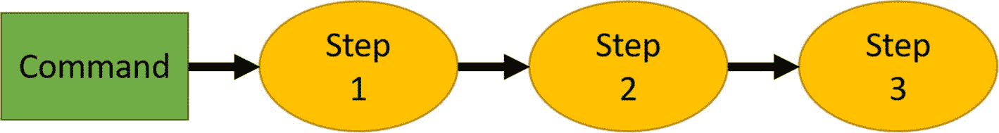

图 6-7

顺序业务流程

其他流程可以并行完成，或者采用扇出设计，因为它们的活动不依赖于其他事务(见图 [6-8](#Fig8) )。

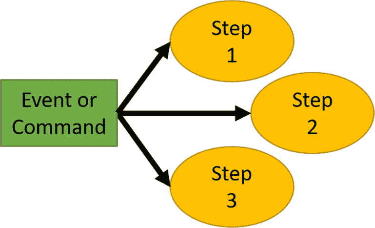

图 6-8

平行活动

在业务流程作为一个整体被认为完成之前，微服务所覆盖的单个流程仍然需要完成。无论选择使用顺序设计还是扇出设计，都需要对事务集合进行管理，因此我们了解业务流程何时完成，同样重要的是，何时未能完成。这种可维护的事务集合被称为传奇。

### 萨迦

saga 是一种在分布式系统中管理潜在长寿命事务的机制。根据事务的处理需求，您可以选择三种 saga 模式之一来管理事务。这三种模式是路由单、编排和编排。

注意，sagas 不提供跨事务的原子性。saga 中包含的每个微服务对其数据库具有原子性，但不会跨其他数据库(参见图 [6-9](#Fig9) )。

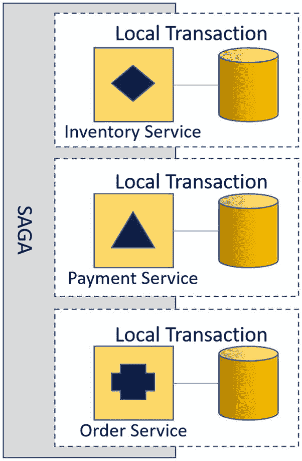

图 6-9

本地事务的 saga 示例

传奇不是分布式事务。分布式事务持有跨微服务的资源锁，并且在处理故障情况时有许多问题。此外，分布式事务不能像 sagas 那样容忍大的时间跨度。saga 用于协调一组本地事务，根据业务流程需求和微服务的可用性，这些事务可能需要几分之一秒或几天才能完成。

#### 传送名单

当使用路由滑动模式时，信息从一个微服务传递到另一个微服务。当微服务收到路由单时，它会根据所提供的信息采取相应的行动，包括将信息存储在其数据库中。举一个路由单中的信息的例子，考虑预订航班和邮轮需要什么。这种方法的前提是，您将只在成功完成航班预订后进行邮轮预订。考虑以下需要回答的问题，以便进行这些预订:

*   游轮哪一天离港？

*   你需要什么时候到达港口？

*   你预计什么时候回来？

*   需要做哪些航班安排？

您的应用将获得这些答案，并尝试进行这些预订。路由单包含传递给每个微服务的信息。每个微服务联系独立的系统来创建预订。路由单有这些答案，并包括呼叫链中的下一个微服务(见图 [6-10](#Fig10) )。

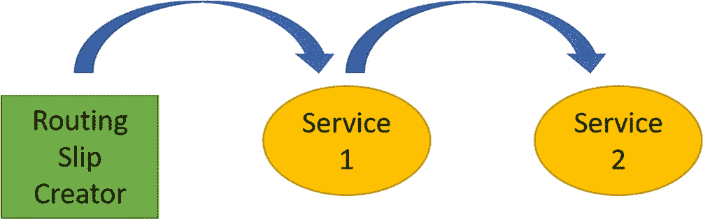

图 6-10

传送名单活动

如果一个微服务出现错误，它会根据自己的信息更新路由单，并将其发送给前一个微服务。通过这种方式，每个微服务都知道它是在执行基于前进的动作还是在执行补偿事务(参见图 [6-11](#Fig11) )。错误情况可能是由于未进行所需的预订或微服务本身的问题。事务的每个状态都保存在传送名单中。

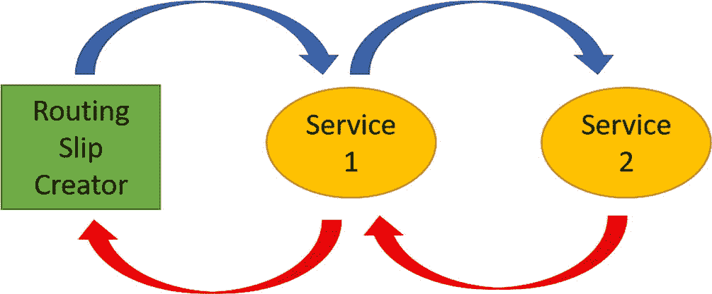

图 6-11

传送名单错误情况处理

传送名单模式对于需要满足前提条件的顺序操作非常有用。虽然这个例子假设了预订的顺序，但是您应该质疑这个模式是否是正确的。您需要在预订航班前预订游轮吗？如果航班预订排在第一位呢？或者操作可以并行进行吗？接下来的两个模式讨论了如何并行处理操作需求。

#### 舞蹈编排

通过编排，微服务使用事件进行通信。当操作完成时，它们会发送带有成功事务信息的事件。其他微服务接收它们订阅的事件，以便它们可以执行它们的操作(参见图 [6-12](#Fig12) )。

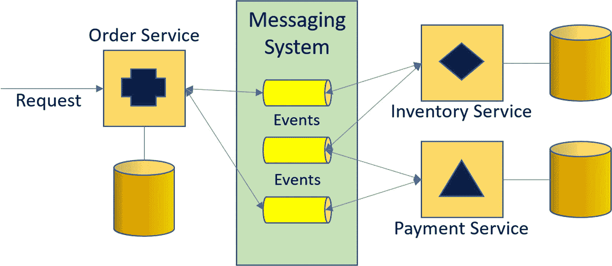

图 6-12

舞蹈编排

以在线订单系统为例，考虑这种活动流程(见图 [6-13](#Fig13) )。订单微服务收到命令后，会创建一个订单，并将其保存到本地数据库中，状态为 Pending。然后它发布一个 *OrderCreated* 事件。库存微服务使用该事件。如果库存微服务验证了现有商品的数量，并成功地对这些商品进行了保留，它将发布一个*商品保留*事件。支付微服务使用该消息并尝试处理支付。如果支付成功，支付微服务发布一个 *PaymentProcessed* 事件。订单微服务使用该事件，并相应地更新订单状态。

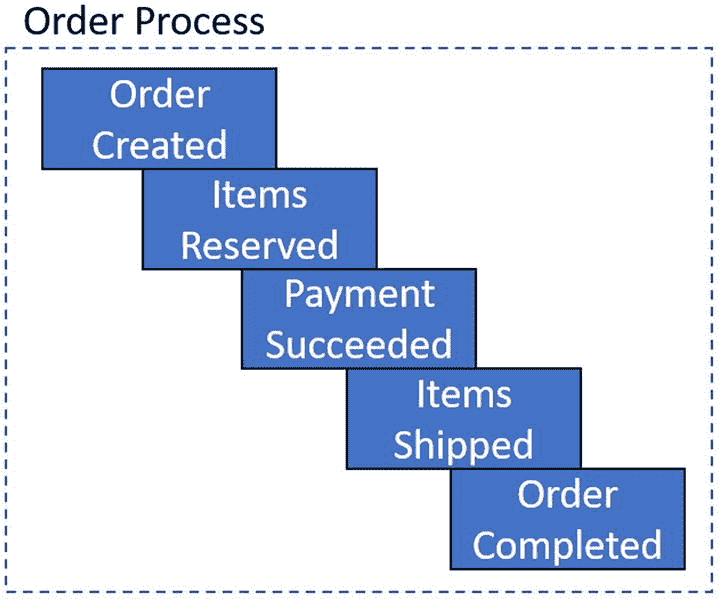

图 6-13

订单创建流程

但是如果在这个过程中的某个地方出现了故障呢？在业务流程中起作用的每个微服务可能也需要有补偿事务。根据需要恢复先前事务的过程和原因，您可以简单地撤销更改(参见图 [6-14](#Fig14) )。当付款已经应用于客户的信用卡时，您不能撤销事务。并且最好在系统中留下发生过的记录。然后，补偿事务是退还收费金额。这是一个新的事务，但也是审计需求的历史记录。

一些进程可能不需要补偿事务，也不需要将数据恢复到以前的状态。如果有一个补偿事务来改变库存商品的数量，这可能是错误的，因为在处理此订单的过程中，商品上可能有另一个事务。

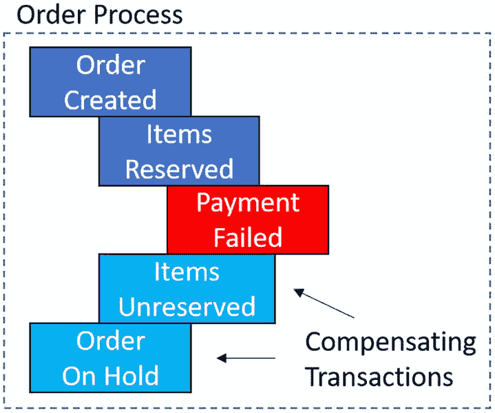

图 6-14

带有补偿事务的订单流程

#### 管弦乐编曲

借助流程编排，可以直接从中央流程管理器使用命令联系微服务。就像精心编排的传奇故事一样，经理维护着传奇故事的状态。

以在线订单系统为例，订单微服务充当中央控制器，有时称为编排器(见图 [6-15](#Fig15) )。当一个请求进来时，order 微服务直接向其他微服务发出命令，依次处理和完成它们的步骤。

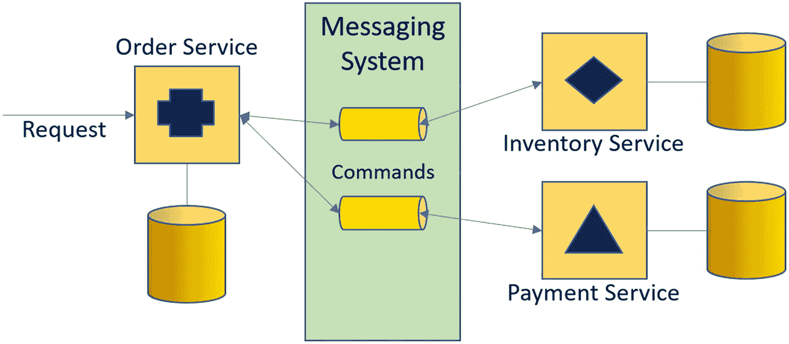

图 6-15

管弦乐编曲

在创建订单信息并将其保存到数据库之后，订单微服务向库存微服务发出一个命令。库存微服务接收命令，并对商品进行预订。然后，订单微服务向支付微服务发出另一个命令。付款被处理，订单进入发货环节。

这里还需要应用创建补偿事务的能力。如果支付处理失败，将向订单微服务发回不同的回复。然后，订单微服务向库存微服务发送另一个命令来释放对商品的预订。然后订单状态被设置为 PaymentCorrectionNeeded。

## CQRS(消歧义)

一些业务流程对于写和读有不同的数据模型。考虑从现场设备接收遥测数据的系统场景(见图 [6-16](#Fig16) )。这些数据每秒钟从许多设备传入几次。用于将数据写入数据库的数据模型很简单。它包含不同传感器的压力值、电池电压和温度等字段。数据模型还具有设备 Id、传感器 Id 和日期/时间戳等属性。

检索数据的目的不同，因此读数据模型与写数据模型有很大不同。读取数据模型包括基于其他字段值的计算值以及滚动平均值。它还包括基于发送数据的设备 Id 的校准值偏移。查询的内容不同于写入数据库的内容。因为写和读使用非常不同的数据模型，所以可以利用设计模式命令查询责任分离(CQRS)。

通过将微服务一分为二，您可以拥有更多专用于数据模型的资源。一个微服务处理插入数据的所有命令，并将它们存储在专用数据库中。另一个微服务专门负责查询所需的数据和计算，全部来自不同的数据库。这个模式非常有趣的一点是有两个数据库。

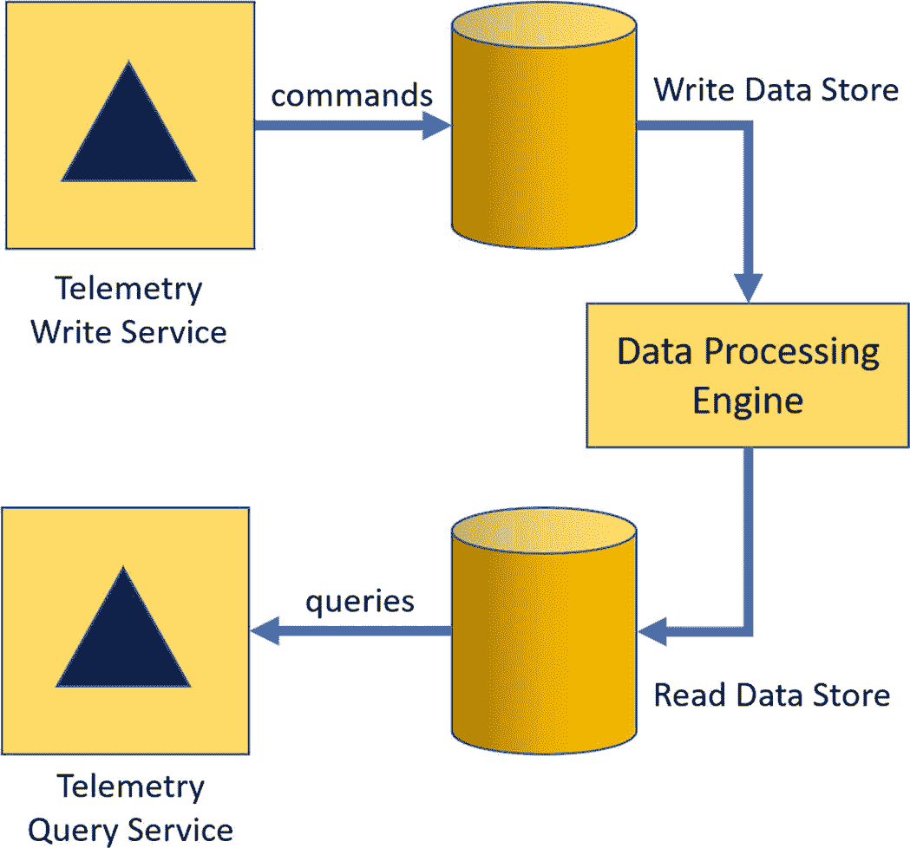

图 6-16

遥测数据的 CQRS 示例

有了两个数据库，您可以对用于写入的数据库进行调优，以处理大量的传入数据。read 数据库可以使用索引进行调优，以支持检索必要的数据。它也不必是与写数据库相同的数据库类型。命令可能以 JSON 文档的形式出现，但是 read 数据库可以是关系数据库，用来存储数据累积的物化视图。

使用 CQRS 有几个好处。数据模型采用不同的安全性。您可以独立扩展微服务。微服务之间的复杂性是分离的。

现在的挑战是将数据从写数据库转移到读数据库。有多种方法可以做到这一点。根据您的需求，这可以通过日志传送、数据流、消息传递甚至其他微服务来实现。因为读数据库独立于写数据库，所以数据可能会滞后或过时。你必须能够处理最终的一致性。有了最终的一致性，数据库或数据库集群中的数据将在以后变得一致。业务流程受此影响，需要有处理这些情况的程序。

CQRS 模式，很像事件源模式，不应该无处不在。如果您的数据模型或业务处理需求很简单，就不应该使用它。如果类似 CRUD 的操作就足够了，那么这可能是更好的选择。

## 活动采购

许多应用以只有当前值的方式存储数据。发生更新以替换数据，先前的值不会自动保留(见图 [6-17](#Fig17) )。在前一个例子的基础上，在发货地址的记录中修复了一个错别字(见图 [6-18](#Fig18) )。新值将替换当前值。对于大多数应用来说，这种操作模型是很好的。但是对于一些业务流程来说，这种处理数据的模型缺少所需的额外细节。


图 6-18

打字错误修复后的记录示例

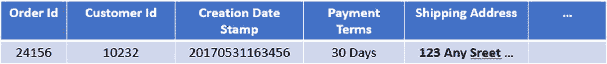

图 6-17

发货地址中有错别字的记录示例

事件源是一种持久化数据的设计模式。它可用于存储影响订单、发票或客户账户等项目的事件。像 *OrderCreated* 和 *OrderStatusUpdated* 这样的事件被存储，以便可以重放这些事件来获得当前值。这使得历史可以一直与对象保存在一起。这不仅是订单更改的历史记录，也是订单如何进入最新状态的证明。通过使用事件源，您拥有了必须遵守法规和合规性要求的流程所需的记录。永远不要直接更新或删除数据。相反，要删除记录，请使用“软删除”，在数据中设置一个属性，以表示应用认为该记录已被删除。这样，你仍然有事件的历史。

存储的条目是对象状态发生的事件。这些事件本质上是领域事件。在领域驱动设计(DDD)中，领域事件被标注为过去式。这是因为它们是事件，而不是命令。

事件有效负载是每个状态变化的关键。当每个事件发生时，存储有效负载。这个有效负载可以是一个简单的 JSON 文档，它有足够的细节来支持事件。例如，这个 JSON 文档的事件类型为 *OrderCreated* 。它还包含订单初始状态的详细信息。

```cs
{
  "Event":{
    "Type":"OrderCreated",
    "Details":{
          "OrderId":1234,
          "CustomerId":98765,
          "Items":[
          "Item1":{
                 "ProductId":"ABC123",
                 "Description":"WhizBang Thing",
                 "UnitPrice":35.99
          }
        ]
    }
  }
}

```

在客户为订单付款之前，他们添加了另一个项目。

```cs
{
  "Event":{
    "Type":"ItemsAdded",
    "Details":{
      "Items":[
      {
       "ProductId":"FOO837",
        "Description":"Underwater Basket Weaving Kit",
        "UnitPrice":125.99
       }
      ]
    }
  }
}

```

新项目的事件有效负载不包含订单中的其他项目。它只有要添加到订单中的商品的详细信息。航运和税收也可以适用。

```cs
{
  "Event":{
    "Type":"ShippingAmountApplied",
    "Details":{
      "OrderId":1234,
      "Amount":15.00
    }
  }
}

{
  "Event":{
    "Type":"TaxAmountApplied",
    "Details":{
      "OrderId":1234,
      "Amount":7.58
    }
  }
}

```

现在客户试图付款，但是失败了。该事件也被捕获。

```cs
{
  "Event":{
    "Type":"PaymentFailed",
    "Details":{
      "OrderId":1234,
      "TransactionId":837539
    }
  }
}

```

也许顾客支付了一部分。他们可以用没有足够余额来支付全部金额的礼品卡来支付。

```cs
{
  "Event":{
    "Type":"PartialPaymentApplied",
    "Details":{
      "OrderId":1234,
      "Amount":10.00,
      "TransactionId":837987
    }
  }
}

```

然后，客户申请另一笔付款。

```cs
{
  "Event":{
    "Type":"PartialPaymentApplied",
    "Details":{
      "OrderId":1234,
      "Amount":174.56,
      "TransactionId":838128
    }
  }
}

```

图 [6-19](#Fig19) 显示了存储订单事件的表格示例。详细信息和金额字段是从事件主体提取的数据。像这样分离数据有助于计算总数时的读取过程。请注意，订单 ID 被用作关联 ID。这允许您查询订单 ID 并获得所有相关的更改条目。

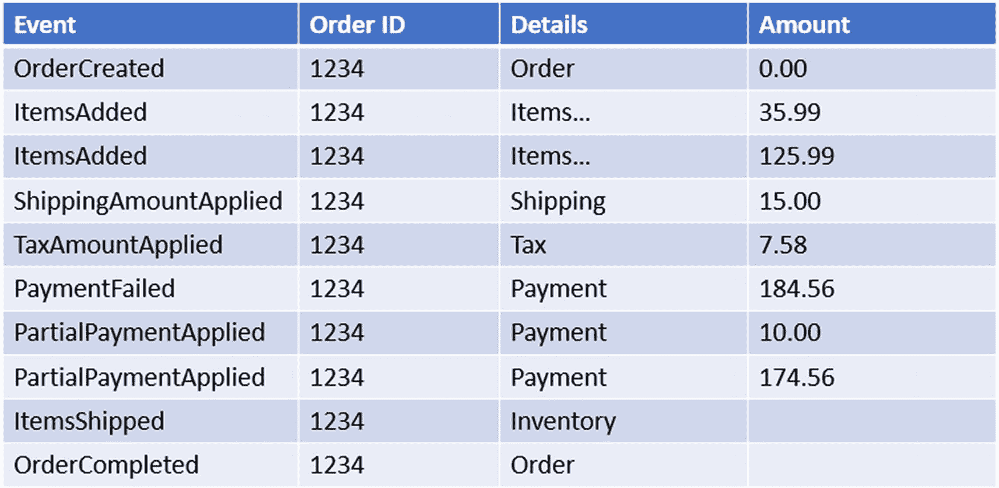

图 6-19

订单活动的记录

事件源对于处理金融事务、医疗记录甚至诉讼信息的流程来说是非常有用的。任何需要变更跟踪记录的东西都可能是这种数据处理模式的候选对象。然而，这种模式不是万能的，你可能会走向过度工程化。如果流程不需要状态变化跟踪，那么事件源模式可能不会像您希望的那样为您服务。此外，您可能会看到事件来源的数据存储成本增加。

### 情节

事件源的另一个好处是它可以抵消系统的作用。它不再负责数据的状态。取而代之的是一个人在负责。系统会接收所有事件，并提供一份报告来记录遗漏的事件。以下场景有助于解释事件源的一些用途。

#### 情景 1

使用库存管理系统，装载卡车的人在将箱子放到卡车上之前扫描箱子。系统说盒子不存在。该人必须停止他们正在做的事情，并找到一种方法将盒子输入到系统中。在将物体放置在卡车上之前，必须纠正物体的状态。但是盒子确实存在！

通过事件源，扫描箱子并将其放在卡车上的事件会继续，即使箱子被认为不存在。系统仍会捕获该事件，并向异常报告发送一个附加条目。这允许人们在不停止业务流程的情况下管理对象的状态。

这也说明了另一个情况。您可能有一个盒子被扫描的事件，在它存在的事件之前。既然管理员已经将项目添加到系统中，就创建了一个事件。在箱子被放置在卡车上的事件之后，创建事件在数据库中。在活动事件之后有一个创建事件是可以容忍的。首先，这表明有一个人必须解决的问题。您还可以让特定事件在其他事件之前有一个序列号。那么你的时间戳是为了追踪证据。查询将显示基于序列号的顺序。

#### 场景 2

场景 1 中框中的商品是在线系统上的订单。在线系统将商品出售给客户，但商品没有库存。订单可以在没有库存的情况下完成。订单事件触发了一个获取商品以履行订单的流程。订单系统不需要对库存中的商品进行真实计数。

出售可能脱销的商品是一个政策问题，而不是架构问题。这允许人们决定如何处理这样的事件。例如，一个策略可能是提醒客户商品被延迟，他们可以取消订单。另一种选择是加快从不同仓库向客户发货的速度。企业可以决定如何处理这些事件。

## 最终一致性

我们周围世界的很多事情最终都是一致的。像存款和借记我们的银行账户，体育比分的变化被发送到记分员和记者是事件的例子，最终随着时间的推移保持一致。尽管我们可能希望存款到达账户后立即可用，但大多数系统都强调可用性而非一致性。如果我们在设计微服务架构时期望有很强的一致性，那么我们就冒着可怕的延迟风险。这是因为微服务是通过网络通信的独立应用。大多数时候，一切都很好，在实现一致性方面没有延迟。我们必须设计我们的系统来应对这些延迟时间的出现。

有最终一致性而不是强一致性是什么意思？对自己的数据库使用事务的微服务可以使用强一致性。这意味着数据库集群中的每个节点都必须达到法定人数，并就更改达成一致。再说一次，大多数时候，这是好的。但是，因为一些数据库系统使用节点，所以有可能出现问题。然后，可能达不到法定人数，事务被拒绝。如果您在云中使用一个数据库，并且它是跨区域的，该怎么办？使用强一致性可能需要在不同区域的多个节点上满足仲裁。这只会增加延迟。

更改后的数据必须立即可读吗？这就是挑战。当预计不会立即读取更改的数据时，将数据写入多区域系统需要时间。当读取已更改数据的需求稍微放松时，您最好保持最终的一致性。回到银行账户的例子，它使用最终一致性。你也许能查询数据库并看到存款。但是与事务相关的其他系统可能不会立即看到变化。

如果您使用在线订单系统直接查询订单数据库，您将看到新订单。但是 report microservice 可能还没有那个数据。因此，一些报告和仪表板落后几秒或几分钟。根据某些流程，可能需要第二天才能创建反映前一天事件的报告。

对于尝试强一致性的微服务，它们必须相互进行同步 API 调用。这要求每个微服务完成其步骤后，下一个微服务才能继续。这不仅增加了等待时间，而且故障率也更高。任何阻止微服务实例完成任务的事情都会导致调用者必须处理的失败。这还包括错误情况，如无效数据、代码中的错误或未知情况。

利用前面提到的异步消息传递模式，您可以提供跨微服务的最终一致性。这允许微服务尽可能快地进行处理，而不依赖另一个服务。通过允许最终的一致性，微服务可以保持松散耦合，而不需要不必要的限制。

## 数据仓库

一些公司使用数据仓库(有时称为数据湖)来存储大量数据或“大数据”这些数据来自许多不同的来源，并允许为不同的目的存储不同的数据模型。数据仓库是用于存储大量数据的数据存储的集合，这些数据不必是同一类型(见图 [6-20](#Fig20) )。

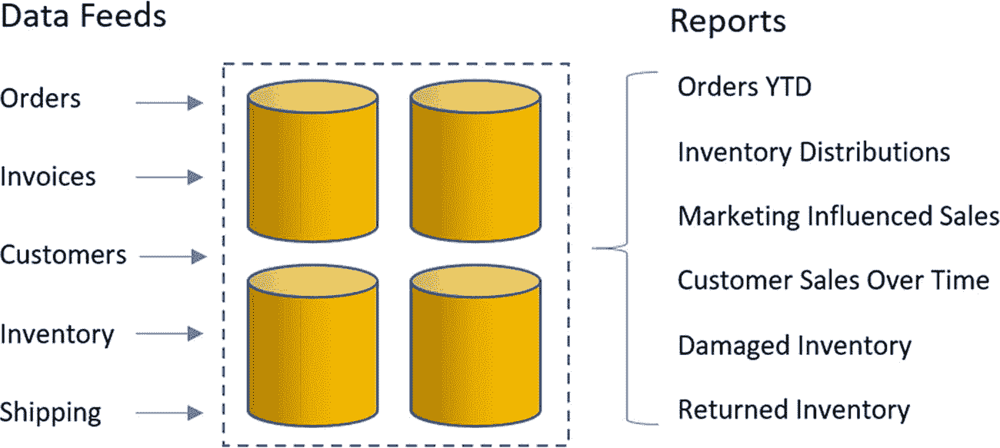

图 6-20

多个数据馈送的示例

数据仓库允许公司为历史合规性和报告收集数据。SQL Server 是一种在线事务处理(OLTP)类型的数据库系统。主要目的是在使用 ACID 属性的事务中处理规范化数据。联机分析处理(OLAP)类型的数据库系统存储用于分析、数据挖掘和商业智能应用的非规范化数据。

由于大多数 OLTP 数据库系统的锁定特性，最好不要将它们用作报告的来源。这些数据库上的大量读取有可能会干扰写入活动的锁。相反，应该在 OLAP 数据库系统中复制数据和应用任何转换。这允许在不妨碍事务的情况下在其他服务器上进行数据处理。它还允许使用不同于写入数据时所使用的数据模型来检索和利用数据。

您可以使用提取、转换、加载(ETL)工具，如 Azure Data Factory、Microsoft SQL Server Integration Services(SSIS)和 Informatica PowerCenter，将数据移动和转换到 OLAP 数据库。

ETL 工具可用于将数据拉入数据仓库，但也可能用于发送数据。当微服务向数据库写入数据时，它也可以在消息总线上发送数据，由数据仓库中的端点接收。

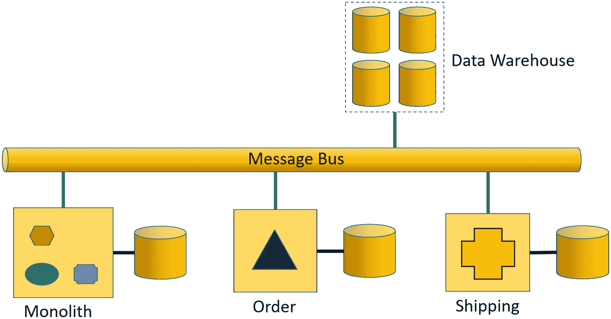

图 6-21

使用数据仓库的微服务架构

像 CQRS 这样的模式可以用来提供数据仓库解决方案。拥有一个数据仓库可以将微服务使用的数据库分开(见图 [6-21](#Fig21) )。数据仓库中的数据现在可以通过多种方式加以利用。其中之一是将来自多个来源的数据组合到一个物化视图中。

## 物化视图

物化视图是一种不同于数据存储方式的数据查看方式。但它不仅仅是一种查看数据的方式。使用物化视图可以显示原始数据以及基于这些值的任何计算数据。物化视图意味着从数据源重新构建，并且永远不会被应用修改。

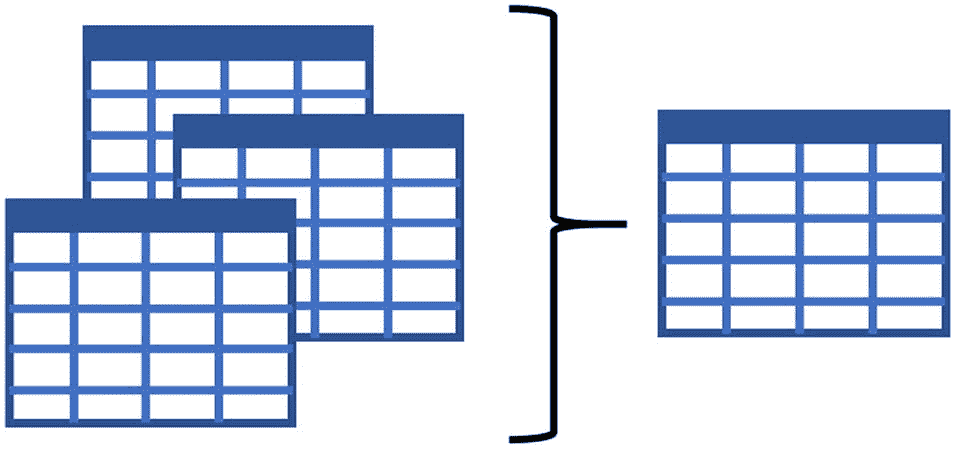

图 6-22

物化视图

物化视图允许应用检索数据的预定义视图(见图 [6-22](#Fig22) )。这有助于提高性能和适应性。这些物化视图可用于报告和仪表板。该数据可以是该月或该年的销售额与预测销售额。它可以帮助看到销售趋势线。甚至客户使用你的应用的能力也有利于未来的改变。

## 劈开整块石头

当谈到将功能从一个整体分割到一个新的微服务时，有许多具有挑战性的细节。每个挑战都可能让你质疑使用微服务是否是正确的方法。那么，我们应该从哪里开始呢？

让我们从代码还没有从一个整体中分离出来的方法开始。有这么多的基础设施要部署，即使最小的代码库也要成为微服务，所以从小处着手。您应该考虑为代码发布建立一个持续集成/持续部署(CI/CD)管道。致力于管理需求、编码标准、测试和 bug 的开发团队也应该首先到位。甚至测试策略(在第 [7](7.html) 章中讨论)也需要考虑和实施。无论你打算从一个没有基础设施的整体中提取多大的代码，你都将会在开发和管理微服务上遇到更大的困难。如果你发现即使是最小的代码也不能为你工作，重新考虑微服务是否是正确的方法。

### 移动代码

从整体开发微服务的一种方法是从代码开始。您需要做一些分析来找出真正需要取出的代码。如果你正在为会计提取功能，你必须找到其他代码在哪里使用了这个领域的功能。通过识别哪些代码正在使用会计功能，您可以列出需要重构的领域。现在，它必须通过 HTTP API 或消息来调用微服务，而不是调用内存中的会计代码。对于这里的例子，我们将假设使用 HTTP API。

monolith 现在通过 API 调用会计微服务。这是正确的方向，但微服务仍然绑定到 monolith 使用的同一个数据库(见图 [6-23](#Fig23) )。正如本章前面所讨论的，保持这种状态会导致模式变化的争用，并挑战数据完整性。可能还有其他部分正在使用表，一旦提取，会计微服务将需要这些表。会计微服务需要成为会计数据的唯一真实来源。

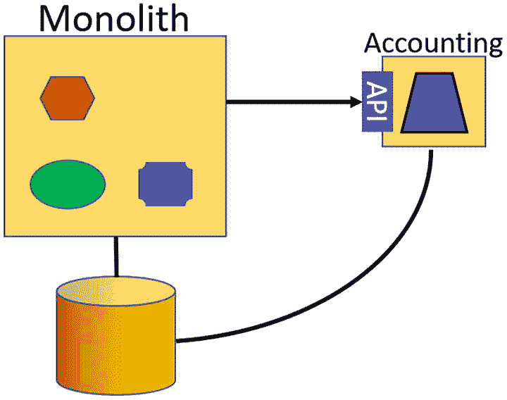

图 6-23

与单个微服务共享数据库

这里还提出了另一个问题。记账功能可能需要联系仍在 monolith 中的其他域功能(参见图 [6-24](#Fig24) )。在这种情况下，我们向 monolith 添加一个 API，供会计微服务调用。我们现在有一个循环引用，否则应该避免。然而，这是可以为您赢得时间的迁移步骤之一。拥有这种循环引用有助于开发会计微服务，并突出显示可能永远不会发现的变化领域。如果这不是最终状态，这个位置是可以忍受的**。除非您有在下一个 sprint 中继续迁移的可靠计划，否则不要以这种方式投入生产。**

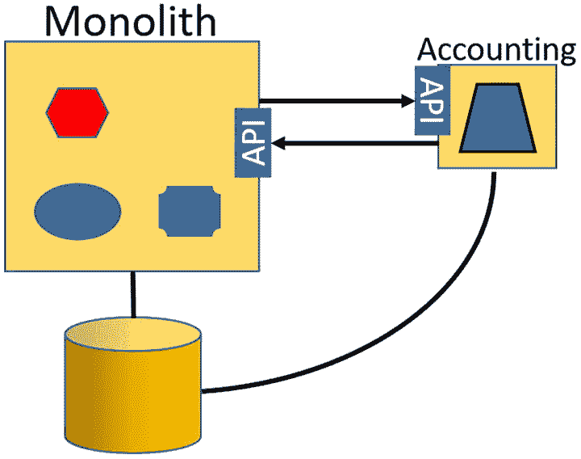

图 6-24

会计微服务召回 monolith

给 monolith 增加一个新的 API 只会增加架构的复杂性，并且更难管理。并且应该总是避免循环依赖。之所以在这里提到它，是因为它是一个合理的迁移步骤，可以让您获得一个可靠的架构。经历这种开发突出了紧密耦合的代码，并允许您尝试重构更松散耦合的代码。最终，您希望处于一个会计微服务不依赖于 monolith 中的代码的位置(参见图 [6-25](#Fig25) )。您可能需要进一步分离域功能，并将一些留在整体中。例如，如果应付账款的功能不能很好地重构，那么就进一步拆分微服务。也许你有一个微服务只是为了处理应收账款业务流程。

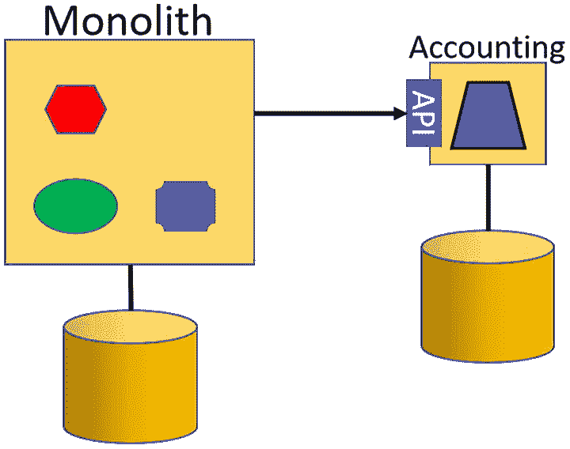

图 6-25

拥有自己数据库的会计微服务

### 扼杀者模式

strangler 模式对于将代码重构为微服务非常有用。首先在调用者和会计代码之间添加一个拦截层(见图 [6-26](#Fig26) )。您创建的拦截层可以将调用定向到 monolith 中仍然存在的功能，或者重定向到调用微服务。当您将附加功能迁移到会计微服务时，拦截层代码会相应地更新以重定向呼叫。欲了解更多信息，请参考 [`https://www.amazon.com/gp/product/B081TKSSNN`](https://www.amazon.com/gp/product/B081TKSSNN) 。

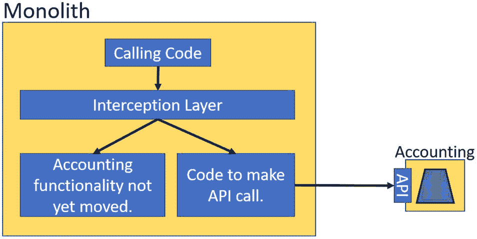

图 6-26

使用拦截层的扼杀者模式

### 特征标志

控制流程的一个选项是特性标志(也称为特性切换)。使用功能标志，monolith 中代码的执行由您设置的各个标志的设置来控制。标志的设置通常在配置文件中。也可以使用数据库中的值来设置它们。一个需要检验的产品是 LaunchDarkly。 <sup>[1](#Fn1)</sup>

## 拆分数据库

我们讨论了关于如何处理数据事务和不同数据存储模型的几个细节。现在是另一个挑战，拆分数据库。对于本节，我们将假设 monolith 使用的是关系数据库，如 SQL Server。查看图 [6-27](#Fig27) ，有一个装运表和另一个会计表，其中包含往返装运的最终金额。

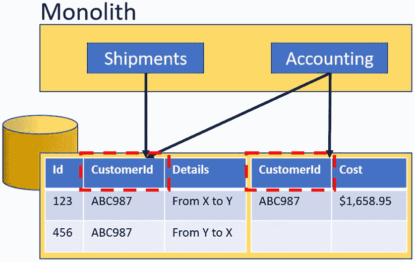

图 6-27

分析数据

从图中我们可以看到会计代码使用了两个表中的信息。这两个表在 CustomerId 列上有外键关系。会计部门可以使用此信息来报告每个客户的当前销售额或本月至今和本年度至今的报告。没有显示的是数据是如何管理的。是否使用了存储过程或函数？像实体框架这样的对象关系映射器(ORM)怎么样？由于尝试将会计功能转移到微服务，该代码需要将会计数据置于其控制之下。这有助于数据完整性管理。

我们知道，会计表将移动到会计微服务的数据库中。我们需要使用连接的表来识别外键约束、存储过程和函数。要按名称查找使用表的存储过程，请使用以下命令:

```cs
SELECT Name
FROM sys.procedures
WHERE OBJECT_DEFINITION(OBJECT_ID) LIKE ‘%TableNameToFind%’

```

要查找包含表名的函数:

```cs
SELECT
    ROUTINE_NAME,
    ROUTINE_DEFINITION ,
    ROUTINE_SCHEMA,
    DATA_TYPE,
    CREATED
FROM INFORMATION_SCHEMA.ROUTINES
WHERE ROUTINE_TYPE = 'FUNCTION'
AND ROUTINE_DEFINITION LIKE '%TableNameToFind%'

```

要查找与指定表有外键关系的表:

```cs
SELECT
   OBJECT_NAME(f1.parent_object_id) TableName,
   COL_NAME(fc1.parent_object_id,fc1.parent_column_id) ColName
FROM
   sys.foreign_keys AS f1
INNER JOIN
   sys.foreign_key_columns AS fc1
      ON f1.OBJECT_ID = fc1.constraint_object_id
INNER JOIN
   sys.tables t
      ON t.OBJECT_ID = fc1.referenced_object_id
WHERE
   OBJECT_NAME (f1.referenced_object_id) = 'TableNameHere'

```

代码开发高手 Kathy 一直在努力理解现有的数据库结构和数据模型。她使用前面显示的查询来帮助识别连接的资源，以确定是否有需要与会计表一起移动的支持表。Kathy 创建了一个特定于会计功能的表映射。然后，她将与会计表有关系的资源添加到映射中。

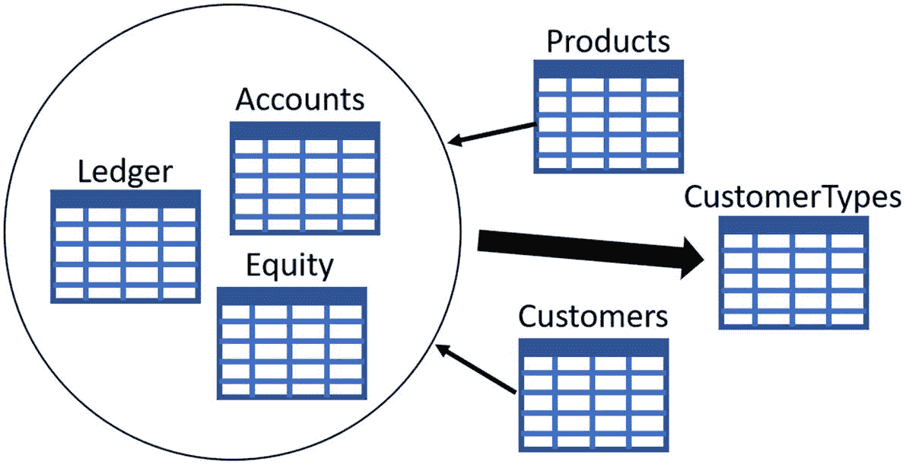

图 6-28

数据依赖的方向

Kathy 记下了依赖关系的方向(见图 [6-28](#Fig28) )。有些表需要来自会计对象的信息。一些表被会计对象使用。当 Kathy 识别出依赖关系时，她能够进一步分析是否有数据应该被复制到会计微服务的数据库中。使用您在上一节中学习的关于共享和复制数据的知识，这是可能的。

更多信息可在 [`https://www.amazon.com/gp/product/B081TKSSNN`](https://www.amazon.com/gp/product/B081TKSSNN) 找到。

## 摘要

分散数据远非易事，并且在架构的发展中扮演着关键角色。正如您在本章中了解到的，使用相同表和模式的应用可能需要有自己的数据库。但这并不意味着独立的数据库服务器。通过拥有独立的数据库，应用可以更好地控制数据的完整性。此外，它允许您根据需要选择不同的数据库类型。

您还了解了在不同的数据库中存在重复数据是允许的。这使得微服务能够利用足够的信息自主工作，以满足业务流程的需求。

我们还讨论了跨微服务分布的数据事务处理。由于业务流程跨越微服务，因此使用本地事务来管理数据的变化。管理一组事务可能涉及路由单和 sagas 之类的模式。

您了解了当写模型与读模型大不相同时使用 CQRS 模式。这种模型差异和处理需求可能会影响性能，因此将责任划分为写微服务和读微服务提供了一种处理数据需求的清晰方式。

事件源显示为一种存储数据的模式，其中不存储当前值，而是存储事件的集合。可以查询事件集合，并计算值以获得到那时为止的最新已知值。当流程需要保留数据状态如何随时间变化的证据时，这很有用。

我们还讨论了如何使用最终一致性来代替强一致性。通过允许不同的系统在以后获得最新的状态变化，为系统提供了更多的可用性。

然后我们讨论了一些公司如何使用基于来自其他来源的数据的数据仓库和物化视图。这使得数据读取和报告方式的不断变化不会影响微服务的性能。

您还了解了一些用扼杀者模式和特性标志来分割代码的想法。对你来说最好的方法只有在你尝试了最适合你的场景之后才知道。分割一个数据库以允许数据移动到微服务拥有的另一个数据库就像分割代码一样乏味。因此，您学习了通过名称查找使用表的存储过程和函数的方法。此外，您还学习了如何识别外键约束。

<aside aria-label="Footnotes" class="FootnoteSection" epub:type="footnotes">Footnotes [1](#Fn1_source)

[https://launch blackly。com](https://launchdarkly.com)

 </aside>