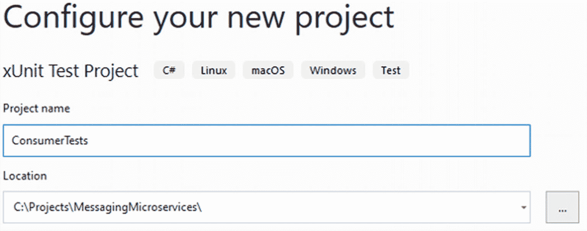
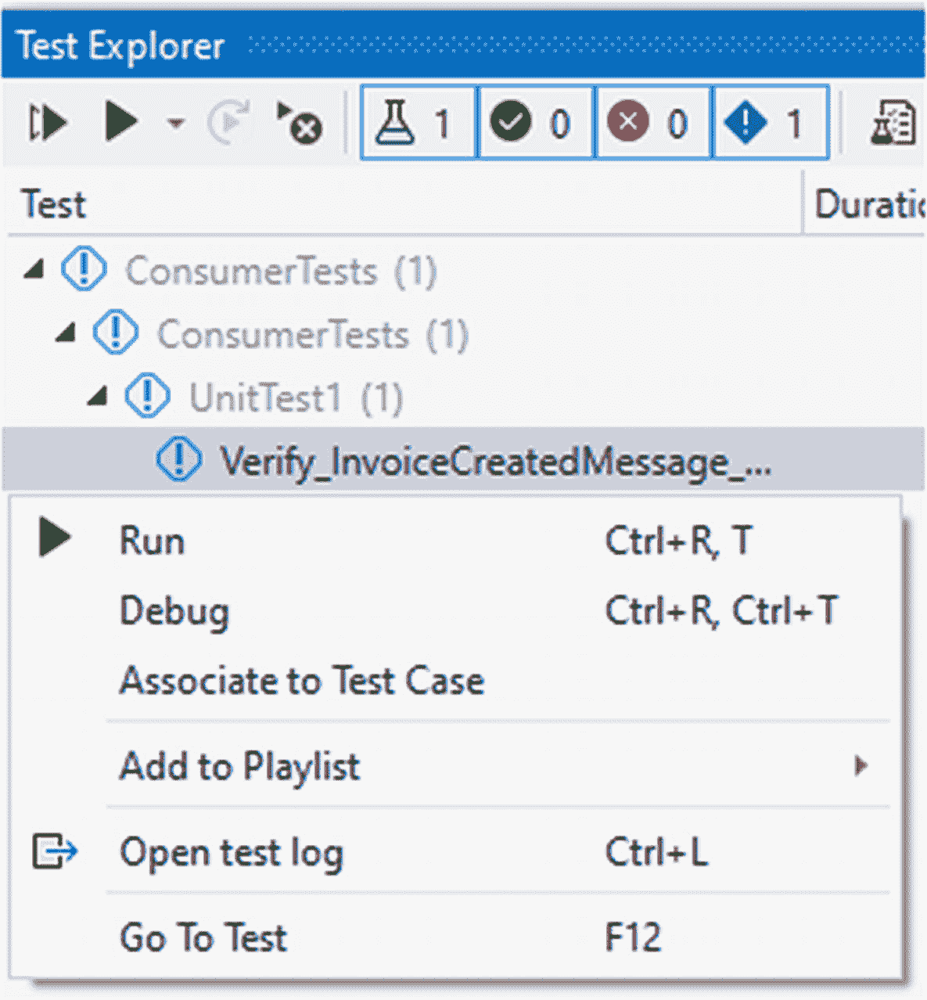

# 九、测试微服务

Code Whiz 的开发人员 Kathy 已经开发了一些微服务，并致力于证明它们能按预期工作。她知道微服务对他们的客户 Hyp-Log(我们在本书中假设的公司)至关重要。Kathy 研究了测试微服务的各种方法。

本章将回顾为什么测试是重要的，测试什么和不测试什么，以及各种测试方法。我们还将为基于 REST 的通信构建一个契约测试示例。然后，我们为基于消息的微服务构建测试。

请记住，每个微服务都是一个独立的应用，与任何其他应用一样值得关注。微服务关注领域功能。它们是更大的架构解决方案的一部分。因此，这些微服务就像任何其他应用一样有测试要求。然而，它们有更多的测试需求，因为它们相互连接以形成一个更大的架构解决方案。

微服务的发展增加了架构的复杂性。它允许直到开发过程的后期或者部署到生产环境之后才发现错误。而且这些 bug 成本很高。

## 错误成本

测试在软件开发中起着至关重要的作用，但经常被低估。太多时候，我们被要求加速代码开发，结果却在理解业务/用户需要什么以及我们如何实现这些需求方面出现了错误。对于 Kathy 和 Code Whiz 的其他开发人员来说，这也不例外。

Note

您应该在任何应用的开发过程中构建测试。测试驱动开发(TDD)是一种值得考虑的强烈推荐的方法。

大量研究证明，从收集需求到在生产中发现，修复 bug 的成本呈指数增长。在软件开发生命周期中尽可能早地识别和修复 bug 会更便宜。

修复漏洞的成本不仅是金钱上的，还包括信心的丧失。如果你雇了一个承包商来增加一个电源插座，但它却随机工作，你会很不高兴。如果你买了一辆新车，一个月后它就坏了，你也会感到沮丧。我们需要他人付出高质量的努力。这个要求也适用于软件开发。是不是每次都意味着完美？不，但这意味着我们会尽最大努力。

微服务在分布式架构中的角色增加了错误无意中进入代码的可能性。鉴于微服务架构的额外复杂性，这些错误的成本远远超过 N 层风格的应用。成本不仅增加了对更多测试的需求，也增加了对更多测试类型的需求。在我们讨论测试细节之前，让我们先检查一些不需要测试的项目。

## 不要测试什么

任何系统都有很多需要测试的地方，以验证准确性、性能和整体质量。然而，有些东西测试会浪费时间。不要创建测试来验证外部系统/依赖项的存在，而是编写测试来证明您的代码正在处理与系统的预期连接失败的情况。

其他不应该测试的项目有。NET 框架。那个。NET Framework 在发布之前已经过充分测试。尽管这并不能使它没有错误，但它消除了您测试它的需要。测试框架就像在购买前测试新车的框架。一般来说，我们测试汽车运行良好，而不证明它会抓住所有的轮胎。需要注意的是，当你在学习一个框架或者库的时候，测试是一种很好的学习方式。

## 测试什么

对我们来说，测试代码是非常重要的，我们必须在合适的时间以合适的方式进行测试。一个微服务不是单独存在的。它是用于特定业务目的的架构的一部分，这意味着需要在多个代码层从多个角度进行测试。测试微服务不仅包括测试代码，还包括测试性能以及处理故障。

### 密码

在《敏捷的成功之路》一书中，迈克·科恩提出了一个测试金字塔(见图 [7-1](#Fig1) )。金字塔描述了测试的不同层次，强调了测试的数量。金字塔的底部是最宽的部分，表明单元测试比其他测试类型多。上面是服务测试，最上面是用户界面(UI)测试。这些有时被称为端到端(E-to-E)测试，通常需要人工执行。


图 7-1

测试金字塔

其他人也加入了这个金字塔，他们注意到不仅单元测试比服务测试和 E-to-E 测试多，而且他们还期望最低的执行成本。也就是说，它们应该易于自动化，并且可以全天重复运行。金字塔顶端的测试是最昂贵的。它们很难自动化，并且通常会耗费大量的时间和人力资源。

### 表演

每个微服务都是为解决业务流程中的各种问题而专门构建的。因此，了解他们如何履行对这些业务流程的责任与了解他们的稳定性和性能一样重要。

在微服务正常工作并且准确无误后，再考虑让它们具有高性能。任何代码运行到错误答案的速度有多快并不重要。让它工作，让它准确，然后让它快速。

评估微服务架构的性能时，需要考虑几个指标。下面的列表提供了一些衡量微服务运行状况时要考虑的指标。更多详情见第 [9](9.html) 章，解决交叉问题。

*   CPU/RAM–微服务是否显示出需要扩展实例数量的迹象？也许您需要为微服务实例提供更多的 CPU 或 RAM。

*   网络连接——微服务是否能处理新的请求并做出响应？

*   消息传递–在给定的时间段内可以处理多少条消息？

*   速率限制——您可能需要考虑对微服务进行速率限制访问。Azure API Management 和 AWS API Gateway 等产品提供了限速选项。

*   错误/异常/重试次数–确保您记录信息并查看一段时间内的错误计数。

*   捕捉指标以向客户收费–您可能需要添加另一个微服务来接收有关业务流程的自定义信息，您可以使用这些信息向客户收费。

### 系统故障处理

在从单片架构向全微服务架构过渡的过程中，网飞创建了一些开源软件(OSS)包。其中一个就是混沌猴( [`https://github.com/Netflix/chaosmonkey`](https://github.com/Netflix/chaosmonkey) )。混沌猴可以用来随机关闭虚拟机或容器，这提供了确保您添加弹性处理保护措施的挑战。您可以在您的测试环境中运行 Chaos Monkey，但是也可以在您的生产环境中运行它。因为虚拟机或容器总是有可能消失，所以架构必须处理这些场景。在您的生产环境中运行 Chaos Monkey 保证了那些系统级故障将会发生。你为那些情况做好准备了吗？你对意外有多期待？

### 安全性

假设您开发了一个微服务来处理工资单功能。进一步，想象这个微服务将处理`your`薪水支票。对细节的关注越来越多，你努力争取最好的代码开发。但是安全性呢？

毫无疑问，微服务将存在于私有网络中。你确定没有互联网流量可以到达微服务。然而，传入流量不是这里的问题。使用第三方公共 NuGet 包是很常见的，但是我们曾经检查过那个包中的代码吗？我们必须保护微服务，防止未经授权的流量流入网络和流出网络。有害代码可以嗅探网络，并试图向外部站点发送信息。该代码可能在另一个微服务中。考虑审查 OWASP 组织的建议( [`https://owasp.org/www-project-top-ten`](https://owasp.org/www-project-top-ten) )。

使用像 Istio ( [`https://istio.io`](https://istio.io) )这样的服务网格提供了一种保护微服务之间流量的方法。服务网格可能有助于保持通信的加密/安全，甚至应该在专用网络上使用。既然您已经创建了一个处理工资的微服务，那么您还需要控制谁可以调用它。只要在网络上有一个可用的微服务，任何人都可以调用它。但是通过使用 Istio，还可以控制微服务上的授权。现在，只有经过许可的呼叫者才能获得微服务提供的敏感信息。

## 测试级别

修改后的测试金字塔显示了微服务交互的更明确的层(参见图 [7-2](#Fig2) )。下图是为测试微服务而修改的金字塔。它有六个级别，而不是原来的三个级别。金字塔测试级别是单元、集成、组件、合同、服务和端到端(E 到 E)。


图 7-2

扩展测试金字塔

### 单元测试

单元测试应该是自动化的，并针对最小的独立业务逻辑代码运行(见图 [7-3](#Fig3) )。这些测试用于验证算法的准确性，例如，接受各种信息并返回税率的方法。税率正确吗？每次都是同样的信息计算正确吗？如果不是，那么你可能有一个因素，比如时间，正在改变。


图 7-3

代码块

与金字塔上的其他测试类型相比，单元测试具有更快的执行时间。单元测试不应该连接到任何其他代码模块或第三方系统，如数据库、文件或消息传递系统。

您可以通过单元测试来证明最基本级别的代码执行准确。这也有助于证明您对业务需求的理解。如果你误解了一个需求，那么测试将有助于表明给定的某些条件下，答案是错误的，需要改变一些东西。

单元测试不应该测试位于算法边界之外的逻辑。例如，测试税率算法并不测试与数据库或其他外部系统的连接。依赖于外部代码的测试过程是集成测试。

### 集成测试

集成测试针对连接到另一个模块或外部系统(如数据库、文件或消息系统)中的资源的代码块(见图 [7-4](#Fig4) )。这里的测试是针对与其他算法一起工作的算法。这些其他方法可能在另一个类中。在这些情况下，您会看到类依赖关系。

集成测试还有助于证明依赖注入正在与注册的类一起工作。由于对其他类的依赖，有时是对第三方系统的依赖，你通常会发现集成测试比单元测试要少。然而，这些测试通常更复杂，有更多的安装和拆卸代码。


图 7-4

代码块在边界外调用

### 组件测试

有了微服务架构，你可以把微服务想象成组件(见图 [7-5](#Fig5) )。调用微服务的代码也是一个组件。这些组件是相互通信以分配计算需求的部件。这一级别的测试是关于孤立地测试这些组件。我们还没有准备好让他们彼此交谈。


图 7-5

作为组件的微服务

#### 嘲弄的

我们这里有几个测试组件的选项。考虑一个场景，其中代码调用不同开发团队拥有的微服务。这里的目的是测试在没有其他微服务可用的情况下进行调用的代码。该提供商的微服务可能尚不可用，或者可能需要自己的资源，在没有准备的情况下无法进行测试。嘲弄是在这种情况下有用的测试类型。

模拟对象是模拟外部资源的代码，比如数据库或其他简单的依赖项。模拟对象的主要目的是允许测试提供一个依赖项的副本，以便更好地隔离测试中的代码。

对于测试微服务，一个 mock 可能代表一个数据库或另一个微服务。它取代了调用另一端的对象，并允许测试没有特定依赖关系的微服务(参见图 [7-6](#Fig6) )。一个运行良好的嘲讽框架叫做 [`https://github.com/moq/moq`](https://github.com/moq/moq) 的“moq”。


图 7-6

模拟测试项目

#### 烟蒂

拥有一个模拟对象只能让你的测试进行到这里。仍然需要确保微服务在发送或接收数据时做出正确的反应。存根是一个定制的应用，它为各种目的提供预定义的响应(见图 [7-7](#Fig7) )。

存根的用途是接收您的微服务发出的调用。在这种情况下，存根是另一个微服务的替身。您创建存根以预定义的方式运行。例如，如果存根收到某些参数值，那么它将返回一个特定的值。参数值可以触发有效的响应来测试快乐路径。您可以使用另一个值来触发随机 HTTP 400 或 500 代码的回复。


图 7-7

存根测试对象

使用对请求和响应的期望来证明代码是如何处理情况的，并且代码更改没有破坏任何东西。另一个想法是让存根在回复之前等待非常长的时间，以测试微服务处理超时问题的能力。

### 合同测试

微服务通过 API 调用或消息传递接收有效数据。无论哪种方式，数据都需要采用预期的格式。这种格式就是合同。契约测试是关于验证从组件到微服务的调用是否以约定的数据格式进行通信。

每个微服务都是架构中的一部分。因此，必须尽早知道数据的格式。当然，需求会改变，代码、数据格式、测试和任何模拟/存根也必须改变。在开发过程中，它可以根据需要进行延展，以满足业务需求。如果已经在生产中的微服务的契约有变更，您将通过对 API 或契约本身进行版本控制来处理变更。

#### 消费者驱动的契约测试

当创建调用或“消费”微服务的代码时，您要测试使用契约的代码。这种类型的测试被称为消费者驱动的契约测试。该测试验证您处理协定中数据的代码。

通过利用消费者驱动的契约测试，消费者的开发人员既可以定义契约，也可以根据该定义编写代码。对于在提供商微服务上工作的开发人员来说，他们也可以使用消费者的开发人员定义的相同测试进行编码和测试。

在这一章的后面，我们将有一个逐步编码的例子，创建一个消费者驱动的合同测试项目集。请参阅“消费者驱动的契约测试深入探讨”一节

### 服务测试

在这个级别，您正在测试与微服务的交互。这些组件现在可以在没有模仿或存根的情况下相互交流了。这里自动化测试是可能的，但是很难完成。如果您是调用方和接收方的开发人员，那么自动化就更容易了。然而，对于其他团队开发的微服务，测试通常是手动的。这些测试在时间和金钱上也更加昂贵，因为他们需要人们做更多的测试准备。通过服务测试，您可以验证以下条件

*   网络的使用

*   API 交互

*   发送或接收消息

*   网络故障或 CPU/内存耗尽

### 端到端测试

端到端测试是最昂贵的级别。它要求人们将系统作为一个整体来测试。在这里，管理员可以为系统创建用户，并可能创建新的客户帐户、加载请求、发票等。端到端测试是从用户的角度来测试业务逻辑。用户不关心系统如何处理发票。他们只需要有信心，系统不仅会处理正确的数据，还会处理无效的数据。您的新微服务能否处理分区、延迟和用户错误数据等网络问题？

## 消费者驱动的合同测试深入探讨

在这一部分，我们将创建消费者驱动的契约测试的例子。我们将创建两个服务，一个是消费者，另一个是提供者。您将看到如何使用 PactNet 库来生成输出文件。提供商微服务使用该文件来确认其没有违反合同。有关 Pact 框架的更多信息，请查看 [`https://pact.io`](https://pact.io) 。

### 消费者项目

在 Visual Studio 2022 中，我们将创建第一个微服务。第一步是创建一个新项目。选择“ASP。NET Core Web API”(参见图 [7-8](#Fig8) )。


图 7-8

项目类型 ASP.NET Core Web API

选择下一步并配置项目名称和位置(参见图 [7-9](#Fig9) )。第一个项目名为 OrderSvc-Consumer。不要求名称中包含“消费者”或“提供者”。这些术语与项目名称一起使用，有助于保持项目目的的明显性。


图 7-9

项目名称和位置

为选择框架选项。NET 6，然后点击“创建”按钮(见图 [7-10](#Fig10) )。


图 7-10

其他项目选项

除了一个模型，这个服务不需要任何真实的代码。这里的测试代码和下一节中的模拟将使用 DiscountModel 类。创建一个名为 DiscountModel 的新类。

```cs
public class DiscountModel
{
  public double CustomerRating { get; set; }
  public double AmountToDiscount { get; set; }
}

```

### 消费者测试项目

现在我们将添加一个测试项目。在这个例子中，我们使用的是 xUnit 测试框架。PactNet 库不依赖于特定的测试框架。因此，欢迎您选择您最喜欢的测试框架。首先右键单击该解决方案，然后选择“添加➤新项目”。现在选择项目类型 xUnit 测试项目，然后选择“下一步”按钮(参见图 [7-11](#Fig11) )。


图 7-11

选择 xUnit 测试项目类型

现在提供一个项目名和创建新项目的位置。然后，您将选择一个合适的目标框架。选择与主项目匹配的版本，对于本书来说应该是。NET 6.0。现在选择“创建”按钮。

创建测试项目后，对正在测试的项目进行项目引用。在此示例中，项目引用使用 OrderSvc-Consumer。

您需要为契约测试添加一个 NuGet 包。首先，你需要知道你选择哪个包是基于你运行测试的操作系统(见图 [7-12](#Fig12) )。如果您在 Windows 上运行，请选择 PactNet。Windows 库。如果在 Linux 上运行，请选择 PactNet。Linux 库基于 if 运行在 32 位(x86)或 64 位(x64)上。OSX 还有一个图书馆选项。


图 7-12

pacnet 库选项

集成测试调用一个模拟服务，而不是调用真正的折扣微服务。在您的测试项目中，创建一个名为 DiscountSvcMock 的新类。然后应用以下代码:

```cs
public class DiscountSvcMock : IDisposable
{
  private readonly IPactBuilder _pactBuilder;
  private readonly int _servicePort = 9222;
  private bool _disposed = false;
  public IMockProviderService MockProviderService { get; }
  public string ServiceUri => $"http://localhost:{_servicePort}";

  public DiscountSvcMock()
  {
    var pactConfig = new PactConfig
    {
      SpecificationVersion = "2.0.0",
      PactDir = @"c:\temp\pact\OrderSvcConsumer",
      LogDir = @"c:\temp\pact\OrderSvcConsumer\logs"
    };

    _pactBuilder = new PactBuilder(pactConfig)
        .ServiceConsumer("Orders")
        .HasPactWith("Discounts");

    MockProviderService = _pactBuilder.MockService(_servicePort,
      new JsonSerializerSettings
        {
          ContractResolver = new CamelCasePropertyNamesContractResolver(),
          NullValueHandling = NullValueHandling.Ignore
        });
    }

  protected virtual void Dispose(bool disposing)
  {
    if (!_disposed)
    {
      if (disposing)
        {
        _pactBuilder.Build();
      }
      _disposed = true;
    }
  }

  public void Dispose()
  {
    Dispose(true);
  }
}

```

在您的测试类中，将其修改为以下代码。它创建了一个依赖于您刚刚创建的模拟服务的测试。因为有了模拟服务，您不需要运行服务本身。运行测试将利用 PactNet 和模拟服务。

```cs
public class DiscountSvcTests : IClassFixture<DiscountSvcMock>
{
  private readonly IMockProviderService _mockProviderService;
  private readonly string _serviceUri;

  public DiscountSvcTests(DiscountSvcMock discountSvcMock)
  {
    _mockProviderService = discountSvcMock.MockProviderService;
    _serviceUri = discountSvcMock.ServiceUri;
    _mockProviderService.ClearInteractions();
  }

  [Fact]
  public async Task GetDiscountAdjustmentAmount()
  {
    var discountModel = new DiscountModel { CustomerRating = 4.1 };

    _mockProviderService
      .Given("Rate")
      .UponReceiving("Given a customer rating" +
        ", an adjustment discount amount will be returned.")
      .With(new ProviderServiceRequest
        {
          Method = HttpVerb.Post,
          Path = "/discount",
          Body = discountModel,
          Headers = new Dictionary<string, object>
          {
            {"Content-Type","application/json; charset=utf-8"}
          }
        })
      .WillRespondWith(new ProviderServiceResponse
        {
          Status = 200,
          Headers = new Dictionary<string, object>
          {
            {"Content-Type","application/json; charset=utf-8"}
          },
        Body = new DiscountModel
          {
            CustomerRating = 4.1,
            AmountToDiscount = .41
          }
        });

      var httpClient = new HttpClient();
      var response = await httpClient
                .PostAsJsonAsync($"{_serviceUri}/discount"
                ,discountModel);
      var discountModelReturned =
        await response.Content.ReadFromJsonAsync<DiscountModel>();

      Assert.Equal(
        discountModel.CustomerRating
        ,discountModelReturned.CustomerRating
      );
  }
}

```

已执行测试的输出有两个主要项目。测试中有一个 assert 语句。但是在文件夹`C:\temp\pact\OrderSvcConsumer`中也创建了一个文件。您可以更改文件的位置；但是，稍后创建提供者微服务时，您需要提供相同的路径。

查看 PactNet 创建的输出文件，我们可以看到 PactNet 要求我们设置的细节，以及当该服务使用同一文件时提供者使用的信息。

```cs
{
  "consumer": {
    "name": "Orders"
  },
  "provider": {
    "name": "Discounts"
  },
  "interactions": [
    {
      "description": "Given a customer rating, an adjustment discount amount will be returned.",
      "providerState": "Rate",
      "request": {
        "method": "post",
        "path": "/discount",
        "headers": {
          "Content-Type": "application/json; charset=utf-8"
        },
        "body": {
          "customerRating": 4.1,
          "amountToDiscount": 0.0
        }
      },
      "response": {
        "status": 200,
        "headers": {
          "Content-Type": "application/json; charset=utf-8"
        },
        "body": {
          "customerRating": 4.1,
          "amountToDiscount": 0.41
        }
      }
    }
  ],
  "metadata": {
    "pactSpecification": {
      "version": "2.0.0"
    }
  }
}

```

您可以看到该请求正在向路径“/discount”发布它使用“application/json”和“charset=utf-8”作为内容类型。还注意到请求的主体包含 DiscountModel 类型的细节。属性“amountToDiscount”显示 0.0，这是一个双精度的默认值，因为没有给定值。

此外，文件中还有预期的响应。它包括一个 HTTP 状态代码 200、匹配的头和一个主体。主体包括提供的客户评级以及调用实际服务的预期结果。记住，它叫做模拟服务，所以所有这些细节都是期望的设置。当提供者微服务使用该文件时，测试库将该值与该文件中定义的响应对象中的值进行比较。

### 提供商项目

现在，我们已经使用 PactNet 进行了消费者驱动的契约集成测试，我们将创建一个提供者微服务来使用输出文件。首先创建一个新的 ASP.NET Core Web API 项目(见图 [7-13](#Fig13) )。

这个例子将是一个完全工作的微服务。然而，业务逻辑将足以证明这一点，并有助于测试。


图 7-14

项目名称和位置


图 7-13

项目类型 ASP.NET Core Web API

提供项目名称和位置，然后选择“下一步”按钮(参见图 [7-14](#Fig14) )。现在，选择框架。然后点击“创建”按钮(见图 [7-15](#Fig15) )。


图 7-15

其他项目选项

从项目中，创建两个文件夹，一个名为 Models，另一个名为 Services。

在 Models 文件夹中，创建一个名为 DiscountModel 的新类。它与您在消费者项目中创建的类具有相同的属性。

```cs
public class DiscountModel
{
  public double CustomerRating { get; set; }
  public double AmountToDiscount { get; set; }
}

```

在 Services 文件夹中，创建一个名为 DiscountService 的新类。

```cs
public class DiscountService
{
  public double GetDiscountAmount(double customerRating)
  {
    return customerRating / 10;
  }
}

```

这些代码足以提供一个工作示例。在 Program.cs 文件中，用以下代码替换现有代码:

```cs
using DiscountSvc_Provider.Models;
using DiscountSvc_Provider.Services;

var builder = WebApplication.CreateBuilder(args);

// Add services to the container.

builder.Services.AddControllers();
builder.Services.AddTransient<DiscountService>();

var app = builder.Build();

// Configure the HTTP request pipeline.

app.UseHttpsRedirection();

app.UseAuthorization();

app.MapControllers();
app.UseRouting();

app.UseEndpoints(endpoints =>
{
  var svc = endpoints
      .ServiceProvider
  .GetRequiredService<DiscountService>();

  endpoints.MapPost("/discount", async context =>
  {
    var model = await context.Request
  .ReadFromJsonAsync<DiscountModel>();

    var amount = svc.GetDiscountAmount(model.CustomerRating);

    await context.Response
      .WriteAsJsonAsync(
        new DiscountModel
        {
          CustomerRating = model.CustomerRating,
          AmountToDiscount = amount
        });
  });
});

app.Run();

```

在 Properties 文件夹中，编辑 launchSettings.json 文件。因为这是一个微服务，不需要向浏览器显示任何内容，所以设置“launchBrowser”值为 false。我们还将“applicationUrl”设置中使用的端口更改为非默认的 5000。只有当您为试图打开和使用同一端口的 Web 应用运行多个 Web API 项目时，才需要这样做。

```cs
"DiscountSvc_Provider": {
  "commandName": "Project",
  "dotnetRunMessages": "true",
  "launchBrowser": false,
  "applicationUrl": "http://localhost:8080",
  "environmentVariables": {
    "ASPNETCORE_ENVIRONMENT": "Development"
  }
}

```

### 提供商测试项目

现在创建测试项目。这里的说明与您为消费者项目所做的相同。右击该解决方案，然后选择“添加➤新项目”。


图 7-16

添加 xUnit 测试项目

选择 xUnit 测试项目的项目类型，然后选择“下一步”按钮(参见图 [7-16](#Fig16) )。


图 7-17

项目名称和位置

提供项目名称提供者测试和位置(见图 [7-17](#Fig17) )。现在，选择框架。NET 6，然后点击“创建”按钮(参见图 [7-18](#Fig18) )。


图 7-18

其他项目选项

根据运行测试的操作系统，将库参考添加到 PactNet for Windows 或 Linux。创建一个名为 DiscountServiceTests 的类，然后应用以下代码:

```cs
public class DiscountServiceTests : IDisposable
{
  private readonly ITestOutputHelper _output;
  private bool _disposed = false;
  private readonly string _serviceUri;

  public DiscountServiceTests(ITestOutputHelper output)
  {
    _output = output;
    _serviceUri = "http://localhost:8080";
  }

  [Fact]
  public void PactWithOrderSvcShouldBeVerified()
  {
    var config = new PactVerifierConfig
    {
      Verbose = true,
      ProviderVersion = "2.0.0",
      CustomHeaders = new Dictionary<string, string>
      {
        {"Content-Type", "application/json; charset=utf-8"}
      },
      Outputters = new List<IOutput>
      {
        new XUnitOutput(_output)
      }
    };

    new PactVerifier(config)
      .ServiceProvider("Discounts", _serviceUri)
      .HonoursPactWith("Orders")
      .PactUri(@"c:\temp\pact\OrderSvcConsumer\orders-discounts.json")
      .Verify();
  }
  protected virtual void Dispose(bool disposing)
  {
    if (!_disposed)
    {
      if (disposing)
      {
        //
      }
         _disposed = true;
    }
  }

  public void Dispose()
  {
    Dispose(true);
  }
}

```

现在创建一个名为 XUnitOutput 的新类，并应用以下代码:

```cs
using Microsoft.VisualStudio.TestPlatform.Utilities;
using Xunit.Abstractions;
using IOutput = PactNet.Infrastructure.Outputters.IOutput;

public class XUnitOutput : IOutput
{
  private readonly ITestOutputHelper _output;

  public XUnitOutput(ITestOutputHelper output)
  {
    _output = output;
  }

  public void Write(string message, OutputLevel level)
  {
    _output.WriteLine(message);
  }

  public void WriteLine(string line)
  {
    _output.WriteLine(line);
  }

  public void WriteLine(string message, OutputLevel level)
  {
    _output.WriteLine(message);
  }
}

```

该代码中有几项值得一提。首先，服务 URI 是提供者项目的所在地。除非项目正在运行，否则测试不会成功。在运行测试之前，我们需要启动那个应用。其次，您必须提供“ServiceProvider”和“HonoursPactWith”的值。这里应用的值与消费者测试生成的输出契约文件中的值相匹配。最后，注意刚才提到的文件的路径。文件路径可以是绝对路径或相对路径。

编译完成后，启动折扣服务提供商应用。为此，可以打开控制台窗口或终端，遍历到项目文件的文件夹位置，并使用。NET CLI。

```cs
dotnet run

```

在提供者运行的情况下，现在执行将针对 Pact 契约文件运行的测试。右键单击测试并选择运行(参见图 [7-19](#Fig19) )。


图 7-19

要执行的 xUnit 测试

经过一小段时间后，您应该会看到一次成功的试运行(参见图 [7-20](#Fig20) )。该测试使用 Pact 文件中的信息来调用该端口位置的折扣微服务。


图 7-20

成功的测试运行

结论是，当契约改变时，您可以测试是否有突破性的改变。因为一个合同的变更会影响很多东西，所以各个微服务的开发者之间必须要有沟通。需要注意的是，在与第三方或外部服务合作时。例如，Google API 服务不需要遵守消费者的要求或合同。

## 测试基于消息的微服务

在上一节中，您学习了如何测试使用基于 REST 的通信的微服务。现在的挑战是测试使用消息通信的微服务。在第 [5](5.html) 章中，你构建了两个使用 MassTransit 互相发送消息的微服务。

在你在第 [5](5.html) 章写的代码中，支付微服务接收并反应发票微服务发送的“InvoiceCreated”消息。我们现在将编写不同的测试——一个针对消费者，另一个针对生产者。

### 测试消费者信息

由于第 [5](5.html) 章中的代码是一体化解决方案，我们将添加两个新的测试项目。实际上，微服务不太可能在一个解决方案中。首先添加一个新的 xUnit 测试项目(参见图 [7-21](#Fig21) )。


图 7-21

选择 xUnit 测试项目类型

提供项目名称和位置(见图 [7-22](#Fig22) )。



图 7-22

项目名称和位置

现在，选择框架。NET 6，然后点击“创建”按钮(见图 [7-23](#Fig23) )。的选择。NET 并不重要，但最好使用与解决方案中其他项目相同的版本。


图 7-23

其他项目选项

现在对支付微服务项目做一个项目参考(见图 [7-24](#Fig24) )。


图 7-24

设置项目引用

您还需要 NuGet 依赖项 MassTransit。TestFramework 和 FluentAssertions。获取每个版本的最新版本(参见图 [7-25](#Fig25) )。


图 7-25

选择大众运输。测试框架

现在，我们将创建一个测试，该测试将设置一个测试工具，发送一条消息，并验证 InvoiceCreatedConsumer 是否使用了它。这里的要点是测试 IInvoiceCreated 消息的消费者是否接收到该消息并对其做出反应。在测试项目中，打开 UnitTest1.cs 文件并添加以下代码:

```cs
[Fact]
public async Task Verify_InvoiceCreatedMessage_Consumed()
{
  var harness = new InMemoryTestHarness();

  var consumerHarness = harness.Consumer<InvoiceCreatedConsumer>();
  await harness.Start();

  try
  {
    await harness.Bus.Publish<IInvoiceCreated>(
        new {InvoiceNumber = InVar.Id });

    //verify endpoint consumed the message
    Assert.True(await harness.Consumed.Any<IInvoiceCreated>());

    //verify the real consumer consumed the message
    Assert.True(await consumerHarness.Consumed.Any<IInvoiceCreated>());

    //verify there was only one message published
    harness.Published.Select<IInvoiceCreated>().Count().Should().Be(1);
  }
  finally
  {
    await harness.Stop();
  }
}

```

在这段代码中，您可以看到 MassTransit 对内存中测试工具的使用。测试工具允许我们使用假总线来发送消息。创建并发布消息 IInvoiceCreated。还有一个测试来验证测试工具使用了消息，以及特定的 InvoiceCreatedConsumer 类使用了消息。

从顶部菜单中选择 Test，然后选择 Test Explorer，打开 Test Explorer 窗口(参见图 [7-26](#Fig26) )。列表中显示测试后，右键单击测试并选择运行(参见图 [7-27](#Fig27) )。



图 7-27

运行测试


图 7-26

打开测试资源管理器窗口

您应该在测试浏览器中看到结果(参见图 [7-28](#Fig28) )。


图 7-28

试运行结果

### 测试生产者消息传递

现在我们需要为消息的提供者编写一个测试。就像上一节一样，右键单击解决方案并添加一个新项目。选择项目类型 xUnit 测试项目(参见图 [7-29](#Fig29) )。


图 7-29

选择 xUnit 测试项目类型

现在将项目命名为 ProducerTests，并提供项目文件的位置(见图 [7-30](#Fig30) )。


图 7-30

项目名称和位置

现在选择。NET 6 为目标框架(见图 [7-31](#Fig31) )。


图 7-31

其他项目选项

测试项目需要一个到发票微服务项目的项目引用连接(见图 [7-32](#Fig32) )。


图 7-32

设置项目引用

现在添加 NuGet 依赖项 MassTransit。TestFramework 和 FluentAssertions。最新版本没问题(见图 [7-33](#Fig33) )。


图 7-33

选择大众运输。测试框架

该测试的目的是提供一个假消息，并将其直接发送给消费者。测试装具为假消息提供总线，并允许我们测试消息的接收。发票微服务中的 EventConsumer 类接收并响应 IInvoiceToCreate 消息。

在 UnitTest1.cs 文件中，添加以下代码:

```cs
[Fact]
public async Task Verify_InvoiceToCreateCommand_Consumed()
{
  //Verify that we are receiving and reacting
  //to a command to create an invoice
  var harness = new InMemoryTestHarness();
  var consumerHarness = harness.Consumer<EventConsumer>();

  await harness.Start();

  try
  {
    await harness.InputQueueSendEndpoint.Send<IInvoiceToCreate>(
      new {
        CustomerNumber = 19282,
        InvoiceItems = new List<InvoiceItems>()
        {
          new InvoiceItems
          {
            Description="Tables",
            Price=Math.Round(1020.99),
            ActualMileage = 40,
            BaseRate = 12.50,
            IsHazardousMaterial = false,
            IsOversized = true,
            IsRefrigerated = false
          }
        }
      });

    //verify endpoint consumed the message
    Assert.True(await harness.Consumed.Any<IInvoiceToCreate>());

    //verify the real consumer consumed the message
    Assert.True(await consumerHarness.Consumed.Any<IInvoiceToCreate>());

    //verify that a new message was published
    //because of the new invoice being created
    harness.Published.Select<IInvoiceCreated>().Count().Should().Be(1);
  }
  finally
  {
    await harness.Stop();
  }
}

```

在向 InputQueueSendEndpoint 发送假消息之后，验证测试工具使用了该消息。然后检查 EventConsumer，以验证它也使用了该消息。接收 IInvoiceToCreate 消息的反应是发送另一个消息。然后，我们验证 IInvoiceCreated 消息的发布。您知道该消息，因为它与您在上一节中编写的消费者消息传递测试相同。

使用测试资源管理器窗口，右键单击列表中的新测试并选择 Run(参见图 [7-34](#Fig34) )。


图 7-34

运行测试

您应该在测试浏览器中看到结果(参见图 [7-35](#Fig35) )。


图 7-35

试运行结果

## 摘要

在这一章中，我们回顾了测试在开发任何软件应用中是如何发挥关键作用的。您了解到错误的成本随着项目的继续发展而上升，当然在部署到生产之后。因此，必须在开发的早期阶段考虑测试，并不断地进行审查。应该考虑像测试驱动开发这样的方法，因为它在很多情况下有助于减少机会。此外，测试应该随着代码和架构的变化而发展。

您还了解到，知道测试什么与知道如何测试一样重要。知道不测试什么可以节省时间，并让您专注于错误或系统故障场景处理。

我们回顾了 Mike Cohn 的测试金字塔和应用于微服务架构的修改金字塔。修改后的金字塔根据您测试的内容和原因显示不同类型的测试。

然后，您学习了如何对通过 REST 通信协同工作的微服务进行契约测试。您还创建了使用 Pact 库来测试微服务之间的契约的代码。为了完成本章，您学习了如何在使用消息通信协同工作的微服务上实现测试。