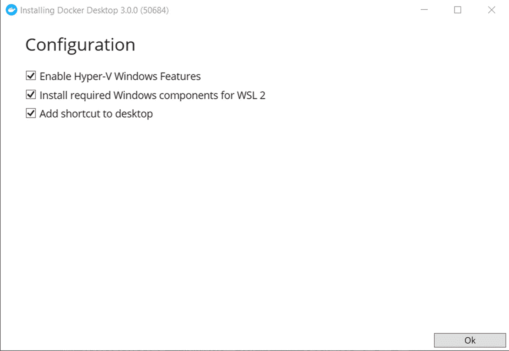
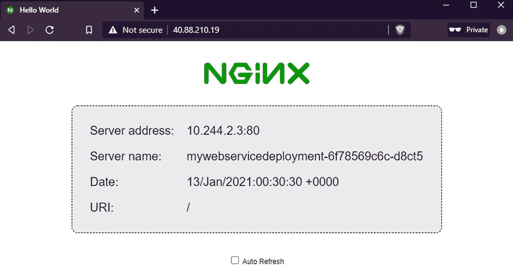

# 八、容器化

严格地说，在构建微服务时，容器和容器化并不是必需的。然而，使用容器有很多好处。在这一章中，我们将介绍两个流行的构建和编排容器的工具:Docker 和 Kubernetes(分别是)。我们将构建一个 Docker 映像，在 Docker Hub 上共享，然后学习如何用 Kubernetes 将其部署到 AKS (Azure Kubernetes 服务)。

## 为什么是容器？

容器是一个独立运行的软件包。你可以把它想象成一个轻量级的虚拟机(比如 VirtualBox 或者 VMWare)。轻量级是因为虚拟机必须包含客户操作系统(Windows、Linux 等。)，容器的抽象更上一层楼，虚拟化了主机操作系统。虽然不是唯一的一个，Docker 是一个非常流行的容器化工具，也是本章唯一涉及的工具。

虽然本章不会深入讨论容器化，但是理解容器的好处以及为什么要使用它们是很重要的。即使你还没有从事微服务架构的工作，你仍然可以从使用 Docker 这样的容器化工具中获益。

### 它在我的机器上工作！

通常，当面对 QA 团队报告的错误时，像我这样的开发人员会试图重现它。当我无法重现这个 bug 时，我会说，“它在我的机器上工作。”在某些时候，一个疲惫的项目经理可能会说，“好吧，让我们把你的机器运送给客户。”

后来，约翰·约安尼迪斯在推特上调侃道，“Docker 就是这样开始的。”约翰在开玩笑，其实离真相不远了。容器允许开发人员在本地运行软件包，将所有需要的东西都内置到容器中。这减少了确保同步所有依赖项的正确版本的需要。它还减少了尝试和找出因人而异、因机器而异的当地环境条件的需要。

有了 Docker 映像，您几乎可以“将您的机器交付给客户”事实上，Docker 网站和标识中使用了船只容器的比喻。通过拥有船只、卡车和火车可以优化的标准容器，船只、卡车和火车操作员不需要具体了解容器中的内容就可以有效地运输容器。

### 登机时

容器和容器组合还可以帮助新的开发人员和新的团队成员快速上手，并减少组件、工具和依赖项的安装。

以我目前的角色为例，我使用了很多后端服务器软件。我运行多个数据库，如 Couchbase Server、SQL Server 和 PostgreSQL，以及通信软件，如 RabbitMQ、Kafka 和 Apache NiFi。更不用说我自己的 ASP.NET Core 容器了(就像你将在本章后面构建的那个)。用 Docker 在容器中安装这个软件，让我有更多的时间去帮助别人解决问题。

它不仅让我安装(和卸载软件)更容易、更快，还能让我在不同版本之间切换。例如，假设我在 Windows 操作系统上直接运行 Couchbase Server 7.0。现在，假设有一个关于 Couchbase Server 6.6.1 的堆栈溢出问题。以下是我可能必须采取的步骤:

1.  从 Couchbase Server 7.0 备份数据。

2.  从 Windows 中卸载 Couchbase Server 7.0。

3.  将 Couchbase Server 6.6.1 下载并安装到 Windows。

4.  完成并回答堆栈溢出问题。

5.  从 Windows 中卸载 Couchbase Server 6.6.1。

6.  安装 Couchbase Server 7.0。

7.  将备份的数据恢复到 Couchbase Server 7.0 中。

另一方面，使用 Docker，我可以“停止”一个 7.0 实例，“启动”一个 6.6.1 实例，处理问题，然后继续使用 7.0，而无需在此过程中丢弃或备份/恢复 7.0 的状态。此外，当您在本章后面看到 Docker 的运行时，您将会看到这个过程是多么高效，尤其是与虚拟机甚至裸机安装相比。

通过使用组合文件(对于 Docker Compose，这是一个 YAML 格式的文件)，新开发人员开始一个项目所需的系统、服务器和软件可以在一个小的 YAML 文件中声明，该文件可以被签入源代码控制。在这个 docker-compose.yml 示例中，三个服务都是以声明方式定义的。`[docker-compose.1.yml]` ( [`https://github.com/Apress/pro-microservices-in-.net-6/blob/main/Chapter8/examples/docker-compose.1.yml`](https://github.com/Apress/pro-microservices-in-.net-6/blob/main/Chapter8/examples/docker-compose.1.yml) )

不要太担心这个文件的细节。我们来看一个缩小版:`[docker-compose.2.yml]` ( [`https://github.com/Apress/pro-microservices-in-.net-6/blob/main/Chapter8/examples/docker-compose.2.yml`](https://github.com/Apress/pro-microservices-in-.net-6/blob/main/Chapter8/examples/docker-compose.2.yml) )

这个组合文件(通常称为 docker-compose.yml)告诉我们这个项目由三个组件组成:一个 web 应用、一个 Microsoft SQL Server 实例和一个 Couchbase 服务器实例。不仅这个 YAML 文件描述了他们，而且 Docker-Compose 将采用这个 YAML 文件并使其发生。如果没有这个文件，我们需要安装 Microsoft SQL Server，安装 Couchbase Server，并手动安装(或者更可能是编译和运行)我们的 ASP.NET web 应用。

只要安装了 Docker，您团队中的新开发人员就可以从您的源代码库中下载最新版本，并且比必须下载、安装和管理每个数据库、排队系统、web 服务器等的开发人员更快地开始工作。，自己反而。更不用说环境因素、操作系统版本、软件版本等可能带来的潜在问题。

### 微服务

到目前为止，您已经了解到，微服务架构比典型的整体架构包含更多的服务。这增加了“在我的机器上工作”的问题，从而增加了像 Docker 这样的容器化工具的有用性。

此外，使用 Docker 来标准化微服务的开发和交付简化了您的微服务架构的整体交付。Docker 提供了一个标准的可交付物(一个图像),可以用来构建容器。这样做的同时，它仍然为开发人员提供了选择他们需要使用的任何技术、模式和工具的灵活性。只要能装进容器，就可以装运。

让我们动手看看 Docker 的工作。

## Docker 是什么？

在安装和使用 Docker 之前，让我们先了解一些基本的 Docker 术语。Docker 引擎是操作系统和各个 Docker 容器之间的桥梁。每个容器都创建有一个 Docker 图像，就像一个蓝图。用面向对象编程的术语来说，图像就像一个类，容器就像一个对象。

您可以自己创建 Docker 图像，方法是使用一个基础图像并在一个或多个图像上分层。图像创建由 Dockerfile 文件定义。你也可以访问 Docker Hub，它有一个由软件公司、开源项目和个人创建的巨大的图片社区。本章将使用 Docker Hub 上的公共图像，Docker Hub 是默认的“提取”图像位置。Docker Hub 也可以托管私有映像。还有其他可用的图像存储库，如 Azure Container Registry (ACR ),它可以存储供私人使用的图像。

与图像和容器交互的一般过程如下:

1.  使用 Docker 创建图像。

2.  将图像推送到 Docker Hub。

3.  其他人可以从 Docker Hub 获取您的图像。

4.  一旦有了图像，就运行基于该图像的容器。

稍后，当我们为微服务构建映像时，我们不必为了使用它而将其发布到 Docker Hub。但是最终您会希望将您的图像发布到一个图像存储库中，以便可以通过编排工具(如 Kubernetes)找到它。

## 安装 Docker

让我们运行 Docker 并探索一些基本概念。您的系统上可能已经运行了 Docker。要进行验证，请打开命令行并执行

```cs
docker -v

```

如果显示了 Docker 版本号，那么您已经安装了 Docker，可以跳到“Docker 基础知识”

否则，请转到 [`https://docker.com`](https://docker.com) 并点击“开始”寻找 Docker 桌面(假设你运行的是 Windows 或 Mac)，如图 [8-1](#Fig1) 所示。我用的是 Docker Desktop for Windows，但 Mac 的过程应该非常相似。


图 8-1

Docker 桌面

对于 Windows，会开始下载一个名为“Docker Desktop Installer.exe”(图 [8-2](#Fig2) )的安装程序。完成后，执行安装程序。


图 8-2

安装程序

在撰写本章时，最新版本是 Docker 3.0.x。您将被引导通过一个简短的安装向导(图 [8-3](#Fig3) )。



图 8-3

配置

向导的第一步将为您提供一些复选框选项。对于 Windows，您需要安装并启用 Hyper-V 功能。如果您使用的是 VirtualBox 或 VMWare 之类的软件，您可能关闭了 Hyper-V 或者没有安装它。

WSL (Windows Subsystem for Linux) 2 不需要使用 Docker，但是如果可以的话，我建议安装它。

Docker 将开始开箱安装(图 [8-4](#Fig4) )。


图 8-4

安装 Docker 桌面 3.0.0

向导的最后一步将告诉您安装已经成功(图 [8-5](#Fig5) )。Docker 现已安装。现在，您应该会在 Windows 任务栏或 Mac 菜单栏中看到带有 Docker 徽标的图标。


图 8-5

安装完成

请注意，Docker 可能会不时提示您可以自动安装的更新。

Docker 也可能会提示您尝试一个教程。如果你愿意，欢迎你自己来过一遍。在继续本章的下一节之前，请确保从命令行验证 Docker 是可用的:

```cs
docker -v

```

让这个命令行保持打开，因为现在我们准备探索一些 Docker 基础知识。

## 码头基础知识

Docker 是一个强大、复杂的工具，具有许多功能。但是对于这一章，我们将只关注几个:创建、启动和停止容器，列出容器和图像，删除容器和图像，以及检查容器。稍后当我们构建图像时，我们将让 Visual Studio 为我们做一些工作。

### 码头运行

要从映像创建容器，请在命令行输入以下内容:

```cs
docker run -d –-name myWebSite -p 8080:80 nginxdemos/hello

```

让我们来分析一下这个命令的每一部分的含义。

#### 奔跑

run 命令将首先创建一个容器，然后启动它。

#### -d

d 指定该映像将在分离模式下运行。分离模式仅仅意味着您将获得命令提示符，而不是将输入/输出的控制权交给 Docker。

#### -命名我的网站

- name 选项允许您给想要运行的容器取一个有用的名称。如果你不指定名字，Docker 会给它分配一个随机生成的名字，这个名字将由一个形容词和一个科学家的名字组成(例如 grumpy_turing)。在这个例子中，我给容器命名为“myWebSite”

#### -p

p 选项指定一个端口映射。这是 Docker 中一个至关重要的概念。使用 Docker for Desktop，所有容器都在同一个 Docker 主机中运行。就像防火墙或您的家庭路由器一样，每个容器的端口都必须“公开”或“映射”以供外部使用。使用-p 8080:80，我告诉 Docker，对于 myWebSite 容器，我希望您公开它的端口 80，但是在外部将其映射到端口 8080。这意味着当我请求通过端口 8080 访问映像时，所有这些请求都会被转发到映像的端口 80。

#### ngirmos/hello

最后，我指定了构建容器的图像的名称。Docker 将首先查看我的本地图像注册中心，看我是否以这个名称创建了一个图像。如果没有找到，那么默认情况下，它将在 Docker Hub 上查找图像(这就是本例中将要发生的情况)。图像将被下载/缓存到我的本地注册表。我选择 nginxdemos/hello 是因为这是一个非常简洁的图片，对于演示来说已经足够了。

运行此命令后，您应该会看到类似如下的输出:

```cs
> docker run -d --name myWebSite -p 8080:80 nginxdemos/hello
Unable to find image 'nginxdemos/hello:latest' locally
latest: Pulling from nginxdemos/hello
550fe1bea624: Pull complete
d421ba34525b: Pull complete
fdcbcb327323: Pull complete
bfbcec2fc4d5: Pull complete
0497d4d5654f: Pull complete
f9518aaa159c: Pull complete
a70e975849d8: Pull complete
Digest: sha256:f5a0b2a5fe9af497c4a7c186ef6412bb91ff19d39d6ac24a4997eaed2b0bb334
Status: Downloaded newer image for nginxdemos/hello:latest
8f5d46c1863312050f13699aff80cff61614657ae596c8edf227d6550d9eadc2

```

运行完这个之后，您现在就有了一个正在运行的容器。因为我们将容器的端口 80 映射到主机的端口 8080，所以您应该能够在您选择的浏览器中输入“localhost:8080”并看到 NGINX hello world(图 [8-6](#Fig6) )。


图 8-6

服务器

### 码头停车

要停止该容器，请使用“停止”命令，如

```cs
docker stop myWebSite

```

“myWebSite”是你给容器起的名字(或者是 Docker 自动分配的名字，如果你之前忽略了使用- name 的话)。

一旦执行了这个 stop，就可以尝试从浏览器访问“localhost:8080”。但是这一次，你的浏览器不会返回任何东西，因为容器不再运行了。

### 码头开始

要让容器再次运行，您不需要使用“docker run”，因为容器已经创建好了。

相反，使用 docker start:

```cs
docker start myWebSite

```

同样，“hello world”页面应该在您的浏览器中返回到“localhost:8080”(图 [8-6](#Fig6) )。在该容器中更改的任何状态(例如，如果它是一个写入磁盘的数据库)仍将保留在该容器中。

### Docker ps

要获取当前正在运行的所有容器的列表，请使用

```cs
docker ps

```

您可以使用-a 标志来获取您创建的所有容器的列表，无论它们是否正在运行。您应该会看到如下所示的列表(被截断以适合页面):

```cs
docker ps
> docker ps -a
CONTAINER ID  IMAGE    COMMAND    CREATED  STATUS  PORTS                  NAMES
8f5d46c18633      nginx...  "nginx..."      38 min        Up      8080->80/tcp  myWebSite

```

您也可以通过单击任务栏中的 Docker 图标来查看该列表。


图 8-7

Docker 图标

### Docker 图像

图像是创建容器的蓝图。即使容器被移除，图像仍然被缓存。您可以获得这些图像的列表:

```cs
docker images

```

这将输出如下所示的列表(被截断以适合页面):

```cs
PS C:\> docker images
REPOSITORY          TAG                IMAGE ID       CREATED        SIZE
nginxdemos/hello    latest             aedf47d433f1   2 years ago    16.8MB
couchbase           enterprise-6.6.0   52d53315bb11   3 months ago   1.18GB
couchbase           enterprise-7.0.0   be0f9a8bda52   5 weeks ago    1.33GB
postgres            latest             c96f8b6bc0d9   2 months ago   314MB
chriseaton/adv...   oltp               d4849fa31749   5 months ago   1.73GB

```

与容器一样，可以通过单击任务栏中的 Docker 图标，然后单击“图像”来查看该列表

### 码头检查

要获得有关容器的信息，请使用“inspect”:

```cs
docker inspect myWebSite

```

Docker inspect 以 JSON 格式输出大量信息。您可以使用- format 参数钻取该信息的特定部分。例如，您可以获得容器的图像名称:

```cs
docker inspect --format='{{.Config.Image}}' myWebSite

```

它将输出:

```cs
nginxdemos/hello

```

### rm 和 rmi 坞站

要移除(删除)容器，必须先将其停止。然后，使用 docker rm:

```cs
docker rm myWebSite

```

要移除(删除)图像:

```cs
docker rmi nginxdemos/hello

```

当前不能有任何容器引用它。例如，如果我试图删除 nginxdemos/hello 图像，而没有首先删除 myWebSite 容器，我会得到类似“来自守护进程的错误响应:冲突:无法删除存储库引用“nginxdemos/hello”(必须强制)-容器<id>正在使用其引用的图像<id>”的错误消息</id></id>

在继续之前，请确保删除 myWebSite 容器，因为我们将不再使用它。

## 微服务和坞站

如前所述，在构建微服务系统时，使用 Docker 来标准化您的交付是非常有益的。在上一节中，我们已经看到了从 Docker Hub 存储库中提取图像。在这一节中，让我们看看如何将您在本书中已经构建的 ASP.NET 微服务容器化。

本节将假设您正在使用 Visual Studio 2019，但在此过程中，我将指出一些用 Docker 命令行完成相同任务的等效方法。

### 添加 Docker 支持

让我们从一个使用 SQL Server 实现持久性的 ASP.NET web 应用开始。如果我们将 web 应用容器化并添加 Docker 支持，我们还需要 SQL Server 能够被 web 应用访问。Docker 容器不一定能够访问 Docker 主机外部的数据库。

但是回想一下前面的“onboarding”和“它在我的机器上工作”的讨论，如果我们能够在 Docker 主机中将 ASP.NET 服务和相应的 SQL Server 数据库组合在一起，将会很有帮助。这至少对开发是有帮助的，即使数据库的实际部署不是通过容器。

### 创建 ASP.NET 形象

让我们从向 ASP.NET web 应用添加 Docker 支持开始。在 Visual Studio 中，右击 ASP.NET 项目，点击“添加”，然后点击“Docker 支持”(图 [8-8](#Fig8) )。


图 8-8

码头支持

Visual Studio 将在该项目的文件夹中创建一个 Dockerfile。这是一个 Docker 可以用来构建图像的文本文件。docker 文件中的内容会根据您使用的 ASP.NET/.NET 版本而有所不同，但它应该类似于[examples/docker file]([)https://github。com/a press/pro-微服务-in-。net-6/blob/main/chapter 8/examples/docker file](https://github.com/Apress/pro-microservices-in-.net-6/blob/main/Chapter8/examples/Dockerfile)

有了这个 Docker 文件，Visual Studio 现在知道如何创建映像、创建容器、将最新的更改部署到容器，以及在 Docker 中运行服务(甚至在调试时)。现在，您应该看到 Docker 是执行选项之一。


图 8-9

Docker 作为执行选项

当您执行 ASP.NET 服务时，Visual Studio 将指示 Docker 创建一个新的映像(如果需要)，创建一个新的容器(如果需要)，并将服务的最新编译部署到该容器中。如果您返回到命令行并尝试“docker ps”和“docker images”，您将看到您的容器(带有:dev 标签)和您的图像分别被列出，类似于

```cs
> docker ps
CONTAINER ID   IMAGE        ...   NAMES
74ce1db05c89   hotshot:dev  ...   hotshot

> docker images
REPOSITORY  TAG     IMAGE ID       CREATED  SIZE
hotshot     dev     31d38aadd403   ...      207MB

```

### 使用坞站-合成

现在 ASP.NET 的图像已经创建好了，但是我们仍然需要一个数据库来处理它。让我们添加“编排”支持(协调管理多个容器的能力)。同样，在 Visual Studio 中右键单击该项目，单击“添加”，这次单击“Container Orchestrator 支持”现在选择“Docker 撰写”。尽管我们将在本章后面使用 Kubernetes，Docker Compose 提供了对编排的简单介绍，这对入职流程仍然很有用。


图 8-10

容器编排

Visual Studio 现在将在您的解决方案中创建一些新文件，但我们今天只看 docker-compose.yml。YAML 是一个对空白敏感的 JSON 超集，通常用于容器和编排对象的配置和定义。生成的 docker-compose.yml 的内容应该类似于[docker-compose . 3 . yml]([https://github。com/a press/pro-微服务-in-。net-6/blob/main/chapter 8/examples/docker-compose。​3.yml](https://github.com/Apress/pro-microservices-in-.net-6/blob/main/Chapter8/examples/docker-compose.3.yml)

这里只定义了一个服务:ASP.NET web 服务。让我们向这个 YML (YAML)文件添加另一个服务，以将 SQL Server 添加为数据库。(如果您已经安装了 SQL Server 并在 Docker 之外运行，您可能希望将其关闭，以避免从现在开始出现任何端口冲突。)

在与您的服务名相同的缩进级别(例如，前面示例中的“hotshot”)，添加另一个名为“mssql”的服务:[docker-compose . 4 . yml]([)https://github。com/a press/pro-微服务-in-。net-6/blob/main/chapter 8/examples/docker-compose。​4.yml](https://github.com/Apress/pro-microservices-in-.net-6/blob/main/Chapter8/examples/docker-compose.4.yml)

下面是对“mssql”下面每一行的简短解释:

#### 图像

这是 Docker 将尝试检索以构建 mssql 容器的图像的名称。微软将 SQL Server 镜像发布到 Docker Hub，我们准备使用最新的 SQL Server 2019 镜像。

#### 环境

Environment 是一个值数组，这些值将被设置为容器中的环境变量。环境变量可用于多种目的，但在本例中，我们指定了两件事:我们同意 SQL Server 的 EULA(最终用户许可协议)，我们希望使用用户名 SA(默认系统管理员)和密码“myStrongPassword1！”创建一个登录名

#### 港口

这是另一个包含端口映射列表的数组，类似于我们之前在“docker run”中所做的在这种情况下，端口号完全是可选的:两个服务将位于 Docker 主机内部的同一个“网络”上，并且您不需要在它们之间开放端口号。然而，作为一名开发人员，我们可能希望使用类似 JetBrains 的 SQL Server Management Studio 或 DataGrip 这样的工具来访问 SQL Server。SQL Server 映射到 1433 的默认端口 1433 将允许我们使用这些工具。

在对 docker-compose.yml 进行更改时，Visual Studio 会注意到并立即执行“docker-compose”命令。Docker Compose 将下载图像(如果需要)，构建容器，并启动这些容器。同样，您可以在命令行使用“docker ps”来查看已经创建的内容(被截断以适合页面):

```cs
> docker ps
CONTAINER ID   IMAGE                        NAMES
5ec134336780   hotshot:dev                  hotshot
e03fc5ddc657   mcr.microsoft.com/mssql...   dockercompose71729...

```

现在，Docker 中运行着一个 web 服务器和一个数据库服务器。你如何让你的 web 服务器与你的数据库对话？回想一下 docker-compose.yml 文件中的名字:[examples/docker-compose . 4 . yml]([https://github。com/a press/pro-微服务-in-。net-6/blob/main/chapter 8/examples/docker-compose。​4.yml](https://github.com/Apress/pro-microservices-in-.net-6/blob/main/Chapter8/examples/docker-compose.4.yml)

Docker 有自己的 DNS 服务。您指定的“mssql”名称现在是 SQL Server 的主机名。因此，ASP.NET 服务中的连接字符串应该如下所示

```cs
Server=mssql;Database=myDatabase;User=sa;Password=myStrongPassword1!

```

重要提示:当您在 Visual Studio 中关闭您的解决方案时，这些图像也将被关闭*并删除*。保存到数据库的任何状态都将被清除(除非您使用 Docker 卷，这将不在本章讨论)。

还有一个重要的注意事项:前面使用的 SQL Server 映像中没有任何预定义的数据库、表或数据。由于端口 1433 是开放的，您可以用其他工具创建这些。或者，您可以创建自己的自定义 SQL Server Docker 映像，它将为您创建一个数据库。

### 推入坞站集线器

当您到达想要发布容器映像的地方(QA、staging、production 等)时，就该将您的映像推送到映像存储库了。对于这一章，我们将使用 Docker Hub，因为它是默认的。

### 建立形象

首先，我们需要建立一个形象。Docker Compose 一直在构建用于开发的映像(注意前面的“hotshot:dev”)，但是我们希望构建一个适合部署的映像。在 Visual Studio 中，您可以通过右键单击“Dockerfile”并选择“构建 Docker 映像”来实现这一点


图 8-11

构建 Docker 映像

另一种选择是使用命令行。例如，尝试

```cs
docker build -f "c:\path\to\hotshot\hotshot\Dockerfile" -t hotshot "c:\path\to\hotshot"

```

这告诉 Docker 使用指定的 Dockerfile 构建一个映像，将其命名为“hotshot”，并使用给定的路径作为 Dockerfile 中包含的指令的“当前目录”。您可能会收到一条类似“您正在针对非 Windows Docker 主机从 Windows 构建 Docker 映像”的错误消息这可能没问题。这只是一个警告，说明您正在构建一个 Linux 映像(假设您选择了 Linux ),并且文件权限在 Linux 中的工作方式略有不同。Docker 对图像中的文件非常宽容。这只是提醒您，如果您想要减少权限，您将需要修改 Dockerfile 文件。

接下来，运行“docker images”来查看您构建的映像是否在您的本地映像库中列出。它应该看起来像这样:

```cs
REPOSITORY   TAG        IMAGE ID       CREATED          SIZE
hotshot      latest     21eaa0802a9c   15 minutes ago   258MB
...
...

```

请注意,“最新”标签已应用于该图像。这对您的本地存储库来说很好。但是，当您推出 Docker Hub 时，您很可能会希望对其进行不同的标记。

### 码头推送

推送至 Docker Hub 需要您拥有 Docker Hub 账户。

一旦你有了一个 Docker ID 的账户(图 [8-12](#Fig12) 中虚构的“微服务大亨”)，你就可以开始向 Docker Hub 推送图片了。


图 8-12

创建码头工人 ID

从命令行，让我们首先给我们的图像一个标签，而不是“最新的”例如，如果这是版本 1，我们可以将其标记为“v1”我还将在标记时使用我的 Docker ID。

```cs
docker image tag hotshot:latest microservicemogul/hotshot:v1

```

现在你的图像已经准备好了。执行推送:

```cs
docker push microservicemogul/hotshot:v1

```

这可能需要一段时间，取决于您的图像有多大。您应该会看到一个类似于

```cs
> docker push microservicemogul/hotshot:v1
The push refers to repository [docker.io/microservicemogul/hotshot]
f63f310c667d: Pushing [==============>                              ]  14.68MB/50.71MB
1d2bedf89fe2: Pushed
33e20f752cf0: Pushing [===================================>      ]  12.81MB/17.85MB
17c445eb92ad: Pushing [===========>                                ]  18.15MB/76.77MB
b19f476f8dd3: Pushed
5128b7cb97a9: Pushing [========>                                   ]  7.238MB/41.33MB
87c8a1d8f54f: Pushing [=>                                          ]  2.714MB/69.23MB

```

当图像完成后，您将能够在登录到您的 Docker Hub 帐户后查看它(图 [8-13](#Fig13) )。


图 8-13

坞站集线器

那么为什么要添加 v1 标签呢？最终，标记策略(如果有的话)取决于您和您的团队。然而，在实际部署您的图像时，有一个标记会非常方便。

我们一直在使用 Docker，但现在是时候探索使用容器编排器进行部署了。Docker 有自己的 orchestrator，称为 Docker Swarm。然而，Kubernetes 的受欢迎程度普遍超过了 Docker Swarm(以及 Mesos 等其他对手)。这就是本章使用 Kubernetes 的原因。

## 忽必烈忽必烈忽必烈忽必烈忽必烈忽必烈忽必烈忽必烈忽必烈忽必烈

Kubernetes 是一个容器编排工具，有时缩写为“K8S”，用“8”代替“Kubernetes”中“K”和“S”之间的字母。就像我们前面看到的 Docker Compose 一样，它允许您声明性地定义多个服务。与 Docker Compose 不同，它可以管理整个*集群*的机器(与 Docker Compose 在一台机器上运行所有东西相反)。

如果您的应用只包含一个 ASP.NET web 服务、一个数据库和少量用户，那么 Kubernetes 可能是多余的(就目前而言)。但是，如果你正在部署一个微服务、数据库、通信软件等的系统。，使用像 Kubernetes 这样的工具是非常有益的。您不仅可以标准化部署，而且现在还可以管理部署的规模和/或多个实例。例如，Kubernetes 可以满足您部署多个 web 服务器(在负载均衡器后面)来处理流量增加的需求。

Kubernetes 是一个具有许多功能的工具，但对于这一章，我想将其归结为我使用的简单心智模型(图 [8-14](#Fig14) )。Kubernetes 是一个工具，您向它提供机器(节点)和 YAML 文件，它产生一个部署。


图 8-14

永恒的物体

在上图中，Kubernetes 对象是由 YAML 文件定义的。Kubernetes 对象可以是各种“种类”，比如部署、服务等。例如，一个部署对象可能会说(用英语解释)，“我想要两个 ASP.NET 服务运行，并给它们加上‘hot shot’标签。”一个服务对象可能会说(再一次，用英语解释)，“我想要一个有公共 IP 的负载平衡器，它会挑选一个标有‘hot shot’的 pod 来引导流量。"

“节点”是一台可以部署一个或多个容器的机器:每台机器都必须运行一个容器运行时(最常见的是 Docker)和一套其他 Kubernetes 组件。一组节点组成一个“集群”当需要更多(或更少)资源时，可以在集群中添加或删除节点。

给定一个集群和一些 YAML，Kubernetes 将按照 YAML 中的指示，在节点上创建“pods”。pod 通常运行单个容器。如上图所示，给定节点可以运行一个或多个单元，具体取决于资源要求和限制。Kubernetes 玩一个“俄罗斯方块”游戏，创建并安装在豆荚里。就像俄罗斯方块一样，容器可能会消失(如果容器中的软件崩溃或关闭)。但 Kubernetes 会持续监控其集群的状态。如果它发现一个豆荚不见了，它会创造另一个豆荚来代替它。

通过使用 Kubernetes 来编排系统，我们可以进行部署:

*   声明性的(我们告诉 Kubernetes 做什么，而不是自己去做)

*   有弹性(Kubernetes 将自行恢复损坏的豆荚)

*   可伸缩(我们指定想要部署的实例数量，Kubernetes 确保实例数量继续存在)

*   标准化的“基础设施即代码”(YAML 文件都遵循 Kubernetes API，部署都在容器中管理)

此外，由于 Kubernetes 是一种开源技术，我们可以在任何我们喜欢的地方创建一个 Kubernetes 集群。您可以在您的办公室、您公司的数据中心创建一个 Kubernetes 集群，或者您可以使用您首选的云供应商提供的 Kubernetes 服务。在下一节中，我们将看看如何在 Azure Kubernetes 服务(AKS)上部署 Kubernetes 集群。然而，大多数主要的公共云都有一些 Kubernetes 的等效实现。

## 蓝色立方体:AK 步枪

如果您还没有，您可能需要创建一个 Microsoft Azure 帐户(提供免费帐户和入门点数)。但是，一旦设置了 AKS 集群，剩下的说明应该适用于您可以使用的任何 Kubernetes 集群。

您可以通过 Azure 门户网站 UI、Azure Cloud Shell 命令行(Azure 门户上的浏览器内)或通过安装 Azure CLI 从本地命令行创建 AKS 集群。我更喜欢 Azure CLI，因为我也更喜欢使用 Kubernetes CLI (kubectl ),无论如何，您稍后都需要 Azure CLI 来连接到集群。然而，至少看一次运行中的 UI 可能有助于您熟悉可用的选项，即使您不打算在日常工作中使用它。

### 蓝色门户网站

首先，在 [`https://portal.azure.com`](https://portal.azure.com) 使用您的帐户登录 Azure 门户。接下来，单击“创建资源”图标。从这里，点击或搜索“容器”，然后“Kubernetes 服务。”您将看到一个逐步向导来创建集群。对于“基础”页面，我已经填写了项目细节和集群细节(图 [8-15](#Fig15) )。


图 8-15

创建立方群集

在“主节点池”下(图 [8-16](#Fig16) )，你可以选择你想要使用哪种类型的 Azure 计算资源(图 [8-17](#Fig17) )作为你的节点。如果您只是作为一名开发人员来评估 AKS，那么您可能希望选择更便宜、性能更低的机器(比如我选择的“标准 B2s ”),并将节点数保留为 3。


图 8-17

虚拟机大小


图 8-16

主节点池

但是，根据您的需要，您可能希望选择更昂贵的机器和/或更多的机器来填充您的节点池。

稍后，您还可以设置“自动缩放”(图 [8-18](#Fig18) )来自动满足需求。


图 8-18

自动缩放

这是一个需要仔细考虑和监控的功能，因为您可能会惊讶于大额账单(如果您将最大节点数设置得太高)和/或在压力下失败的微服务系统(如果您将最大节点数设置得太低)。

欢迎您浏览其余的创建步骤，以了解您将来可能需要的更多配置选项。现在，如果您正在跟进，您可以将向导中的其余步骤保留为默认设置，并单击“Review + create”验证完成后，单击“创建”。供应节点并使它们成为 Kubernetes 集群的一部分并不是瞬间完成的。您将看到“部署正在进行中”(图 [8-19](#Fig19) )。


图 8-19

部署正在进行

完成后，您现在在一个资源组(在我的例子中称为“apress-rg”)中有了一个 Kubernetes 集群(在我的例子中称为“a press-rg”)。

### 蓝色 CLI

继续之前，请在您的计算机上安装 Azure CLI。Azure CLI 可用于 Windows、Mac、Linux，甚至在 Docker 映像中。你也可以直接在你的浏览器中运行 Azure 云壳(图 [8-20](#Fig20) )(点击门户网站右上角的“云壳”图标)。


图 8-20

蓝色 CLI

Azure CLI 准备就绪后，在命令行运行“az–version”。您应该会看到类似以下内容的输出

```cs
> az --version
azure-cli                         2.17.1
core                              2.17.1
telemetry                          1.0.6

Python location 'C:\Program Files (x86)\Microsoft SDKs\Azure\CLI2\python.exe'
Extensions directory 'C:\Users\mgroves\.azure\cliextensions'

Python (Windows) 3.6.8 (tags/v3.6.8:3c6b436a57, Dec 23 2018, 23:31:17) [MSC v.1916 32 bit (Intel)]

Legal docs and information: aka.ms/AzureCliLegal

Your CLI is up-to-date.

```

第一步是使用 CLI 登录到您的 Azure 帐户。执行“az 登录”，这将打开一个浏览器。按照说明操作。

接下来，我们将创建一个 Azure 资源组和 AKS 集群，就像我们在 UI 中所做的一样。同样，您可能希望使用“az 帮助”,尤其是“az aks–帮助”,以查看所有可用的配置选项。但是，像我们在 UI 中所做的那样配置集群可以用两个命令来完成:

```cs
> az group create --name apress-rg --location eastus

> az aks create --resource-group apress-rg --name apressAksCluster --generate-ssh-keys --node-vm-size "Standard_B2s"

```

就像 UI 一样，Azure 需要一些时间来提供节点。完成后，您将在命令行上看到一个巨大的 JSON 读数。

### 连接到集群

在继续之前，您需要安装 Kubernetes CLI。该工具适用于 Linux、Windows 和 Mac。一旦安装完成，在命令行运行“kubectl 版本-客户端”。您应该会看到类似以下内容的响应

```cs
> kubectl version --client
Client Version: version.Info{Major:"1", Minor:"13", GitVersion:"v1.13.3", GitCommit:"721bfa751924da8d1680787490c54b9179b1fed0", GitTreeState:"clean", BuildDate:"2019-02-01T20:08:12Z", GoVersion:"go1.11.5", Compiler:"gc", Platform:"windows/386"}

```

现在您已经创建了一个 AKS Kubernetes 集群，您需要将您的 kubectl 客户机连接到它。还有一个特定于 Azure 的步骤可以做到这一点:

```cs
> az aks get-credentials --resource-group apress-rg --name apressAksCluster
Merged "apressAksCluster" as current context in C:\Users\myusername\.kube\config

```

从现在开始，你不用做任何 Azure 特有的事情。您只需使用 kubectl 命令行工具与您创建的 Kubernetes 集群进行交互。同样的命令可以用于其他 Kubernetes 集群，无论它们是在 Azure、AWS、Google 等平台上。

### 定义无间隙对象

让我们创建一些简单的 YAML 文件来定义一个 web 服务和一个负载平衡器。首先，创建一个名为“app.yaml”的文件:

```cs
apiVersion: apps/v1
kind: Deployment
metadata:
  name: mywebservicedeployment
spec:
  selector:
    matchLabels:
      app: mywebservice
  replicas: 3
  template:
    metadata:
      labels:
        app: mywebservice
    spec:
      containers:
      - image: "nginxdemos/hello"
        resources:
          limits:
            memory: 128Mi
            cpu: 500m
        imagePullPolicy: Always
        name: mywebservice
        ports:
          - containerPort: 80

```

这里有很多内容要介绍，但是仔细阅读之后，它应该开始成为 Kubernetes 的一组声明性指令。

#### apiVersion(堆叠版本)

这是为了指定 Kubernetes API 版本。目前是版本 1。

#### 种类

这就是你想要创造的那种资源。部署将导致创建一个或多个 pod。YAML 的其余内容很大程度上取决于您选择的类型。

#### 元数据

这定义了关于部署本身的信息。我们现在只需要一个名字。

#### 投机

规范之下(spec)是真正定义部署的地方。分离舱的说明在这里。

#### 规格副本

这指定了该部署要创建和维护多少个 pod。先说 3。我们可以很容易地添加或删除这个数字改变以后。从字面上看，你需要做的只是改变数字和更新对象，Kubernetes 会处理剩下的事情。

#### 规格模板

另一个嵌套级别，这个区域定义了每个 pod 应该遵循的规范。

#### 规范.模板.元数据

此元数据将应用于每个 pod。这在接下来创建负载平衡器对象时变得很重要。

#### 规格.模板.容器

这是一个数组(YAML 数组中的每个元素都以“-”开头)，它定义了应该在 pod 中部署哪些容器。将来您可能想要创建多容器 pod，但是现在我们将它保持在一个容器中。

#### spec.template .容器[0]。图像

这是要在此窗格中使用的 Docker 图像的名称。默认情况下，这将看向 Docker Hub。使用私有存储库需要额外的配置。在前面的例子中，我再次使用 nginxdemos/hello 图像(这对于后面的演示很有用)。如前所述，在这里使用标签是个好主意；否则，Kubernetes 会认为是“最新的”，这可能不是您想要的。

#### spec.template .容器[0]。资源

理想情况下，无论我们选择什么样的容器，都不会占用太多资源。但是，指定资源限制是个好主意。

#### 规格. template.containers[0]。imagePullPolicy(映像策略)

在开发、测试和试运行期间，您可以继续更新 Docker 映像，而无需创建新的标记。如果这样做，请确保将其设置为 Always 否则，pod 将继续使用旧的缓存版本。

#### spec.template .容器[0]。名字

为创建的每个 pod 指定一个名称。

#### spec.template .容器[0]。港口

与 Docker 非常相似，您可以在这个数组中指定要打开的端口。

Kubernetes 将创建这些 pods，但是现在我们需要一种方法让客户端的浏览器向它们发出请求。拥有副本的目的是分散负载(这有时被称为*水平扩展*)。由于这些是无状态的 HTTP 应用，我们可以简单地使用负载均衡器来管理传入的请求，并在副本之间分配它们。创建另一个名为 loadbalancer.yaml 的 YAML 文件:

```cs
apiVersion: v1
kind: Service
metadata:
  name: myweb
spec:
  type: LoadBalancer
  ports:
  - port: 80
  selector:
    app: mywebservice

```

这里没什么可看的。注意,“种类”现在是“服务”规范中的类型是 LoadBalancer。最后要指出的重要一点是选择器:它告诉 Kubernetes 负载平衡器*请求将被转发到哪个*pod:任何标记为“mywebservice”的 pod。

### 部署到集群

这是一个很大的挑战，还有很多选项和设置需要探索，但是现在，我们基本上是告诉 Kubernetes，我们希望 3 个 pods(服务器)的“hello”映像运行，一个负载平衡器坐在它们前面，代理 HTTP 流量。要在 AKS 集群上实际创建这个部署，请运行以下命令:

```cs
> kubectl apply -f app.yaml
deployment.apps/mywebservicedeployment created
> kubectl apply -f loadbalancer.yaml
service/myweb created

```

Kubernetes 将立即为您工作，创建您指定的 pod 和服务。值得一提的是，如果这些 pod 崩溃，Kubernetes 将创建并启动新的 pod 来取代它们。此外，如果您想进行更改(比如将副本从 3 更改为 4)，请将更改保存到您的 YAML 文件，并使用“kubectl apply”或“kubectl replace”让 Kubernetes 知道您的更改。

让我们列出所有的豆荚:

```cs
> kubectl get pods
NAME                                      READY   STATUS    RESTARTS   AGE
mywebservicedeployment-6f78569c6c-cbndf   1/1     Running   0          108s
mywebservicedeployment-6f78569c6c-d8ct5   1/1     Running   0          108s
mywebservicedeployment-6f78569c6c-x2bjx   1/1     Running   0          108s

```

记下 pod 名称。它们在每个名称的末尾都有一个随机生成的元素(例如“d8ct5”)，我们稍后将再次看到。

我们可以获得所有服务的列表:

```cs
> kubectl get services
NAME        TYPE          CLUSTER-IP    EXTERNAL-IP   PORT(S)        AGE
kubernetes  ClusterIP     10.0.0.1      <none>        443/TCP        9m13s
myweb       LoadBalancer  10.0.219.161  40.88.210.19  80:31679/TCP   2m5s

```

请注意，名为“myweb”的负载平衡器有一个外部 IP 地址。在 web 浏览器中打开此 IP(您获得的 IP 将与我的不同)。您应该会看到一个与图 [8-21](#Fig21) 非常相似的页面。



图 8-21

外部 IP 地址

这个应该看着眼熟。请特别注意显示的服务器名称。它应该与之前的一个 pod 名称相匹配。尝试从其他浏览器和设备访问此网站。你可能会被引导到一个不同的舱。这告诉我们负载平衡器正在完成它的工作。

### 部署数据库

对于像 web 服务器这样的无状态应用，我们有了一个非常好的开始。然而，对于像数据库、消息队列等有状态应用来说。，采取同样的方法将是困难的，至少有两个原因:崩溃的 pod 会被自动替换，横向扩展数据库更具挑战性。Kubernetes 提供了两个工具可以提供帮助:StatefulSets 和 Operators。

#### 吊舱更换

第一个问题是吊舱更换。一个无状态的 web 应用可以被销毁和重新创建，并继续按设计运行而不会被中断。然而，当一个 pod 崩溃时，我们前面定义的 Kubernetes 部署不会将任何数据保存到内存或磁盘中。例如，它将创建一个带有数据库映像的 pod，但是它将是一个空白的板。

#### 水平缩放

第二个问题是水平缩放。如果您打算使用跨多台机器的分布式数据库(Kubernetes 集群中的一个数据库集群)，那么这些机器中的每一台都必须能够找到彼此、建立通信并进行协调。如果其中一个崩溃，一个简单的 Kubernetes 替换不仅会丢失其状态，还会丢失与其数据库兄弟的通信。与无状态 web 应用不同，简单的负载平衡器不会执行复制数据的工作。

#### 状态集

Kubernetes 提供了另一个管理有状态应用的 API:stateful sets。与部署不同，状态集中的每个 pod 都维护自己的身份。此身份可用于附加永久卷。重新启动后，该卷可以由新的 pod 装载，并且它将基本上从旧的、被破坏的 pod 停止的地方继续。

#### 运算符模式

在您的微服务架构中可以使用许多有状态的应用(数据库和排队系统是最常见的)。Kubernetes 提供了一个丰富的 API，但是仅仅用基线 API 来管理软件(有状态的或者其他的)常常是不优雅或者低效的。Kubernetes 允许创建提供特定于应用的 API 的定制资源。例如，如果我想将 Couchbase 服务器部署到我的 AKS 集群，我可以使用 Couchbase 自治操作符。在我的集群中安装了操作符之后，我现在可以创建 CouchbaseCluster、CouchbaseBucket 等类型的对象。，带着自己的 YAML 风味。

Kubernetes 运营商生态系统一直在扩大，Kafka、Spark 和众多数据库(Cassandra、蟑螂、PostgreSQL、Redis 和前面提到的 Couchbase)都有运营商。如果可能的话，我强烈建议尽可能使用 operator 模式。

## 摘要

本章仅仅触及了容器化和编排的表面。有很多东西要学。社区和工具仍在成长和改进。这个非常高层次的概述不是你旅程的结束，只是开始。

首先，知道*为什么*你追求容器和编排是很重要的。当你第一次开始的时候，它可能看起来像许多额外的步骤。如果你没有建立一个复杂的微服务系统，现在还不值得投入。然而，即使作为一名开发人员，Docker 的知识也可以帮助您在日常工作中更有效率。

在本章中，您构建了一个映像并启动了一个容器。Visual Studio 可以帮助您完成大部分工作，但是了解如何使用命令行导航的基础知识将有助于您理解幕后发生的事情。与 git 非常相似，即使您很少使用命令行，在需要时使用它也是很有帮助的。

最后，您用 YAML 创建了 Kubernetes 对象，并将它们部署到 Azure AKS 集群中。Kubernetes 和 Docker 可以合作来标准化您的 onboarding、部署和依赖关系。用于 Docker Compose 和/或 Kubernetes 的声明式 YAML 允许您从代码中创建基础设施。这些代码可以与您的团队共享、审查并签入源代码控制。您可以使用 Docker 将您的机器运送给客户，也可以使用 Kubernetes 将您的整个数据中心运送给任何您想要的云提供商。