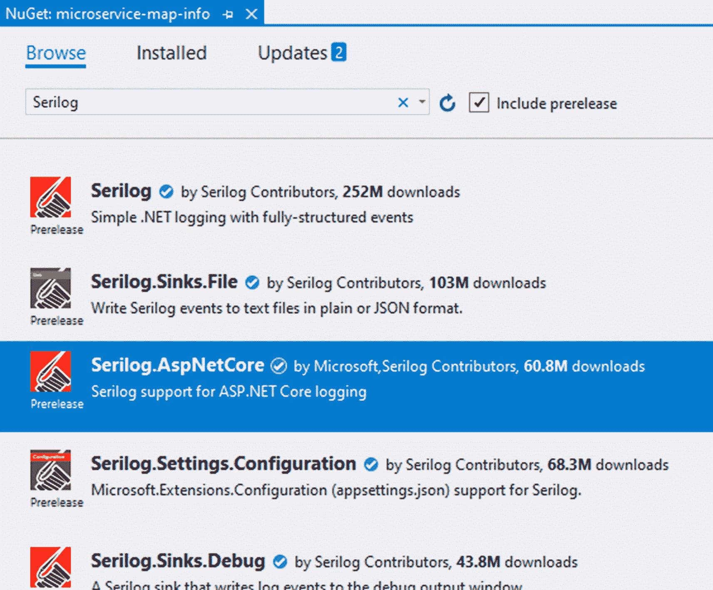
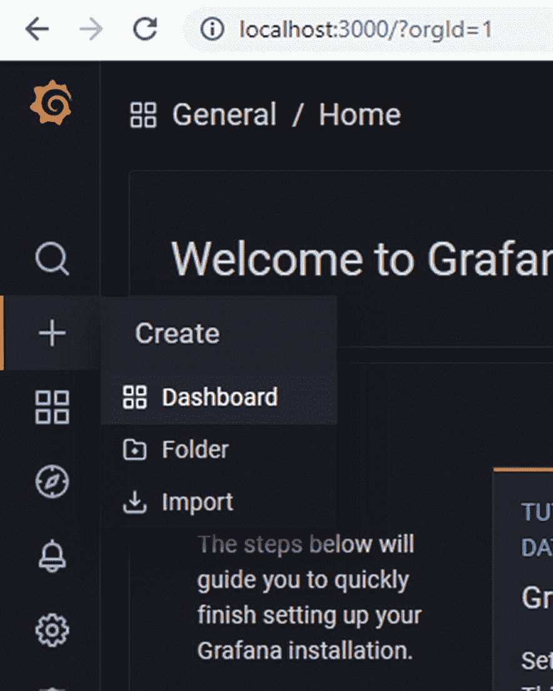
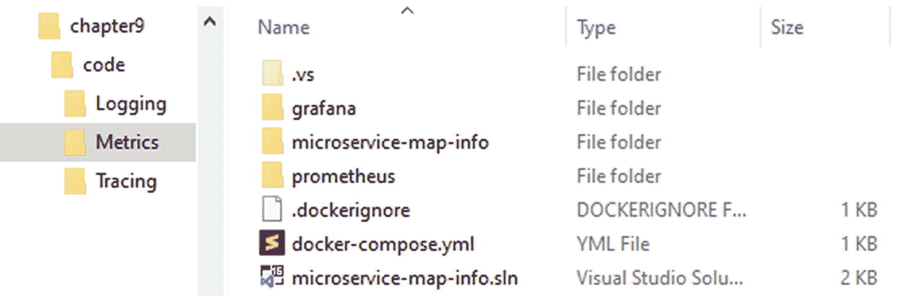
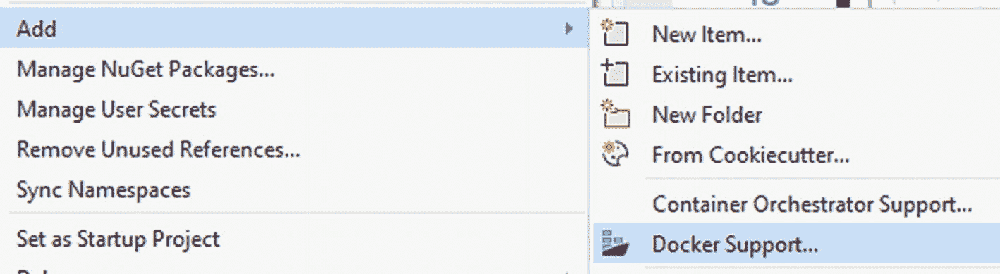
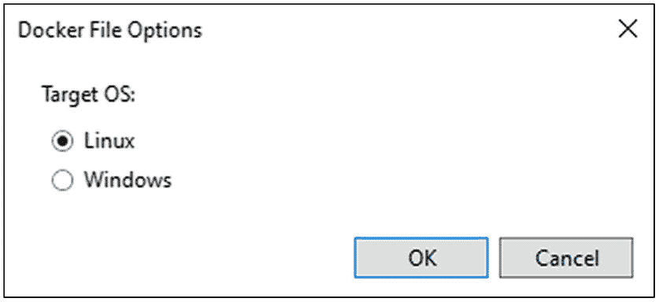
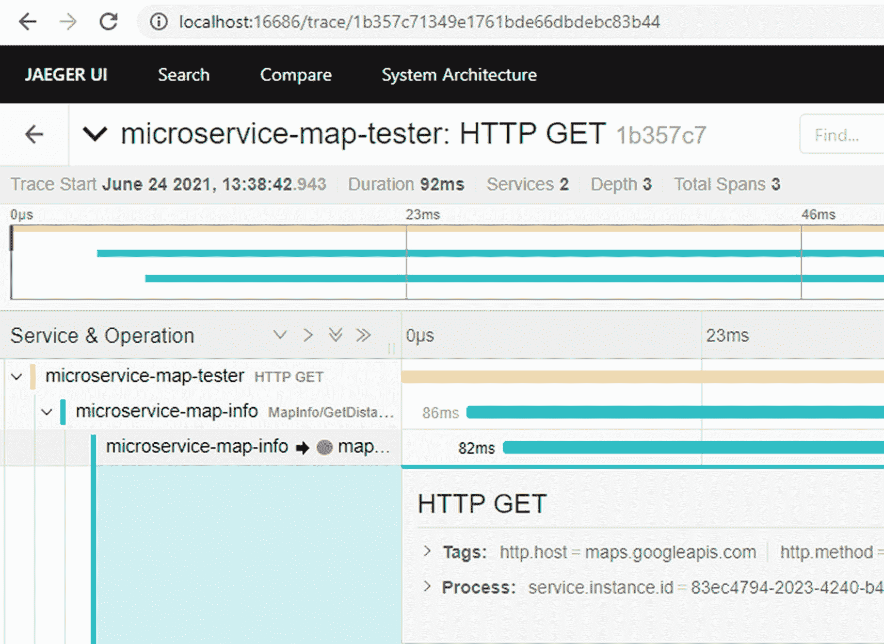

# 九、健康的微服务

当你想到保持微服务健康时，你会想到什么？大概是关于失败吧。如果它是健康的，你可能根本不会去想它。为了确保服务保持健康，需要进行大量的工作来监控、警报、验证和纠正服务。本章着眼于容器内的监控系统，以及如何为我们的微服务添加健康监控。

Code Whiz 的开发人员 Kathy 正在享受新的微服务，用于收获距离和建立发票。这些服务与单一的应用融合在一起。但现在，她的任务是确保系统运行良好。

让我们来看看收获跟踪、日志和度量，从我们的服务中公开健康检查，并使用 OpenTelemetry 收集它们。

## 健康吗？

当我们看一个微服务的时候，我们怎么知道它运行的好不好？当您查看服务时，如果它运行正常，您可能没有注意到。但是如果它运行的很差，你可能会注意到很多。

让我们从列举微服务可能出现的问题开始:

*   不响应网络流量。

*   数据处理不正确。

*   使用太多内存。

*   跑得慢。

*   引发了异常。

*   系统崩溃了。

*   另一个进程表现不佳，阻塞了资源。

*   运行系统更新。

*   硬件出现故障。

我们如何补偿这种行为的服务？天真的方法——通常是我们的第一次尝试——是向它扔东西。它跑得慢吗？让我们买一个更大的处理器。它占用了太多内存吗？让我们给机器增加更多的内存。另一个进程是否有干扰？让我们把它移到它自己的机器上。硬件有问题吗？让我们运行多个副本。这通常可以为我们赢得时间，但这是一项非常昂贵的努力。

当我们达到高可用性时，我们需要冗余和功能良好的系统。让我们更深入地看看如何正确处理这个问题。

## 我们去哪里找？

我们需要一种系统诊断的方法。我们当然可以在这个问题上砸钱，但这不是一个可靠的方法。相反，我们需要了解系统如何运行，并在系统出现故障时有条不紊地采取行动加以纠正。

在考察一个系统时，我们可以列举一些我们想知道的关于这个系统的问题:

*   它正在处理多少请求？

*   它使用了多少内存？

*   失败的请求百分比是多少？

*   是什么导致了异常？

当我们列举这些问题时，群体开始形成。微软的软件工程师 Francisco Beltrao，很好地列举了三组主要观点，他向。NET 开发人员:我们需要日志记录、跟踪和度量。

**日志**–日志向我们展示某个时间点的事件。例如，系统启动，或者抛出异常。这些日志可能包含额外的详细信息，如堆栈跟踪、事件的日期和时间、当前正在处理的 URL 以及已登录的已验证用户。这些组与其他组的区别在于它们是一个时间点，没有持续时间。

**追踪**–追踪帮助我们将用户的旅程(事件的顺序)放在一起。除了日志中的详细信息之外，每个跟踪还通过关联 id 或请求 id 与之前和之后的事件相关联。我们可以通过跟踪日志跟踪用户从浏览器应用到 API 网关，通过微服务到数据存储的旅程。虽然日志可以告诉我们数据库是否超时，但是跟踪可以告诉我们这是否导致他们放弃购物车或者他们是否再次尝试。痕迹可以告诉我们他们通过销售漏斗的旅程。

**指标**–指标为调查增加了时间因素。日志标记一个时间点，一个事件。相比之下，度量不需要起始点；指标是关于系统的持续统计数据。我们每秒处理多少请求？HTTP 状态不是 200 的失败请求的百分比是多少？CPU 使用率是否高于正常水平？

当我们研究一个系统时，我们需要所有三组洞察力。让我们记录下什么时候发生了异常，什么时候部署了新的版本。让我们跟踪系统间的请求，以了解用户使用模式，并给出异常的上下文和可再现性。让我们收集系统和应用指标，以了解系统是否受到约束或表现不佳。

## 记录

### ASP.NET 岩心和系列测井

在第 4 章中，我们构建了一个微服务来获取给定两个地址的距离。让我们将日志添加到这个服务中。随着我们添加日志记录，我们将能够跟踪事件细节，并使用这些日志中的细节来诊断异常故障。

从第 [4 章](4.html)中打开 microservice-map-info.sln，在服务文件夹中打开`DistanceInfoService.cs`。我们来看一下`GetMapDistanceAsync()`的方法。在这种方法中，我们可以发现一些可能出错的地方:

1.  如果`originCity`或`destinationCity`为空或无效怎么办？

2.  如果`googleDistanceApiKey`过期或者没有设置怎么办？

3.  如果`client.SendAsync()`因为无法建立连接而抛出异常怎么办？

4.  如果响应没有得到成功状态码，导致`response.EnsureSuccessStatusCode()`抛出异常怎么办？

5.  如果我们过于频繁地调用服务，而 API 告诉我们已经超出了我们的限制，该怎么办？

6.  如果发生了我们没有预料到的其他事情，比如内存不足错误、套接字关闭、机器重启产生了`ThreadAbortException`，或者许多其他事情，该怎么办？

我们希望捕获这些异常，并确保我们有必要的细节来诊断问题，并在请求失败时修复错误。我们需要什么信息来获得这个上下文？

1.  出发地城市和目的地城市。

2.  响应状态代码和响应正文。

3.  发出请求的客户订单——遗憾的是，我们在服务中没有这些信息。

虽然记录 API 密钥很诱人，但这将导致机密泄露。如果我们发现所有的请求都失败了，并且没有看到跨请求的模式，我们可以检查这些秘密。

记录请求 URL 也很有诱惑力。这可能会加快诊断速度，因为我们可以很容易地重现问题。然而，这些数据可以很容易地从始发地和目的地城市获得，并且 URL 包含了我们没有明确记录的秘密。我们也不要记录这些数据。

我们现在要做一个决定。我们希望在这个方法内部还是在调用方法中记录日志？如果我们用这个方法登录，我们需要一种方法向调用者发出失败的信号。如果我们登录控制器，我们可能会丢失响应的上下文。在这种情况下，让我们任意决定登录控制器。

在控制器文件夹中，打开`MapInfoController.cs`。

在构造函数中，接受一个附加参数`ILogger<MapInfoController>`，并将其设置为私有字段。此外，按照指示添加 using 语句:

```cs
private readonly ILogger<MapInfoController> _logger;

public MapInfoController(DistanceInfoService distanceInfoService, ILogger<MapInfoController> logger)
{
  _distanceInfoService = distanceInfoService;
  _logger = logger ?? throw new ArgumentNullException(nameof(logger));
}

```

为什么我们接受一个`ILogger<T>`其中 T 是当前的类？因为我们可以根据错误的来源过滤日志。在`appsettings.json`的日志部分，我们为不同的名称空间提供了不同的日志级别。

在操作中，将对服务的调用包装在 try/catch:

```cs
[HttpGet]
public async Task<GoogleDistanceData> GetDistance(string originCity, string destinationCity)
{
  try
  {
    return await _distanceInfoService.GetMapDistanceAsync(
      originCity, destinationCity);
  }
  catch (Exception ex)
  {
    _logger.LogError(ex);
  }
}

```

当我们记录时，我们选择适合我们记录的数据的日志级别。在这种情况下，这是一个错误，所以我们选择`LogError()`。按照严重性从最低到最高的顺序，我们有跟踪、调试、信息、警告、错误和严重。 <sup>[2](#Fn2)</sup>

现在我们正在记录这个异常。让我们修改这个方法，以获取额外的上下文来帮助我们诊断错误。将记录器行从

```cs
_logger.LogError(ex);

```

对此:

```cs
_logger.LogError(ex, $"Error getting address details from Google: {originCity} to {destinationCity}");

```

现在我们有了输入参数，但是没有响应状态代码或主体。这些可能是`HttpRequestException`的一部分。 <sup>[3](#Fn3)</sup> 让我们为`HttpRequestException`再添加一个 catch 博客:

```cs
  try
  {
    return await _distanceInfoService.GetMapDistanceAsync(
      originCity, destinationCity);
  }
  catch (HttpRequestException ex)
  {
    _logger.LogError(ex,
      $"Error getting map distance: ${originCity} to ${destinationCity},
      status code: {ex.StatusCode}");
  }
  catch (Exception ex)
  {
    _logger.LogError(ex, $"Error getting address details from Google: {originCity} to {destinationCity}");
  }

```

最后一部分是确保我们向调用者返回一个错误的 HTTP 状态代码。更改方法的返回类型，并返回状态代码 500。下面是完整的方法:

```cs
[HttpGet]
public async Task<ActionResult<GoogleDistanceData>> GetDistance(string originCity, string destinationCity)
{
  try
  {
    return await _distanceInfoService.GetMapDistanceAsync(
      originCity, destinationCity);
  }
  catch (HttpRequestException ex)
  {
    _logger.LogError(ex,
      $"Error getting map distance: ${originCity} to ${destinationCity},
      status code: {ex.StatusCode}");
    return StatusCode(500);
  }
  catch (Exception ex)
  {
    _logger.LogError(ex,
      $"Error getting map distance: ${originCity} to ${destinationCity}");
    return StatusCode(500);
  }
}

```

在这个例子中，我们依赖于从`response.EnsureSuccessStatusCode`生成的`HttpRequestException`。正如大卫·福勒指出的，<sup>T34</sup>响应体被从这个异常中移除，以避免异常成为控制流。获取响应体并返回包含 HTTP 状态代码和成功或失败对象的特定回复对象可能更有效。John Thiriet 有一个关于这种技术的很棒的代码示例 <sup>[5](#Fn5)</sup> 。

我们如何测试错误处理？我们可以运行应用并向它发送坏数据。更好的是，我们可以创建一个模拟`HttpClient`并返回错误代码的单元测试。你可以在第 7 章中了解更多关于测试微服务的信息。

如果我们想减少日志记录呢？在`appsettings.json`中，它列出了默认的日志级别:

```cs
{
  "Logging": {
    "LogLevel": {
      "Default": "Information",
      "Microsoft": "Warning",
      "Microsoft.Hosting.Lifetime": "Information"
    }
  }
}

```

目前默认`LogLevel`设置为`"Information"`。这意味着不会记录跟踪和调试消息。如果我们将此更改为`"Error"`，那么信息消息也将被忽略。如果我们将此设置为`"None"`，那么控制台将不会记录任何内容。

我们可以针对特定的名称空间进行调整。在默认配置中，名称空间中任何以`Microsoft`(比如`Microsoft.AspNetCore.Mvc`)开头的代码只有在消息为`"Warning"`或更高时才会被记录。我们不会在日志中得到微软的调试信息。Kestrel 的请求/响应消息是从`Microsoft.Hosting.Lifetime`名称空间中的一个类记录的，因此默认情况下，该日志会显示信息。这是排除聊天库日志的好方法，这样我们就可以专注于重要的日志内容。

错误日志放在哪里？使用这种默认配置，错误将被发送到控制台。如果我们在容器中运行，我们可以将控制台输出和容器指标一起路由到我们选择的日志收集器。如果在 IIS 中运行，我们可以告诉 IIS 将这些细节记录到一个文件中。

如果我们想要对日志的去向有更多的控制呢？为此，我们可以使用 Serilog。ASP.NET 没有包含 Serilog，但它已经成为. NET 中收集和路由日志消息的标准方式。让我们添加 Serilog 来将微服务的日志路由到一个文件中。

打开 NuGet 包管理器，切换到 Browse 选项卡，并键入 Serilog。

安装`Serilog.AspNetCore`包、`Serilog.Sinks.File`包、`Serilog.Settings.Configuration`包，如图 [9-1](#Fig1) 所示。第一条电线连接到 ASP.NET。第二个允许我们记录到一个文件。第三个可以从标准配置位置读取配置，包括`appsettings.json`、环境变量和命令行参数。



图 9-1

选择 Serilog。*获取软件包，但不获取 Serilog 本身

更换`Program.cs`以初始化`Main()`中的记录器，并在`CreateHostBuilder()`中设置 Serilog:

```cs
public class Program
{
  public static int Main(string[] args)
  {
    // Mimic the configuration options in Host.CreateDefaultBuilder()
    var env = Environment.GetEnvironmentVariable("ASPNETCORE_ENVIRONMENT")
      ?? "Production";

    var configuration = new ConfigurationBuilder()
      .SetBasePath(Directory.GetCurrentDirectory())
      .AddJsonFile("appsettings.json")
      .AddJsonFile($"appsettings.{env}.json", true)
      .AddEnvironmentVariables()
      .AddUserSecrets(typeof(Program).Assembly)
      .AddCommandLine(args)
      .Build();

    // Initialize Serilog's logger
    Log.Logger = new LoggerConfiguration()
      .ReadFrom.Configuration(configuration)
      .CreateLogger();

    try
    {
        CreateHostBuilder(args).Build().Run();
        return 0;
    }
    catch (Exception ex)
    {
        Log.Fatal(ex);
        return 1;
    }
    finally
    {
        Log.CloseAndFlush();
    }
  }

  public static IHostBuilder CreateHostBuilder(string[] args) =>
    Host.CreateDefaultBuilder(args)
      .UseSerilog() // <-- Replace Microsoft's logging with Serilog
      .ConfigureWebHostDefaults(webBuilder =>
      {
        webBuilder.UseStartup<Startup>();
      });
}

```

获得配置细节需要走很长一段路。在`Host.CreateDefaultBuilder()`内部有一个类似的收集配置源的路径。但是我们需要在调用`CreateHostBuilder()`之前创建记录器，所以我们也必须在这里完成。

现在我们已经有了从配置中读取的所有 Serilog 代码，打开 appsettings.json，让我们用“Serilog”部分替换“Logging”部分:

```cs
{
  "Serilog": {
    "Using": [ "Serilog.Sinks.File" ],
    "MinimumLevel": "Information",
    "Override": {
      "Microsoft": "Warning",
      "Microsoft.Hosting.Lifetime": "Information"
    },
    "WriteTo": [
      {
        "Name": "File",
        "Args": {
          "path": "logs/log.txt",
          "rollingInterval": "Day",
          "rollOnFileSizeLimit": true
        }
      }
    ],
    "Enrich": [ "FromLogContext", "WithMachineName", "WithThreadId" ],
    "Properties": {
      "Application": "MapInfo"
    }
  },
  "AllowedHosts": "*",
  "googleDistanceApi": {
    "...snip..."
  }
}

```

我们现在已经安装了 Serilog，所有的日志都将被记录到日志文件中，而不是控制台中。我们可以将所有这些配置转移到`Program.cs`中的代码中，但是通过在`appsettings.json`中设置它，我们可以很容易地用注入到容器中的环境变量覆盖这些部分。如果它被硬编码到我们的应用中，这种按环境重新配置是不可能的。

我们已经将系统配置为每天滚动日志文件，以避免文件变得太大。虽然我们没有在这里设置它，但是我们也可以配置保留多少这样的文件，自动删除最旧的文件。这是记录文件时的最佳实践。如果没有这一点，很容易得到一个大到我们无法有效读取的文件，或者大到它填满了磁盘并使系统崩溃。也可能很容易获得太多的文件，以至于填满磁盘，或者使读取文件夹中的文件变得低效。仔细了解日志文件通常有多大，旧日志对组织有多大价值，以及有多少空间可用于记录。如果日志需要持续更长时间，或者日志需要更多空间，请考虑将它们发送到另一个位置或系统。

在这种情况下，我们选择将日志发送到一个文件。相反，我们可以选择将日志发送到另一个服务，如 Splunk 实例、弹性集群、AWS Cloud Watch 之类的云日志程序或 NewRelic 或 PagerDuty 之类的第三方服务。花点时间添加其他 Serilog 同步包，并调整配置文件以将数据保存到您选择的日志平台。

### 避开“上帝”课

当代码高手 Kathy 查看这些日志代码时，她可以看到一些常见的模式。我们正在列举异常细节；如果没有内容，我们会避开日志。Kathy 渴望将这种逻辑集中化，所以我们不需要在每个项目中重复它。

在大多数情况下，我们依靠干巴巴的原则:不要重复自己。Kathy 试图构建一个所有项目都可以继承的中央日志记录类。这是一种反模式，我们应该避免它。但是，在我们的内心深处，DRY 原则依然存在:我们希望避免重复的代码。我们为什么要在这里改变路线？为什么我们不应该将这些共享代码复制到一个中央基础库中呢？

这些共同关心的问题很容易被收集和复制。今天是伐木。明天它将枚举枚举值。下周我们将集中收集整理。很快，我们就有了一个非常大的图书馆:上帝课堂。

到目前为止，所有的决定都是合理的。我们小心翼翼地走在这条路上，做出了当时我们能做出的最好的选择。但现在我们面对的是一个每个军种都必须继承的庞然大物。我们变成了我们试图避免的东西。我们正试图从整体重构到微服务，而不是相反。

god 类是有时相关的库的集合。客户端 Hyp-Log 的前一名员工创建了一个神级库，其中包括日志库、URL 解析库、一些 LINQ 助手方法、使用 Dapper 时的 ADO.NET 查询助手、实体框架助手方法的分叉版本，以及一个帮助纠正机器时钟时间偏差的库。

这种微服务地图信息服务需要所有这些功能吗？可能不会。Kathy 当然希望她可以直接引入添加日志记录的 NuGet 包，而不必让`Program.cs`从 corporate god 类继承来初始化它。凯西还希望能够快速升级 Serilog，而不必等待 Hyp-Log 升级神级库。

当构建这些实用程序库时，您应该更喜欢组合而不是继承，更喜欢小块而不是大的实用程序库。在 Kathy 的例子中，是的，有几行 Serilog 配置我们必须复制，还有几行我们必须添加到`Program.cs`中。但是很可能不值得花力气把它抽象出来。抽象会变得过于固执己见。在这种情况下，最好将这些行复制到位，保留 Serilog 和。网络日志。

随着日志记录的进行，我们还需要以一种额外的方式了解我们的微服务的健康状况:指标。

## 韵律学

我们添加了日志记录来跟踪单一事件。现在让我们看一下累积和聚合事件的指标。这种聚合的元数据有助于理解服务的平均响应速度、请求失败的百分比以及其他比单个请求/响应甚至单个异常更广泛的事件。

在微服务中，跟踪指标过去是用 Prometheus 捕获的，可视化事件是用 Grafana 完成的。两者都是开源产品，可以很容易地集成到大大小小的架构中。

不像大多数日志记录系统，软件将内容推入其中，Prometheus 接触每个包，通常是一个 HTTP 端点，并要求度量。这种方法的优点是 Prometheus 不需要做假设:服务的数据在传输过程中丢失了吗？目标系统离线了吗？指标丢失了吗？相反，Prometheus 将以可配置的时间间隔查询服务，并获取所有指标。

Grafana 不是可视化指标的唯一仪表板，但它是一个很好的选择，因为它与 Prometheus 无缝连接。Kathy 可以轻松制作仪表板，直接查询 Prometheus 数据或从大量社区贡献的解决方案中导入预构建的仪表板。

Prometheus 和 Grafana 一起已经成为从不同系统收集指标的事实上的标准。让普罗米修斯和格拉夫纳都旋转起来。然后，我们将添加从 ASP.NET 收集指标所需的代码。Data Whiz 开发人员可以进一步扩展这个解决方案，以监控其他新的或遗留的服务，无论是用。. NET。网核，或者说。NET 框架。许多其他基础设施组件可能会公开 Prometheus 接收器，这些接收器也允许从这些硬件和软件系统收集指标。

### 普罗米修斯和格拉夫纳

升级软件最简单的方法是通过容器，Prometheus 和 Grafana 也不例外。如果你还没有，请前往 [`https://docker.com/`](https://docker.com/) 安装 Docker 桌面。一旦它开始运行，我们就能发射所有我们需要的容器。

我们需要为 Prometheus 和 Grafana 创建一个数据文件，我们将从一个`docker-compose.yaml`文件启动这两个容器。虽然普罗米修斯是伟大的警报，为了简洁起见，我们将跳过这里设置的警报。

#### 普罗米修斯

让我们从一个新的度量文件夹开始。创建一个名为 metrics 的新文件夹。在这个文件夹中，我们将创建一个 docker-compose 文件、`prometheus`文件夹和`grafana`文件夹。

我们的第一站是`docker-compose.yaml`档。在 metrics 文件夹中，创建一个名为`docker-compose.yaml`的新文件，并包含以下内容:

```cs
version: '3'

services:
  prometheus:
    image: prom/prometheus
    ports:
      - 9090:9090
    volumes:
      - ./prometheus:/etc/prometheus
      - prometheus-data:/prometheus
    command: --web.enable-lifecycle --config.file=/etc/prometheus/prometheus.yaml

volumes:
  prometheus-data:

```

`docker-compose.yaml`文件是一个 YAML 文件，所以缩进是用两个空格完成的。像 Python 一样，如果您混合使用空格和制表符，或者使用多于或少于两个空格，就会出错。让我们快速浏览一下这个合成文件中的细节。

该文件基于来自[`https://hub.docker.com/r/prom/prometheus`](https://hub.docker.com/r/prom/prometheus)Docker Hub 的图像定义了`prometheus`容器。它暴露了 9090 端口，所以我们可以从`http://localhost:9090/`攻击普罗米修斯。它还告诉 Prometheus 使用`prometheus.yaml`文件来获取配置细节。接下来让我们建造这个。

在 metrics 中创建一个名为`prometheus`的新文件夹。在`prometheus`文件夹中，创建一个名为`prometheus.yaml`的文件，包含以下内容:

```cs
global:
  scrape_interval: 15s
  evaluation_interval: 15s

scrape_configs:
  - job_name: prometheus
    static_configs:
    - targets:
      - 'prometheus:9090'

  - job_name: doesnotexist
    static_configs:
    - targets:
      - 'doesnotexist:567'

```

在`prometheus/prometheus.yaml,`中，我们开始定义时间。默认情况下，普罗米修斯将每分钟查看一次每个目标。为了加速我们的成功之旅，我们会更频繁地这样做:每 15 秒钟一次。

接下来，我们定义要从中收集数据的系统。第一项工作是从普罗米修斯本身收集数据。默认情况下，Prometheus 使用 HTTP 并点击 URL /metrics，因此 Prometheus 作业的完整 URL 是`http://prometheus:9090/metrics`。这将非常有用，因为容器在上面的 docker-compose 文件中被命名为`prometheus`。

接下来的工作是一个不存在的系统。我们将点击`http://doenotexist:567/metrics`，它将失败，我们将看到成功和失败的指标。

安装了 Docker 和这两个文件后，我们就可以启动 Prometheus 了。在 metrics 文件夹中启动终端或命令提示符，并运行以下命令:

```cs
docker-compose up

```

当 Docker 下载图像和 Prometheus 开始工作时，我们会看到大量的控制台输出。一旦它开始运行，打开浏览器`http://localhost:9090,`我们就有了普罗米修斯！

等等，为什么 URL 在 Docker `http://prometheus:9090`里面，而我们正在启动`http://localhost:9090/?` Docker 自动将流量通过它的路由器转发到容器的暴露端口。我们可以认为这很像我们家里的 Wi-Fi 路由器或我们办公室的路由器。如果我们想在家里托管许多网站，它们都将进入我们的公共 IP。从路由器的配置屏幕中，我们将特定的公共端口转发到我们选择的机器。docker-compose 文件列出了这个映射:`9090:9090`说，“将端口 9090 上的公共 IP(在我们的例子中是本地主机)连接到端口 9090 上的‘机器’(容器)`prometheus`”

现在我们已经在`http://localhost:9090`上加载了普罗米修斯网站，让我们四处看看。在状态菜单中，选择目标。我们可以看到我们定义的两个目标:`prometheus`正在运行，而`doesnotexist`离线。

点击左上方的普罗米修斯名称，您将返回普罗米修斯主页。从这里，我们可以运行查询来查看 Prometheus 正在收集的指标。在框中，键入

```cs
up

```

该查询显示两个系统，显示一个在线，一个离线。接下来，键入以下查询:

```cs
prometheus_http_requests_total

```

该查询显示 Prometheus 服务过的唯一 web 地址及其服务次数。

现在我们已经发射了普罗米修斯，让我们也发射格拉夫纳。

#### 格拉凡娜

我们需要停止普罗米修斯容器，这样我们就可以添加格拉夫纳容器。在终端中，按 Ctrl+C，然后运行

```cs
docker-compose down

```

这个命令将停止并删除 docker-compose 文件中的所有容器。一旦完成，普罗米修斯和格拉夫纳不再运行。

现在让我们添加 Grafana 的细节。在 metrics 文件夹中，打开`docker-compose.yaml`并添加`grafana`内容。这是新文件:

```cs
version: '3'

services:
  prometheus:
    image: prom/prometheus
    // ... omitted for brevity ...

  grafana:
    image: grafana/grafana
    ports:
      - 3000:3000
    volumes:
      - ./grafana:/etc/grafana/provisioning/datasources
      - grafana-data:/var/lib/grafana
    environment:
      - GF_SECURITY_ADMIN_PASSWORD=admin

volumes:
  prometheus-data:
  grafana-data:

```

这里我们已经添加了 Grafana 容器，它是从 [`https://hub.docker.com/r/grafana/grafana`](https://hub.docker.com/r/grafana/grafana) 的 Docker Hub 拉过来的。我们将传递下一步要构建的配置文件，并公开端口 3000。我们还将密码设置为 admin，以便于登录。

接下来，在 metrics 文件夹中，创建一个名为`grafana`的文件夹，并在其中添加一个名为`prometheus_ds.yaml`的新文件。下面是`grafana/prometheus_ds.yaml`的内容:

```cs
datasources:
- name: Prometheus
  access: proxy
  type: prometheus
  url: http://prometheus:9090
  isDefault: true

```

在`grafana/prometheus_ds.yaml`文件中，我们已经配置了到普罗米修斯的路径。虽然我们肯定可以在用户界面中这样做，但是在这里做要简单得多。Grafana 容器到 Prometheus 容器的 URL 是`http://prometheus:9090/`。

回到终端，仍然在 metrics 文件夹中，我们准备启动两个容器。在终端中键入以下内容:

```cs
docker-compose up

```

现在普罗米修斯号和格拉夫纳号都发射了。可以刷新`http://localhost:9090`看普罗米修斯。然后浏览到`http://localhost:3000`看 Grafana。用户名是 admin，我们也将密码设置为 admin。

我们可以看到仪表板是空的。让我们添加一个新图表。点击左上方的加号菜单，选择仪表板，如图 [9-2](#Fig2) 所示。



图 9-2

添加新仪表板:单击“+”，然后单击仪表板

单击 Add Empty Panel，我们可以配置这个新指标。我们在左上角看到一个示例图，在左下角看到数据源细节，在右边看到其他配置细节。

在左下方，我们来配置图表。在数据源中，从“- Grafana -”切换到“Prometheus”，然后在 Prom 查询窗口中键入以下内容:

```cs
rate(prometheus_http_request_duration_seconds_count[5m])

```

在右上角，将标题从“面板标题”更改为“普罗米修斯请求”，然后单击右上角的“应用”。

现在我们可以看到新的图表，但我们看到的是过去的 6 个小时。在右上角，单击 6 小时，并将其更改为最后 5 分钟。

在右上角，单击加号按钮添加另一个面板。像以前一样选择数据源，并输入以下查询:

```cs
process_cpu_seconds_total

```

设置面板标题，然后单击“应用”。在右上角，单击保存图标，为这个新仪表板命名并保存它。

我们创建了一个新的仪表板，但这需要一点工作来将所有的指标都调整到合适的位置。让我们从社区中引入一个预构建的仪表板。

在左上方，单击加号按钮，然后选择 import。在提示输入 URL 或 id 的框中，输入 id 1229。在底部，选择 Prometheus 数据源，然后单击 import。

我们可以在 [`https://grafana.com/grafana/dashboards`](https://grafana.com/grafana/dashboards) 浏览社区贡献的仪表盘图库，具体看一下 [`https://grafana.com/grafana/dashboards/1229`](https://grafana.com/grafana/dashboards/1229) 的这个仪表盘。现在，这个仪表板相当稀疏，因为它将显示关于 Docker 的详细信息。让普罗米修斯监控 Docker 桌面。

#### 监控码头

在终端中，按 Ctrl+C，然后运行

```cs
docker-compose down

```

这将停止 Grafana 和 Prometheus，但是因为我们已经将他们的数据保存到 Docker 卷中，所以当我们启动备份时，指标和仪表板将仍然存在。

通过单击鲸鱼图标(Windows 的右下角任务栏，Mac 的右上角菜单栏)并选择设置，打开 Docker 设置。在 Docker 设置部分，添加以下行(如果它们不存在):

```cs
"metrics-addr": "127.0.0.1:9323",
"experimental": "true"

```

确保 JSON 文件中的所有行都以逗号结尾，最后一行除外。这几行告诉 Docker Desktop 暴露一个普罗米修斯水槽。单击应用并重新启动。

为什么我们没有使用端口 9090 来匹配普罗米修斯的其他工作？我们使用端口 9090 作为 docker-compose 文件的一部分，所以我们会在 docker 路由器的公共端得到一个端口冲突。Docker docs <sup>[6](#Fn6)</sup> 使用端口 9323 作为度量，因此这似乎是一个不错的随机选择。

既然 Docker Desktop 曝光了 Prometheus metrics，那就浏览到`http://localhost:9323/`看看吧。是的，这是一大堆指标。

打开`prometheus/prometheus.yaml`，我们来添加 Docker 目标。文件现在看起来像这样:

```cs
global:
  scrape_interval: 15s
  evaluation_interval: 15s

scrape_configs:
  - job_name: prometheus
    static_configs:
    - targets:
      - 'prometheus:9090'

  - job_name: idonotexists
    static_configs:
    - targets:
      - 'idonotexists:567'

  - job_name: docker
    scrape_interval: 5s
    static_configs:
    - targets:
      - 'host.docker.internal:9323'

```

为什么我们使用`host.docker.internal`而不是 localhost？由于 Docker 桌面中 Docker 路由器的魔力，来自我们本地机器的 Localhost 将工作得很好。但是 Prometheus 容器中的 localhost 就是它自己。这个神奇的词在 Windows 和 Mac 的 Docker 桌面上非常好用，可以从 Docker 虚拟网络内的容器回到主机。

现在我们已经配置了 Docker 目标，让我们启动 Prometheus 和 Grafana 看看。从终端运行的度量文件夹中，运行

```cs
docker-compose up

```

运行后，浏览到`http://localhost:3000`。使用用户名 admin 和密码 admin 登录，从控制面板列表中，单击 Docker 引擎指标。那看起来好多了。我们现在可以看到许多关于 Docker 桌面引擎的指标。完成浏览后，在终端中，按 Ctrl+C，并通过运行

```cs
docker-compose down

```

普罗米修斯和格拉夫纳是伟大的监控系统。现在让我们将普罗米修斯监控添加到谷歌位置服务中。

### ASP.NET·普罗米修斯水槽

在第 4 章中，我们构建了一个微服务来获取给定两个地址的距离。让我们将 Prometheus metrics 导出添加到该服务中。随着 Prometheus sink 的就位，我们将能够可视化微服务的健康状况，了解正常处理是如何工作的，并识别和警告异常活动。我们将从收集所有常用的 ASP.NET 指标开始，然后我们将添加一些自定义指标。



图 9-3

从第[章第 4 章](4.html)复制的新微服务地图信息文件夹

从第 [4 章](4.html)中复制 microservice-map-info.sln 和 microservice-map-info 文件夹，并设置在 metrics 文件夹中，如图 [9-3](#Fig3) 所示。然后在 Visual Studio 中打开 microservice-map-info.sln。在解决方案资源管理器中，右键单击 microservice-map-info 项目，然后选择“管理 NuGet 包”。点击浏览选项卡，搜索`prometheus-net.AspNetCore`并安装。

接下来，我们将配置普罗米修斯接收器。 <sup>[7](#Fn7)</sup> 开`Startup.cs`。在底部的 Configure 方法中，添加这两行:

```cs
public void Configure(IApplicationBuilder app, ...)
{
  // ...
  app.UseRouting();
  app.UseHttpMetrics(); // <-- add this line
  // ...
  app.UseEndpoints(endpoints =>
  {
    // ...
    endpoints.MapControllers();
    endpoints.MapMetrics(); // <-- add this line
  });
}

```

我们添加的第一行捕获了所有的 ASP.NET 指标，重要的是它在`UseRouting()`之后，这样它可以捕获控制器细节。我们添加的第二行公开了/metrics 端点，因此 Prometheus 可以使用这些指标。

接下来，我们将在`ConfigureServices`方法中捕获来自`HttpClient`的指标:

```cs
public void ConfigureServices(IServiceCollection services)
{
  // ...
  services.AddHttpClient("googleApi", client =>
  {
    // ...
  }).UseHttpClientMetrics(); // <-- add this line
  // ...
}

```

有了所有这些，开始在 Visual Studio 或 VS 代码中调试 API，并浏览到`https://localhost:5001/metrics`。在那里看到所有的指标真是太好了。浏览到`https://localhost:5001/swagger`，点击试用，运行几次服务。然后回到`https://localhost:5001/metrics,`，你可以看到新的细节。完成后，停止调试器。

接下来，我们需要将这个服务容器化，将其添加到 docker-compose 文件中，并一起启动所有部分。

再加一个`Dockerfile`。在解决方案资源管理器中，右键单击 microservice-map-info 项目，选择添加，然后从下一个菜单中选择 Docker 支持。我们使用 Linux 容器，所以在 OS 选择框中选择 Linux。这增加了一个`Dockerfile`和一个`.dockerignore`文件。我们可以精简这些文件，使它们更有效，更少混乱，但它们现在还能正常工作。

下一站是`docker-compose.yaml`文件，我们将在这里添加构建该容器并与 Prometheus 和 Grafana 一起运行所需的细节。将微服务地图信息内容添加到`docker-compose.yaml`:

```cs
version: '3'

services:
  prometheus:
    # ... omitted for brevity ...

  grafana:
    # ... omitted for brevity ...

  microservice-map-info:
    build: microservice-map-info
    ports:
      - 80:80

volumes:
  # ... omitted for brevity ...

```

最后一站是告诉普罗米修斯如何监控这个站点。因为我们在 docker-compose 文件中将容器命名为 microservice-map-info，所以从 Prometheus 容器的角度来看，度量的 URL 是`http://microservice-map-info:80/metrics`。打开`prometheus/prometheus.yaml`，添加微服务地图信息内容:

```cs
global:
  # ...
scrape_configs:
  - job_name: prometheus
    # ... omitted for brevity ...

  - job_name: idonotexists
    # ... omitted for brevity ...

  - job_name: docker
    # ... omitted for brevity ...

  - job_name: microservice-map-info
    static_configs:
    - targets:
      - 'microservice-map-info:80'

```

我们在 ASP.NET 服务中添加了一个 Prometheus sink，在`docker-compose.yaml`文件中添加了 ASP.NET 项目，并告诉 Prometheus 如何查询细节。让我们点燃它，带它去兜风。

从终端的 metrics 文件夹中，通过运行

```cs
docker-compose up

```

一旦全部运行完毕，进入`http://localhost:80/swagger`，点击试用并执行几次服务，以建立一些有趣的指标。然后前往`http://localhost:9090/`。在列表中看到任何新的指标了吗？目标列表看起来怎么样？

现在让我们前往`http://localhost:3000/`的 Grafana，绘制这些指标的图表。登录 Grafana 后，单击左上方的加号并选择 import。添加仪表板 id 10427，在底部选择普罗米修斯，然后选择导入。添加另一个仪表板并选择 id 10915。然后在 [`https://grafana.com/grafana/dashboards`](https://grafana.com/grafana/dashboards) 查看其他社区仪表盘，导入几个更有趣的仪表盘。

完成后，将容器停在码头:

```cs
docker-compose down

```

#### 自定义指标

现在我们已经收集了所有的标准指标，让我们看看这些指标的业务价值。看看微服务地图信息，它消耗了谷歌地图地理定位 API。Google 限制了每个 API 键对这个服务的使用，所以了解我们调用 API 的次数以确保我们没有滥用这个有限的资源会很有帮助。

在 Visual Studio 中加载 microservice-map-info.sln，打开 Services 文件夹，打开`DistanceInfoService.cs`。让我们添加一个普罗米修斯度量来计算 API 调用的数量。

在服务的顶部，定义并初始化计数器

```cs
public class DistanceInfoService : DistanceInfo.DistanceInfoBase
{
  private static readonly Counter googleApiCount = Metrics.CreateCounter(
    "google_api_calls_total",
    "Number of times Google geolocation api is called.");
  // ...

```

为什么这个计数器是静态的？打开`Startup.cs`，在`ConfigureServices,`中我们注意到这个服务被定义为 Scoped。作用域服务意味着将为每个请求创建一个新的实例，在请求结束时，实例被垃圾收集。我们不希望我们的普罗米修斯指标只适用于单个请求。通过将这个计数器定义为 static，我们将拥有整个应用的一个度量，而不管哪个请求调用它。

在`GetMapDistanceAsync`方法中，在调用执行请求之前递增计数器:

```cs
public async Task<GoogleDistanceData> GetMapDistanceAsync(...)
{
  // ...

  googleApiCount.Inc(); // <-- add this line
  var response = await client.SendAsync(request);

  // ...
}

```

现在，让我们使用新的指标重新启动它。从终端:

```cs
docker-compose build && docker-compose up

```

我们需要重新构建容器，因为`up`只会验证容器是否存在，而不是它是否是最新的。

在 http://localhost:3000/上登录 Grafana，创建一个新面板，捕获我们刚刚添加的指标:

```cs
increment(google_api_calls_total)

```

将它进一步扩展到捕获请求持续时间、请求成功计数和失败原因的直方图，包括 HTTP 状态代码和 Google API 结果状态，可能会很有趣。看看是否可以将这些额外的指标添加到微服务中，并在 Grafana 仪表板中显示详细信息。

我们已经获得了指标，因此我们现在知道它发生了多少次。但是是什么导致了这一切呢？接下来发生了什么？为此，我们深入研究了 OpenTelemetry 的追踪功能。

## 追踪

分布式跟踪是通过各种服务收集用户路径的过程。代码高手 Kathy 的任务是增加各种服务调用链的可见性。我们想知道 monolith 何时调用 Google Maps API 微服务，传递什么参数，以及系统结果。为此，我们将利用 OpenTelemetry。

它是如何工作的？当用户在应用中的功能之间和软件中的服务之间来回移动时，我们如何跟踪用户的进度？相关 id。关联 id 是与这个请求相关联的惟一 id，我们可以用它将这个请求的所有元素联系在一起。我们可以获取具有相同关联 id 的所有跟踪，并且我们知道它们是同一个请求的一部分。我们可以忽略所有具有不同关联 id 的跟踪，知道它们是不同请求的一部分。我们可以选择将这个关联 id 作为一个额外的 HTTP 头在服务之间传递。

如果我们并行运行两个任务会发生什么？如果相关 id 源自同一个原始请求，我们如何保持它们的独立性？那就是我们升级追踪 id 的地方。轨迹跨度表示当前正在完成的工作。这个 span 有一个惟一的 id，它还可以选择有一个父跟踪 id。当我们遍历系统时，我们想要跟踪的每个工作将开始一个新的跨度，继承以前的跟踪作为其父跟踪 id，并为这个工作构建一个新的唯一跟踪 id。

这将创建一个嵌套的生成树，其中每个生成树都基于与父跟踪 id 的匹配链接回父生成树。我们可以想象这棵树看起来很像 Git 历史树或直方图的数据集。

OpenTelemetry 的仪器跟踪跨度，并在开始新的跨度时自动获取父跟踪 id，以跟踪新的工作。OpenTelemetry 使用`traceparent` HTTP 头 <sup>[8](#Fn8)</sup> 在服务之间传递数据。很像设置内容类型的 HTTP 头，告诉目标系统我们将发送 JSON 或 XML，`traceparent`头告诉新的微服务当前的跟踪 id。然后，目标系统可以创建一个新的范围，并正确设置父跟踪 id。

### 关于 open 遥测术

OpenTelemetry 已经成为日志记录、跟踪和度量的行业标准机制。。NET 6 将对 OpenTelemetry 的支持构建到预先存在的。NET 基础类库。我们可以使用 OpenTelemetry 将跟踪添加到我们的应用中。

OpenTelemetry 开始是为了统一 OpenTrace 和 Google 的 OpenCensus。它已经发展成为一个 CNCF <sup>[9](#Fn9)</sup> 支持的项目，包括度量、跟踪和日志记录。有针对 Spring、ASP.NET Core、Express、Rust、Java、Ruby、Python 等的实现。OpenTelemetry 提供了日志记录、度量和跟踪选项。与 Prometheus 不同，在 OpenTelemetry 中，所有数据都被推送到提供者。

在撰写本文时，OpenTelemetry 的。NET 实现几乎只关注跟踪。那个。NET 实现适应。NET 概念转化为 OpenTelemetry 概念，为这项新技术提供了难以置信的向后兼容性和系统可见性。该系统的功能仍然相同，但概念被重新命名。例如，在 OpenTelemetry 中,“跨度”标识正在进行的工作，包括开始和结束时间、描述活动的属性或标签，以及产生它的父活动。英寸 NET，Span <t><sup>[10](#Fn10)</sup> 的意思完全不同。因此。NET OpenTelemetry 实现将此称为活动。 <sup>[11](#Fn11)</sup></t>

### 将 OpenTelemetry 添加到。网

我们将从在第 [4](4.html) 章中创建的微服务开始，获取给定两个地址的距离。在我们的示例中，我们将把数据推送到控制台和 Jaeger——一个开源跟踪可视化工具。我们将利用 Docker 来托管服务和可视化仪表板。

跟踪映射服务之间的调用，因此我们将创建一个控制台应用，每隔几秒钟就调用一次 web 端点。这将允许我们可视化服务之间的调用。在我们试验了这种技术之后，我们可以很容易地将 OpenTelemetry 应用到 monolith 和所有的微服务，这样我们就可以在整个应用中获得完整的调用堆栈。

从第 [4 章](4.html)导航到 microservice-map-info.sln，并在 Visual Studio 中打开它。

向该解决方案添加一个新的控制台应用，并将其命名为 microservice-map-tester。我们在第 [4](4.html) 章中多次这样做，因此请参考本章以获得详细说明。

在新项目中，打开`Program.cs`并用以下代码替换 Main 方法:

```cs
public static async Task Main(string[] args)
{
  HttpClient httpClient = new HttpClient();
  string mapInfoUrl = configuration.GetValue<string>("mapInfoUrl");
  httpClient.BaseAddress = new Uri(mapInfoUrl);

  while (true)
  {

    Thread.Sleep(5000);

    try
    {
      string originCity = "Topeka,KS";
      string destinationCity = "Los Angeles,CA";
      var res = await httpClient.GetAsync($"/MapInfo/GetDistance?" +
        "originCity={originCity}" +
        "&destinationCity={destinationCity}");
      string data = await res.Content.ReadAsStringAsync();

      Console.WriteLine($"Response: {data}");

    }
    catch (Exception ex)
    {
      Console.WriteLine($"{ex.Message}\n{ex.StackTrace}");
    }
  }

}

```

这段代码将每 5 秒调用一次地图服务。

现在，这段代码没有正确运行，因为我们正在从配置中读取地图服务 URL。我们需要从配置中提取设置，因为它会在本地环境、docker-compose 设置和生产服务器之间发生变化。如果我们在一个 web 项目或工作者服务中，我们会有一个`HostBuilder`来自动添加来自每个源的配置细节。在这种情况下，我们需要自己建立这一点。

在 Main 方法的顶部，添加以下配置初始化:

```cs
public static async Task Main(string[] args)
{
  var envName = Environment.GetEnvironmentVariable("ASPNETCORE_ENVIRONMENT")
    ?? "Production";
  var configuration = new ConfigurationBuilder()
    .SetBasePath(Directory.GetCurrentDirectory())
    .AddJsonFile("appsettings.json")
    .AddJsonFile($"appsettings.{envName}.json", optional: true)
    .AddEnvironmentVariables()
    .AddUserSecrets(typeof(Program).Assembly, optional: true)
    .AddCommandLine(args)
    .Build();

  // ... code omitted for brevity ...
}

```

这个配置初始化将从许多地方获取数据，包括`appsettings.json`文件、`appsettings.Developmment.json,`或`appsettings.Production.json`文件、环境变量、用户机密和命令行参数。在一个 web 项目中，这个逻辑全部包含在`Host.CreateDefaultBuilder(args)`方法调用中。

为了让这个配置像预期的那样工作，我们需要添加包含这些内容的 NuGet 包。右键单击 microservice-map-info 项目，选择管理 NuGet 包，然后安装这些包:

*   微软。扩展. Configuration.CommandLine

*   微软。扩展.配置.环境变量

*   微软。扩展

*   微软。扩展. Configuration.UserSecrets

从 microservice-map-info 项目中复制`appsettings.json`文件，并将其粘贴到 microservice-map-tester 项目中。如果您愿意，也可以复制`appsettings.Development.json`文件。

在`appsettings.json`中，删除`googleMapsApi`部分，并为`mapInfoUrl`添加一个新的字符串。最终文件如下所示:

```cs
{
  "Logging": {
    "LogLevel": {
      "Default": "Information",
      "Microsoft": "Warning",
      "Microsoft.Hosting.Lifetime": "Information"
    }
  },
  "mapInfoUrl": "https://localhost:5001"
}

```

现在我们有了一个控制台应用来调用我们的微服务，让我们运行它并确保一切正常。

右击该解决方案并选择"设置启动项目"。在列表中，将两个项目都设置为 Start，然后单击 OK。

选择“调试”菜单➤“开始调试”或按绿色的“播放”按钮，开始调试解决方案。

从控制台输出中，我们可以看到我们正在调用地图信息微服务。它调用谷歌地图并返回结果。现在让我们将 OpenTelemetry 添加到这两个项目中，这样我们就可以观察服务之间的调用流。

右键单击 microservice-map-info 项目，选择管理 NuGet 包，然后安装这些 NuGet 包:

*   打开遥测。出口器.控制台

*   打开遥测。出口商耶格

*   打开遥测。扩展。托管

*   打开遥测。仪器仪表. AspNetCore

*   打开遥测。仪器仪表. Http

我们不需要安装 OpenTelemetry 包本身，因为每个包都依赖于它。

前两个包是出口商。OpenTelemetry 将数据推送到我们配置的任何位置。在这种情况下，我们将对其进行配置，以将其推送到 Jaeger(开源跟踪仪表板)和控制台。我们还可以将跟踪细节推送到其他系统，如 Zipkin 或 Prometheus，或云平台，如 NewRelic 或 Azure App Insights。

其他三个包包括从各种来源获取跟踪细节的函数。Hosting 和 AspNetCore 包从 web 服务器获取详细信息，而 Http 从向 Google Maps 发出请求的`HttpClient`类获取详细信息。

安装了这五个包之后，我们就可以添加代码来使用它们了。

所有主要的跟踪采集都在`Startup.cs`中配置。打开`Startup.cs,`,让我们添加代码来获取跟踪。

在`ConfigureServices`的顶部，添加以下代码:

```cs
public void ConfigureServices(IServiceCollection services)
{
  var jaegerHost = Configuration.GetValue<string>("openTelemetry:jaegerHost");
  services.AddOpenTelemetryTracing(builder =>
  {
    builder
      .SetResourceBuilder(ResourceBuilder
        .CreateDefault()
        .AddService(_env.ApplicationName))
      .AddAspNetCoreInstrumentation()
      .AddHttpClientInstrumentation()
      .AddJaegerExporter(options =>
      {
        options.AgentHost = jaegerHost;
      })
      .AddConsoleExporter();
  });

  // ... code omitted for brevity ...
}

```

使用 Visual Studio 的灯泡添加这两个 using 语句:`using OpenTelemetry.Resources;`和`using OpenTelemetry.Trace;`

第一行从配置中拉出 Jaeger 的 URL。

接下来，我们打开遥测装置。我们从创建一个`ResourceBuilder`开始。默认情况下，OpenTelemetry 将应用显示为“未知 _ 服务”这里我们从环境中设置应用名称。我们也可以对它进行硬编码或者从 config 中设置它。

接下来，我们添加一些跟踪仪器。我们将连接到 ASP。NET 的中间件管道来获取每个请求的 URL、控制器和动作。我们挂钩到`HttpClient`来捕获出站请求的 URL、标题和返回状态代码。

接下来，我们配置导出器——它将把指标发送到哪里？在这种情况下，我们导出到 Jaeger 和控制台。在生产场景中，我们可能只需要一个目的地，但是在调试时，将数据导出两次会很方便。如果我们要更健壮一点，我们可能只在设置了`jaegerHost`配置值的情况下添加 Jaeger exporter。

这段代码还没有完全编译，因为我们是从`_env,`开始读取的，但是它目前被注入到了`Configure()`方法中。将此依赖项从 configure 方法移至构造函数，并设置私有属性。新的构造函数现在看起来像这样:

```cs
public class Startup
{
  private readonly IWebHostEnvironment _env;

  public Startup(IConfiguration configuration, IWebHostEnvironment env)
  {
    Configuration = configuration;
    _env = env;
  }

  public IConfiguration Configuration { get; }

  // ... code omitted for brevity ...

```

现在我们已经将 OpenTelemetry 安装到微服务中，让我们添加 Jaeger URL 的配置值。打开`appsettings.json`并在底部添加这些行:

```cs
"openTelemetry": {
  "jaegerHost": "localhost"
}

```

在`googleDistanceApi`部分后添加一个逗号，使其成为有效的 JSON。

这个微服务做好了。让我们也为我们的测试项目安装 OpenTelemetry。

就像我们对 map-info 项目所做的那样，我们将从 NuGet 包开始。右键单击 microservice-map-tester 项目，选择“管理 NuGet 包”,然后安装这些 NuGet 包来启动测试程序。这个包列表与另一个列表略有不同，因为我们不在 ASP.NET 项目中:

*   打开遥测。出口器.控制台

*   打开遥测。出口商耶格

*   打开遥测。仪器仪表. Http

在这个 tester 项目的`Program.cs`中，在配置部分之后添加以下代码:

```cs
public static class Program
{
  public static async Task Main(string[] args)
  {
    var envName = Environment.GetEnvironmentVariable("ASPNETCORE_ENVIRONMENT")
      ?? "Production";
    var configuration = new ConfigurationBuilder()
    // ... code omitted for brevity ...

    // Add these lines:
    var jaegerHost = configuration.GetValue<string>("openTelemetry:jaegerHost");
    using var tracerProvider = Sdk.CreateTracerProviderBuilder()
      .SetResourceBuilder(ResourceBuilder
        .CreateDefault()
        .AddService(typeof(Program).Assembly.GetName().Name))
      .AddHttpClientInstrumentation()
      .AddJaegerExporter(options =>
      {
        options.AgentHost = jaegerHost;
      })
      .AddConsoleExporter()
      .Build();

    HttpClient httpClient = new HttpClient();
    // ... code omitted for brevity ...

```

同样，我们在 ASP.NET 项目中定义了 OpenTelemetry 跟踪配置，并且定义了导出器和仪器细节。我们用程序集的名称覆盖了默认的服务名称“unknown_service”。

接下来，我们需要将设置添加到`appsettings.json`中。打开测试项目的`appsettings.json`并添加`openTelemetry`部分:

```cs
"openTelemetry": {
  "jaegerHost": "localhost"
}

```

我们现在有了开放式遥测技术。让我们运行它，看看它看起来怎么样。

在解决方案资源管理器中，右击解决方案文件，选择“设置启动项目”，选择“多个项目”，并确认两个项目都已选中。

然后开始调试解决方案。

在控制台输出中，我们看到如下活动消息:

```cs
Activity.Id:          00-8343d3a08cd8276108939d4a50b2309f-2af1291d92810529-01
Activity.ParentId:    00-8343d3a08cd8276108939d4a50b2309f-7818926375a69b3d-01
Activity.ActivitySourceName: OpenTelemetry.Instrumentation.AspNetCore
Activity.DisplayName: MapInfo/GetDistance
Activity.Kind:        Server
Activity.StartTime:   2021-10-01T20:01:33.6323228Z
Activity.Duration:    00:00:00.1768398
Activity.TagObjects:
    http.host: localhost:5001
    http.method: GET
    http.path: /MapInfo/GetDistance
    http.url: https://localhost:5001/MapInfo/GetDistance?originCity=...
    http.route: MapInfo/GetDistance
    http.status_code: 200
    otel.status_code: UNSET
Resource associated with Activity:
    service.name: microservice-map-info
    service.instance.id: c4d9abf3-1590-4be0-b904-f33ff27d5a01

```

这是来自系统的 OpenTelemetry 指标。在本例中，我们看到来自 microservice-map-info 的消息，指出微服务收到了一个 HTTP web 请求。它将其路由到控制器`MapInfo`，方法`GetDistance`，并在 0.17 秒后返回 HTTP 状态代码 200。

特别有趣的是`Activity.ParentId`。这是 microservice-map-tester 服务在启动 HTTP 调用时记录的 id。这个关联 id 允许我们将两个跟踪链接在一起。当我们到达 Jaeger 时，我们将看到如何使用它来构建一个网络调用和系统函数树。

再加上 Jaeger，可视化追踪树木的工具。

### 在 Jaeger 中可视化追踪树

Jaeger 是一个可视化跟踪信息的开源工具。Jaeger 不仅可以显示跟踪细节，而且我们还可以使用它来可视化系统依赖关系。启动 Jaeger 最简单的方法是通过容器。让我们将 Docker 细节添加到每个微服务中，将 Jaeger 添加到组合中，并在 Docker 桌面中启动这一切。如果你还没有，请前往 [`https://docker.com/`](https://docker.com/) 安装 Docker 桌面。一旦它开始运行，我们就能发射所有我们需要的容器。

在 Visual Studio 中，右键单击 microservice-map-info 项目，选择“添加”,然后选择“Docker 支持”。在对话框中，选择 Linux 容器。这将生成一个`Dockerfile`和`.dockerignore`文件。我们当然可以精简这些文件，使它们更有效、更清晰，但是它们现在还能正常工作。

再次右键单击 microservice-map-info 项目，选择“添加”,然后选择“容器编制器支持”;参见图 [9-4](#Fig4) 。



图 9-4

添加 Docker 支持

在对话框中，选择 Docker Compose，并选择 Linux containers 见图 [9-5](#Fig5) 。这将生成`docker-compose.yml`文件以及 docker-compose 伪项目。



图 9-5

选择 Linux 容器类型

对 microservice-map-tester 项目重复这些过程:添加 Docker 支持和添加 Docker 编写。

如果我们现在发射，它将使用 HTTPS。证书对于现代企业是必要的，但是我们通常在 Kubernetes 入口端终止 HTTPS 连接，微服务容器通过 HTTP 进行通信。

在解决方案资源管理器中，单击`docker-compose.yml`旁边的三角形，并打开`docker-compose.override.yml`文件。

删掉写着“443”的那一行

调整 ASPNETCORE_URLS 行，仅包含 HTTP 行。

下面是调整后的文件:

```cs
version: '3.4'

services:
  microservice-map-info:
    environment:
      - ASPNETCORE_ENVIRONMENT=Development
      - ASPNETCORE_URLS=http://+:80
    ports:
      - "80"
    volumes:
      - ${APPDATA}/Microsoft/UserSecrets:/root/.microsoft/usersecrets:ro
      - ${APPDATA}/ASP.NET/Https:/root/.aspnet/https:ro
  microservice-map-tester: {}

```

接下来，让我们将 Jaeger 容器添加到 docker-compose 文件中。

打开`docker-compose.yml`，在底部为 Jaeger 容器添加这些细节:

```cs
  jaeger:
    image: jaegertracing/all-in-one
    environment:
    - BADGER_EPHEMERAL=false
    - SPAN_STORAGE_TYPE=badger
    - BADGER_DIRECTORY_VALUE=/badger/data
    - BADGER_DIRECTORY_KEY=/badger/key
    - BADGER_SPAN_STORE_TTL=8h
    - COLLECTOR_ZIPKIN_HTTP_PORT=19411
    volumes:
    - badger_data:/badger/data
    - badger_key:/badger/key
    ports:
    - 6831:6831/udp # Microservices publish events here
    - 16686:16686 # Browse to http://localhost:16686/

volumes:
  badger_data:
  badger_key:

```

这是 YAML，空白很重要，所以确保第一个 jaeger 行缩进两个空格，以便与上面几行的 microservice-map-tester 对齐，并确保卷完全不缩进。每一节的后续行多缩进两个空格。如果文件混合了制表符和空格，或者缩进不是两个空格，那么它将失败。

我们为 Jaeger 公开了两个端口:6831，微服务在这里发布事件， <sup>[12](#Fn12)</sup> 和 16686，我们将在这里浏览查看仪表盘。 <sup>[13](#Fn13)</sup>

我们还需要配置两个微服务来覆盖 Jaeger URL 和微服务地图信息 URL。在两个`appsettings.json`文件中，我们假设所有服务都在本地主机上。在 docker 网络内部，指向 jaeger 的 URL 是`http://jaeger:9831/`，因为服务名是 Jaeger。

在`docker-compose.yml`中，将这个环境部分添加到两个服务中:

```cs
services:
  microservice-map-info:
    # ... code omitted for brevity ...
    environment:
    - openTelemetry__jaegerHost=jaeger
    depends_on:
    - jaeger

  microservice-map-tester:
    # ... code omitted for brevity ...
    environment:
    - mapInfoUrl=http://microservice-map-info
    - openTelemetry__jaegerHost=jaeger
    depends_on:
    - microservice-map-info
    - jaeger

```

`depends_on`部分很有帮助，但不是必需的。它告诉 docker-compose 在启动这个服务之前等待另一个服务启动。

为什么我们在读取时将环境变量设置为`openTelemetry__jaegerHost`而不是指定的`openTelemetry:jaegerHost`？环境变量通常不喜欢包含奇怪的 ASCII 字符。ASP.NET 提供了这个方便的“双下划线” <sup>[14](#Fn14)</sup> 的小技巧来避免环境变量名中的冒号。

现在一切就绪，让我们用 Docker Compose 开始这个项目。

在带有`docker-compose.yml`和 microservice-map-info.sln 的目录中打开一个新的终端或命令提示符，然后运行

```cs
docker-compose up

```

如果一切正常，我们将看到 Docker 继续运行，三个容器的控制台输出将开始流入控制台。

打开浏览器进入`http://localhost:16686/`。

在左侧的服务菜单中，选择一项服务，然后按底部的搜索。

在右侧，我们可以看到该服务中涉及的跟踪列表。

选择其中一个轨迹并单击它以获得详细信息。

你现在会看到一个类似的屏幕，如图 [9-6](#Fig6) 所示。



图 9-6

Jaeger dashboard trace detail 显示了嵌套的跨度树

在这张图片中，我们可以看到微服务地图测试器调用微服务地图信息，微服务地图信息调用 maps.google.com。单击每个跨度，我们可以看到与该工作相关的详细信息。单击 Tags 和 Processes 旁边的箭头，您可以看到显示请求、响应、持续时间等详细信息的特定标签。

完成探索后，停止码头的所有容器。按 Ctrl+C 停止当前进程，然后键入

```cs
docker-compose down

```

我们现在已经在 Jaeger 中获得了所有默认的追踪细节。我们如何添加自己的痕迹和跨度？

#### 自定义指标

在 OpenTelemetry 设置中，我们已经连接到 Jaeger 和控制台导出器，并将仪器连接到标准行为。如果我们想要获取我们自己的度量标准呢？代码高手 Kathy 的任务是添加关于我们请求的位置和谷歌地图响应代码的具体细节。让我们添加自定义跟踪和跨度，或在。网络术语、活动和标签。

在 microservice-map-info 项目的服务文件夹中，打开`DistanceInfoService.cs`文件。

在类的顶部，添加一个静态的`ActivitySource`:

```cs
public class DistanceInfoService : DistanceInfo.DistanceInfoBase
{
  private static readonly ActivitySource activitySource =
    new ActivitySource("microservice_map_info.DistanceInfoService");

```

这个`ActivitySource`是静态的，因为我们希望在应用的整个生命周期中只有一个。如果我们要为每个实例创建一个新的`ActivitySource`，我们可以很容易地用跟踪仪器淹没 OpenTelemetry。

在构造函数中，我们传递一个唯一的名称。按照惯例，我们可以使用完整的名称空间和类名。可选地，我们也可以传递一个版本作为第二个参数。

在`GetMapDistanceAsync`方法的主体中，添加这个调用来获取活动:

```cs
public async Task<GoogleDistanceData> GetMapDistanceAsync(string originCity, string destinationCity)
{
  // ... code omitted for brevity ...
  using var activity = activitySource.StartActivity("GoogleMapsAPI");
  var googleUrl = $"?units=imperial&origins={originCity}" +
  // ... code omitted for brevity ...

```

我们想把这个放在我们想要跟踪的工作的开始。在这种情况下，在形成 URL 和调用 Google Maps 之前将其放在右边是有意义的。我们在这里添加了 using，所以它会随着方法的结束而自动结束。

此处的活动可能为空。正如文档中提到的，如果没有导出器监听跟踪事件。NET 可以通过不返回对象来优化执行。 <sup>[15](#Fn15)</sup> 出于这个原因，我们将使用 C# 6 中引入的空合并运算符。 <sup>[16](#Fn16)</sup>

添加这两行以添加显示呼叫来源和目的地的标记:

```cs
using var activity = activitySource.StartActivity("GoogleMapsAPI");

activity?.SetTag("google.originCity", originCity); // <-- add this line
activity?.SetTag("google.destinationCity", originCity); // <-- and this line

var googleUrl = $"?units=imperial&origins={originCity}" +

```

这些标签是自由格式的值。我们可以为任何感兴趣的行为添加标签。在本例中，我们希望捕获始发地和目的地城市，但是我们真的不想在跟踪细节中记录 API 键。

让我们为结果再添加一个标签:

```cs
var distanceInfo = await JsonSerializer.DeserializeAsync<GoogleDistanceData> ...
activity?.SetTag("google.status", distanceInfo?.status); // <-- add this line

```

就这样！我们已经创建了一个新的活动(span ),并向其中添加了自定义标记。

在终端中，重建容器:

```cs
docker-compose build

```

然后运行新的设置:

```cs
docker-compose up

```

在`http://localhost:16686`浏览到 Jaeger，点一个新的轨迹，就可以看到新的跨度和标签。

跟踪是发现和审计组件之间关系的有效工具。在本节中，我们使用 OpenTelemetry 收集跟踪细节，并将其发送到 Jaeger，一个开源跟踪可视化工具。与其他 OpenTelemetry 实现不同。NET 的实现使用现有的。NET 类的名称与官方的 OpenTelemetry 概念略有不同。与一个全新的库相比，挂钩到现有的跟踪系统允许 OpenTelemetry 可见性到更老的内容。

## 有效监控

了解相互关联的微服务系统的健康状况不仅仅是收集所有系统的日志、指标和跟踪。我们还需要平衡内容的频率和细节与数据的有用性。

当收集健康数据时，很容易记录太多，垃圾日志，使它们无用。例如，带有硬编码值的消息，如“here”或“executed this line”在编写代码时可能非常有用，但在试图诊断故障时却毫无用处。如果内容只包含像这样的硬编码值，这可能不是一个好消息，应该删除这些代码。

哪些有价值的数据要保存在日志、指标和跟踪中？保存上下文数据。包括您需要了解如何到达这里、用户选择了什么选项以及操作结果的线索。在异常情况下包括额外的细节，如堆栈跟踪和内部异常。

在编写日志、指标和跟踪时，您可以考虑捕获:

*   在数据层中，记录 SQL 查询、查询参数、运行时持续时间以及数据库返回的任何错误。

*   对于 REST 查询，获取 URL、HTTP 方法、相关的头以及返回的 HTTP 状态代码和反序列化的状态消息。

*   对于长时间运行的任务，记录开始和结束时间以及要处理的项目数。

*   在所有日志、指标和跟踪中，捕获当前通过认证的用户、事件的日期和时间、持续时间、环境名称、当前应用名称和版本以及其他系统上下文。例如，如果没有产品版本号、发布日期或 Git 散列来帮助找到文件的正确版本，那么堆栈跟踪中的行号就没有多大帮助。

*   当捕获异常时，获取异常消息，可能是异常类型、堆栈跟踪(或者至少是顶部的文件和行号)，并通过内部异常进行循环。

*   对于独特的例外，获取更多详细信息。例如，对于一个`AggregateException`，获取`InnerExceptions`列表中的所有异常。 <sup>[17](#Fn17)</sup> 为`HttpRequestException`，收割了`StatusCode`。对于来自实体框架的`DbUpdateException`，从`Entities`列表中抓取细节。

我们应该避免保存哪些数据？我们不应该保存任何硬编码的、多余的或敏感的东西。

避免编写包含以下内容的日志、指标和跟踪:

*   不要捕捉像“在这里”、“做了工作”或其他不包括上下文的硬编码信息。

*   不要包含敏感数据，包括 API 密钥或密码、社会保险号或信用卡号、个人身份信息或其他敏感数据。记录这些数据可能会扩大系统审核的范围，将记录平台的安全性包括在内。

*   不要包括搜索的项目列表。例如，如果浏览办公室或国家的列表，我们只需要我们搜索的项目和它没有被找到的事实。如果我们也记录所有选项，当搜索这些办公室地址或国家名称的日志时，我们会得到许多无用的匹配。

*   从底层系统中过滤掉有噪声的消息。例如，获取通过 ASP.NET 的当前 URL 是有帮助的，但是记录每个中间件功能的输入和输出参数是没有帮助的。知道我们传递给 PDF 生成库的参数是有帮助的，但是如果我们将库视为一个黑盒，那么获得库内部的所有状态变化是没有帮助的。

随着我们的健康监控策略的成熟，发布部署日期和版本，以及产生这个版本的软件的 Git 散列会很有帮助。例如，如果我们注意到在部署之后所有的系统指标都变慢了，我们可以推断在这个版本中有一个性能退化。如果我们注意到失败的请求减少了，我们知道我们已经正确地解决了问题。如果我们注意到新版本的日志量急剧增加，我们知道可能有问题需要解决。

找到信息细节和有用性的正确平衡是一个不断完善的过程。我们很可能第一次就做不好，但是我们可以继续改进我们的日志记录、指标收集和跟踪系统，以确保这些系统是有价值的调试工具。

## 使用日志调试

如果我们不能连接调试器，我们如何诊断系统故障？如果失败的原因从此消失了呢？如果配置正确，我们从系统健康监视器中捕获的消息可以成为有用的调试工具。让我们来看一个场景，在这个场景中，我们可以使用日志来调试故障。

代码开发高手 Kathy 注意到了系统的一个问题。在 Grafana 仪表板中，她发现 HTTP 500 错误增加，表明地图微服务在某些情况下出现故障。她的任务是诊断和纠正故障。有了她用来在本地机器上构建服务的测试数据，系统运行得很好。现在怎么办？

在 Grafana 中，Kathy 根据普罗米修斯数据创建了一个自定义图表。她绘制了一段时间内 HTTP 500 错误的图表，并注意到一种相关性:故障似乎总是发生在周四下午 4 点。现在怎么办？

在下周四之前，我们是否添加了额外的“it got here”消息并在生产中部署了新版本？这几乎不是一个健壮和确定的解决方案。让我们找到一个不同的解决方案。

Kathy 转到 Serilog 文件，查看上周四的错误消息。不幸的是，80%的日志都是相同的堆栈跟踪。这些日志没什么帮助。Kathy 在吉拉中添加了一个新任务来更好地处理这些错误，可能避免记录堆栈跟踪，而是一条指向这部分代码的唯一消息。遗憾的是，她得出的结论是，Serilog 日志在当前状态下是没有帮助的。唯一有帮助的是 Serilog 记录了开始这项工作的消息的入站 URL。根据查询字符串参数，她现在有了源城市和目的地城市。

在代码中，Kathy 启动了 Visual Studio 中的 mapping 微服务，浏览了 Swagger 测试页面，并插入了两个城市。“仍然在我的机器上工作。”不是这个原因。

凯西转向杰格，查看追踪信息。她放大到上周四，发现了一个与入站 URL 匹配的跟踪。从嵌套的跟踪树中，Kathy 可以看到会计部的 Bob 发出了请求。他经常在星期四下午赶完一周的订单。这有关系吗？

当 Kathy 在 Jaeger 中的轨迹跨度上上下下遍历时，最里面的跨度有一个标签提示她。将 Google 搜索结果作为自定义标签添加到 OpenTelemetry 设置中确实有所收获。在这种情况下，从 Google Maps API 返回的结果是`OVER_QUERY_LIMIT`。原因如下。

看来我们的业务做得非常好，我们已经超过了谷歌地图的 API 限制。这是一个好问题。那么我们如何监控这种有限的资源呢？我们可以添加特定的指标来计算流入 Prometheus 并在 Grafana 中绘制出来的有限资源的使用情况。我们可以将缓存添加到地图信息微服务中。毕竟，在同样的路况和封闭条件下，两个地址之间的距离不会改变。Kathy 在吉拉又创建了一些任务来满足这些不断变化的业务需求。同时，Kathy 建议 Bob 每天完成订单，直到开发人员可以添加这些新的更改。

我们在这里探索的场景使用系统健康指标来诊断系统故障。每个组件都有助于描述系统的健康状况和诊断其故障。

度量对于了解当前或即将发生的故障非常有帮助。随着时间的推移，这些测量可以帮助我们理解正常是什么样子，并帮助我们发现系统何时运行不正常。随着时间的推移，我们将了解哪些指标是有用的，并且我们可以添加或删除指标来获得对系统的适当可见性。

跟踪对于了解相关系统的影响非常有帮助。我们可以通过系统中的每个微服务和依赖项跟踪单个用户的旅程。我们可以理解认证状态如何影响 web 请求，以及参数验证失败如何导致下游系统不稳定。

日志对于挖掘故障的细节非常有帮助。堆栈跟踪、系统状态变量和其他上下文信息给了我们足够的细节来重现问题——即使我们只能在脑海中重现。我们可以返回到代码中，编写一个失败的单元测试，并用这些信息准备一个适当的修正。

使用所有这些系统来帮助我们“用日志调试”是一种非常有用和强大的技术。当系统被设计成暴露正确的细节水平时，诊断系统故障会变得容易和愉快。相比之下，如果我们让健康监测器充满大量噪音，使用起来会很麻烦。

在每个开发 sprint 中，在日志或跟踪中找到最嘈杂、最无用的消息并删除它通常是有帮助的。在我们这样做了六次之后，日志可能会更有价值。

有时我们需要来自系统的更多细节来诊断特定问题。我们可以暂时提高日志级别来捕获更多的细节。我们看到了如何配置 Serilog 来忽略一些名称空间中的内容，并在其他名称空间中默认为信息级和更高级别的消息。在某些情况下，识别特定的名称空间并打开这些日志进行调试可能会有所帮助。但是在完成后要小心地把它们关掉，否则下次你使用日志时，它们会被无关的噪音淹没。

## 摘要

在本章中，我们讨论了如何确保服务的健康。我们学习了用于捕获事件的日志记录、用于捕获事件之间关系的跟踪，以及用于捕获一段时间内系统状态的指标。这些数据源中的每一个都可以讲述故事的不同部分，使我们能够轻松地监控服务和调试错误故障。我们看到了内置的`ILogger<T>`如何轻松捕获内容，以及 Serilog 如何将这些数据重定向到其他系统。我们看到了像 Prometheus 和 Grafana 这样的经典监控工具是如何捕捉指标的。我们也看到了像 OpenTelemetry 这样的新系统如何让我们提升对系统的看法。我们通过添加上下文和消除多余的噪音来确保日志是有用的。

<aside aria-label="Footnotes" class="FootnoteSection" epub:type="footnotes">Footnotes [1](#Fn1_source)

来源: [`https://devblogs.microsoft.com/aspnet/observability-asp-net-core-apps/`](https://devblogs.microsoft.com/aspnet/observability-asp-net-core-apps/)

  [2](#Fn2_source)

[T2`https://docs.microsoft.com/en-us/dotnet/api/microsoft.extensions.logging.loglevel`](https://docs.microsoft.com/en-us/dotnet/api/microsoft.extensions.logging.loglevel)

  [3](#Fn3_source)

[`https://docs.microsoft.com/en-us/dotnet/api/system.net.http.httpclient.sendasync`](https://docs.microsoft.com/en-us/dotnet/api/system.net.http.httpclient.sendasync) ， [`https://docs.microsoft.com/en-us/dotnet/api/system.net.http.httpresponsemessage.ensuresuccessstatuscode`](https://docs.microsoft.com/en-us/dotnet/api/system.net.http.httpresponsemessage.ensuresuccessstatuscode)

  [4](#Fn4_source)

[T2`https://github.com/aspnet/Mvc/issues/4311#issuecomment-198324107`](https://github.com/aspnet/Mvc/issues/4311%2523issuecomment-198324107)

  [5](#Fn5_source)

[T2`https://johnthiriet.com/efficient-api-calls/#custom-exception`](https://johnthiriet.com/efficient-api-calls/%2523custom-exception)

  [6](#Fn6_source)

[T2`https://docs.docker.com/config/daemon/prometheus/`](https://docs.docker.com/config/daemon/prometheus/)

  [7](#Fn7_source)

[T2`https://github.com/prometheus-net/prometheus-net`](https://github.com/prometheus-net/prometheus-net)

  [8](#Fn8_source)

[T2`https://www.w3.org/TR/trace-context/`](https://www.w3.org/TR/trace-context/)

  [9](#Fn9_source)

CNCF 是云计算的基础。 [`https://www.cncf.io/`亦见](https://www.cncf.io/)

  [10](#Fn10_source)

[T2`https://docs.microsoft.com/en-us/dotnet/api/system.span-1`](https://docs.microsoft.com/en-us/dotnet/api/system.span-1)

  [11](#Fn11_source)

[T2`https://github.com/open-telemetry/opentelemetry-dotnet/blob/main/src/OpenTelemetry.Api/README.md#introduction-to-opentelemetry-net-tracing-api`](https://github.com/open-telemetry/opentelemetry-dotnet/blob/main/src/OpenTelemetry.Api/README.md%2523introduction-to-opentelemetry-net-tracing-api)

  [12](#Fn12_source)

[T2`https://www.jaegertracing.io/docs/1.6/deployment/#agent`](https://www.jaegertracing.io/docs/1.6/deployment/%2523agent)

  [13](#Fn13_source)

[T2`https://www.jaegertracing.io/docs/1.6/deployment/#query-service--ui`](https://www.jaegertracing.io/docs/1.6/deployment/%2523query-service--ui)

  [14](#Fn14_source)

[T2`https://docs.microsoft.com/en-us/aspnet/core/fundamentals/configuration/#environment-variables`](https://docs.microsoft.com/en-us/aspnet/core/fundamentals/configuration/%2523environment-variables)

  [15](#Fn15_source)

[T2`https://docs.microsoft.com/en-us/dotnet/core/diagnostics/distributed-tracing-instrumentation-walkthroughs#activity`](https://docs.microsoft.com/en-us/dotnet/core/diagnostics/distributed-tracing-instrumentation-walkthroughs%2523activity)

  [16](#Fn16_source)

[T2`https://docs.microsoft.com/en-us/dotnet/csharp/language-reference/operators/member-access-operators#null-conditional-operators--and-`](https://docs.microsoft.com/en-us/dotnet/csharp/language-reference/operators/member-access-operators%2523null-conditional-operators--and-)

  [17](#Fn17_source)

[T2`https://docs.microsoft.com/en-us/dotnet/api/system.aggregateexception.innerexceptions#System_AggregateException_InnerExceptions`](https://docs.microsoft.com/en-us/dotnet/api/system.aggregateexception.innerexceptions%2523System_AggregateException_InnerExceptions)

 </aside>